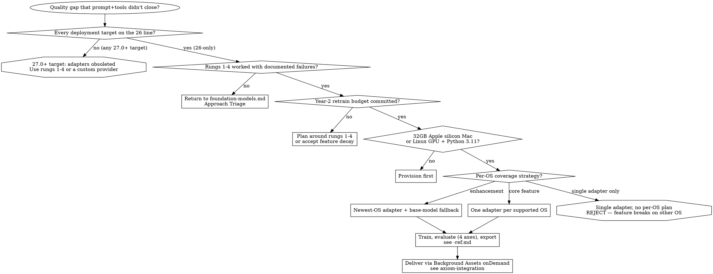

# Foundation Models Custom Adapters

> **Status — custom adapters are a 26-cycle-only capability, obsoleted in 27.0.** The on-device custom-adapter runtime (`SystemLanguageModel.Adapter`, `SystemLanguageModel(adapter:)`, `init(name:)`/`init(fileURL:)`/`compile()`/`compatibleAdapterIdentifiers(name:)`/`removeObsoleteAdapters()`) is `deprecated: 26.4, obsoleted: 27.0` in the Xcode 27 SDK on iOS, iPadOS, macOS, and visionOS (never available on watchOS/tvOS). It does **not compile** when your deployment target is 27.0 or later (`'Adapter' was obsoleted in iOS 27.0`); it still builds when you deploy back to 26.x. The 27 SDK (beta 1) ships **no replacement** adapter API — Apple's direction for on-device specialization moves to Core AI (ahead-of-time model authoring) and bring-your-own-model custom providers (`LanguageModelExecutor`). **The decision below applies only when every deployment target you support is on the 26 line.** If any target is 27.0+, adapters are off the table: work the Approach Triage (rungs 1-4) or a custom provider instead.

## Overview

Custom adapter training applies only after rungs 1-4 of the Approach Triage in `axiom-ai (skills/foundation-models.md)` have been exhausted (prompt engineering, `@Generable`/`@Guide`, tool calling, built-in content-tagging adapter). **Core principle**: adapters carry an ongoing maintenance contract — one adapter per supported base-model OS version, retrained per system-model release, re-evaluated against a locale-specific test set, re-shipped via Background Assets. Teams without budget for that cycle plan around rungs 1-4 instead.

**Apple's explicit guidance**: *"Before considering adapters, try to get the most out of the system model using prompt engineering or tool calling."*

This file owns the *decision* to train. `axiom-ai (skills/foundation-models-adapters-ref.md)` owns the operational API (toolkit CLIs, runtime types). `axiom-integration (skills/background-assets.md)` owns delivery.

---

## When to Use This Skill

Use when:
- A user is about to invoke the Foundation Models adapter toolkit and rungs 1-4 of the Approach Triage have not been worked
- A user proposes shipping a single adapter without per-base-model variant coverage
- A user is authoring training data, eval methodology, or runtime fallback for a custom adapter
- A user describes the adapter as a hard dependency (no base-model fallback)
- A user is about to set up the toolkit's Python environment, hardware, or entitlements

---

## Red Flags

If any of these appear, surface the corresponding rule before proceeding:

| Signal | Rule |
|--------|------|
| "We need an adapter to fix X" without documented rung-1-4 failures | Work the Approach Triage first; document each rung's specific failure |
| "One adapter for the app" | Each `.fmadapter` pins to one base-model version; one adapter does not cover a multi-OS install base |
| Multi-paragraph system prompts in training data | Adapter learns the verbose preamble at inference time, eating context window on every request |
| `--adapter-name` contains a hyphen | Runtime regex `/fmadapter-\w+-\w+/` rejects hyphens; use underscores |
| Bundling `.fmadapter` in the app bundle | Apple prohibits this; adapter ships via Background Assets `onDemand` only |
| No retrain budget for next OS minor | Adapter goes obsolete on first base-model update; feature decays silently |
| Toolkit `export/` folder modified | Compatibility breaks at runtime; toolkit explicitly forbids modification |
| Adapter treated as hard dependency, no base-model fallback path | `compatibleAdapterNotFound` becomes a feature outage instead of a degraded mode |
| Toolkit assets used outside adapter training | License violation: *"You are only permitted to use these model assets for training adapters"* |
| Safety eval axis skipped | Task-specific training can erode base-model guardrails on adjacent topics; not auditable post-ship |
| English-only eval against an app shipped in PFIGSCJK locales | Non-English regressions are invisible until App Store reviews surface them |

---

## Mandatory First Steps

### Step 1: Confirm rungs 1-4 were exhausted

Open `axiom-ai (skills/foundation-models.md)`, run the Approach Triage ladder, document each rung's failure mode in writing:

1. **Prompt engineering** — explicit instructions, imperative phrasing, defined role, few-shot examples
2. **`@Generable` + `@Guide`** — constrained decoding for structural failures
3. **Tool calling or RAG** — for factual gaps that are context problems
4. **Built-in adapter** — `SystemLanguageModel(useCase: .contentTagging)` for tag/entity extraction

If any rung cannot be described as "tried and failed because X," that rung is not done. Stop and work it.

### Step 2: Budget the maintenance contract

| Item | Cost |
|------|------|
| Initial adapter for current OS | 1-2 weeks engineering |
| Retrain per system-model OS minor (typical: 2-3 per year) | per release |
| Re-run four-axis eval suite per retrain | per release |
| Dataset extension for new behaviors | as needed |
| Background Assets delivery integration | 4-6 hours, one-time |

If the year-2 column is unfunded, the adapter ships and decays. Plan around rungs 1-4 instead.

### Step 3: Verify hardware and entitlements

| Requirement | Value |
|-------------|-------|
| Training Mac | Apple silicon, ≥32 GB unified memory |
| Alternative | Linux GPU machine |
| Python | **3.11 exactly** — 3.12/3.13 break the `coremltools` pin in `export/` |
| Toolkit access | Apple Developer Program membership |
| Deployment entitlement | `com.apple.developer.foundation-model-adapter` (Account Holder request; not needed for local training) |

### Step 4: Decide per-OS coverage strategy

| Strategy | Cost | When |
|----------|------|------|
| Newest-OS adapter + base-model fallback for older OS | One adapter per OS minor; older OS users get base model | Adapter is enhancement, not core |
| Per-OS adapter coverage | One adapter per supported OS minor, all retrained at each release | Adapter is core to the feature |
| Single adapter, no per-OS plan | Adapter loads on one OS only; feature breaks elsewhere | Not viable — reject |

Hardcoding a single asset pack ID (instead of using `compatibleAdapterIdentifiers(name:)`) is the runtime expression of the rejected strategy.

---

## Decision Tree



---

## Common Patterns

### Pattern 1: Dataset Construction

Apple's volume guidance:

| Task complexity | Sample count |
|-----------------|--------------|
| Basic (style transfer, narrow classification) | 100 – 1,000 |
| Complex (multi-step reasoning, domain extraction) | 5,000+ |

Quality rule: *"A smaller dataset of clear, consistent, and well-structured samples may be more effective than a larger dataset of noisy, low-quality samples."*

**Required**:
- Short, consistent system messages across samples
- Diverse user phrasings (not template variations)
- Realistic assistant outputs in target style

**Forbidden**:
- Multi-paragraph system prompts (adapter learns to expect them at inference time)
- Unscrubbed confidential user data (training assets are local but checkpointed)
- Filler samples to hit a count target (degrades quality, increases overfitting)

For the JSONL schema (chat-turn and tool-calling extension), see `axiom-ai (skills/foundation-models-adapters-ref.md)`.

---

### Pattern 2: Four-Axis Evaluation

Apple ships no default eval suite for custom adapters. A complete eval covers four axes; **any axis regressing against the base-model baseline blocks ship**.

| Axis | Method | Required because |
|------|--------|-------------------|
| Quantitative | Task-appropriate metric (accuracy, F1, ROUGE, BLEU); defined before training | Without a pre-committed metric, post-hoc rationalization replaces measurement |
| Human grading | Stratified sample, blind pairs (base vs adapter), ~100 pair minimum | Catches subtle quality regressions model graders miss |
| Larger-model grading | Server LLM grades full eval set | Scales human grading insight across thousands of comparisons |
| Safety | Internal red-team prompt set re-run against the trained adapter | Task-specific training can erode base-model guardrails on adjacent topics |

**Locale grouping** (per Apple's 2025 tech report):

| Group | Languages |
|-------|-----------|
| English-US | American English |
| English-outside-US | British, Australian, Indian, Canadian English |
| PFIGSCJK | Portuguese, French, Italian, German, Spanish, Chinese-Simplified, Japanese, Korean |

If the app ships in a non-English locale, run eval against the matching group. English-only eval against a multi-locale app silently ships non-English regressions.

For `examples.generate` CLI usage, see `axiom-ai (skills/foundation-models-adapters-ref.md)`.

---

### Pattern 3: Runtime Lifecycle

This lifecycle compiles only on a 26.x deployment target — the whole runtime is obsoleted at 27.0 (see status banner). Keep the deployment target below 27 so it compiles; at runtime, use `if #available` and a base-model fallback for any device that has reached 27.

```swift
import FoundationModels
import BackgroundAssets

// 1. App launch — remove adapters that no longer match the current base model.
try? SystemLanguageModel.Adapter.removeObsoleteAdapters()

// 2. Pick the variant for the device's current base-model version.
let ids = SystemLanguageModel.Adapter
    .compatibleAdapterIdentifiers(name: "MyAdapter")

guard let assetPackID = ids.first else {
    // No compatible adapter — fall back to base model.
    let session = LanguageModelSession()
    return session
}

// 3. Ensure the asset pack is local.
let pack = try await AssetPackManager.shared.assetPack(withID: assetPackID)
try await AssetPackManager.shared.ensureLocalAvailability(of: pack)

// 4. Load and use.
let adapter = try SystemLanguageModel.Adapter(name: "MyAdapter")
let model = SystemLanguageModel(adapter: adapter)
let session = LanguageModelSession(model: model)

// 5. After OS upgrades.
try? await AssetPackManager.shared.checkForUpdates()
```

**Rules**:
- Never hardcode the asset pack ID. The framework picks the variant for the current base-model version via `compatibleAdapterIdentifiers(name:)`; hardcoding skips variant selection and breaks on OS update.
- Always implement a base-model fallback. `compatibleAdapterIdentifiers(name:)` returns empty when no variant matches; the feature must still work.
- Call `removeObsoleteAdapters()` at launch. ~160 MB per pack adds up across abandoned variants.
- Call `checkForUpdates()` after OS upgrades. The system does not auto-refresh adapter packs.

Runtime API surface in `axiom-ai (skills/foundation-models-adapters-ref.md)`. Asset pack delivery in `axiom-integration (skills/background-assets.md)`.

---

### Pattern 4: Disclosure and UX

Adapter-enhanced features inherit the HIG Generative AI baseline from `axiom-ai (skills/foundation-models.md)`:

- AI involvement disclosed before invocation
- Retry as a first-class affordance on every result
- `guardrailViolation` shows a constructive next step, not a moralizing error wall
- Personal-data-used-for-training disclosure if the dataset ingests user content (Apple's base model does not train on user data; a custom dataset pipeline might)

Adapter-specific additions:

| Situation | Required UX |
|-----------|-------------|
| First download of ~160 MB adapter pack | User-visible progress; not instant on cellular |
| `compatibleAdapterIdentifiers(name:)` returns empty post-OS-upgrade | Graceful fallback to base model; surface "Using the standard model" only if quality difference is material |
| Result quality | Wire `session.logFeedbackAttachment(sentiment:issues:desiredOutput:)` — pass `LanguageModelFeedback.Sentiment` (`.positive`/`.negative`/`.neutral`) plus optional `LanguageModelFeedback.Issue` values, each built as `Issue(category:explanation:)` over the 8-case `Issue.Category` (see `axiom-ai (skills/foundation-models-ref.md)`); the sentiment + issues feed the next retrain dataset |

---

### Pattern 5: Draft Model Speculative Decoding

A **draft model** is an optional artifact you can train alongside an adapter. It enables *speculative decoding*: a small, fast model proposes several tokens that the full model verifies in one pass, cutting latency when the verification mostly agrees. Apple's framing is deliberately narrow — the draft model "is an optional step when training your adapter that can speed up inference"; without it, inference "might be slower." It is not a quality lever; it is a latency lever.

The draft model is trained through the toolkit (`examples.train_draft_model`) and exported with the adapter, so it **adds to the adapter's storage and memory footprint** — you ship and load a second model.

#### When training a draft model is worth it

Speculative decoding pays off when the *acceptance rate* is high and completions are long enough to amortize the overhead. As engineering judgment (Apple does not publish a rubric):

| Train a draft model when | Skip it when |
|--------------------------|--------------|
| The feature is latency-bound and user-visible (streaming a paragraph, not a word) | Completions are short (a label, a tag, a yes/no) — draft overhead can exceed the savings |
| Completions are long enough that token-by-token cost dominates | FM invocation is sparse (the model is rarely hot; compile/load cost dominates instead) |
| You have memory + storage headroom for a second model | The device budget is already tight from the adapter itself |
| Your eval includes a latency axis you're trying to move | You have no measured latency target — optimize nothing you can't measure |

#### The compilation rate limit (this is the trap)

Apple rate-limits draft-model compilation: *"the framework... rate-limits the compilation process on all platforms, excluding macOS, to three draft model compilations per-app, per-day."* This is a **runtime, on-device** compile step, specific to the draft model — not adapter compilation generally, and not enforced on macOS. Three per app per day is a hard ceiling on iOS/iPadOS/visionOS. Design around it:

- **Cache the compiled draft model across launches.** Never recompile speculatively or "to be safe." A recompile-on-every-launch bug silently burns the daily quota and then fails.
- **The first compilation is the user's first AI invocation cost.** It is not instant — surface progress, don't block the UI on it.
- **Switching adapters mid-session triggers a second compilation.** If the user can change the active adapter, each switch can eat another slot in the daily three.
- Once the three are spent in a 24-hour window, further draft-model compilations fail until the window resets — see `foundation-models-adapters-diag.md` Pattern 10.

#### Eval implication

The draft model changes latency, not just the adapter. **Any latency claim you make about the adapter must be measured with the draft model in place** (and separately without it), because production latency is the combined figure. Add latency to the four-axis eval (Pattern 2) when you ship a draft model.

---

## Pressure Scenarios

### Scenario 1: "Train a custom adapter for our restaurant-summarization feature, we need it ASAP"

**Trigger**: A user requests adapter training because the model output isn't domain-specific enough, without documenting failures of rungs 1-4.

**Required response**: refuse to start adapter work until the Approach Triage has been run.

Concrete diagnostic prompts to send back:

1. What did the current prompt look like? Did it specify "restaurant summary," few-shot examples, target vocabulary?
2. Is the output structured as a `@Generable RestaurantSummary` (`vibe`, `cuisineNotes`, `priceLevel`, `standoutDishes`), or unstructured text?
3. Is the model getting actual restaurant data via a `getRestaurantDetails` tool, or hallucinating from prompt context alone?
4. Has `SystemLanguageModel(useCase: .contentTagging)` been tried for entity-level extraction?

Most "summaries feel generic" cases resolve at rung 1, 2, or 3. Adapter training without those documented failures spends 2-3 weeks on a problem fixable in a day.

**Pushback template** (to deliver to the requester):

> Apple's explicit guidance is to exhaust prompt engineering, `@Generable`, and tool calling before adapter training. Working the four-rung ladder against the actual quality complaints takes half a day to a day. If the gap survives, we'll have a documented case for adapter work and the eval data to know what "better" looks like. Otherwise we save 2-3 weeks of initial training plus the per-OS retrain contract.

---

### Scenario 2: "I trained one adapter on iOS 26.0, let's ship it"

**Trigger**: A user proposes shipping a single adapter against a multi-OS install base, or hardcoding an asset pack ID instead of using `compatibleAdapterIdentifiers(name:)`.

**Required response**: refuse the single-adapter path; surface per-OS pinning rule.

Apple's runtime contract: *"Each adapter is compatible with a single specific system model version. To support people using your app who have devices on OS versions using different system model versions, you will need to train a different adapter for every version of the system model."*

Outcome of shipping one adapter:

- Devices on the trained OS: adapter loads, feature works
- Devices on other OS versions: `compatibleAdapterIdentifiers(name:)` returns empty; feature degrades to base model (if fallback coded) or fails (if not)
- New OS releases during this build's lifetime: every device that updates loses the adapter

**Pushback template**:

> Apple's adapter design pins each adapter to one base-model version. The framework wants one adapter per supported OS, picked at runtime via `compatibleAdapterIdentifiers(name:)`. Let me automate the training pipeline now so the next retrain is an afternoon, not a from-scratch rebuild under deadline pressure.

---

### Scenario 3: "Skip the locale-specific eval — our users are mostly English-speaking"

**Trigger**: A user proposes English-only eval for an app that ships in any of Apple's 16 supported languages.

**Required response**: surface the non-English regression risk; require eval for at least the locale groups the install base actually uses.

The base model supports 16 languages including the PFIGSCJK group. Training against English-only data does not remove non-English capability — it leaves it untested. Possible outcomes per non-English input:

- Quality regression vs base model
- Mixed-language output
- Silent fallback to less coherent behavior

Without per-locale eval, none of these are measurable until App Store reviews surface them.

**Pushback template**:

> Apple's adapter design assumes per-locale eval. English-only eval ships a quality regression we can't measure. We can scope to the top-N languages the install base actually uses, but English-only against a multi-locale app is not defensible. Adding French/Spanish/Japanese eval sets is 2-3 days; reactive triage on non-English complaints is weeks.

---

## Audit Checklists

### Decision

- [ ] Approach Triage rungs 1-4 attempted with documented failure for each
- [ ] Year-2 retrain budget committed
- [ ] Hardware confirmed (32 GB Apple silicon Mac or Linux GPU)
- [ ] Python 3.11 environment ready
- [ ] Apple Developer Program membership confirmed
- [ ] Per-OS coverage strategy decided (not "single adapter, no plan")

### Dataset

- [ ] Sample count matches Apple's guidance for task complexity
- [ ] System messages short and consistent across samples
- [ ] User-input phrasings diverse, not template variations
- [ ] Assistant outputs reflect desired ship behavior, not aspirational ideals
- [ ] No unscrubbed confidential user data

### Training & Export

- [ ] Toolkit version matches the lowest system-model OS version targeted
- [ ] `--adapter-name` uses underscores only
- [ ] Toolkit `export/` folder unmodified
- [ ] Checkpoints retained per training run

### Evaluation

- [ ] Quantitative metric defined before training
- [ ] Human grading sample large enough for statistical confidence
- [ ] Larger-model grading covers full eval set
- [ ] Safety eval re-run against trained adapter (not inherited from base)
- [ ] Locale-specific eval covers all applicable groups
- [ ] No axis regresses against base-model baseline

### Runtime

- [ ] `removeObsoleteAdapters()` called at launch
- [ ] `compatibleAdapterIdentifiers(name:)` used for variant selection (not hardcoded ID)
- [ ] Base-model fallback exists for empty result
- [ ] `checkForUpdates()` called after OS upgrades
- [ ] User-visible progress for adapter download

### Delivery (cross-reference)

- [ ] `onDemand` download policy (never `essential` or `prefetch`)
- [ ] One asset pack per base-model variant
- [ ] Apple-hosted vs server-hosted decision per `axiom-integration (skills/background-assets.md)`
- [ ] `com.apple.developer.foundation-model-adapter` entitlement requested

### Disclosure & UX

- [ ] AI involvement disclosed before invocation
- [ ] Retry as first-class affordance
- [ ] `guardrailViolation` shows constructive next step
- [ ] Adapter-not-available state degrades gracefully
- [ ] `session.logFeedbackAttachment(sentiment:issues:desiredOutput:)` wired (`LanguageModelFeedback.Sentiment` + `Issue(category:explanation:)` values) for next-retrain dataset

---

## Quick Reference

| Need | Where |
|------|-------|
| Approach Triage (rungs 1-4) | `axiom-ai (skills/foundation-models.md)` |
| Toolkit installation, dataset schema, training/eval/export CLIs | `axiom-ai (skills/foundation-models-adapters-ref.md)` |
| Runtime API (`SystemLanguageModel.Adapter`, `AssetError` cases) | `axiom-ai (skills/foundation-models-adapters-ref.md)` |
| Per-base-model compatibility matrix | `axiom-ai (skills/foundation-models-adapters-ref.md)` |
| Asset pack delivery (Apple-hosted vs server-hosted, `xcrun ba-package`) | `axiom-integration (skills/background-assets.md)` |
| Asset pack API (`AssetPackManager`, `StoreDownloaderExtension`) | `axiom-integration (skills/background-assets-ref.md)` |
| Adapter-specific failure modes (forum-sourced) | `axiom-ai (skills/foundation-models-adapters-diag.md)` |
| HIG Generative AI baseline | `axiom-ai (skills/foundation-models.md)` |

---

## Resources

**WWDC**: 2024-10159, 2024-10160, 2025-248, 2025-286, 2025-301, 2025-325

**Docs**: /foundationmodels, /foundationmodels/loading-and-using-a-custom-adapter-with-foundation-models, /foundationmodels/systemlanguagemodel/adapter, /bundleresources/entitlements/com.apple.developer.foundation-model-adapter, /backgroundassets

**Apple ML Research**: apple-foundation-models-tech-report-2025 (arXiv 2507.13575), Apple Intelligence Foundation Language Models (arXiv 2407.21075)

**Skills**: axiom-ai (skills/foundation-models.md), axiom-ai (skills/foundation-models-adapters-ref.md), axiom-ai (skills/foundation-models-adapters-diag.md), axiom-integration (skills/background-assets.md), axiom-integration (skills/background-assets-ref.md)

---

**Last Updated**: 2026-06-11
**Platforms**: iOS / iPadOS / macOS / visionOS **26.0–26.x only** (runtime deprecated 26.4, obsoleted 27.0; never watchOS/tvOS); macOS 14+ Apple silicon ≥32 GB or Linux GPU (training)
**Skill Type**: Discipline
