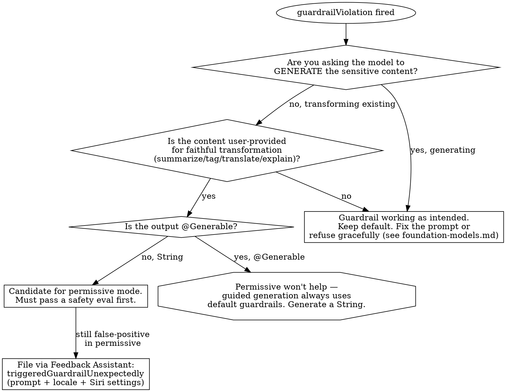

# Foundation Models Guardrails & Safety

The *decision* layer for Foundation Models content safety: when to relax the default guardrails with `permissiveContentTransformations`, how to tell a correct refusal from an over-restrictive false positive, and how to prove your safety choice is sound before shipping.

This file owns the **decision**. For the "a `guardrailViolation` fired, what do I show the user" troubleshooting path, see `foundation-models-diag.md` Pattern 2b. For the HIG refusal-UX baseline, see `foundation-models.md` "User Trust & Disclosure."

## When to Use

- A legitimate prompt is being refused (`guardrailViolation`) and you're tempted to switch to permissive mode.
- You're deciding whether `permissiveContentTransformations` is appropriate for your feature.
- You need to prove a permissive-mode feature is safe to ship (eval, red-team set).
- You trained a custom adapter and want to know whether it weakened the base model's safety.

## How guardrails actually work

Apple frames safety as layered — a "Swiss cheese" model where a violation requires *every* layer to fail:

1. **Built-in model alignment** — the model is trained to handle sensitive topics with care.
2. **Apple's guardrails** (framework layer) — block harmful input and output (self-harm, violence, adult content). Applied to **both** the input (your instructions, prompt, tool calls) and the output — so a crafted prompt that slips past input checks can still be blocked on output.
3. **Your safety instructions** — the model is trained to obey instructions over prompt content, so instructions are a real (though "by no means bulletproof") safety lever.
4. **Your prompt construction** — control whether and how untrusted user text enters the prompt. Never place user input in instructions.
5. **Your use-case mitigations** — e.g. a keyword deny-list. *You are ultimately responsible for mitigations for your own use case.*

`permissiveContentTransformations` relaxes **layer 2 only**, and only in one direction (see below). The other four layers still apply.

## The Guardrails API

```swift
// Guardrails are set on the MODEL, then passed to the session — NOT on the session directly.
let model = SystemLanguageModel(guardrails: .permissiveContentTransformations)
let session = LanguageModelSession(model: model)

// With an adapter:
let model = SystemLanguageModel(adapter: myAdapter, guardrails: .permissiveContentTransformations)
```

- `SystemLanguageModel.Guardrails` exposes exactly two values: **`.default`** and **`.permissiveContentTransformations`**. There is no public initializer — you cannot author a custom guardrail policy, only choose between these two.
- Availability: **iOS 26.0+, macOS 26.0+, visionOS 26.0+**. Guardrails are **not available on tvOS or watchOS**.
- A violation throws `LanguageModelSession.GenerationError.guardrailViolation(Context)`.

### ⚠️ Permissive mode is string-only

`permissiveContentTransformations` only takes effect when generating a **plain `String`**. **Guided generation (`@Generable`) always runs the default guardrails on input and output, regardless of the model's guardrail setting.** If your feature produces structured output, permissive mode does nothing — you cannot relax guardrails for a `@Generable` response. Plan accordingly: a content-transformation feature that needs permissive behavior must generate strings, not structured values.

## Default vs permissive — the decision

`permissiveContentTransformations` is for **faithfully transforming content that already exists** — summarizing, tagging, translating, or explaining text the user brought in. It is **not** a general "turn off safety" switch.

| Appropriate for permissive | NOT appropriate |
|----------------------------|-----------------|
| Summarizing a news article that mentions violence | Generating original violent/adult content |
| Tagging the topics of a chat that contains profanity | Free-form user-generated output shown to other users |
| Explaining study notes that discuss a sensitive topic | Broadcast-style output your brand stands behind |
| Faithful translation of pre-existing text | Any `@Generable` output (permissive is ignored) |
| ...where you have run a safety eval (below) | ...where you have not measured the unhappy path |

Apple's own caveat: even in permissive mode, **the model may still refuse.** Permissive widens the band of acceptable transformations; it does not guarantee any specific prompt passes.

## False-positive triage

When a `guardrailViolation` fires on content you believe is legitimate, decide *first* whether the guardrail is working correctly or over-firing — don't reflexively flip to permissive.



Categories that are *usually* legitimate but *often* blocked by the default guardrail (real reports from Apple Developer Forums thread 787736): mainstream political/news summarization, obituaries, factual safety content (water purification, first aid), real place/person names, and personal-journal text describing events. Apple staff guidance on that thread: use permissive mode for appropriate contexts like news summarization, and **file every unexpected refusal via Feedback Assistant** — include the prompt, the language/locale, and the device's Siri settings. The SDK provides the canonical category for this: `LanguageModelFeedback.Issue.Category.triggeredGuardrailUnexpectedly`.

## Proving permissive mode is safe (custom safety eval)

You cannot author a custom guardrail, so your safety work is **evaluation**, not configuration. Before shipping a permissive-mode feature:

1. **Build a red-team prompt set** covering your real use cases plus deliberate stress: nonsensical input, sensitive content, controversial topics, vague/ambiguous input, and prompt-injection attempts.
2. **Test the unhappy path** — most teams only test prompts they hope work. Measure what the feature does on the prompts you fear.
3. **Compare default vs permissive** on the same set: what does permissive newly allow, and is each newly-allowed case acceptable for your feature?
4. **Cover your locales** — guardrail behavior varies by language; an English-only safety eval ships unmeasured behavior in other locales (see `foundation-models-adapters.md` Pattern 2 locale grouping).
5. **Re-run on every model or prompt change.** The base model updates with the OS; a permissive choice that was safe at 26.0 must be re-validated.

## Adapter interaction

Custom adapter training can **erode the base model's guardrails on topics adjacent to the training data**, even with default guardrails set. This is exactly why the four-axis eval in `foundation-models-adapters.md` Pattern 2 makes **safety a blocking axis** — re-run your red-team set against the *trained adapter*, not just the base model. Combining a custom adapter with permissive mode compounds the risk; eval both together.

## Anti-Rationalization

| Thought | Reality |
|---------|---------|
| "It refused legitimate content, just switch to `.permissiveContentTransformations`" | First decide if the refusal is correct. Permissive is for faithful transformation of *existing* content, not a global safety-off switch — and it won't help if you're generating content or using `@Generable`. |
| "Permissive mode disables guardrails" | It relaxes layer 2 for string transformations only. Input/output guardrails for guided generation, your instructions, prompt hygiene, and use-case mitigations all still apply. The model may still refuse. |
| "I'll set permissive on the session" | Guardrails are set on the `SystemLanguageModel`, then passed to `LanguageModelSession(model:)`. There's no session-level guardrail setter. |
| "Permissive will fix my `@Generable` refusals" | Guided generation always runs default guardrails regardless of the setting. Switch the feature to String output or keep default. |
| "We tested the happy path, permissive is safe" | Safety is the unhappy path. Build a red-team set, test injection and sensitive input, and re-run on every model update. |
| "Default guardrails cover us, even with our adapter" | Adapter training can weaken guardrails on adjacent topics. Re-run the safety eval against the trained adapter — Pattern 2 treats any safety regression as ship-blocking. |
| "A false positive means the guardrail is broken" | Sometimes it's correct. When it's genuinely over-restrictive, the action is permissive-mode-after-eval *plus* a Feedback Assistant report (`triggeredGuardrailUnexpectedly`), not silently shipping permissive everywhere. |

## Resources

**WWDC**: 2025-248

**Docs**: /foundationmodels/systemlanguagemodel/guardrails, /foundationmodels/improving-the-safety-of-generative-model-output — plus Apple Developer Forums thread 787736 (false-refusal reports + Apple staff guidance)

**Skills**: foundation-models (HIG refusal UX, Approach Triage), foundation-models-diag (Pattern 2b — guardrailViolation troubleshooting), foundation-models-adapters (Pattern 2 — safety eval axis), foundation-models-ref (`GenerationError` cases)
