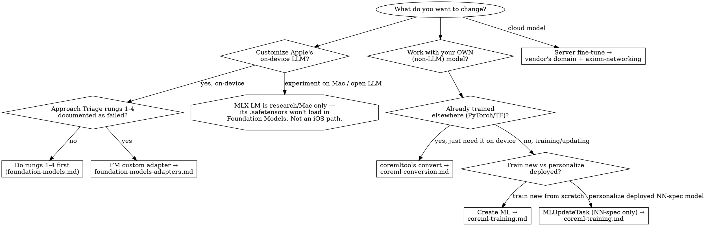

# ML Training Paths — Which One Applies

When a developer says "I need to train / fine-tune / personalize a model," six distinct paths exist, and they are constantly conflated. Each has a different output file, a different runtime, and a different maintenance contract. Picking the wrong one wastes weeks — most often by building an MLX or `.mlpackage` pipeline and discovering at the end that the output **cannot be loaded** where it's needed.

This is the disambiguation entry point. Once you know which path you're on, the detailed file owns the how-to.

## When to Use

- "What's the difference between training an FM adapter, fine-tuning with MLX, and personalizing with `MLUpdateTask`?"
- You're about to start a training pipeline and want to confirm its output is loadable on your target.
- A trained artifact won't load and you suspect a format/toolchain mismatch.

## The six paths

| Path | Trains | Output | Runtime | Use when | Detailed file |
|------|--------|--------|---------|----------|---------------|
| **FM custom adapter** | Apple's frozen on-device ~3B LLM (rank-32 LoRA) | `.fmadapter` (~160 MB) | `SystemLanguageModel(adapter:)` | App-specific behavior on top of Apple's on-device LLM, after Approach Triage rungs 1-4 fail | `foundation-models-adapters.md` |
| **Core ML personalization** | An NN-spec model's last updatable layers | Updated `.mlmodelc` | `MLUpdateTask` (on device, runtime) | Per-user personalization of an existing **NN-spec** model | `coreml-training.md` |
| **Create ML** | A new Core ML model from scratch / transfer learning | `.mlmodel` | Core ML | App-specific task model trained from scratch | `coreml-training.md` |
| **coremltools convert** | Nothing (format conversion) | `.mlpackage` | Core ML | Bring an already-trained PyTorch/TF model to Apple platforms | `coreml-conversion.md` |
| **MLX LM** (`mlx_lm.lora`) | Open-source LLMs on Apple silicon | `adapters.safetensors` — **NOT loadable by Foundation Models** | MLX runtime (Mac); not an iOS distribution path | Research, on-Mac inference, fine-tuning experimentation | External — adjacent tool, outside Axiom |
| **Server LLM fine-tune** | A cloud-hosted model | Cloud artifact | API call | Vendor-specific cloud LLM customization | `axiom-networking` for the API integration |

## The three disambiguations that cost weeks

1. **MLX LM output is not a Foundation Models adapter.** `mlx_lm.lora` writes `adapters.safetensors`; Apple's Foundation Models load only `.fmadapter` packages (produced by Apple's adapter toolkit, gated by the `com.apple.developer.foundation-model-adapter` entitlement). MLX is a separate Apple-silicon training/inference framework — its `.safetensors` **cannot** be passed to `SystemLanguageModel(adapter:)` or `LanguageModelSession`. "Apple has MLX *and* Apple has Foundation Models adapters" does not make them interchangeable. If your goal is shipping behavior into the on-device LLM, MLX is the wrong toolchain.

2. **`MLUpdateTask` is NN-spec only.** It does **not** work with ML Program (`.mlpackage`) models — which is what modern PyTorch/TF conversion produces. If your personalization pipeline starts from a `coremltools.convert` `.mlpackage`, `MLUpdateTask` will never apply to it. Developers routinely discover this after building most of the pipeline. Decide the format *before* you build — see `coreml-training.md`.

3. **FM adapters pin to a base-model version; the others don't.** A `.fmadapter` is compatible with exactly one on-device system-model version and must be retrained and re-shipped on each OS minor that changes the base model (Background Assets delivery, per-OS variants). Core ML / Create ML / MLX models carry no such pin — they run until you replace them. The maintenance contracts are materially different; budget for the adapter's recurring retrain cycle (`foundation-models-adapters.md`).

## Decision tree

## Anti-Rationalization

| Thought | Reality |
|---------|---------|
| "I fine-tuned with MLX, now I'll load it into Foundation Models" | MLX emits `adapters.safetensors`, not `.fmadapter`. It cannot load into `SystemLanguageModel(adapter:)`. Different toolchain — use Apple's adapter toolkit if the target is the on-device LLM. |
| "I'll personalize my `.mlpackage` on-device with `MLUpdateTask`" | `MLUpdateTask` is NN-spec only. ML Program models can't be updated. Choose the format before building. |
| "Train one FM adapter and ship it everywhere" | Each `.fmadapter` pins to one base-model OS version. Plan per-OS variants and a retrain cycle. |
| "Create ML and FM adapters are both 'training,' so they're similar" | Create ML trains a *new Core ML* model (`.mlmodel`); FM adapter training fine-tunes *Apple's LLM* (`.fmadapter`). Entirely different toolchains, outputs, and runtimes. |
| "coremltools will train my model" | coremltools *converts* an already-trained model. It trains nothing. Training is Create ML, `MLUpdateTask`, or the FM adapter toolkit. |

## Resources

**Docs**: /foundationmodels/systemlanguagemodel/adapter, /coreml/mlupdatetask, /createml — plus apple.github.io/coremltools (conversion) and github.com/ml-explore/mlx-lm (MLX, external)

**Skills**: foundation-models-adapters (FM adapter discipline), coreml-training (Create ML + `MLUpdateTask`), coreml-conversion (coremltools), `skills/ios-ml.md` (Core ML hub), axiom-networking (server fine-tune API), axiom-ai (`SKILL.md` has the quick Training Path Boundaries table this doc expands)
