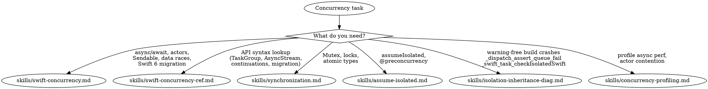

# Concurrency

**You MUST use this skill for ANY concurrency, async/await, threading, or Swift 6 concurrency work.**

## Quick Reference

| Symptom / Task | Reference |
|----------------|-----------|
| async/await patterns, @MainActor, actors | See `skills/swift-concurrency.md` |
| Data race errors, Sendable conformance | See `skills/swift-concurrency.md` |
| Swift 6 migration, @concurrent attribute | See `skills/swift-concurrency.md` |
| Actor definition, reentrancy, global actors | See `skills/swift-concurrency-ref.md` |
| Task/TaskGroup/cancellation API | See `skills/swift-concurrency-ref.md` |
| AsyncStream, continuations | See `skills/swift-concurrency-ref.md` |
| DispatchQueue → actor migration | See `skills/swift-concurrency-ref.md` |
| Mutex (iOS 18+), OSAllocatedUnfairLock | See `skills/synchronization.md` |
| Atomic types, lock vs actor decision | See `skills/synchronization.md` |
| MainActor.assumeIsolated | See `skills/assume-isolated.md` |
| @preconcurrency protocol conformances | See `skills/assume-isolated.md` |
| Legacy delegate callbacks | See `skills/assume-isolated.md` |
| Warning-free build crashes with `_dispatch_assert_queue_fail` | See `skills/isolation-inheritance-diag.md` |
| Crash signature `_swift_task_checkIsolatedSwift` | See `skills/isolation-inheritance-diag.md` |
| Core Data `context.perform` runtime crash inside @MainActor class | See `skills/isolation-inheritance-diag.md` |
| Combine `.map`/`.sink` crash from receive(on:) placement | See `skills/isolation-inheritance-diag.md` |
| Delegate method crash from isolation inheritance (CLLocationManager, NSDocument, AVAudioPlayerDelegate, WKNavigationDelegate) | See `skills/isolation-inheritance-diag.md` |
| Actor reentrancy / stale state across await | See `skills/isolation-inheritance-diag.md` |
| Swift Concurrency Instruments template | See `skills/concurrency-profiling.md` |
| Actor contention diagnosis | See `skills/concurrency-profiling.md` |
| Thread pool exhaustion | See `skills/concurrency-profiling.md` |

## Decision Tree

1. Data races / actor isolation / @MainActor / Sendable / Swift 6 migration? → `skills/swift-concurrency.md`
1a. Need specific API syntax (actor definition, TaskGroup, AsyncStream, continuations)? → `skills/swift-concurrency-ref.md`
2. Writing async/await code? → `skills/swift-concurrency.md`
3. assumeIsolated / @preconcurrency? → `skills/assume-isolated.md`
3a. Warning-free Swift 6 build that crashes in production with `_dispatch_assert_queue_fail` or `_swift_task_checkIsolatedSwift`? → `skills/isolation-inheritance-diag.md`
4. Mutex / lock / synchronization? → `skills/synchronization.md`
5. Profile async performance / actor contention? → `skills/concurrency-profiling.md`
6. Value type / ARC / generic optimization? → See axiom-performance (skills/swift-performance.md)
7. borrowing / consuming / ~Copyable? → See axiom-swift (skills/ownership-conventions.md)
8. Combine / @Published / AnyCancellable / reactive streams? → See axiom-uikit (skills/combine-patterns.md)
9. Want automated concurrency scan? → concurrency-auditor (Agent)

#### Concurrency in practice
- HealthKit queries with Swift Concurrency (canonical bridging example) → See axiom-health (skills/queries.md)

## Conflict Resolution

**concurrency vs axiom-performance**: When app freezes or feels slow:
1. **Try concurrency FIRST** — Main thread blocking is the #1 cause of UI freezes. Check for synchronous work on @MainActor before profiling.
2. **Only use axiom-performance** if concurrency fixes don't help — Profile after ruling out obvious blocking.
3. **To pin a specific freeze to app code**, see the Hang Window Workflow in axiom-performance (skills/hang-diagnostics.md) — re-scope `xcprof analyze` to the hang window with `--start-ms/--end-ms --user-binary` to surface the app-owned frame on the main thread.

**concurrency vs axiom-build**: When seeing Swift 6 concurrency errors:
- **Use concurrency, NOT axiom-build** — Concurrency errors are CODE issues, not environment issues.

**concurrency vs axiom-data**: When concurrency errors involve Core Data or SwiftData:
- Core Data threading (NSManagedObjectContext thread confinement) → **use axiom-data first**
- SwiftData + @MainActor ModelContext → **use concurrency**
- General "background saves losing data" → **use axiom-data first**
- GRDB Sendable patterns (struct records, `databaseSelection` as computed property, Swift 6 conformance) → See axiom-data (skills/grdb-performance.md) §8

## Critical Patterns

**Swift Concurrency** (`skills/swift-concurrency.md`):
- Progressive journey: single-threaded → async → concurrent → actors
- @concurrent attribute for forced background execution
- Isolated conformances, main actor mode
- 12 copy-paste patterns including delegate value capture, weak self in Tasks
- Comprehensive decision tree for 7 common error messages

**API Reference** (`skills/swift-concurrency-ref.md`):
- Actor definition, reentrancy, global actors, nonisolated
- Sendable patterns, @unchecked Sendable, sending parameter
- Task/TaskGroup/cancellation, async let, withDiscardingTaskGroup
- AsyncStream, continuations, buffering policies
- Isolation patterns (#isolation, @preconcurrency, nonisolated(unsafe))
- DispatchQueue/DispatchGroup/completion handler migration

**Synchronization** (`skills/synchronization.md`):
- Mutex (iOS 18+), OSAllocatedUnfairLock (iOS 16+), Atomic types
- Lock vs actor decision tree
- Danger patterns: locks across await, semaphores in async context

**Profiling** (`skills/concurrency-profiling.md`):
- Swift Concurrency Instruments template
- Diagnosing main thread blocking, actor contention, thread pool exhaustion
- Safe vs unsafe primitives for cooperative pool

**Runtime Isolation Crashes** (`skills/isolation-inheritance-diag.md`):
- `_dispatch_assert_queue_fail` and `_swift_task_checkIsolatedSwift` signatures
- Closure isolation inheritance (Core Data `perform`, Combine `.map`, NotificationCenter `.sink`)
- Delegate method isolation inheritance (CLLocationManager, NSDocument, AVAudioPlayerDelegate, WKNavigationDelegate)
- `MainActor.assumeIsolated` misuse
- Actor reentrancy state staleness

## Automated Scanning

**Concurrency audit** → Launch `concurrency-auditor` agent or `/axiom:audit concurrency` (5-phase semantic audit: maps isolation architecture, detects 8 anti-patterns, reasons about missing concurrency patterns, correlates compound risks, scores Swift 6.4 readiness)

## Anti-Rationalization

| Thought | Reality |
|---------|---------|
| "Just add @MainActor and it'll work" | @MainActor has isolation inheritance rules. `skills/swift-concurrency.md` covers all patterns. |
| "I'll use nonisolated(unsafe) to silence the warning" | Silencing warnings hides data races. `skills/swift-concurrency.md` shows the safe pattern. |
| "It's just one async call" | Even single async calls have cancellation and isolation implications. |
| "I know how actors work" | Actor reentrancy and isolation rules changed in Swift 6.2. |
| "I'll fix the Sendable warnings later" | Sendable violations cause runtime crashes. Fix them now. |
| "My Swift 6 build has zero warnings, so isolation is correct" | Static checking can't see SDK callbacks. Runtime checks crash anyway. `skills/isolation-inheritance-diag.md`. |
| "I'll wrap the crash in `MainActor.assumeIsolated`" | `assumeIsolated` is a runtime trap, not a silencer. Wrong assumption = crash. |
| "Combine is dead, just use async/await" | Combine has no deprecation notice. Rewriting working pipelines wastes time. See See axiom-uikit (skills/combine-patterns.md). |
| "I'll use @unchecked Sendable to silence this" | You're hiding a data race from the compiler. It will crash in production. |
| "This async function runs on a background thread" | `async` suspends without blocking but resumes on the *same actor*. Use `@concurrent` to force background. |

## Example Invocations

User: "I'm getting 'data race' errors in Swift 6"
→ Read: `skills/swift-concurrency.md`

User: "How do I use @MainActor correctly?"
→ Read: `skills/swift-concurrency.md`

User: "How do I create a TaskGroup?"
→ Read: `skills/swift-concurrency-ref.md`

User: "What's the AsyncStream API?"
→ Read: `skills/swift-concurrency-ref.md`

User: "How do I use assumeIsolated?"
→ Read: `skills/assume-isolated.md`

User: "Should I use Mutex or actor?"
→ Read: `skills/synchronization.md`

User: "My async code is slow, how do I profile it?"
→ Read: `skills/concurrency-profiling.md`

User: "My warning-free Swift 6 build crashes in production with _dispatch_assert_queue_fail"
→ Read: `skills/isolation-inheritance-diag.md`

User: "Core Data `context.perform` crashes inside an @MainActor view model"
→ Read: `skills/isolation-inheritance-diag.md`

User: "CLLocationManager delegate method is crashing with _swift_task_checkIsolatedSwift"
→ Read: `skills/isolation-inheritance-diag.md`

User: "My app is slow due to unnecessary copying"
→ See axiom-performance (skills/swift-performance.md)

User: "Check my code for Swift 6 concurrency issues"
→ Invoke: `concurrency-auditor` agent
