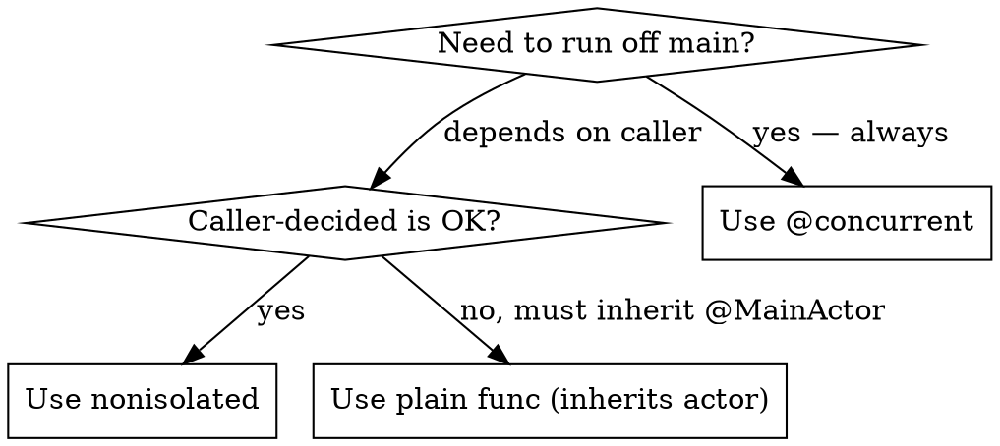

# Swift 6 Concurrency Guide

**Purpose**: Progressive journey from single-threaded to concurrent Swift code
**Swift Version**: Swift 6.4 (ships with Xcode 27; strict concurrency by default). `@concurrent` requires the Swift 6.2+ toolchain (compile-time only) — it imposes NO deployment-target floor and back-deploys via the concurrency runtime (iOS 13+).
**iOS Version**: iOS 17+
**Xcode**: Xcode 16+ (Xcode 26+ for `@concurrent`)

## When to Use This Skill

✅ **Use this skill when**:
- Starting a new project and deciding concurrency strategy
- Debugging Swift 6 concurrency errors (actor isolation, data races, Sendable warnings)
- Deciding when to introduce async/await vs concurrency
- Implementing `@MainActor` classes or async functions
- Converting delegate callbacks to async-safe patterns
- Deciding between `@MainActor`, `nonisolated`, `@concurrent`, or actor isolation
- Resolving "Sending 'self' risks causing data races" errors
- Making types conform to `Sendable`
- Offloading CPU-intensive work to background threads
- UI feels unresponsive and profiling shows main thread bottleneck

❌ **Do NOT use this skill for**:
- General Swift syntax (use Swift documentation)
- SwiftUI-specific patterns (use `axiom-swiftui` debugging or performance references)
- API-specific patterns (use API documentation)

## Core Philosophy: Think in Isolation Domains, Not Threads

> "Your apps should start by running all of their code on the main thread, and you can get really far with single-threaded code." — Apple

**Stop asking**: "What thread should this run on?"
**Start asking**: "What isolation domain should own this work?"

- `@MainActor` → UI state ownership
- Custom `actor` → shared mutable state ownership
- `nonisolated` → no ownership, caller decides
- `@concurrent` → force background execution

**Async does not mean background.** An `async` function suspends without blocking, but resumes on the *same actor* it was called from. A `@MainActor` async function runs entirely on the main actor — `await` just yields control, it does not switch threads. Use `@concurrent` (Swift 6.2+) when you need to force work off the calling actor.

**MainActor is the main thread on Apple platforms.** On iOS, iPadOS, macOS, watchOS, tvOS, and visionOS, `@MainActor` and the main thread are the same. Treat them as synonymous in app code. Two edge cases to be aware of:
- Non-app Swift environments (server-side, library tests) may technically map MainActor elsewhere — not a concern for Apple platform apps.
- **C/Objective-C/C++ interop bypasses static concurrency checking.** A `@MainActor`-isolated Swift method can be called from C/ObjC/C++ on the wrong thread without a compile-time error — a data race at runtime. When bridging Swift concurrency to these languages, use `MainActor.assumeIsolated` (which crashes on violation) or other dynamic checks at the boundary.

**Prefer structured concurrency.** Use `async let` and `TaskGroup` for parallel work — they propagate cancellation and errors automatically through the task tree. Unstructured `Task {}` is for bridging sync→async boundaries (event handlers, SwiftUI `.task`). `Task.detached` is a last resort.

**SwiftUI `.task` cancels on view destruction, not state change.** It cancels on the same timeline as `onDisappear` — a body re-evaluation from a `@State` change does NOT cancel it. SwiftUI does not expose the task handle, so to cancel on any other signal (a "stop" button, a network condition) you must own the `Task` yourself. See axiom-swiftui (skills/architecture.md, "`.task` Modifier Lifecycle").

**GCD is a bridge pattern, not a default.** In new code, do not use `DispatchQueue`, `DispatchGroup`, `DispatchSemaphore`, or completion handlers as primary architecture. Use them only to bridge legacy APIs that don't have async alternatives yet. Isolate bridge code and keep the rest of the codebase idiomatic Swift 6.

### The Progressive Journey

```
Single-Threaded → Asynchronous → Concurrent → Actors
     ↓                ↓             ↓           ↓
   Start here    Hide latency   Background   Move data
                 (network)      CPU work     off main
```

**When to advance**:
1. **Stay single-threaded** if UI is responsive and operations are fast
2. **Add async/await** when high-latency operations (network, file I/O) block UI
3. **Add concurrency** when CPU-intensive work (image processing, parsing) freezes UI
4. **Add actors** when too much main actor code causes contention

**Key insight**: Concurrent code is more complex. Only introduce concurrency when profiling shows it's needed.

---

## Step 1: Single-Threaded Code (Start Here)

With Main Actor Mode enabled (the default for new projects in Xcode 26+), all code runs on the **main thread** unless explicitly marked otherwise.

```swift
// ✅ Simple, single-threaded
class ImageModel {
    var imageCache: [URL: Image] = [:]

    func fetchAndDisplayImage(url: URL) throws {
        let data = try Data(contentsOf: url)  // Reads local file
        let image = decodeImage(data)
        view.displayImage(image)
    }

    func decodeImage(_ data: Data) -> Image {
        // Decode image data
        return Image()
    }
}
```

#### Main Actor Mode (Xcode 26+)

- Enabled by default for new projects
- All code protected by `@MainActor` unless explicitly marked otherwise
- Access shared state safely without worrying about concurrent access

#### Build Setting (Xcode 26+)

```
Build Settings → Swift Compiler — Language
→ "Default Actor Isolation" = Main Actor

Build Settings → Swift Compiler — Upcoming Features
→ "Approachable Concurrency" = Yes
```

**When this is enough**: If all operations are fast (<16ms for 60fps), stay single-threaded!

---

## Step 2: Asynchronous Tasks (Hide Latency)

Add async/await when **waiting on data** (network, file I/O) would freeze UI.

### Problem: Network Access Blocks UI

```swift
// ❌ Blocks main thread until network completes
func fetchAndDisplayImage(url: URL) throws {
    let data = try Data(contentsOf: url)  // ❌ Synchronous network fetch, freezes UI!
    let image = decodeImage(data)
    view.displayImage(image)
}
```

### Solution: Async/Await

```swift
// ✅ Suspends without blocking main thread
func fetchAndDisplayImage(url: URL) async throws {
    let (data, _) = try await URLSession.shared.data(from: url)  // ✅ Suspends here
    let image = decodeImage(data)  // ✅ Resumes here when data arrives
    view.displayImage(image)
}
```

**What happens**:
1. Function starts on main thread
2. `await` suspends function without blocking main thread
3. URLSession fetches data on background thread (library handles this)
4. Function resumes on main thread when data arrives
5. UI stays responsive the entire time

### Task Creation

Create tasks in response to user events:

```swift
class ImageModel {
    var url: URL = URL(string: "https://swift.org")!

    func onTapEvent() {
        Task {  // ✅ Create task for user action
            do {
                try await fetchAndDisplayImage(url: url)
            } catch {
                displayError(error)
            }
        }
    }
}
```

**Where should the Task live — View or Model?** For async work triggered by a button tap or other user event, prefer pushing the Task into your model and exposing a **synchronous** entry point to the View. The View calls `model.startDownload()` (sync); the model spawns the Task internally and updates its observable state when the work completes.

```swift
// ✅ Model owns the Task
@Observable
@MainActor
final class DownloadModel {
    var state: DownloadState = .idle

    func startDownload() {                      // Sync API for the View
        Task {
            state = .downloading
            do {
                let data = try await fetcher.fetch()
                state = .completed(data)
            } catch {
                state = .failed(error)
            }
        }
    }
}

struct DownloadButton: View {
    @State private var model = DownloadModel()
    var body: some View {
        Button("Download") { model.startDownload() }  // No Task in the View
    }
}
```

Benefits: the async logic is testable independent of any View, the View doesn't own the Task lifecycle, and you can swap models in previews and tests without dragging SwiftUI's environment in. The View becomes a thin trigger over the model's sync surface.

### Task Interleaving (Important Concept)

Multiple async tasks can run on the **same thread** by taking turns:

```
Task 1: [Fetch Image] → (suspend) → [Decode] → [Display]
Task 2: [Fetch News]  → (suspend) → [Display News]

Main Thread Timeline:
[Fetch Image] → [Fetch News] → [Decode Image] → [Display Image] → [Display News]
```

**Benefits**:
- Main thread never sits idle
- Tasks make progress as soon as possible
- No concurrency yet—still single-threaded!

**Critical**: Both tasks above run on the main actor. The `await` keyword suspends the task and frees the thread, but when the task resumes, it returns to the *same isolation domain* (main actor). No background thread is involved unless the awaited API (like URLSession) handles that internally.

**When to use tasks**:
- High-latency operations (network, file I/O)
- Library APIs handle background work for you (URLSession, FileManager)
- Your own code stays on main thread

---

## Step 3: Concurrent Code (Background Threads)

Add concurrency when **CPU-intensive work** blocks UI.

### Problem: Decoding Blocks UI

Profiling shows `decodeImage()` takes 200ms, causing UI glitches:

```swift
func fetchAndDisplayImage(url: URL) async throws {
    let (data, _) = try await URLSession.shared.data(from: url)
    let image = decodeImage(data)  // ❌ 200ms on main thread!
    view.displayImage(image)
}
```

### Solution 1: `@concurrent` Attribute (Swift 6.2+)

Forces function to **always run on background thread**:

```swift
func fetchAndDisplayImage(url: URL) async throws {
    let (data, _) = try await URLSession.shared.data(from: url)
    let image = await decodeImage(data)  // ✅ Runs on background thread
    view.displayImage(image)
}

@concurrent
func decodeImage(_ data: Data) async -> Image {
    // ✅ Always runs on background thread pool
    // Good for: image processing, file I/O, parsing
    return Image()
}
```

**What `@concurrent` does**:
- Function always switches to background thread pool
- Compiler highlights main actor data access (shows what you need to fix)
- Cannot access `@MainActor` properties without `await`

**Requirements**: Swift 6.2+ toolchain, Xcode 26+ (compile-time only). No deployment-target floor beyond the concurrency runtime — `globalConcurrentExecutor` (what `@concurrent` selects) is iOS 18.0+, and the runtime itself back-deploys to iOS 13. Usable on apps targeting iOS 13/17/18.

### Solution 2: `nonisolated` (Library APIs)

If providing a general-purpose API, use `nonisolated` instead:

```swift
// ✅ Stays on caller's actor
nonisolated
func decodeImage(_ data: Data) -> Image {
    // Runs on whatever actor called it
    // Main actor → stays on main actor
    // Background → stays on background
    return Image()
}
```

**When to use `nonisolated`**:
- Library APIs where **caller decides** where work happens
- Small operations that might be OK on main thread
- General-purpose code used in many contexts

**When to use `@concurrent`**:
- Operations that **should always** run on background (image processing, parsing)
- Performance-critical work that shouldn't block UI

### `@concurrent` vs `nonisolated` — Decision Matrix

The two attributes are the most-confused pair in Swift 6 concurrency. They sound similar but have opposite intent.

| Question | `@concurrent` | `nonisolated` |
|----------|---------------|---------------|
| Where does the work run? | **Always** on the cooperative pool (background) | **Wherever the caller is** (inherits caller's actor) |
| Who decides isolation? | The callee (this function) | The caller |
| Can it access `@MainActor` state? | Only via `await` — compiler highlights every access | Yes if caller is on `@MainActor`, no if caller is elsewhere |
| Swift version | 6.2+ toolchain (no OS floor) | All Swift versions |
| Typical use | CPU-bound work that must not block UI (image decode, parsing, hashing) | Library API where the caller picks the context |
| Failure mode | Forces a context switch even when caller is already off-main (small overhead) | Silently runs UI-blocking work on main if caller is `@MainActor` |



**Rule of thumb** App code that ships a binary → `@concurrent`. Library code published as a package → `nonisolated`.

**Common mistake** Using `nonisolated` on a CPU-bound function expecting it to run off-main. If called from `@MainActor`, it runs on main. The compiler won't warn. Mark it `@concurrent` to enforce background execution.

### `nonisolated(nonsending)` and the default-behavior flip

In Swift 6.2 (with `NonisolatedNonsendingByDefault` upcoming feature, on by default in new Xcode 26 projects), `nonisolated async` functions no longer auto-hop to the concurrent thread pool. They now stay on the **caller's actor**.

- `nonisolated(nonsending)` — explicit spelling for the new default (stay on caller's actor). Rarely needed since it's the default; useful when you've disabled the upcoming feature but want the new behavior on one function.
- `@concurrent` — explicit spelling for the old default (always switch to the global concurrent executor).
- Plain `nonisolated` on a non-async function — unchanged; inherits caller's actor for synchronous execution.

```swift
struct S: Sendable {
    func performSync() {}              // Synchronous: caller's actor
    func performAsync() async {}       // Async: nonisolated(nonsending) by default — caller's actor
    @concurrent func alwaysSwitch() async {}  // Always concurrent executor
}
```

**Why the default flipped:** Apple's pre-6.2 default (move async to concurrent pool) was the wrong trade-off in practice. It caused unnecessary executor switches and made `nonisolated` confusing — the same keyword behaved differently for sync vs. async. The new default makes `nonisolated` mean one thing: "stay on caller's actor; the caller picks the context."

**Migrating from old behavior:** Existing code that relied on the old "async functions always go to the concurrent pool" semantic should annotate those functions `@concurrent` during migration. See the Swift 5 → Swift 6 migration recipe later in this skill.

### Breaking Ties to Main Actor

When you mark a function `@concurrent`, compiler shows main actor access:

```swift
@MainActor
class ImageModel {
    var cachedImage: [URL: Image] = [:]  // Main actor data

    @concurrent
    func decodeImage(_ data: Data, at url: URL) async -> Image {
        if let image = cachedImage[url] {  // ❌ Error: main actor access!
            return image
        }
        // decode...
    }
}
```

#### Strategy 1: Move to caller

```swift
func fetchAndDisplayImage(url: URL) async throws {
    // ✅ Check cache on main actor BEFORE async work
    if let image = cachedImage[url] {
        view.displayImage(image)
        return
    }

    let (data, _) = try await URLSession.shared.data(from: url)
    let image = await decodeImage(data)  // No URL needed now
    view.displayImage(image)
}

@concurrent
func decodeImage(_ data: Data) async -> Image {
    // ✅ No main actor access needed
    return Image()
}
```

#### Strategy 2: Access via @MainActor helper

```swift
@MainActor
func getCachedImage(for url: URL) -> Image? {
    cachedImage[url]
}

@concurrent
func decodeImage(_ data: Data, at url: URL) async -> Image {
    // ✅ Call @MainActor function to access isolated state
    if let image = await getCachedImage(for: url) {
        return image
    }
    // decode...
}
```

#### Strategy 3: Make nonisolated

```swift
nonisolated
func decodeImage(_ data: Data) -> Image {
    // ✅ No actor isolation, can call from anywhere
    return Image()
}
```

### Concurrent Thread Pool

When work runs on background:

```
Main Thread:    [UI] → (suspend) → [UI Update]
                         ↓
Background Pool: [Task A] → [Task B] → [Task A resumes]
                 Thread 1    Thread 2    Thread 3
```

**Key points**:
- System manages thread pool size (1-2 threads on Watch, many on Mac)
- Task can resume on different thread than it started
- You never specify which thread—system optimizes automatically

---

## Step 4: Actors (Move Data Off Main Thread)

Add actors when **too much code runs on main actor** causing contention.

### Problem: Main Actor Contention

```swift
@MainActor
class ImageModel {
    var cachedImage: [URL: Image] = [:]
    let networkManager: NetworkManager = NetworkManager()  // ❌ Also @MainActor

    func fetchAndDisplayImage(url: URL) async throws {
        // ✅ Background work...
        let connection = await networkManager.openConnection(for: url)  // ❌ Hops to main!
        let data = try await connection.data(from: url)
        await networkManager.closeConnection(connection, for: url)  // ❌ Hops to main!

        let image = await decodeImage(data)
        view.displayImage(image)
    }
}
```

**Issue**: Background task keeps hopping to main actor for network manager access.

### Solution: Network Manager Actor

```swift
// ✅ Move network state off main actor
actor NetworkManager {
    var openConnections: [URL: Connection] = [:]

    func openConnection(for url: URL) -> Connection {
        if let connection = openConnections[url] {
            return connection
        }
        let connection = Connection()
        openConnections[url] = connection
        return connection
    }

    func closeConnection(_ connection: Connection, for url: URL) {
        openConnections.removeValue(forKey: url)
    }
}

@MainActor
class ImageModel {
    let networkManager: NetworkManager = NetworkManager()

    func fetchAndDisplayImage(url: URL) async throws {
        // ✅ Now runs mostly on background
        let connection = await networkManager.openConnection(for: url)
        let data = try await connection.data(from: url)
        await networkManager.closeConnection(connection, for: url)

        let image = await decodeImage(data)
        view.displayImage(image)
    }
}
```

**What changed**:
- `NetworkManager` is now an `actor` instead of `@MainActor class`
- Network state isolated in its own actor
- Background code can access network manager without hopping to main actor
- Main thread freed up for UI work

### When to Use Actors

✅ **Use actors for**:
- Non-UI subsystems with independent state (network manager, cache, database)
- Data that's causing main actor contention
- Separating concerns from UI code

❌ **Do NOT use actors for**:
- UI-facing classes (ViewModels, View Controllers) → Use `@MainActor`
- Model classes used by UI → Keep `@MainActor` or non-Sendable
- Every class in your app (actors add complexity)

**Guideline**: Profile first. If main actor has too much state causing bottlenecks, extract one subsystem at a time into actors.

**Keep isolation-domain count low.** Concurrent programming is hard, and every actor is a new isolation domain that must coordinate with the rest of the program via `await`. Most apps need just a few: `MainActor` plus one or two service actors (network manager, database, cache). Reach for an actor when an **entire subsystem** needs its own isolation — not every time you see shared state. Synchronous code on `MainActor` is fine; only escalate when profiling shows contention.

---

## Sendable Types (Data Crossing Actor Boundaries)

When data passes between actors or tasks, Swift checks it's **Sendable** (safe to share).

### Value Types Are Sendable

```swift
// ✅ Value types copy when passed
let url = URL(string: "https://swift.org")!

Task {
    // ✅ This is a COPY of url, not the original
    // URLSession.shared.data runs on background automatically
    let data = try await URLSession.shared.data(from: url)
}

// ✅ Original url unchanged by background task
```

**Why safe**: Each actor gets its own independent copy. Changes don't affect other copies.

### What's Sendable?

```swift
// ✅ Basic types
extension URL: Sendable {}
extension String: Sendable {}
extension Int: Sendable {}
extension Date: Sendable {}

// ✅ Collections of Sendable elements
extension Array: Sendable where Element: Sendable {}
extension Dictionary: Sendable where Key: Sendable, Value: Sendable {}

// ✅ Structs/enums with Sendable storage
struct Track: Sendable {
    let id: String
    let title: String
    let duration: TimeInterval
}

enum PlaybackState: Sendable {
    case stopped
    case playing
    case paused
}

// ✅ Main actor types
@MainActor class ImageModel {}  // Implicitly Sendable (actor protects state)

// ✅ Actor types
actor NetworkManager {}  // Implicitly Sendable (actor protects state)
```

### Reference Types (Classes) and Sendable

```swift
// ❌ Classes are NOT Sendable by default
class MyImage {
    var width: Int
    var height: Int
    var pixels: [Color]

    func scale(by factor: Double) {
        // Mutates shared state
    }
}

let image = MyImage()
let otherImage = image  // ✅ Both reference SAME object

image.scale(by: 0.5)  // ✅ Changes visible through otherImage!
```

**Problem with concurrency**:

```swift
func scaleAndDisplay(imageName: String) {
    let image = loadImage(imageName)

    Task {
        image.scale(by: 0.5)  // Background task modifying
    }

    view.displayImage(image)  // Main thread reading
    // ❌ DATA RACE! Both threads could touch same object!
}
```

#### Solution 1: Finish modifications before sending

```swift
@concurrent
func scaleAndDisplay(imageName: String) async {
    let image = loadImage(imageName)
    image.scale(by: 0.5)  // ✅ All modifications on background
    image.applyAnotherEffect()  // ✅ Still on background

    await view.displayImage(image)  // ✅ Send to main actor AFTER modifications done
    // ✅ Main actor now owns image exclusively
}
```

#### Solution 2: Don't share classes concurrently

Keep model classes `@MainActor` or non-Sendable to prevent concurrent access.

### Sendable Checking

Happens automatically when:
- Passing data into/out of actors
- Passing data into/out of tasks
- Crossing actor boundaries with `await`

```swift
func fetchAndDisplayImage(url: URL) async throws {
    let (data, _) = try await URLSession.shared.data(from: url)
    //  ↑ Sendable    ↑ Sendable (crosses to background)

    let image = await decodeImage(data)
    //          ↑ data crosses to background (must be Sendable)
    //                            ↑ image returns to main (must be Sendable)
}
```

---

## Common Patterns (Copy-Paste Templates)

### Pattern 1: Sendable Enum/Struct

**When**: Type crosses actor boundaries

```swift
// ✅ Enum (no associated values)
private enum PlaybackState: Sendable {
    case stopped
    case playing
    case paused
}

// ✅ Struct (all properties Sendable)
struct Track: Sendable {
    let id: String
    let title: String
    let artist: String?
}

// ✅ Enum with Sendable associated values
enum FetchResult: Sendable {
    case success(data: Data)
    case failure(error: Error)  // Error is Sendable
}
```

---

### Pattern 2a: Choosing between `Task { @MainActor in }` and `await MainActor.run { }`

Both forms run code on MainActor. Which to use depends on **how much of the closure body needs MainActor isolation**.

| Situation | Use | Why |
|-----------|-----|-----|
| Entire Task body should run on MainActor (typical for delegate-to-UI hops) | `Task { @MainActor in ... }` | Annotation applies to the whole closure; synchronous code inside is MainActor by default |
| Only a few lines inside an otherwise non-isolated Task need MainActor | `Task { ...; await MainActor.run { ... }; ... }` | Outer body keeps the original isolation; only the `.run` block hops |
| The MainActor work is reusable across call sites | Factor into `@MainActor func`, call from any Task | Decouples the hop from the call site; testable in isolation |

```swift
// ✅ Whole body on MainActor
Task { @MainActor in
    let model = makeModel()        // MainActor
    viewModel.apply(model)         // MainActor
    analytics.log("applied")       // hops if analytics is on another actor
}

// ✅ Only a couple of lines need MainActor
Task {
    let data = try await fetch()   // Wherever Task started
    let parsed = parse(data)       // Same context
    await MainActor.run {
        viewModel.items = parsed   // Brief hop to MainActor
    }
    persistMetrics(parsed)         // Back to original context
}

// ✅ Reusable @MainActor entry point
@MainActor
private func applyResult(_ result: ParsedResult) {
    viewModel.items = result.items
    viewModel.summary = result.summary
}

Task {
    let parsed = try await fetchAndParse()
    await applyResult(parsed)
}
```

---

### Pattern 2: Delegate Value Capture (CRITICAL)

**When**: `nonisolated` delegate method needs to update `@MainActor` state

```swift
nonisolated func delegate(_ param: SomeType) {
    // ✅ Step 1: Capture delegate parameter values BEFORE Task
    let value = param.value
    let status = param.status

    // ✅ Step 2: Task hop to MainActor
    Task { @MainActor in
        // ✅ Step 3: Safe to access self (we're on MainActor)
        self.property = value
        print("Status: \(status)")
    }
}
```

**Why**: Delegate methods are `nonisolated` (called from library's threads). Capture parameters before Task. Accessing `self` inside `Task { @MainActor in }` is safe.

---

### Pattern 3: Weak Self in Tasks

**When**: Task is stored as property OR runs for long time

```swift
class MusicPlayer {
    private var progressTask: Task<Void, Never>?

    func startMonitoring() {
        progressTask = Task { [weak self] in  // ✅ Weak capture
            guard let self = self else { return }

            while !Task.isCancelled {
                await self.updateProgress()
            }
        }
    }

    deinit {
        progressTask?.cancel()
    }
}
```

**Note**: Short-lived Tasks (not stored) can use strong captures.

---

### Pattern 4: Background Work with @concurrent

**When**: CPU-intensive work should always run on background (Swift 6.2+)

```swift
@concurrent
func decodeImage(_ data: Data) async -> Image {
    // ✅ Always runs on background thread pool
    // Good for: image processing, file I/O, JSON parsing
    return Image()
}

// Usage
let image = await decodeImage(data)  // Automatically offloads
```

**Requirements**: Swift 6.2+ toolchain, Xcode 26+ (compile-time only). No deployment-target floor beyond the concurrency runtime — back-deploys to iOS 13.

---

### Pattern 5: Isolated Protocol Conformances (Swift 6.2+)

**When**: Type needs to conform to protocol with specific actor isolation

```swift
protocol Exportable {
    func export()
}

class PhotoProcessor {
    @MainActor
    func exportAsPNG() {
        // Export logic requiring UI access
    }
}

// ✅ Conform with explicit isolation
extension StickerModel: @MainActor Exportable {
    func export() {
        photoProcessor.exportAsPNG()  // ✅ Safe: both on MainActor
    }
}
```

**When to use**: Protocol methods need specific actor context (main actor for UI, background for processing)

---

### Pattern 6: #isolation Capture for Non-Sendable Types (SE-0420)

**When**: Task closure needs to work with non-Sendable delegates or objects

```swift
func process(
    delegate: NonSendableDelegate,
    isolation: isolated (any Actor)? = #isolation
) {
    Task {
        _ = isolation  // Forces capture — Task inherits caller's isolation
        delegate.doWork()  // ✅ Safe: running on caller's actor
    }
}
```

**Why `_ = isolation` is required**: Per SE-0420, Task closures only inherit isolation when a non-optional binding of an isolated parameter is captured by the closure. Without this line, the Task runs on the default executor and the non-Sendable capture is an error.

**When to use**: Spawning Tasks that work with non-Sendable delegate objects, fire-and-forget async work that needs access to caller's state, or bridging callback-based APIs to async streams.

---

### Pattern 7: Task Timeout

**When**: Async operation must complete within a deadline

```swift
func withTimeout<T: Sendable>(
    _ duration: Duration,
    operation: @Sendable @escaping () async throws -> T
) async throws -> T {
    try await withThrowingTaskGroup(of: T.self) { group in
        group.addTask { try await operation() }
        group.addTask {
            try await Task.sleep(for: duration)
            throw TimeoutError()
        }
        guard let result = try await group.next() else {
            throw TimeoutError()
        }
        group.cancelAll()  // Cancel the loser (critical — without this it keeps running)
        return result
    }
}

// Usage
let data = try await withTimeout(.seconds(5)) {
    try await slowNetworkRequest()
}
```

---

### Pattern 8: MainActor for UI Code

**When**: Code touches UI

```swift
@MainActor
class PlayerViewModel: ObservableObject {
    @Published var currentTrack: Track?
    @Published var isPlaying: Bool = false

    func play(_ track: Track) async {
        // Already on MainActor
        self.currentTrack = track
        self.isPlaying = true
    }
}
```

---

## Data Persistence Concurrency Patterns

### Pattern 9: Background SwiftData Access

```swift
actor DataFetcher {
    let modelContainer: ModelContainer

    func fetchAllTracks() async throws -> [Track] {
        let context = ModelContext(modelContainer)
        let descriptor = FetchDescriptor<Track>(
            sortBy: [SortDescriptor(\.title)]
        )
        return try context.fetch(descriptor)
    }
}

@MainActor
class TrackViewModel: ObservableObject {
    @Published var tracks: [Track] = []

    func loadTracks() async {
        let fetchedTracks = try await fetcher.fetchAllTracks()
        self.tracks = fetchedTracks  // Back on MainActor
    }
}
```

### Pattern 10: Core Data Thread-Safe Fetch

```swift
actor CoreDataFetcher {
    func fetchTracksID(genre: String) async throws -> [String] {
        let context = persistentContainer.newBackgroundContext()
        var trackIDs: [String] = []

        try await context.perform {
            let request = NSFetchRequest<CDTrack>(entityName: "Track")
            request.predicate = NSPredicate(format: "genre = %@", genre)
            let results = try context.fetch(request)
            trackIDs = results.map { $0.id }  // Extract IDs before leaving context
        }

        return trackIDs  // Lightweight, Sendable
    }
}
```

### Pattern 11: Batch Import with Progress

```swift
actor DataImporter {
    func importRecords(_ records: [RawRecord], onProgress: @Sendable @MainActor (Int, Int) -> Void) async throws {
        let chunkSize = 1000
        let context = ModelContext(modelContainer)

        for (index, chunk) in records.chunked(into: chunkSize).enumerated() {
            for record in chunk {
                context.insert(Track(from: record))
            }
            try context.save()

            let processed = (index + 1) * chunkSize
            await onProgress(min(processed, records.count), records.count)

            if Task.isCancelled { throw CancellationError() }
        }
    }
}
```

### Pattern 12: GRDB Background Execution

```swift
actor DatabaseQueryExecutor {
    let dbQueue: DatabaseQueue

    func fetchUserWithPosts(userId: String) async throws -> (user: User, posts: [Post]) {
        return try await dbQueue.read { db in
            let user = try User.filter(Column("id") == userId).fetchOne(db)!
            let posts = try Post
                .filter(Column("userId") == userId)
                .order(Column("createdAt").desc)
                .limit(100)
                .fetchAll(db)
            return (user, posts)
        }
    }
}
```

---

## Structured Progress Reporting — `ProgressManager` (OS27)

Foundation's `ProgressManager` is the modern, `Sendable` replacement for `NSProgress`'s implicit current-progress tree. A parent hands each child operation a **consuming `Subprogress` token** for its slice of the total — the token is `~Copyable`, so it can't be duplicated or reused, which makes the progress tree explicit and race-free across async boundaries.

```swift
import Foundation

func importLibrary() async throws {
    let progress = ProgressManager(totalCount: 100)

    let fileSlice = progress.subprogress(assigningCount: 60)   // hand out a slice
    try await importFiles(reporting: fileSlice)

    let indexSlice = progress.subprogress(assigningCount: 40)
    try await rebuildIndex(reporting: indexSlice)
}

func importFiles(reporting subprogress: consuming Subprogress) async throws {
    let progress = subprogress.start(totalCount: filePaths.count)   // child starts its own manager
    for path in filePaths {
        try await importOne(path)
        progress.complete(count: 1)
    }
}
```

- **Observe progress, don't poll it.** `ProgressManager` and its read-only `ProgressReporter` are both `@Observable` (the Observation framework) and `Sendable`. Hand consumers the `ProgressReporter` and read its `fractionCompleted` / `completedCount` / `totalCount` / `isFinished` / `isIndeterminate`: inside a SwiftUI `body` they auto-track; elsewhere wrap reads in `withObservationTracking`. Unlike `NSProgress` there's no KVO — observation is the mechanism.
- Bridge to legacy APIs with `progress.assign(count:to: someNSProgress)`.
- The SwiftUI document model reports read/write progress through this type — see `axiom-design (skills/app-composition.md)`.

---

## Quick Decision Tree

```
Starting new feature?
└─ Is UI responsive with all operations on main thread?
   ├─ YES → Stay single-threaded (Step 1)
   └─ NO → Continue...
       └─ Do you have high-latency operations? (network, file I/O)
          ├─ YES → Add async/await (Step 2)
          └─ NO → Continue...
              └─ Do you have CPU-intensive work? (Instruments shows main thread busy)
                 ├─ YES → Add @concurrent or nonisolated (Step 3)
                 └─ NO → Continue...
                     └─ Is main actor contention causing slowdowns?
                        └─ YES → Extract subsystem to actor (Step 4)

Error: "Main actor-isolated property accessed from nonisolated context"
├─ In delegate method?
│  └─ Pattern 2: Value Capture Before Task
├─ In async function?
│  └─ Add @MainActor or call from Task { @MainActor in }
└─ In @concurrent function?
   └─ Move access to caller, use await, or make nonisolated

Error: "Main actor-isolated property can not be referenced from a Sendable closure"
├─ Read-only access?
│  └─ Capture the value: { [count] in print(count) }
├─ Need mutation after background work?
│  └─ Extract background work to @concurrent func, call from @MainActor context:
│     func upload(_ data: Data) { Task { await doUpload(data); self.count += 1 } }
│     @concurrent func doUpload(_ data: Data) async { /* heavy work */ }
├─ Need mutation only?
│  └─ Task { @MainActor in self.count += 1 }
└─ Own the API?
   └─ Make closure parameter @MainActor: (_ closure: @Sendable @MainActor () -> Void)

Error: "Capture of non-sendable type in @Sendable closure"
├─ Type is a struct?
│  └─ Add `: Sendable` (all stored properties must be Sendable)
├─ Type is a class you own?
│  └─ Convert to actor, or make final + immutable + Sendable
└─ Migration staging?
   └─ @unchecked Sendable temporarily, track removal ticket

Error: "Value of non-Sendable type accessed after being transferred"
├─ Can avoid concurrent access?
│  └─ Capture as let: Task { [myArray] in ... }
├─ Need shared mutable access?
│  └─ Wrap in actor
└─ Redesign possible?
   └─ Rework to avoid sharing mutable state across tasks

Error: "Reference to captured var in concurrently-executing code"
├─ Variable doesn't need to be mutable?
│  └─ Change var to let
├─ Needs to stay var?
│  └─ Capture in closure: { [task] in ... } or shadow: let t = task
└─ In a loop?
   └─ Create let binding inside loop body before Task

Error: "Type does not conform to Sendable"
├─ Enum/struct with Sendable properties?
│  └─ Add `: Sendable`
└─ Class?
   └─ Make @MainActor or keep non-Sendable (don't share concurrently)

Want to offload work to background?
├─ Always background (image processing)?
│  └─ Use @concurrent (Swift 6.2+)
├─ Caller decides?
│  └─ Use nonisolated
└─ Too much main actor state?
   └─ Extract to actor
```

---

## Build Settings (Xcode 16+)

```
Build Settings → Swift Compiler — Language
→ "Default Actor Isolation" = Main Actor
→ "Approachable Concurrency" = Yes

Build Settings → Swift Compiler — Concurrency
→ "Strict Concurrency Checking" = Complete
```

**Swift Package Manager equivalent**:

```swift
.target(
    name: "MyTarget",
    swiftSettings: [
        .swiftLanguageMode(.v6),
        .defaultIsolation(MainActor.self)
    ]
)
```

**What this enables**:
- Main actor mode (all code @MainActor by default)
- Compile-time data race prevention
- Progressive concurrency adoption

### App vs library — default isolation policy

The right default isolation depends on what you're building. App targets and libraries should choose opposite defaults.

| Context | Default isolation | Selectively use the *opposite* for |
|---------|-------------------|-------------------------------------|
| **App target** | `@MainActor` by default | CPU/I/O work that must run off main — annotate `@concurrent` or extract to actor |
| **Library / Swift package** | `nonisolated` by default | UI-related APIs (e.g., `UndoManager`) — annotate `@MainActor` |

**Why apps default to MainActor:** Most app code interacts with views, which are already MainActor. Defaulting to MainActor eliminates a class of spurious data-race warnings and lets developers write straightforward synchronous code until profiling shows a hotspot.

**Why libraries default to nonisolated:** Library code runs in many isolation contexts — you don't know whether a client will call your API from MainActor, an actor, or a `@concurrent` function. Letting the caller decide is more flexible than imposing an isolation that callers must hop into. Foundation is the reference example: most of Foundation is nonisolated; `UndoManager` (heavily UI-focused) is `@MainActor`.

**Async functions in libraries:** With `NonisolatedNonsendingByDefault` (Swift 6.2+, default in Xcode 26), `async` library functions stay on the caller's actor by default. That's the right behavior for library APIs — the caller controls execution context.

---

## Task Initializer Forms

### `Task { }`, `Task { @concurrent in }`, and `Task.detached` — what each inherits

The three Task-creation forms are commonly confused. The key axis is **what the new task inherits from the surrounding context**.

| Form | Isolation | Priority | Task-local values | Use when |
|------|-----------|----------|-------------------|----------|
| `Task { }` | Inherits caller's actor | Inherits | Inherits | Default. Spawning a task from `@MainActor`, calling actor methods, etc. |
| `Task { @concurrent in }` | Concurrent executor (overridden) | **Inherits** | **Inherits** | You need background isolation but still want priority/task-locals to flow. |
| `Task.detached { }` | Concurrent executor | **Does NOT inherit** | **Does NOT inherit** | Genuinely independent work — runs at default priority, fresh task-local scope, unrelated to caller. |

**Decision rule:** If you just need background isolation, use `Task { @concurrent in }` — it preserves priority and task-locals. Reach for `Task.detached` only when you specifically want to discard the surrounding context (e.g., a long-running maintenance task that shouldn't inherit a UI priority).

```swift
// ✅ Background isolation, but inherits caller's .userInitiated priority and TaskLocal scope
Task { @concurrent in
    await indexDocuments()
}

// ✅ Truly independent — runs at default priority, no caller task-locals visible
Task.detached {
    await uploadCrashReports()
}
```

### Common Pitfalls When Choosing a Task Form

These are the specific rationalizations that lead to wrong choices. Each one has bitten real codebases.

**"I'll just pass `priority:` to `Task.detached` to keep my user-initiated QoS."** — Wrong. `Task.detached(priority: .userInitiated)` overrides priority *only*; it still drops task-local values (logging context, tracing spans, SwiftUI environment bridges). If your codebase uses `@TaskLocal` anywhere, you'll see "missing trace ID" or "wrong user context" bugs from detached tasks. `Task { @concurrent in }` is the form that preserves both.

**"`@concurrent` doesn't actually move work off the main thread for I/O-bound async code — only for CPU-bound."** — Wrong. `@concurrent` switches the Task's executor to the global concurrent executor regardless of work type. Whether the awaited operation is I/O-bound or CPU-bound is independent. The performance characteristic *of the suspension* (when `await` yields) is separate from *where the Task body runs between awaits*. `@concurrent` controls the latter.

**"Senior engineer says always use `Task.detached` for background work — it's the only way to truly escape MainActor."** — Wrong on Swift 6.2+. This was reasonable advice in Swift 5.5-6.1 when `@concurrent` didn't exist. Today, `Task { @concurrent in }` provides the same escape from MainActor *with* better defaults (inherited priority, inherited task-locals). `Task.detached` should be a deliberate choice to drop those, not the default for "I want this off main."

**"I need `Task.detached` because the surrounding context might cancel me."** — Wrong reasoning. Cancellation propagation is from parent to child for *structured* concurrency (async let, TaskGroup). Unstructured `Task { }` and `Task { @concurrent in }` are NOT children of the surrounding task — they don't get cancelled when their creator's task is cancelled. Only `Task.detached`'s lack of context-inheritance is independent of cancellation behavior. Both unstructured forms have the same cancellation isolation.

**"`@concurrent` requires the function to be async."** — Correct, but often misunderstood. `Task { @concurrent in }` puts `@concurrent` on the closure itself, which makes the closure body run on the concurrent executor — the body doesn't need to be an async function declaration. Inside the closure, you `await` any async work normally.

### Task Lifecycle Facts

Three facts that surprise developers new to Swift concurrency:

1. **Cancellation is cooperative.** Calling `task.cancel()` is a *request*. The task's synchronous code is NOT interrupted at any point — it continues running until it reaches a suspension point or explicitly checks `Task.isCancelled` / calls `try Task.checkCancellation()`. This is by design: a cancelled task may still need to perform atomic cleanup before unwinding.

2. **Tasks are NOT auto-cancelled when their owning scope deinits.** If you store a `Task` as a property on a class and the class deallocates, the task keeps running. You must explicitly call `task.cancel()` in `deinit` (or some other lifecycle hook) for the cancellation to fire. The lifetime of an unstructured task is independent of the lifetime of the value that created it.

3. **Memory is not released the moment `cancel()` is called.** The task and everything it captures (including `self` if captured strongly) live until the task body actually returns. If the body is busy in synchronous code or won't see the cancellation until its next suspension, the captured state persists during that window.

```swift
class Player {
    private var monitorTask: Task<Void, Never>?

    func start() {
        monitorTask = Task { [weak self] in
            while let self, !Task.isCancelled {
                await self.tick()             // Cancellation check at the await
            }
        }
    }

    deinit {
        monitorTask?.cancel()                 // Required — not automatic
    }
}
```

Without the `cancel()` call in `deinit`, the task continues running indefinitely (with `self == nil` after the weak ref is dropped, but the task body itself doesn't know to stop). The `[weak self]` capture is necessary to avoid the retain cycle but isn't sufficient to end the task on its own.

## Anti-Patterns and Anti-Rationalizations

| Rationalization | Why it's wrong | Do this instead |
|---|---|---|
| "I'll use `Task.detached` to make it background" | `Task.detached` is overkill if you only need background isolation — it also discards priority and task-local values. | Use `Task { @concurrent in }` to override only isolation. Reserve `Task.detached` for work that should run independently of the caller's priority/task-locals. |
| "I'll add `@unchecked Sendable` to silence this" | You're hiding a data race from the compiler. It will crash in production. | Make the type genuinely Sendable (struct/enum), use an actor, or use `sending` parameter. |
| "I'll use `nonisolated(unsafe)` to fix this" | Zero runtime protection. The compiler stops checking — data races go undetected. | Use proper isolation (`@MainActor`, actor, Mutex). Reserve for global constants only. |
| "This async function runs on a background thread" | `async` suspends without blocking but resumes on the **same actor**. A `@MainActor` async function runs on the main thread. | Use `@concurrent` to force background. Don't assume async = background. |
| "I'll wrap this in `DispatchQueue.global().async`" | GCD queue-hopping inside structured concurrency breaks isolation guarantees and risks thread explosion. | Use `@concurrent` or extract to an actor. Keep GCD in bridge layers only. |
| "Every class needs to be an actor" | Actors add serialization overhead. UI code on a custom actor can't update views. | Use `@MainActor` for UI/ViewModel code. Actors are for non-UI shared mutable state only. |
| "I'll use `@preconcurrency` to ship faster" | You're assuming thread-safety the compiler can't verify. Crashes appear in production. | Migrate to proper concurrency. Use `@preconcurrency` only as a temporary bridge with a removal ticket. |
| "I need concurrency for this feature" | Concurrency adds complexity. Most app code runs fine single-threaded on MainActor. | Profile first. Only escalate when Instruments shows a bottleneck. |
| "Each Task maps to a thread" | Tasks share a cooperative thread pool. A task can resume on any thread after suspension. | Think in isolation domains, not threads. |
| "I'll spawn a Task for each piece of work" | Unstructured Tasks lose cancellation propagation and error handling. They're harder to reason about. | Use `async let` (fixed count) or `TaskGroup` (dynamic count) for related parallel work. Reserve `Task {}` for sync→async bridges. |

### ❌ Using Concurrency When Not Needed

```swift
// ❌ Premature optimization
@concurrent
func addNumbers(_ a: Int, _ b: Int) async -> Int {
    return a + b  // ❌ Trivial work, concurrency adds overhead
}

// ✅ Keep simple
func addNumbers(_ a: Int, _ b: Int) -> Int {
    return a + b
}
```

### ❌ Strong Self in Stored Tasks

```swift
// ❌ Memory leak — task retains self, self retains task
progressTask = Task {
    while true {
        await self.update()  // ❌ Strong capture in infinite loop
    }
}

// ✅ Weak capture breaks the cycle
progressTask = Task { [weak self] in
    while let self, !Task.isCancelled {
        await self.updateProgress()
    }
}
```

**Rule of thumb**: Strong self is fine in short-lived Tasks that complete quickly. Use `[weak self]` when the Task is stored as a property or runs indefinitely (loops, async sequences).

### ❌ Making Every Class an Actor

```swift
// ❌ Don't do this
actor MyViewModel: ObservableObject {  // ❌ UI code should be @MainActor!
    @Published var state: State  // ❌ Won't work correctly
}

// ✅ Do this
@MainActor
class MyViewModel: ObservableObject {
    @Published var state: State
}
```

### ❌ Thread.current in Async Contexts

```swift
// ❌ Swift 6 language mode: compiler error
func checkThread() async {
    print(Thread.current)  // ERROR: unavailable from asynchronous contexts
}

// ✅ If you must inspect threads (debugging only)
extension Thread {
    static var currentThread: Thread { Thread.current }
}
print(Thread.currentThread)  // Works, but don't rely on thread identity
```

**Why**: Tasks move between threads at suspension points. Thread identity is meaningless in Swift Concurrency — reason about isolation domains instead.

---

## Code Review Checklist

### Before Adding Concurrency
- [ ] Profiled and confirmed UI unresponsiveness
- [ ] Identified specific slow operations (network, CPU, contention)
- [ ] Started with simplest solution (async → concurrent → actors)

### Async/Await
- [ ] Used for high-latency operations only
- [ ] Task creation in response to events
- [ ] Error handling with do-catch

### Background Work
- [ ] `@concurrent` for always-background work (Swift 6.2+)
- [ ] `nonisolated` for library APIs
- [ ] No blocking operations on main actor

### Sendable
- [ ] Value types for data crossing actors
- [ ] Classes stay @MainActor or non-Sendable
- [ ] No concurrent modification of shared classes

### Actors
- [ ] Only for non-UI subsystems
- [ ] UI code stays @MainActor
- [ ] Model classes stay @MainActor or non-Sendable

---

## Migrating from Swift 5 to Swift 6 Concurrency

Recipe for the common starting point: existing Swift 5 codebase with **Strict Concurrency Checking = Minimal**, **Approachable Concurrency = No**, and **Default Actor Isolation = nonisolated**.

### Step 1 — Enable approachable concurrency

In Xcode build settings (or `Package.swift` `swiftSettings`):
- `Approachable Concurrency` → **Yes**
- For app targets: `Default Actor Isolation` → **MainActor**
- For libraries: leave `Default Actor Isolation` at **nonisolated**

This flips the default for `async` functions (now nonisolated(nonsending) — stays on caller's actor) and unlocks the easier-to-use diagnostics.

### Step 2 — Run the Swift migration tool

```
swift package migrate --to-feature NonisolatedNonsendingByDefault
```

The migrator handles mechanical changes. Read the [Swift Migration Guide](https://www.swift.org/migration/documentation/migrationguide/) for the full list of supported migrations.

### Step 3 — Preserve old async semantics where needed

If your code relied on the pre-6.2 behavior where async functions always moved to the concurrent pool, mark those functions `@concurrent`. This is the mechanical preservation path — the function keeps its old semantics with explicit syntax.

```swift
// Before (relied on async = background)
nonisolated func process() async { /* expensive work */ }

// After (preserves "always background" intent)
@concurrent
nonisolated func process() async { /* expensive work */ }
```

### Step 4 — Choose your strictness ramp-up

Two viable strategies. Pick one based on team capacity.

**All-at-once.** Set `Strict Concurrency Checking = Complete`. Triage all warnings in waves. Best for small codebases or focused refactoring sprints.

**Feature-by-feature.** Use `Build Settings → Swift Compiler → Upcoming Features` to enable one diagnostic category at a time. Order by impact:
1. `GlobalConcurrency` — catches unsafe global mutable state
2. `InferSendableFromCaptures` — finds non-Sendable closure captures
3. `IsolatedDefaultValues` — flags isolation issues in default arguments

Resolve each category's warnings before enabling the next. Best for large codebases where waves of warnings would be unmanageable.

### Step 5 — Find patterns, not just instances

When you see ten or more warnings of the same shape, a **single annotation** often fixes the lot:
- Ten warnings about reading a view-model property from nonisolated contexts → put `@MainActor` on the type
- Ten warnings about a payload type → conform once to `Sendable`
- Ten warnings about a delegate protocol → use `@preconcurrency` on the conformance with a removal ticket

Scan for the pattern before fixing each warning individually.

### Common Misconception

You do **not** have to refactor everything into a "perfect" concurrency model before code compiles. Strict concurrency is designed for iterative adoption — fix one diagnostic category, ship, fix the next. Foundation itself has migrated target-by-target over multiple releases using exactly this approach.

### Migration Discipline

- **Iterate in small batches.** Fix one module or category at a time. Rebuild, test, commit. Don't batch unrelated changes.
- **Design new types as Sendable from the start.** Retrofitting Sendable cascades through the codebase.
- **Avoid scope creep.** Concurrency PRs should contain only concurrency changes, not architecture refactors.
- **Don't suppress to ship faster.** `@unchecked Sendable`, `nonisolated(unsafe)`, and `@preconcurrency` are migration tools, not permanent solutions. Each one gets a removal ticket.
- **Prioritize areas of new code.** Maintenance-mode modules can stay on the old defaults longer. Spend migration effort where you're writing new code.

---

## Resources

**WWDC**: 2025-268, 2025-245, 2022-110351, 2021-10133, 2026-262

**Docs**: /swift/adoptingswift6, /swift/sendable, /foundation/progressmanager, /foundation/subprogress

**Skills**: axiom-build (skills/lldb.md) (debug actor/task state in the debugger)

---

**Last Updated**: 2025-12-01
**Status**: Enhanced with WWDC 2025-268 progressive journey, @concurrent attribute, isolated conformances, and approachable concurrency patterns
