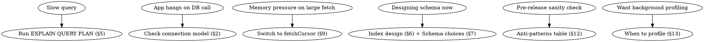

# GRDB Performance

## Overview

Performant, idiomatic SQLite + GRDB for Swift on Apple platforms. Use SQLite deliberately; let GRDB handle safe Swift integration; validate with query plans and Instruments — not cargo-cult PRAGMAs.

**Core principle** GRDB is a SQLite *toolkit*, not an ORM. Performance comes from understanding how SQLite actually works, then choosing GRDB idioms that don't fight it.

**Requires** Swift 6.1+, GRDB 7+. All SQLite features in this skill are available on Axiom's iOS 18+/macOS 15+ floor.

## When to Use

Use this skill when:

- A GRDB query is slow and you want to know what to measure first
- App hangs or jank traces back to database access
- Memory grows while fetching large result sets
- You're designing a new schema and want to make choices you won't regret
- You're choosing between `DatabaseQueue` and `DatabasePool`
- You need to know if you're using indexes correctly
- A code review surfaced raw SQL string interpolation
- You're shipping for the first time and want a pre-release sanity check

For **full-text search** specifics (tokenizers, Unicode discipline) → see `sqlite-fts-ref.md`.
For **multi-process sharing** (app + widget + extension on one DB) → see `grdb-app-groups.md`.
For **migration safety** (adding columns, schema evolution) → see `database-migration.md`.

## Quick Decision Tree

Sections below are numbered §1–§13. The tree edges point at the section you should read.



## 1 — Folklore correction: N+1 is fine in SQLite

The "N+1 query problem" is a *client/server database* problem. It doesn't apply to SQLite.

> "SQLite is able to do one or two large and complex queries, or it can do many smaller and simpler queries. Both are efficient." — sqlite.org/np1queryprob

SQLite runs in-process. Each query is a function call, not a network round trip. SQLite's own documentation cites a real example rendering a 50-entry timeline in *under 25 milliseconds with 200+ statements*.

**What this changes:** don't twist Swift code into a single mega-query just to "avoid N+1." Write clear code that fetches data in the shape it's needed. Use associations when they're clearer (§6, §10); use loops when they're clearer.

**When N+1 still hurts in SQLite:** writes inside the loop without an enclosing transaction (each statement becomes its own commit — see §3). For *reads*, it doesn't.

## 2 — Connection model

GRDB exposes two database connection types. The decision is small:

| | `DatabaseQueue` | `DatabasePool` |
|---|---|---|
| Concurrency | Serializes all access | Parallel reads + one writer |
| Journal mode | Rollback (default); can opt into `.wal` | WAL automatically |
| In-memory | Supported (`DatabaseQueue()`) | Not supported |
| Best for | Default; tests; previews; most apps | Apps needing concurrent UI reads while writing |

**Rule:** start with `DatabaseQueue`. Switch to `DatabasePool` when measurement shows contention between UI reads and background writes. GRDB's own docs: *"If you are not sure, choose `DatabaseQueue`. You will always be able to switch to `DatabasePool` later."*

### Keep connections open

Apple's measurement at **WWDC 2019 #419 (17:01)**:

> "Opening and closing a database can cause expensive operations such as consistency checking, journal recovery, and journal checkpointing... we actually recommend not using a more traditional model of opening and closing a database each time it's needed. Keep the database open as long as possible and close connections only when necessary."

Practically: hold the `DatabaseQueue`/`DatabasePool` as a singleton (or in a long-lived dependency container) for the app's lifetime. GRDB closes the connection on `deinit`; you almost never call `close()` directly. The `DatabaseWriter` protocol lets you swap an in-memory test queue for a production pool.

### In-memory for tests

```swift
// Production
let dbQueue = try DatabaseQueue(path: "/path/to/app.sqlite")

// Tests / previews
let dbQueue = try DatabaseQueue()    // in-memory, ephemeral
```

Both conform to `DatabaseWriter`. Write app code against `DatabaseWriter`, not the concrete type, so test/production swap is one line. Cross-link `grdb.md` Database Setup section for setup details.

## 3 — WAL economics and backup safety

WAL (write-ahead logging) is the default journal mode for `DatabasePool` and recommended for most apps. Apple's WWDC19 measurement: switching from delete-mode journaling to WAL took fsync calls from **16 to 1** in their workload.

### Enable WAL (once, persists)

```swift
var config = Configuration()
config.prepareDatabase { db in
    try db.execute(sql: "PRAGMA journal_mode = WAL")
}
let dbQueue = try DatabaseQueue(path: dbPath, configuration: config)
```

`DatabasePool` does this automatically. For `DatabaseQueue` you set it explicitly.

### Sidecar files

WAL adds two sidecar files: `app.sqlite-wal` and `app.sqlite-shm`. SQLite's docs are explicit:

> "If a database file is separated from its WAL file, then transactions ... might be lost, or the database file might become corrupted."

**Backup discipline:** use GRDB's typed `vacuum(into:)` to serialize a consistent snapshot to a single new file. It's a one-liner and the right primitive — no need for raw SQL:

```swift
try dbQueue.vacuum(into: backupPath)
```

Under the hood this issues `VACUUM INTO ?` with the path as a bound argument. If you must hand-roll, copy all three files (`.sqlite`, `-wal`, `-shm`) atomically with no writer active.

**Never copy `.sqlite` alone while the app is running.** WAL contains uncheckpointed commits; you'll either lose data or get an inconsistent backup.

### Checkpoint awareness

WAL grows until SQLite checkpoints it back into the main file. Defaults:

- `PRAGMA wal_autocheckpoint = 1000` — auto-checkpoint after 1000 pages (~4 MB)
- `PRAGMA journal_size_limit = -1` — no truncation limit by default

A long-running reader can prevent checkpoints from making progress. If you see WAL files growing unbounded in production, look for long-lived read observations holding the database busy.

### Big transactions

For very large bulk-load transactions (gigabytes), WAL can be slower than delete-mode journaling because every modified page must traverse the WAL. SQLite's docs note: *"If an application is doing a lot of one-shot bulk-loading of data, it might be more efficient to disable the WAL."* Switch to `journal_mode = DELETE` for the import, then back to WAL.

## 4 — `PRAGMA optimize` workflow (biggest cheap win) [load-bearing]

> "The PRAGMA optimize command should be applied periodically." — sqlite.org/lang_analyze

`PRAGMA optimize` tells SQLite to refresh its query planner statistics. Without it, SQLite uses stale statistics or none at all, and chooses indexes poorly. As of **SQLite 3.46.0** (May 2024; bundled in iOS 18+/macOS 15+), the pragma self-throttles so it completes quickly even on huge databases.

### The pattern

```swift
var config = Configuration()
config.prepareDatabase { db in
    // On connection open: include analysis of fresh connection (0x10000 bit)
    try db.execute(sql: "PRAGMA optimize=0x10002")
}
let dbQueue = try DatabaseQueue(path: dbPath, configuration: config)
```

Then periodically (e.g., on app background or before close):

```swift
try dbQueue.write { db in
    try db.execute(sql: "PRAGMA optimize")
}
```

**What the bits mean.** `0x00002` is the standard "do an ANALYZE if helpful" bit — cheap, applies to long-lived connections. The extra `0x10000` bit in `0x10002` forces examination on a fresh connection that has no query history yet — this is what makes on-open useful. The `0x10000` bit pays a one-time cost on a connection that hasn't accumulated any query stats; once the connection is warm, subsequent `PRAGMA optimize` calls without `0x10000` are nearly free. If you observe a cold-launch budget breach traceable to this line, the right move is to **defer DB open off the launch critical path** (open lazily on first read), not to drop the bit.

### Why it matters

- Cost per call: milliseconds on a small DB, seconds at most on a huge DB (3.46+ auto-throttles).
- Win: index choice that actually matches your data distribution.
- Without it: SQLite may scan a table where an index exists, or pick a less-selective index.

### When else

- After running migrations that add or change indexes — run `PRAGMA optimize` once at the end of the migration.
- After bulk imports or deletes that significantly change row counts.

**Do not skip this section under time pressure.** It is the single cheapest perf win available, costs nothing at runtime in the common case, and prevents a class of slow-query bug reports that are nearly impossible to diagnose from the field. Apps that ship without `PRAGMA optimize` typically have queries 2–10× slower than necessary on real user data because the planner is reasoning from no statistics.

## 5 — `EXPLAIN QUERY PLAN` as workflow

Before assuming a query uses an index, ask SQLite. `EXPLAIN QUERY PLAN` is free and authoritative.

```swift
try dbQueue.read { db in
    let plan = try Row.fetchAll(db, sql: "EXPLAIN QUERY PLAN SELECT * FROM track WHERE artist_id = ?", arguments: [42])
    for row in plan { print(row) }
}
```

### What to look for

| In plan output | Meaning | Action |
|---|---|---|
| `SCAN <table>` (large table) | Full table scan | Add an index on the filter column |
| `SEARCH <table> USING INDEX <name>` | Uses an index | Good |
| `SEARCH <table> USING COVERING INDEX <name>` | Uses an index that contains all needed columns | Optimal — no table touch |
| `USE TEMP B-TREE FOR ORDER BY` | Sorting in memory | Add an index that includes the sort columns in order |
| `USE TEMP B-TREE FOR GROUP BY` | Aggregating in memory | Same — index the group columns |
| `USE TEMP B-TREE FOR DISTINCT` | Deduplicating in memory | Index the distinct columns |
| `CORRELATED SCALAR SUBQUERY` | Subquery runs once per outer row | Rewrite as a JOIN |
| `MULTI-INDEX OR` | OR clause used multiple indexes | Good |

**Red flags:** `SCAN` on any table with more than a few thousand rows; any `USE TEMP B-TREE`.

**Note:** EQP output format may change between SQLite releases — use it for debugging, not parsing in production.

## 6 — Index design

### The compound-index rule

Evan Schwartz captures it in seven words: **"left to right, no skipping, stops at the first range."**

For an index on `(a, b, c)`:

- `WHERE a = ?` — uses index
- `WHERE a = ? AND b = ?` — uses index
- `WHERE a = ? AND b = ? AND c = ?` — uses index
- `WHERE b = ?` — does NOT use index (skipped `a`)
- `WHERE a = ? AND c = ?` — uses index on `a` only (skipped `b`)
- `WHERE a >= ? AND b = ?` — uses index on `a` only (range stops it)

Implication: put equality columns first, range columns last. A single multi-column index almost always beats two single-column indexes.

### Drop prefix-redundant indexes

> "Your database schema should never contain two indices where one index is a prefix of the other." — sqlite.org/queryplanner

If you have `INDEX(a, b, c)`, drop `INDEX(a, b)` and `INDEX(a)` — they're covered.

### Always index foreign-key columns

SQLite does *not* automatically index FK columns. Without indexes, JOINs scan the child table. GRDB's DSL does this for you:

```swift
try db.create(table: "book") { t in
    t.belongsTo("author")    // adds author_id column + FK + index automatically
}
```

For raw SQL migrations, you must add the index yourself:

```sql
CREATE INDEX idx_book_author ON book(author_id);
```

### Partial indexes

When most rows are inactive, archived, or filtered out, a partial index can be smaller and faster:

```sql
CREATE INDEX idx_active_users ON user(email) WHERE deleted_at IS NULL;
```

**Critical gotcha — the planner does no algebra.** The query's `WHERE` clause must textually match the index's `WHERE` clause for the index to be used. `WHERE deleted_at IS NULL` in your query matches; `WHERE NOT deleted` does not, even if the column is the same boolean.

### Expression indexes

For case-insensitive lookups, JSON extraction, or other computed lookups:

```sql
CREATE INDEX idx_user_email_lower ON user(LOWER(email));
CREATE INDEX idx_event_time ON event(json_extract(data, '$.time'));
```

Same exact-form-match rule: query must use `LOWER(email)`, not `email COLLATE NOCASE`.

## 7 — Schema choices that affect performance

### `WITHOUT ROWID`

`WITHOUT ROWID` tables store rows in the primary-key B-tree directly, no rowid indirection. Win case: rows smaller than ~1/20 of the page size (≈ 200 bytes for default 4 KiB pages) with a non-integer or composite primary key.

```sql
CREATE TABLE setting (
    key   TEXT PRIMARY KEY,
    value TEXT NOT NULL
) WITHOUT ROWID;
```

Storage: ~half. Speed: nearly 2× for suitable schemas.

**Don't use:**
- with `INTEGER PRIMARY KEY` (you lose the rowid alias and gain nothing)
- with large rows (>2 KB-ish) — rowid tables are actually faster
- when you need AUTOINCREMENT, `sqlite3_last_insert_rowid()`, or incremental BLOB I/O

### Generated columns

Generated columns are computed from other columns. Two flavors:

| | `VIRTUAL` (default) | `STORED` |
|---|---|---|
| Recomputed on | every read | every write |
| Disk cost | none | full column |
| Indexable | yes (as expression index) | yes (as ordinary index) |
| ALTER TABLE | can add via `ALTER TABLE ADD COLUMN` | cannot add via ALTER |

Simon Willison's correction is worth internalizing: **"stored are rarely used in practice."** VIRTUAL + index gets you the same query performance, less disk cost, fewer write costs.

**Practical pattern — index a JSON field for fast lookups:**

```sql
ALTER TABLE event
    ADD COLUMN event_time TEXT AS (data ->> 'time');
CREATE INDEX idx_event_time ON event(event_time);
```

The `->>` operator returns a SQL text scalar; `->` returns JSON. Use `->>` for indexing.

**Inspection gotcha:** generated columns are missing from `PRAGMA table_info`. Use `PRAGMA table_xinfo` instead.

### STRICT tables → see migration skill

STRICT tables enforce column types at insert/update time. Useful, but they affect correctness (no silent coercion), not performance directly. See `database-migration.md` "Modern schema choices" for STRICT discipline.

## 8 — Query idioms (Sendable + injection)

### Records: structs, not classes

GRDB 7 actively discourages the legacy `Record` base class. Use structs conforming to `FetchableRecord` / `PersistableRecord`:

```swift
struct Track: Codable, FetchableRecord, PersistableRecord, Sendable {
    var id: Int64
    var title: String
    var artistID: Int64

    enum Columns {
        static let id     = Column(CodingKeys.id)
        static let title  = Column(CodingKeys.title)
        static let artistID = Column(CodingKeys.artistID)
    }
}
```

Structs compose with `Sendable` automatically when all stored properties are `Sendable`. Classes don't.

### `databaseSelection` must be computed

This trips most upgrades to Swift 6:

```swift
// WRONG — stored property is not concurrency-safe in Swift 6
static let databaseSelection: [any SQLSelectable] = [Columns.id, Columns.title]

// RIGHT — computed property
static var databaseSelection: [any SQLSelectable] {
    [Columns.id, Columns.title]
}
```

The Swift 6 compiler error is "Static property 'databaseSelection' is not concurrency-safe because non-'Sendable' type '[any SQLSelectable]' may have shared mutable state."

### SQL injection: arguments or `execute(literal:)`, never string interpolation

```swift
// CRITICAL ANTI-PATTERN — injectable
try db.execute(sql: "UPDATE track SET title = '\(title)' WHERE id = \(id)")

// SAFE — positional arguments
try db.execute(sql: "UPDATE track SET title = ? WHERE id = ?", arguments: [title, id])

// SAFE — named arguments
try db.execute(sql: "UPDATE track SET title = :title WHERE id = :id",
               arguments: ["title": title, "id": id])

// SAFE — SQL interpolation literal
try db.execute(literal: "UPDATE track SET title = \(title) WHERE id = \(id)")
```

The `literal:` form looks like string interpolation but safely parameterizes values. Use either arguments or `literal:`. Never use `execute(sql:)` with a string built from user input.

The query interface (`Track.filter(...)`) is injection-safe by construction — prefer it when the query is expressible.

## 9 — Cursors for large streams

`fetchAll` materializes the entire result set into a `[Player]`. For large result sets, this can spike memory and stall the calling thread. `fetchCursor` is lazy and near-direct SQLite access:

```swift
try dbQueue.read { db in
    let cursor = try Track.fetchCursor(db, sql: "SELECT * FROM track ORDER BY title")
    while let track = try cursor.next() {
        process(track)
    }
}
```

### Critical rules

1. **Consume inside the closure.** Cursors hold an open SQLite statement. Pulling a cursor out of `read { ... }` is undefined behavior:
   ```swift
   // WRONG
   let cursor = try dbQueue.read { db in
       try Track.fetchCursor(db, ...)   // closure returns; statement still open
   }
   ```
2. **Single-pass.** A cursor iterates once. Need to iterate twice? Fetch an array.
3. **`Row` is reused.** A `Cursor<Row>` returns the same `Row` instance with new values each iteration. Do not collect rows into an array directly — they'll all be the same row. Either fetch typed records (`Track.fetchCursor`), or call `row.copy()` to capture a snapshot.
4. **No database mutations mid-iteration.** Modifying the database while a cursor iterates is undefined behavior.

### When to use cursors

- Result set > ~10K rows
- Memory-sensitive context (background processing, extension memory limits)
- Streaming pipelines (export, sync, indexing) where you process and discard rows

For small result sets, `fetchAll` is simpler and not measurably slower.

## 10 — Observation cost

### `ValueObservation` defaults

```swift
let observation = ValueObservation.tracking { db in
    try Track.fetchAll(db)
}
let cancellable = observation.start(in: dbQueue) { error in
    // handle error
} onChange: { tracks in
    // tracks are delivered on @MainActor, async
}
```

Defaults:
- Initial value delivered on `@MainActor`, asynchronously
- Changes delivered on `@MainActor`, asynchronously after commit
- Only commits trigger notifications — uncommitted changes are invisible
- External-process writes are *not* detected (see `grdb-app-groups.md` §7)

### `.immediate` scheduling — only for fast queries

Scheduling is a parameter on `start(in:scheduling:onError:onChange:)`, not a method on the observation:

```swift
let cancellable = observation.start(in: dbQueue, scheduling: .immediate) { error in
    // handle error
} onChange: { tracks in
    // initial value arrives synchronously here
}
```

Delivers the initial value synchronously on subscription. Useful for snappy SwiftUI updates, but it blocks the main thread until the fetch returns. GRDB's docs are blunt: *"Only use the `immediate` scheduling for very fast database requests!"*

### Coalescing

ValueObservation may deliver identical consecutive values. Use `.removeDuplicates()` (requires `Equatable`) to dedupe.

### Sharing

If multiple SwiftUI views observe the same query, use `.shared(in:)` to fetch once and fan out:

```swift
let observation = ValueObservation
    .tracking { db in try Track.fetchAll(db) }
    .shared(in: dbQueue)
```

### `DatabaseRegionObservation` — when to drop down

`DatabaseRegionObservation` notifies you about *transactions that touched a region*, not about *fresh values*. The callback receives a `Database` for inspection.

Use it when:
- You need every individual transaction (no coalescing) — ValueObservation may coalesce
- You need synchronous-after-commit semantics — ValueObservation is async
- You're broadcasting cross-process change notifications — see `grdb-app-groups.md` §7

For 95% of UI code, `ValueObservation` is the right choice.

## 11 — SQLiteData layer: how tuning transfers

If you're using Point-Free's SQLiteData, the SQLite tuning in this skill applies **unchanged**. SQLiteData sits *above* GRDB (which sits above SQLite). What changes vs raw GRDB:

1. **Decode path.** SQLiteData uses a direct SQLite-3 decoder, not `Codable` round-trips. Bulk fetches are faster than GRDB's Codable record path on large result sets. Raw GRDB users get equivalent direct access via `fetchCursor` (§9).
2. **Observation.** `@FetchAll` / `@FetchOne` behave like `ValueObservation.shared(in:)` w.r.t. coalescing semantics — initial value + change broadcasts, fan-out across subscribers.
3. **Property-wrapper observability.** `@FetchAll` works in `@Observable` classes and UIKit view controllers, not just SwiftUI — wider applicability than GRDB's `@Query` from GRDBQuery.

What *doesn't* change:
- PRAGMAs (§4)
- Index design (§6)
- Journal mode (§3)
- FTS5 setup (`sqlite-fts-ref.md`)
- App-group sharing rules (`grdb-app-groups.md`)

Cross-link `sqlitedata.md` for SQLiteData-specific patterns and decisions.

## 12 — Anti-patterns

| Anti-pattern | Symptom | Fix | Section |
|---|---|---|---|
| Raw SQL with `"\(value)"` in `execute(sql:)` | SQL injection; subtle bugs with quoting | Use `?`/`:name` args or `execute(literal:)` | §8 |
| Missing FK index | Slow JOINs; `EXPLAIN QUERY PLAN` shows SCAN | `CREATE INDEX` on FK column; or use `t.belongsTo` | §6 |
| `fetchAll` on unbounded table | Memory spike; main-thread stall | Switch to `fetchCursor` or paginate | §9 |
| Opening/closing DB per query | High latency on every call | Hold connection for app lifetime | §2 |
| Missing `PRAGMA optimize` hookup | Slow queries on real user data; planner uses no stats | Apply in `prepareDatabase`; periodic call | §4 |
| Partial-index WHERE doesn't match query WHERE | Index exists, not used; EQP shows SCAN | Make `WHERE` clauses textually identical | §6 |
| `ORDER BY` without supporting index | EQP shows `USE TEMP B-TREE` | Add index with sort columns in order | §5, §6 |
| `.immediate` on slow ValueObservation | Main thread stalls on view appear | Use default async, or fetch less | §10 |
| `Record` class subclass | Sendable warnings in Swift 6; harder to test | Convert to struct + protocols | §8 |
| `databaseSelection` as `static let` | "Not concurrency-safe" error | Make it `static var` (computed) | §8 |
| Backup `.sqlite` alone | Lost or corrupted backup | `dbQueue.vacuum(into:)`, or copy all 3 files atomically with no writer active | §3 |
| Stored generated column for indexable lookups | Wasted disk; ALTER TABLE limitations | Use VIRTUAL + index | §7 |
| String concatenation in WHERE for case-insensitive | Index ignored | `LOWER()` expression index | §6 |

## 13 — When to profile, when to read

Profile when:
- You have a specific slow query and want to know which index it's hitting → `EXPLAIN QUERY PLAN` (§5). Free.
- You suspect write amplification → Instruments **File Activity** template. Look for unexpected fsyncs and page writes.
- You suspect connection contention → Instruments **Points of Interest** with GRDB's `db.trace { ... }` callback.
- You want a wall-clock budget for a known operation → `XCTMetric` / `os_signpost` with realistic data.

Read this skill when:
- You haven't picked a connection type yet (§2)
- You haven't enabled `PRAGMA optimize` (§4)
- You haven't run `EXPLAIN QUERY PLAN` (§5)
- You haven't asked whether your indexes match your queries (§6)

**Most performance bugs are not measurement problems. They're missing-the-cheap-win problems.** Read first, profile when read isn't enough.

### Realistic data matters

Toy data lies. A query that takes 2 ms on 100 rows can take 2 s on 100,000 rows with no index — the cost difference is invisible until production. When measuring, populate with realistic counts and distributions.

## Resources

**WWDC**: 2019-419

**SQLite docs**: sqlite.org/np1queryprob, sqlite.org/wal, sqlite.org/eqp, sqlite.org/queryplanner, sqlite.org/lang_analyze, sqlite.org/partialindex, sqlite.org/expridx, sqlite.org/withoutrowid, sqlite.org/gencol

**GRDB docs**: github.com/groue/GRDB.swift README, Documentation/{DatabaseConnections,SwiftConcurrency,Migrations,ValueObservation,DatabaseRegionObservation,RecordRecommendedPractices}.md

**Third-party**: emschwartz.me/subtleties-of-sqlite-indexes (Schwartz compound-index rule), simonwillison.net/2024/May/8/modern-sqlite-generated-columns (Willison generated columns), phiresky.github.io/blog/2020/sqlite-performance-tuning (Phiresky PRAGMA tuning)

**Skills**: grdb (primer), sqlite-fts-ref, grdb-app-groups, database-migration, sqlitedata, sqlitedata-ref, axiom-concurrency, axiom-performance
