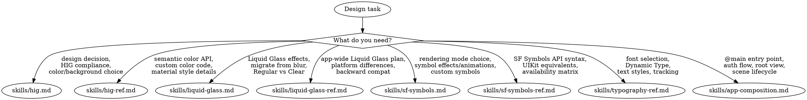

# Design & HIG

**You MUST use this skill for ANY visual design, HIG compliance, Liquid Glass, SF Symbols, typography, or app composition work.**

## Quick Reference

| Symptom / Task | Reference |
|----------------|-----------|
| Design decisions, HIG compliance, colors, backgrounds | See `skills/hig.md` |
| Semantic colors, custom color patterns, material styles | See `skills/hig-ref.md` |
| Liquid Glass effects, adoption, migration from blur effects | See `skills/liquid-glass.md` |
| App-wide Liquid Glass adoption, backward compatibility | See `skills/liquid-glass-ref.md` |
| SF Symbols rendering modes, effects, animations | See `skills/sf-symbols.md` |
| SF Symbols API signatures, UIKit equivalents, availability | See `skills/sf-symbols-ref.md` |
| San Francisco fonts, text styles, Dynamic Type, tracking | See `skills/typography-ref.md` |
| App entry points, auth flows, root view switching, scene lifecycle, document-based apps | See `skills/app-composition.md` |
| Apple Pay button / Wallet pass design / Tap to Pay button | See `axiom-payments` suite, plus `skills/hig.md` for cross-cutting HIG context |

## Decision Tree

1. Design decision / HIG compliance / choosing colors or backgrounds? → `skills/hig.md`
1a. Need semantic color API, custom color code, or material style details? → `skills/hig-ref.md`
2. Liquid Glass effects / migrating from blur / Regular vs Clear variant? → `skills/liquid-glass.md`
2a. Planning app-wide Liquid Glass adoption / platform differences / backward compatibility? → `skills/liquid-glass-ref.md`
3. SF Symbols rendering mode / symbol effects / custom symbols? → `skills/sf-symbols.md`
3a. Need SF Symbols API syntax / UIKit equivalents / availability check? → `skills/sf-symbols-ref.md`
4. Font selection / Dynamic Type / text styles / tracking / leading? → `skills/typography-ref.md`
5. App entry point / auth flow / root view switching / scene lifecycle? → `skills/app-composition.md`
6. SwiftUI view implementation? → `/skill axiom-swiftui`
7. TextKit / rich text editing / Writing Tools? → `/skill axiom-uikit`
8. Accessibility compliance (VoiceOver, contrast, touch targets)? → `/skill axiom-accessibility`
9. Audit UI for Liquid Glass adoption? → liquid-glass-auditor (Agent — surfaces migration opportunities AND adoption-completeness gaps: variant discipline, nesting hygiene, availability gating, primary-action tinting, accessibility re-check; scores ADOPTED / PARTIAL / NOT ADOPTED)
10. CarPlay app design, categories, driver-distraction rules? → `/skill axiom-media` (carplay-hig.md)

#### Platform-specific HIG
- watchOS design (glanceable UI, watchOS 10 navigation) → See axiom-watchos (skills/design-for-watchos.md)

## Conflict Resolution

**design vs swiftui**: When building UI:
1. **Use design FIRST** — Decide what to build (colors, materials, typography, layout intent) before how to build it.
2. **Then use swiftui** — Implement the design decision in SwiftUI code.

**design vs accessibility**: When choosing colors or typography:
- Color contrast or Dynamic Type compliance? → **use accessibility**
- Which semantic color or text style to pick? → **use design**

**design (liquid-glass) vs swiftui**: When implementing Liquid Glass:
- What Liquid Glass is, when to use Regular vs Clear, migration strategy → **use design** (`skills/liquid-glass.md`)
- SwiftUI code for `.glassEffect()` modifier → **use design** (`skills/liquid-glass-ref.md`), then swiftui for surrounding view code

**design (app-composition) vs swiftui**: When structuring app architecture:
- @main entry, auth state machine, root view switching, scene lifecycle → **use design** (`skills/app-composition.md`)
- NavigationStack, NavigationSplitView, tab structure → **use swiftui**

**design vs media (CarPlay)**: When designing for CarPlay:
- General iOS HIG principles (colors, typography, Liquid Glass) → **use design**
- CarPlay-specific rules (app categories, entitlement review, template-only UI, driver distraction, per-category design rules) → **invoke axiom-media** (`skills/carplay-hig.md`)
- CarPlay rules are stricter than iOS HIG and enforced at entitlement review, not just App Store review.

## Critical Patterns

**HIG Quick Decisions** (`skills/hig.md`):
- Background color decision tree (media-focused vs standard)
- Typography selection (headline vs body vs caption)
- Color usage guidelines and when to use semantic vs custom colors
- Design review checklist for HIG compliance

**HIG Comprehensive Reference** (`skills/hig-ref.md`):
- All semantic colors with platform availability
- Custom color patterns with dark mode support
- Background hierarchy and material styles
- Code examples for every color and background pattern

**Liquid Glass** (`skills/liquid-glass.md`):
- What Liquid Glass is and how it differs from blur effects
- Regular vs Clear variant selection
- Migration strategy from pre-iOS 26 materials
- Tinting, legibility, and adaptive behavior troubleshooting
- Expert review criteria for Liquid Glass implementations

**Liquid Glass Adoption** (`skills/liquid-glass-ref.md`):
- App-wide adoption planning (icons, controls, navigation, menus)
- Platform-specific behavior (iOS, iPadOS, macOS, tvOS, watchOS)
- Backward compatibility strategy for supporting pre-Liquid Glass
- Accessibility compliance with Liquid Glass interfaces

**SF Symbols** (`skills/sf-symbols.md`):
- Rendering mode selection (Monochrome, Hierarchical, Palette, Multicolor)
- Symbol effect selection (Bounce, Pulse, Scale, Wiggle, Rotate, Breathe, Draw)
- Custom symbol creation workflow
- Troubleshooting effects not playing, weight mismatches

**SF Symbols API** (`skills/sf-symbols-ref.md`):
- Exact API signatures for rendering modes and effects
- UIKit/AppKit equivalents for every SwiftUI symbol API
- Platform availability matrix
- Configuration options (weight, scale, variable values)

**Typography** (`skills/typography-ref.md`):
- San Francisco font system (Pro, Compact, Mono, New York)
- Text styles with Dynamic Type scaling
- Tracking and leading values
- Internationalization considerations

**App Composition** (`skills/app-composition.md`):
- @main entry point and root view patterns
- Authentication state machine (login, onboarding, main)
- Flicker-free root view switching
- scenePhase lifecycle handling and state restoration
- Document-based apps: the `OS27` `@Observable` document model (`ReadableDocument`/`WritableDocument`) + `DocumentGroup`

## Anti-Rationalization

| Thought | Reality |
|---------|---------|
| "I'll just pick colors that look good" | Semantic colors adapt to dark mode, accessibility settings, and platform automatically. Custom colors need all of that manually. `skills/hig.md` has the decision tree. |
| "Liquid Glass is just a blur effect" | Liquid Glass is a distinct material system with lensing, tinting, and adaptive behavior. Using `.blur()` instead creates a visually wrong result. `skills/liquid-glass.md` explains the difference. |
| "I know which SF Symbol rendering mode to use" | The right mode depends on context (monochrome for toolbars, hierarchical for depth, palette for brand colors). `skills/sf-symbols.md` has the decision tree. |
| "I'll hardcode font sizes" | Hardcoded sizes break Dynamic Type, violate HIG, and fail accessibility review. `skills/typography-ref.md` shows the text style system. |
| "I'll handle auth state with a boolean" | A boolean can't represent login, onboarding, and main states without race conditions. `skills/app-composition.md` has the state machine pattern. |
| "Liquid Glass adoption means rewriting my whole UI" | Most standard SwiftUI/UIKit components adopt automatically. Start by building with latest Xcode, then review. `skills/liquid-glass-ref.md` has the incremental strategy. |
| "I'll add the SF Symbol animation later" | Symbol effects are the primary way users perceive interactive feedback. Shipping without them feels broken. `skills/sf-symbols.md` covers selection. |
| "I'll skip the design review, the code works" | HIG compliance affects App Store review. Reviewers reject apps that feel wrong even if they function correctly. `skills/hig.md` has the review checklist. |

## Example Invocations

User: "Should I use a dark or light background?"
-> Read: `skills/hig.md`

User: "What semantic color should I use for secondary text?"
-> Read: `skills/hig-ref.md`

User: "How do I implement Liquid Glass in my app?"
-> Read: `skills/liquid-glass.md`

User: "I need to plan Liquid Glass adoption across my whole app"
-> Read: `skills/liquid-glass-ref.md`

User: "My SF Symbol is flat, I want it to have depth"
-> Read: `skills/sf-symbols.md`

User: "What's the SwiftUI API for symbol effects?"
-> Read: `skills/sf-symbols-ref.md`

User: "Which font should I use for body text?"
-> Read: `skills/typography-ref.md`

User: "How do I switch between login and main screens?"
-> Read: `skills/app-composition.md`

User: "Check my app's UI for HIG compliance"
-> Read: `skills/hig.md`, then `/skill axiom-accessibility` for contrast/Dynamic Type

User: "I want my download button icon to animate"
-> Read: `skills/sf-symbols.md`
