# HealthKit and WorkoutKit

**You MUST use this skill for ANY HealthKit or WorkoutKit development including authorization, data queries, background delivery, workout sessions, planned workouts, wellbeing APIs (State of Mind), Medications, and Health Records.**

## Quick Reference

| Symptom / Task | Reference |
|----------------|-----------|
| HealthKit framework model, `HKHealthStore`, data types, sample vs characteristic data | See `skills/fundamentals.md` |
| Capability setup, `requestAuthorization`, purpose strings, read-asymmetry, privacy | See `skills/authorization-and-privacy.md` |
| `HKSampleQuery`, Swift Concurrency query APIs, `HKStatisticsCollectionQuery`, sample writes | See `skills/queries.md` |
| Anchored queries, observer queries, `HKDeletedObject`, `background-delivery` entitlement | See `skills/sync-and-background.md` |
| `HKWorkoutSession`, `HKLiveWorkoutBuilder`, recovery, multi-device, iOS/iPadOS/watchOS workout tracking | See `skills/workouts.md` |
| Workout zones (heart-rate/power effort bands), live + retrospective `OS27` | See `skills/workouts.md` |
| WorkoutKit custom/planned workouts, scheduling, swimming workouts, previewing | See `skills/workoutkit.md` |
| State of Mind, Medications API, symptom logging, menopausal state, wellbeing APIs `OS27` | See `skills/wellbeing-and-medications.md` |
| Health Records (FHIR), Mobility Health App, motion-based health | See `skills/clinical-and-mobility.md` |

## Cross-Suite Routes

These topics overlap with HealthKit/WorkoutKit but live in separate suites:

#### watchOS presentation
- Watch-specific workout presentation (Always On, Smart Stack), complication surfaces → See axiom-watchos
- Workout app structure on Apple Watch → See axiom-watchos (`skills/platform-basics.md`)

#### Concurrency
- Swift 6 concurrency, actors, Sendable → See axiom-concurrency
- HealthKit queries bridging to Swift Concurrency → `skills/queries.md` is the canonical example

#### SwiftUI
- Charts rendering for health data → See axiom-swiftui
- `@Observable` view models for health data → See axiom-swiftui

#### Data and sync
- General cross-platform sync patterns (CloudKit, GRDB) → See axiom-data
- HealthKit anchored/observer queries as a generalizable sync mechanism → `skills/sync-and-background.md`

#### Security and privacy
- Keychain storage, encryption, data-protection entitlements → See axiom-security

## Conflict Resolution

**axiom-health vs axiom-watchos**: For workout apps on Apple Watch:
1. **Use axiom-health** for `HKWorkoutSession` lifecycle, `HKLiveWorkoutBuilder`, recovery APIs, multi-device mirroring — these are HealthKit concepts, not watch concepts
2. **Use axiom-watchos** for watch-specific presentation: Always On display, Smart Stack placement, watchOS background mode coordination
3. **Both apply** for a watch-native workout app — start with axiom-health for session lifecycle, then axiom-watchos for presentation

**axiom-health vs axiom-concurrency**: For HealthKit query patterns:
1. **Use axiom-health** for which query type to choose and HealthKit-specific gotchas
2. **Use axiom-concurrency** for general Swift 6 actor isolation rules that apply to query callbacks

**axiom-health vs axiom-data**: For change-tracked data synchronization:
1. **Use axiom-health** for `HKAnchoredObjectQuery`, `HKObserverQuery`, `HKDeletedObject`
2. **Use axiom-data** for application-level data sync across devices (CloudKit, GRDB, SwiftData)

## Decision Tree

```dot
digraph health {
    start [label="HealthKit / workout task" shape=ellipse];
    what [label="What area?" shape=diamond];

    start -> what;
    what -> "skills/fundamentals.md" [label="framework basics, data types"];
    what -> "skills/authorization-and-privacy.md" [label="permissions, purpose strings, privacy"];
    what -> "skills/queries.md" [label="reading data, rollups, writes"];
    what -> "skills/sync-and-background.md" [label="change tracking, background delivery"];
    what -> "skills/workouts.md" [label="HKWorkoutSession, live workouts"];
    what -> "skills/workoutkit.md" [label="planned/custom workouts"];
    what -> "skills/wellbeing-and-medications.md" [label="State of Mind, Medications"];
    what -> "skills/clinical-and-mobility.md" [label="Health Records, Mobility"];
    what -> "axiom-watchos" [label="watch-specific presentation"];
    what -> "axiom-concurrency" [label="general actor isolation rules"];
    what -> "axiom-swiftui" [label="Charts, data visualization"];
}
```

## Resources

**WWDC**: 2019-218, 2020-10182, 2020-10184, 2020-10664, 2021-10009, 2021-10287, 2022-10005, 2023-10016, 2023-10023, 2024-10084, 2024-10109, 2025-321, 2025-322

**Docs**: /healthkit, /healthkit/about-the-healthkit-framework, /healthkit/authorizing-access-to-health-data, /healthkit/protecting-user-privacy, /healthkit/reading-data-from-healthkit, /healthkit/running-queries-with-swift-concurrency, /healthkit/executing-anchored-object-queries, /healthkit/executing-observer-queries, /healthkit/hkworkoutsession, /healthkit/hklivewobuilder, /workoutkit, /healthkit/accessing-health-records

**Skills**: axiom-watchos, axiom-concurrency, axiom-swiftui, axiom-data, axiom-security
