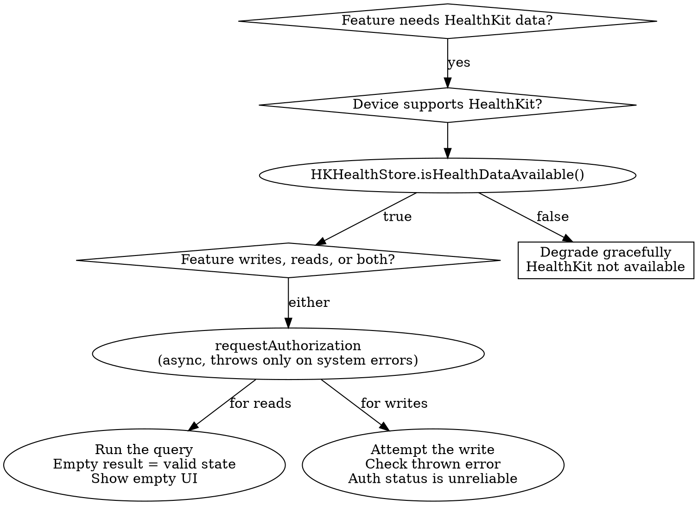

# HealthKit Authorization and Privacy

## When to Use This Skill

Use when:
- Implementing the first authorization request for any HealthKit feature
- Investigating "my Health tab is empty for some users" (this is usually the read-asymmetry, not a bug)
- Deciding between `requestAuthorization` and `getRequestStatusForAuthorization`
- Handling `HKAuthorizationStatus.notDetermined` vs `.sharingDenied` vs `.sharingAuthorized`
- Writing purpose strings for `NSHealthShareUsageDescription` / `NSHealthUpdateUsageDescription`
- Adding clinical records, vision prescriptions, or other per-object-authorization types
- Preparing for App Store submission with Health data

#### Related Skills

- Use `fundamentals.md` for the HealthKit data model and `HKHealthStore` setup
- Use `queries.md` for how queries behave after authorization
- Use `axiom-shipping` for App Store submission concerns around Clinical Records and privacy

## The One Thing You Must Internalize

**HealthKit does not tell you whether read access was granted or denied.** This is a deliberate privacy feature, not an API oversight:

> "To prevent possible information leaks, an app isn't aware when the user denies permission to read data. From the app's point of view, no data of that type exists." — Apple, *Protecting User Privacy*

Every other rule in this skill follows from that one. If a denied read returned a distinct error, an app could infer the user has data (and therefore a condition, habit, or workout) just from the denial pattern. Returning "no matching samples" makes denial indistinguishable from "no data exists," closing the leak.

## `HKAuthorizationStatus` Is Write-Only

```swift
public enum HKAuthorizationStatus {
    case notDetermined     // User has not yet chosen.
    case sharingDenied     // User has explicitly denied WRITE access.
    case sharingAuthorized // User has explicitly granted WRITE access.
}
```

Every case name contains `sharing`. That word is literal — it refers to write (share to store) state only. There is no enum case for read status.

`authorizationStatus(for:)` returns one of the three cases above:

```swift
func authorizationStatus(for type: HKObjectType) -> HKAuthorizationStatus
```

> "checks the authorization status for saving data to the HealthKit store" — Apple, `authorizationStatus(for:)` docs

So `authorizationStatus(for: stepCount)` tells you nothing about whether you can read steps. If you want to know whether data is actually available, you must run a query and see what comes back.

## `getRequestStatusForAuthorization` Is a Sheet Gate

```swift
func statusForAuthorizationRequest(
    toShare typesToShare: Set<HKSampleType>,
    read typesToRead: Set<HKObjectType>
) async throws -> HKAuthorizationRequestStatus

public enum HKAuthorizationRequestStatus {
    case unknown        // Error occurred.
    case shouldRequest  // At least one type is still .notDetermined; sheet would appear.
    case unnecessary    // All types have been previously requested.
}
```

Use this when you want to avoid showing the request UI if it would be a no-op. It tells you *whether the sheet would appear*, not whether permissions were granted.

## Required `Info.plist` Keys — Or The App Crashes

> "You must set the usage keys, or your app will crash when you request authorization." — Apple, `requestAuthorization` docs

| Key | Required when |
|---|---|
| `NSHealthShareUsageDescription` | `typesToRead` is non-empty |
| `NSHealthUpdateUsageDescription` | `typesToShare` is non-empty |
| `NSHealthClinicalHealthRecordsShareUsageDescription` | You access clinical records (FHIR) |
| `NSHealthRequiredReadAuthorizationTypeIdentifiers` | You require specific clinical record types to be readable |

Write strings that explain the *feature*, not the framework. "Share activity with friends" beats "This app reads your step count."

## Capability and Entitlement Setup

1. Xcode → target → **Signing & Capabilities** → **+ Capability** → **HealthKit**
2. Toggle **Clinical Health Records** only if you actually access FHIR data. **App Review rejects apps that enable it without using it.**
3. Toggle **Background Delivery** only if you register observer queries with background delivery enabled (see `sync-and-background.md`).

Entitlements added:
- `com.apple.developer.healthkit`
- `com.apple.developer.healthkit.access`

If HealthKit is optional for your app, remove the `healthkit` entry from `UIRequiredDeviceCapabilities` in `Info.plist` so non-HealthKit devices can still install. The `healthkit` capability entry is not used on watchOS.

## Canonical Request Flow

```swift
import HealthKit

@MainActor
final class HealthAuth {
    let store = HKHealthStore()

    func requestStepCountAccess() async throws {
        // 1. Gate on device availability — macOS, old iPadOS, or unsupported devices return false.
        guard HKHealthStore.isHealthDataAvailable() else {
            throw AuthError.notAvailable
        }

        let toRead: Set<HKObjectType> = [HKQuantityType(.stepCount)]
        let toWrite: Set<HKSampleType> = []

        // 2. Optionally skip the sheet if it wouldn't appear anyway.
        let status = try await store.statusForAuthorizationRequest(
            toShare: toWrite,
            read: toRead
        )
        if status == .unnecessary {
            return
        }

        // 3. Request. This may or may not show the sheet depending on prior choices.
        //    The `async` variant throws only on system errors, NOT on user denial.
        try await store.requestAuthorization(toShare: toWrite, read: toRead)

        // 4. DO NOT check authorizationStatus(for:) here and expect a read answer.
        //    Run a query and treat an empty result as "no permission OR no data" —
        //    they're indistinguishable by design.
    }

    enum AuthError: Error { case notAvailable }
}
```

## Success Is Not Consent

> "Success in this case does not mean that the user has granted permission to these data types. It just means that you successfully requested authorization." — WWDC 2020-10664

The async `requestAuthorization` throws only on system errors (missing usage key, device unavailable). It does not throw on user denial. The completion-handler variant returns `(success: true, error: nil)` even when the user taps "Don't Allow."

This means:
- Never treat a successful `requestAuthorization` return as "I can read data now."
- Never show "authorization granted" UI based on the request's return value.
- Always validate actual access by attempting the operation. For writes, check the thrown error. For reads, run a query and accept that empty results are valid.

## The Four Rules of When to Request

From WWDC 2020-10664:

1. **Request in context.** Ask when the user is in the flow that needs the data — not at launch. The onboarding walkthrough is also a fine place for a single upfront request.
2. **Request every time you intend to interact.** Users change permissions in Settings and the Health app outside your app. HealthKit is the source of truth, not your cache.
3. **Request only what the feature needs.** Over 100 data types exist; batching them feels like a privacy violation to users.
4. **Never treat success as granted.** (See previous section.)

## Background Reads May Fail

> "your app may not be able to read data from the store when it runs in the background." — Apple, *Protecting User Privacy*

Writes still work in the background via temporary caching. Reads do not reliably work when the device is locked. Design background workflows so that read failures are acceptable — see `sync-and-background.md` for observer queries + background delivery that handle this correctly.

## Guest User Session Trap

> "An app's permissions don't change when an app runs in a Guest User session. Therefore, `authorizationStatus(for:)` returns `.sharingAuthorized` if the owner previously granted authorization to write the data, even though the app can't write it during a Guest User session." — Apple, `authorizationStatus(for:)` docs

Relevant on iPad. Do not use `authorizationStatus(for:)` as a pre-flight gate for writes; attempt the write and handle the error.

## Per-Object Read Authorization (Vision Prescriptions)

A small class of types uses per-object authorization — the user picks specific records, not a type-wide permission. Currently applies to `HKVisionPrescriptionType` (iOS 16+):

```swift
store.requestPerObjectReadAuthorization(
    for: HKObjectType.visionPrescriptionType(),
    predicate: myPredicate
) { success, error in
    // "success" means the request was delivered, not that the user approved any record.
    // Users select specific prescriptions to share.
}
```

This is the only authorization path that always shows a sheet (per WWDC 2022-10005: "Doing so will always display an authorization prompt in your app with a list of all the prescriptions that match your predicate").

## App Store Privacy

- The **Privacy Manifest** (`PrivacyInfo.xcprivacy`) does not currently require HealthKit-specific declarations in Apple's published manifest documentation. Check App Store Connect's data-collection questionnaire at submission — it asks separately about health and fitness data categories.
- Apps must not "use information gained through the use of the HealthKit framework for advertising or similar services" or "sell information gained through HealthKit to advertising platforms, data brokers, or information resellers." These are hard App Review rejection triggers.
- A privacy policy is required for any HealthKit-reading app, and Apple specifically expects alignment with PHR or HIPAA-style disclosures.

## Common Mistakes

| Mistake | Reality |
|---|---|
| Reading `authorizationStatus(for:)` and assuming it reflects read access | It's write-only. There is no API that reflects read access. Period. |
| Showing "authorization granted" UI after a successful `requestAuthorization` return | Success means the request was delivered, not approved. Users may have tapped "Don't Allow." |
| Re-presenting the authorization sheet aggressively when the Health tab looks empty | The sheet only appears once per type. Re-calling `requestAuthorization` when status is `.notDetermined` is fine, but after denial the sheet will not reappear — you are silently no-oping. |
| Treating empty query results as a bug | By design, denied reads and genuinely-empty reads are indistinguishable. Empty is a valid state. Show an empty-state UI, not an error. |
| Requesting a large batch of types on launch | Users see a sheet with 40 toggles and either deny everything or drop out of onboarding. Request in context. |
| Forgetting `NSHealthUpdateUsageDescription` | App crashes the first time `requestAuthorization` is called with a non-empty `toShare`. Same for `NSHealthShareUsageDescription` and `toRead`. |
| Relying on `authorizationStatus(for:)` on iPad (Guest mode) | Returns the owner's status even in Guest sessions where writes fail. Attempt the write and handle the error. |
| Enabling Clinical Health Records capability "just in case" | App Review rejects apps that enable it without using it. |
| Using reads as an access-granted signal for billing or paywall gating | You cannot know if the user denied reads vs has no data. Both look identical. Use write access as the signal if you need proof of permission. |

## Pressure-Resistant Decision Tree



## Pressure Scenario — "My Health tab is empty for some users"

**Real case, high frequency.** The team sees analytics showing that some users open the Steps tab and see zero data. The instinctive fix:

- Check `authorizationStatus(for: stepCount)` — returns `.sharingAuthorized` for the users in question.
- Conclude "permission is granted, so the data should be there — it's a bug."
- Add a re-auth prompt on every launch, panic-implement data-refetching, or file a radar.

**All wrong.** The status returned `.sharingAuthorized` because the user granted **write** access (maybe a workout they logged once). Read access was denied silently. The query correctly returned empty. The UI correctly showed empty.

**Correct fix:**
1. Change the empty UI to explain what the state could mean: "No step data available. If this isn't right, check permissions in the Health app > Sources."
2. Do not re-prompt. The sheet will not reappear after denial.
3. Do not rely on `authorizationStatus(for:)` as a read signal — ever.

## Resources

**WWDC**: 2020-10664, 2022-10005

**Docs**: /healthkit/authorizing-access-to-health-data, /healthkit/protecting-user-privacy, /healthkit/setting-up-healthkit, /healthkit/hkauthorizationstatus, /healthkit/hkauthorizationrequeststatus, /healthkit/hkhealthstore/requestauthorization(toshare:read:), /healthkit/hkhealthstore/statusforauthorizationrequest(toshare:read:), /healthkit/hkhealthstore/authorizationstatus(for:)

**Skills**: axiom-health (fundamentals, queries, sync-and-background), axiom-shipping
