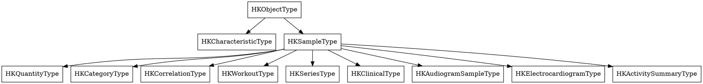

# HealthKit Fundamentals

## When to Use This Skill

Use when:
- Starting a HealthKit feature and need the framework mental model
- Deciding between characteristic data and sample data for a new type
- Confused about `HKQuantitySample` vs `HKCumulativeQuantitySample` vs `HKDiscreteQuantitySample`
- Figuring out which platforms support HealthKit read/write
- Setting up `HKHealthStore` correctly for the first time
- Debugging completion-handler threading issues

#### Related Skills

- Use `authorization-and-privacy.md` for the full authorization flow, purpose strings, and read/write permission model
- Use `queries.md` for reading data, statistics rollups, and writing samples
- Use `sync-and-background.md` for anchored queries, observer queries, and background delivery
- Use `workouts.md` for `HKWorkoutSession` lifecycle and `HKLiveWorkoutBuilder`
- Use `clinical-and-mobility.md` for Health Records (FHIR) and mobility-specific data
- Use `axiom-concurrency` for general Swift 6 actor isolation rules that apply to HealthKit completion handlers

## Core Concepts

HealthKit is a central repository. Apps read from it and contribute to it. The system handles cross-device sync between iPhone, Apple Watch, iPad (iPadOS 17+), and visionOS automatically — your app never deals with sync.

Three properties shape every HealthKit API:

1. **Authorization-gated per type** — read and write are requested separately for each data type (no "all-or-nothing" permission).
2. **Shared store with third-party contributors** — your reads return data from any app the user has authorized, not just yours.
3. **All HealthKit objects are immutable** — once saved, samples are deleted-and-replaced rather than edited.

## HKHealthStore — The Gateway

`HKHealthStore` is the single entry point for everything: authorization, reads, writes, background delivery, workout sessions.

**One instance per app.** Create it at launch, reuse for the app's lifetime:

> "You only need to create one instance and reuse it across the lifecycle of your application." — WWDC 2020-10664

```swift
import HealthKit

@MainActor
final class HealthStore {
    static let shared = HealthStore()
    let store = HKHealthStore()

    private init() {}
}
```

`HKHealthStore` conforms to `Sendable`, so reuse across actors is safe.

**Gate on device availability first.** HealthKit compiles on all Apple platforms but is read/write-capable only on iOS, iPadOS 17+, watchOS, and visionOS. Check `isHealthDataAvailable()` before touching the store:

```swift
guard HKHealthStore.isHealthDataAvailable() else {
    // HealthKit not usable on this device — degrade gracefully
    return
}
```

## Data Type Hierarchy

Two root branches below `HKObjectType`:



**Characteristic vs sample — the most important distinction.**

| Aspect | Characteristic | Sample |
|---|---|---|
| Shape | Single value, static per user | Time-windowed event with value(s) |
| Examples | birthday, biological sex, blood type, wheelchair use | step count, heart rate, workout, sleep stage |
| Access | synchronous getters on `HKHealthStore` | queries (`HKSampleQuery`, statistics, anchored, observer) |
| Authorization | read-only | read and write are separate permissions |

## Sample Kinds

Every sample carries a type, a time window, a value, optional metadata, and provenance (device + source app).

| Kind | Value shape | Canonical example |
|---|---|---|
| Quantity (`HKQuantitySample` — abstract since iOS 13) | Numeric + unit | 105 kcal active energy, 628 m walking distance |
| Quantity cumulative (`HKCumulativeQuantitySample`) | Sum (steps, distance, calories) | 8,342 steps between 09:00 and 17:00 |
| Quantity discrete (`HKDiscreteQuantitySample`) | Avg / min / max / most-recent (heart rate, body mass) | 142 bpm at 10:15 during a workout |
| Category | Value from predefined enum, no unit | `.asleepREM` sleep-analysis sample |
| Correlation | Groups multiple subsamples | Blood pressure (systolic + diastolic) |
| Workout | Aggregates multiple values and units over an activity | A 5 km run with distance + energy + HR |
| Series | Compact storage for high-frequency streams | Heartbeat series (timestamps only), quantity series (many quantities sharing metadata) |
| Clinical | FHIR records | Lab results, prescriptions, immunizations — see `clinical-and-mobility.md` |

**Why quantity samples split into cumulative vs discrete (iOS 13+).** `HKQuantitySample` is an abstract base class — concrete instances are always `HKCumulativeQuantitySample` or `HKDiscreteQuantitySample`. Existing code that handles instances as `HKQuantitySample` still compiles (the abstract base is preserved for source compatibility), but you cast to the concrete subclass to access the summary properties:

- **Cumulative** types expose `sum`. Steps, distance, calories.
- **Discrete** types expose `average`, `minimum`, `maximum`, `mostRecentQuantity`. Heart rate, body mass, audio exposure.

**Aggregation styles** (relevant when you see these in statistics queries):

| Style | Applies to | What `average` means |
|---|---|---|
| `.cumulative` | Summable types | Sum |
| `.discreteArithmetic` | Most discrete types | Simple arithmetic mean |
| `.discreteTemporallyWeighted` | Heart rate | Time-weighted average (older readings matter less) |
| `.discreteEquivalentContinuousLevel` | Audio exposure | Continuous-level average per acoustics convention |

## Canonical Setup Pattern

```swift
import HealthKit

@MainActor
final class HealthSession {
    let store = HKHealthStore()

    func bootstrap() async throws {
        guard HKHealthStore.isHealthDataAvailable() else {
            throw HealthError.notAvailable
        }

        // Reads can include characteristics (non-sample, static data).
        let toRead: Set<HKObjectType> = [
            HKQuantityType(.stepCount),
            HKQuantityType(.heartRate),
        ]

        // Writes are samples only — characteristics are read-only.
        let toWrite: Set<HKSampleType> = [
            HKWorkoutType.workoutType(),
        ]

        try await store.requestAuthorization(toShare: toWrite, read: toRead)
    }
}

enum HealthError: Error { case notAvailable }
```

**Required `Info.plist` keys:**

| Key | When required |
|---|---|
| `NSHealthShareUsageDescription` | Any read access |
| `NSHealthUpdateUsageDescription` | Any write access |

Without these, the authorization call crashes at runtime. Full authorization discipline lives in `authorization-and-privacy.md`.

## Platform Availability

HealthKit's own documentation uses the language "Full HealthKit stores" (can read and write) vs "Limited support" (can compile, cannot read or write):

| Platform | HealthKit store |
|---|---|
| iOS 8+ | Full |
| iPadOS 17+ | Full |
| iPadOS 16 and earlier | Limited — compiles, cannot read or write |
| watchOS 2+ | Full (old Apple Watch data is periodically purged) |
| visionOS 1+ | Full |
| macOS 13+ | Limited — compiles, cannot read or write |
| Mac Catalyst 13+ | Limited — runs on a Mac, which has no Health store; `isHealthDataAvailable()` returns `false` (matches macOS, **not** iPadOS rules) |

Always check `isHealthDataAvailable()` at runtime — it is the definitive signal for the current device.

## Threading and Concurrency

> "All the HealthKit API's completion handlers execute on private background queues. You typically dispatch this data back to the main queue before updating your user interface." — Apple framework docs

Two rules this implies:

1. **Do not touch UI from completion handlers.** Use `@MainActor` to hop back. Modern Swift Concurrency variants (iOS 15.4+) handle this correctly if you `await` from a `@MainActor` context.
2. **Long-running queries must be stopped.** `HKStatisticsCollectionQuery` and `HKObserverQuery` with update handlers keep running until you call `healthStore.stop(query)` — or, for descriptor-based async variants, `break` out of the `AsyncSequence` loop.

See `queries.md` for the async descriptor pattern and `sync-and-background.md` for observer and anchored query lifecycles.

## Common Mistakes

| Mistake | Fix |
|---|---|
| Assuming "success" in `requestAuthorization` means "user said yes" | It only means the request was delivered. Check actual data access, not the completion status. See `authorization-and-privacy.md`. |
| Requesting authorization for "all" data types up front | Request only what the feature needs. Over 100 data types exist; a giant sheet feels like a privacy violation. |
| Creating a new `HKHealthStore` per view model | Reuse one store. Multiple instances work but waste resources and complicate lifecycle. |
| Running on macOS and expecting data | Full store only on iOS, iPadOS 17+, watchOS, visionOS. Gate on `isHealthDataAvailable()` first. |
| Casting a quantity sample to the wrong concrete subclass | Heart rate is *discrete* (`average`/`min`/`max`/`mostRecentQuantity`); steps/distance/calories are *cumulative* (`sum`). Casting heart rate to `HKCumulativeQuantitySample` with `as?` silently yields `nil` → a wrong `0` that looks like "no data"; with `as!` it crashes the first time real data exists. Match the subclass to the type's aggregation style, or read aggregates via a statistics query. |
| Hand-summing quantity samples for a daily total | iPhone + Apple Watch both record system types like steps/distance/energy, so a raw `HKSampleQuery` returns overlapping samples and `.reduce(+)` double-counts the same activity (the store is shared — Core Concept 2). `HKStatisticsQuery` / `HKStatisticsQueryDescriptor` with `.cumulativeSum` applies the system's source-prioritization for these auto-recorded types so the same activity isn't counted twice; scope to one source with a predicate when you need it. See `queries.md`. |
| Forgetting an `Info.plist` usage key | The crash happens at `requestAuthorization(toShare:read:)` — **not** later at save or read. Including a write type without `NSHealthUpdateUsageDescription` (or a read type without `NSHealthShareUsageDescription`) throws an `NSException` the moment you request authorization. Both keys are required if you do both operations. |
| Updating UI from a completion handler without hopping to main | Completion handlers run on private background queues. Use `await MainActor.run` or call from an `@MainActor` context. |

## Resources

**WWDC**: 2019-218, 2020-10664, 2020-10182, 2022-10005

**Docs**: /healthkit, /healthkit/about-the-healthkit-framework, /healthkit/data-types, /healthkit/hkhealthstore, /healthkit/hkobjecttype, /healthkit/hksampletype

**Skills**: axiom-health (authorization-and-privacy, queries, sync-and-background, workouts, clinical-and-mobility), axiom-concurrency
