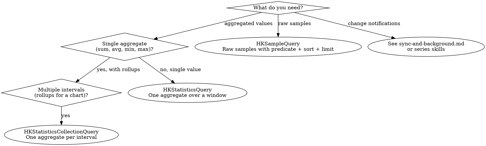

# HealthKit Queries and Sample Writes

## When to Use This Skill

Use when:
- Reading data from HealthKit for a one-shot display (today's steps, most recent heart rate)
- Computing daily, hourly, or weekly rollups for charts
- Writing new `HKQuantitySample`, `HKCategorySample`, or `HKWorkout` samples to the store
- Choosing between `HKSampleQuery`, `HKStatisticsQuery`, `HKStatisticsCollectionQuery`, and descriptor variants
- Modernizing callback-based query code to Swift Concurrency descriptors

#### Out of Scope — Use Different Skills

- **Change tracking over time, background delivery, observer queries, anchored queries** → `sync-and-background.md`. Those are long-running queries with anchor persistence and wake-on-change semantics.
- **Workout session lifecycle (`HKWorkoutSession`, `HKLiveWorkoutBuilder`)** → `workouts.md`.
- **Authorization prerequisites** → `authorization-and-privacy.md`.

#### Related Skills

- Use `fundamentals.md` for the HKObjectType hierarchy and quantity-vs-category distinction
- Use `axiom-concurrency` for Swift 6 actor isolation patterns that affect query handlers
- Use `axiom-swiftui` for rendering `HKStatisticsCollection` results as charts

## The Query Decision

HealthKit has nine query types. For most reads, you need exactly one of three:



**Rule of thumb:** charts with x-axis intervals need `HKStatisticsCollectionQuery`. A single "total steps today" metric uses `HKStatisticsQuery`. Reading a table of raw heart rate samples uses `HKSampleQuery`.

## Prefer Swift Concurrency Descriptors

The callback-based query classes (`HKSampleQuery`, `HKStatisticsQuery`, `HKStatisticsCollectionQuery`) still work, but since iOS 15.4 / watchOS 8.5 / macOS 13.0, the descriptor variants are the preferred API. They conform to `HKAsyncQuery` (and, for streaming variants, `HKAsyncSequenceQuery`).

| Classic (callback) | Descriptor (async) | Output |
|---|---|---|
| `HKSampleQuery` | `HKSampleQueryDescriptor<Sample>` | `[Sample]` |
| `HKStatisticsQuery` | `HKStatisticsQueryDescriptor` | `HKStatistics?` |
| `HKStatisticsCollectionQuery` | `HKStatisticsCollectionQueryDescriptor` | `Result` (wraps `HKStatisticsCollection`) |

Why descriptors win:
- `async throws` result APIs — no completion-handler callback pyramids.
- Automatic cleanup — one-shot descriptors need no `healthStore.stop(query)`.
- Generic typing (`HKSampleQueryDescriptor<HKQuantitySample>`) catches wrong-type bugs at compile time.
- `Sendable` conformance suits Swift 6 strict concurrency.

## Canonical Patterns

### Read raw samples (most recent 100 heart rate readings)

```swift
import HealthKit

@MainActor
final class HeartRateFeed {
    let store = HKHealthStore()

    func recentSamples() async throws -> [HKQuantitySample] {
        let predicate = HKSamplePredicate<HKQuantitySample>.quantitySample(
            type: HKQuantityType(.heartRate),
            predicate: nil
        )

        let descriptor = HKSampleQueryDescriptor(
            predicates: [predicate],
            sortDescriptors: [SortDescriptor(\.startDate, order: .reverse)],
            limit: 100
        )

        return try await descriptor.result(for: store)
    }
}
```

### Single aggregate (total steps today)

```swift
func stepsToday() async throws -> Double {
    let startOfDay = Calendar.current.startOfDay(for: .now)
    let nsPredicate = HKQuery.predicateForSamples(withStart: startOfDay, end: nil)
    let predicate = HKSamplePredicate<HKQuantitySample>.quantitySample(
        type: HKQuantityType(.stepCount),
        predicate: nsPredicate
    )

    let descriptor = HKStatisticsQueryDescriptor(
        predicate: predicate,
        options: .cumulativeSum
    )

    let statistics = try await descriptor.result(for: store)
    return statistics?.sumQuantity()?.doubleValue(for: .count()) ?? 0
}
```

### Rollups for a chart (daily steps, last 30 days)

```swift
func dailySteps(days: Int) async throws -> [(date: Date, steps: Double)] {
    let calendar = Calendar.current
    let anchorDate = calendar.startOfDay(for: .now)
    let start = calendar.date(byAdding: .day, value: -days, to: anchorDate)!

    let nsPredicate = HKQuery.predicateForSamples(withStart: start, end: nil)
    let predicate = HKSamplePredicate<HKQuantitySample>.quantitySample(
        type: HKQuantityType(.stepCount),
        predicate: nsPredicate
    )

    let descriptor = HKStatisticsCollectionQueryDescriptor(
        predicate: predicate,
        options: .cumulativeSum,
        anchorDate: anchorDate,
        intervalComponents: DateComponents(day: 1)
    )

    let result = try await descriptor.result(for: store)
    var points: [(Date, Double)] = []
    result.enumerateStatistics(from: start, to: anchorDate) { stats, _ in
        let sum = stats.sumQuantity()?.doubleValue(for: .count()) ?? 0
        points.append((stats.startDate, sum))
    }
    return points
}
```

## `HKStatisticsOptions` — The Option Rules

| Option | Use for |
|---|---|
| `.cumulativeSum` | Cumulative types (step count, distance, active energy) |
| `.discreteAverage` | Discrete types' mean (heart rate, body mass) |
| `.discreteMin` / `.discreteMax` | Discrete types' bounds |
| `.mostRecent` | Latest reading (replaces the deprecated `.discreteMostRecent`) |
| `.duration` | Total time covered by samples (workout rollups) |
| `.separateBySource` | Report values per contributing device/app |

**Hard rule:**

> "You cannot combine a discrete option with a cumulative option. You can, however, combine multiple discrete options together to perform multiple calculations." — `HKStatisticsOptions`

So `[.discreteAverage, .discreteMin, .discreteMax]` is valid; `[.cumulativeSum, .discreteAverage]` is not.

**Hard rule for collection queries:**

> "You can only use statistics collection queries with quantity samples. If you want to calculate statistics over workouts or correlation samples, you must perform the appropriate query and process the data yourself." — `HKStatisticsCollectionQuery`

If you need a "weekly workout count," run an `HKSampleQueryDescriptor<HKWorkout>` and bucket in Swift.

## Statistics Result Shapes

### `HKStatistics` (single interval's aggregate)

Access the option you requested; other accessors return nil:

```swift
stats.sumQuantity()          // present when .cumulativeSum was requested
stats.averageQuantity()      // present when .discreteAverage was requested
stats.minimumQuantity()      // .discreteMin
stats.maximumQuantity()      // .discreteMax
stats.mostRecentQuantity()   // .mostRecent
stats.duration()             // .duration

stats.sources                // [HKSource]?, contributors
stats.sumQuantity(for: source)  // source-specific variant when .separateBySource set
```

### `HKStatisticsCollection` (multiple intervals)

```swift
collection.statistics()                          // [HKStatistics] — populated intervals only
collection.statistics(for: date)                 // HKStatistics? at that instant
collection.enumerateStatistics(from:to:with:)    // preferred — fills gaps correctly
collection.sources()                             // Set<HKSource>
```

`enumerateStatistics(from:to:)` is usually what you want — it produces one `HKStatistics` per interval in range, including intervals with zero samples (so your chart axis has continuous points).

## Writing Samples

```swift
func recordBodyMass(kg: Double) async throws {
    let quantity = HKQuantity(unit: .gramUnit(with: .kilo), doubleValue: kg)
    let sample = HKQuantitySample(
        type: HKQuantityType(.bodyMass),
        quantity: quantity,
        start: .now,
        end: .now,
        metadata: [HKMetadataKeyWasUserEntered: true]
    )
    try await store.save(sample)
}
```

**Save rules:**

- `save(_:)` and `save(_:withCompletion:)` both accept a single `HKObject` or an `[HKObject]`. Batch when saving many — one transaction is much faster.
- Prefer minute-or-less granularity for active data. Apple: *"Avoid samples 24+ hours long. Workouts benefit from minute-or-less granularity; daily counts work well at hourly intervals."*
- Samples are immutable once saved. To correct a value, delete the old sample and save a new one.
- Writes throw on authorization errors. Don't trust `authorizationStatus(for:)` — attempt the save and handle the error (see `authorization-and-privacy.md`).

## Threading

> "All queries run on an anonymous background queue." — Apple, *Reading data from HealthKit*

Callback-based query handlers run on private background queues. The async descriptor methods inherit the caller's actor context — if you call `try await descriptor.result(for: store)` from a `@MainActor` function, you stay on main. This is one more reason to prefer descriptors.

## Performance Caveat

> "People may have a large quantity of data saved to the HealthKit store. Querying for all samples of a given data type can become very expensive, both in terms of memory usage and processing time." — Apple, *Running Queries with Swift Concurrency*

Always set a `limit:` or a date-range predicate. Avoid `HKObjectQueryNoLimit` except when you know the scope is bounded (for example, samples written by your own app in a known window).

For bulk processing of all historical samples, use `HKAnchoredObjectQueryDescriptor` with pagination (see `sync-and-background.md`) — not an unlimited sample query.

## Common Mistakes

| Mistake | Fix |
|---|---|
| Using `HKStatisticsCollectionQuery` with workout samples | Statistics collection queries only work on `HKQuantitySample`. Query workouts with `HKSampleQueryDescriptor<HKWorkout>` and bucket in Swift. |
| Combining `.cumulativeSum` with `.discreteAverage` | Not allowed. Pick one family. |
| Requesting `.discreteAverage` but calling `stats.sumQuantity()` | Returns nil. Aggregate accessors return nil unless the matching option bit was requested. |
| Running an unbounded `HKSampleQueryDescriptor` without a limit | Can return thousands of samples and blow memory. Always set `limit:` or predicate by date. |
| Treating an empty result as an error | Empty can mean denied reads (by design — see `authorization-and-privacy.md`) or genuinely no data. Render an honest empty state. |
| Forgetting to call `stop` on a callback-based collection query with `statisticsUpdateHandler` set | Long-running callback queries leak until stopped. Prefer the async `results(for:)` streaming descriptor and cancel via `Task.cancel()`. |
| Saving samples without `HKMetadataKeyWasUserEntered` when appropriate | Apple uses this metadata for Journal-app suggestions in iOS 17.2+ and for source distinction. Set it for manually-entered data. |
| Querying without a start/end predicate and hoping `limit:` saves you | `limit:` caps the returned array, but the system still scans the matching range. Always narrow with date predicates for efficiency. |

## Resources

**WWDC**: 2020-10664, 2022-10005

**Docs**: /healthkit/reading-data-from-healthkit, /healthkit/queries, /healthkit/running-queries-with-swift-concurrency, /healthkit/hksamplequerydescriptor, /healthkit/hkstatisticsquerydescriptor, /healthkit/hkstatisticscollectionquerydescriptor, /healthkit/hkstatisticsoptions, /healthkit/hkstatistics, /healthkit/hkstatisticscollection, /healthkit/hksamplepredicate, /healthkit/saving-data-to-healthkit

**Skills**: axiom-health (fundamentals, authorization-and-privacy, sync-and-background, workouts), axiom-concurrency, axiom-swiftui
