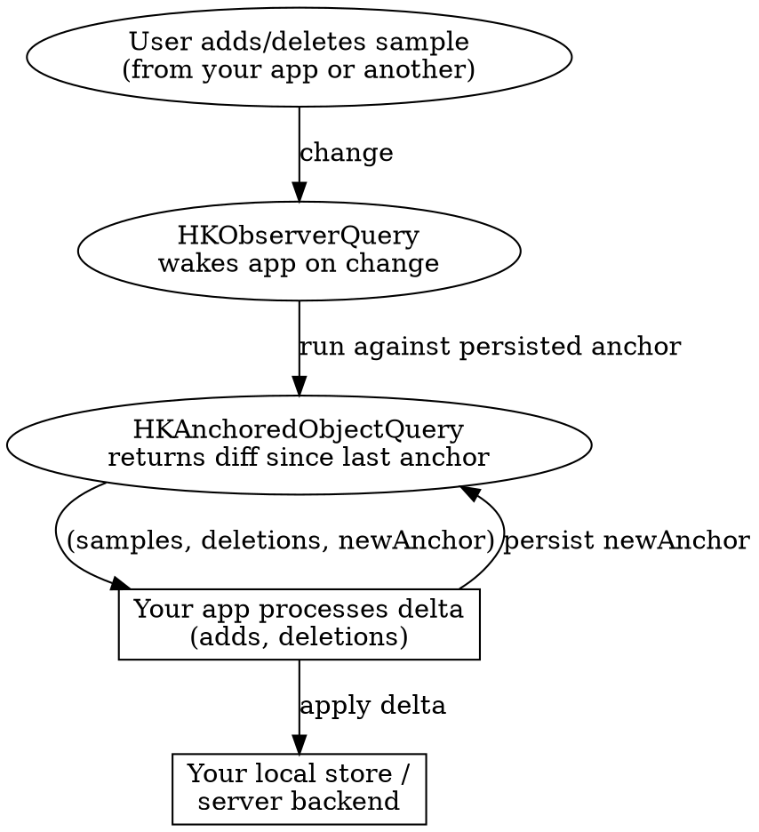

# HealthKit Sync and Background Delivery

## When to Use This Skill

Use when:
- Reading from HealthKit across app launches without re-reading the entire history every time
- Responding to HealthKit changes in the background (no polling)
- Syncing HealthKit data to a server without creating duplicates
- Handling sample deletions correctly — not just additions
- Adding the `com.apple.developer.healthkit.background-delivery` entitlement
- Deciding between `HKObserverQuery`, `HKAnchoredObjectQuery`, and their descriptor variants

#### Related Skills

- Use `fundamentals.md` for `HKHealthStore` and the sample type system
- Use `authorization-and-privacy.md` before adding any read workflow — background reads fail if the user has not authorized
- Use `queries.md` for one-shot reads and statistics
- Use `axiom-concurrency` for Swift 6 actor isolation around background callbacks

## The One Thing You Must Internalize

**Re-reading the whole HealthKit store on every launch is wrong.** Apple's anchored-object design exists precisely so you never do that:

> "Persisting the anchor allows us to only retrieve the changes in HealthKit since the last query." — WWDC 2020-10184

Three reasons this matters:

1. **Battery** — a daily full re-read of thousands of samples is orders of magnitude more expensive than a delta query with a persisted anchor.
2. **Correctness** — without anchors, you cannot see deletions. A sample the user removed in the Health app will silently stay in your local store forever.
3. **Duplicates** — without sync identifiers, repeated writes create duplicate samples; anchored queries return them all, and your UI double-counts.

Fix all three by adopting the anchor + deletion handling + sync identifier pattern below.

## The Sync Architecture

Three APIs that work together:



**Roles:**
- **Observer query** — the signal. Fires when any sample of a type changes. Carries no payload — "you have new data, go look."
- **Anchored query** — the payload. Run after the observer fires. Returns everything added or deleted since the anchor you provide, plus a new anchor to persist.
- **Sync identifiers** — the de-duplicator. Metadata keys that let you re-save a sample idempotently without creating duplicates.

## Anchor Persistence

`HKQueryAnchor` is a point-in-time token. Persist it between launches with `NSKeyedArchiver`:

```swift
import HealthKit

func persist(anchor: HKQueryAnchor) throws {
    let data = try NSKeyedArchiver.archivedData(
        withRootObject: anchor,
        requiringSecureCoding: true
    )
    UserDefaults.standard.set(data, forKey: "healthkit.anchor.stepCount")
}

func loadAnchor() -> HKQueryAnchor? {
    guard let data = UserDefaults.standard.data(forKey: "healthkit.anchor.stepCount") else {
        return nil
    }
    return try? NSKeyedUnarchiver.unarchivedObject(
        ofClass: HKQueryAnchor.self,
        from: data
    )
}
```

Persist per type (`stepCount`, `heartRate`, etc.) — anchors are type-specific. Store them wherever survives app termination (UserDefaults, SwiftData, Core Data — size is tiny).

**First launch:** pass `nil`. HealthKit returns all matching samples. Save the returned anchor.

**Subsequent launches:** pass the persisted anchor. HealthKit returns only diffs (adds + deletes). Save the new anchor.

## `HKAnchoredObjectQuery` — Signature and Behavior

### Classic callback form

```swift
class HKAnchoredObjectQuery : HKQuery

init(
    type: HKSampleType,
    predicate: NSPredicate?,
    anchor: HKQueryAnchor?,
    limit: Int,
    resultsHandler: @escaping @Sendable (
        HKAnchoredObjectQuery,
        [HKSample]?,
        [HKDeletedObject]?,
        HKQueryAnchor?,
        (any Error)?
    ) -> Void
)
```

The fourth parameter — `HKQueryAnchor?` — is the new anchor to persist.

**Important:** `resultsHandler` fires exactly once with the initial batch. To get continuous updates without running a new query on every change, set `updateHandler` after creation — it fires for each subsequent change and delivers the same tuple.

### Modern descriptor form (iOS 15.4+, watchOS 8.5+)

```swift
struct HKAnchoredObjectQueryDescriptor<Sample> where Sample : HKSample

// One-shot delta fetch:
func result(for store: HKHealthStore) async throws -> Result

// Long-running stream of deltas:
func results(for store: HKHealthStore) -> Results  // AsyncSequence
```

The descriptor conforms to both `HKAsyncQuery` (one-shot) and `HKAsyncSequenceQuery` (streaming). Choose deliberately:

- `result(for:)` — use from within an observer query's handler, or at startup, for a one-off delta batch.
- `results(for:)` — use for a persistent foreground reader that streams deltas until cancelled. Cancel via `Task.cancel()`.

### Canonical delta read

```swift
@MainActor
final class StepSync {
    let store = HKHealthStore()

    func fetchDelta() async throws {
        let anchor = loadAnchor()

        let predicate = HKSamplePredicate<HKQuantitySample>.quantitySample(
            type: HKQuantityType(.stepCount),
            predicate: nil
        )

        let descriptor = HKAnchoredObjectQueryDescriptor(
            predicates: [predicate],
            anchor: anchor
        )

        let result = try await descriptor.result(for: store)

        apply(additions: result.addedSamples, deletions: result.deletedObjects)
        try persist(anchor: result.newAnchor)
    }

    private func apply(additions: [HKQuantitySample], deletions: [HKDeletedObject]) {
        // Upsert additions in local store, remove deletions by UUID.
    }
}
```

## `HKDeletedObject` — Do Not Ignore Deletions

```swift
class HKDeletedObject
var uuid: UUID
var metadata: [String : Any]?
```

**Semantics:**

- The `uuid` matches the deleted sample's UUID. Use it to remove the sample from your local mirror.
- `metadata` carries the sync identifier of the original sample (see below) — so if you're syncing to a server, you can delete by sync identifier without needing to keep a UUID↔syncID map.

**Critical warning** (verbatim from Apple):

> "Deleted objects are temporary; the system may remove them from the HealthKit store at any time."

In practice, this means: if your app is offline for weeks, you may miss deletions that happened during that time. The anchor-based model tolerates this (you still see the additions you need), but if strict sync correctness matters, fall back to a full resync after a long absence.

**Observer queries alone do not deliver deletions.** Only anchored queries include `HKDeletedObject` instances in their results. An observer-only architecture silently accumulates tombstones in your local store.

## `HKObserverQuery` — The Wake-Up Signal

```swift
class HKObserverQuery : HKQuery

init(
    sampleType: HKSampleType,
    predicate: NSPredicate?,
    updateHandler: @escaping @Sendable (
        HKObserverQuery,
        HKObserverQueryCompletionHandler,
        (any Error)?
    ) -> Void
)

typealias HKObserverQueryCompletionHandler = () -> Void
```

Observer queries "monitor the HealthKit store and alert you to any changes to matching samples." They carry no payload — the handler fires with only a completion token.

**The handler contract:**

1. The handler receives a `HKObserverQueryCompletionHandler` closure.
2. You **must** call that closure when you have finished processing the change (run your anchored query, persist data, whatever).
3. HealthKit will then re-suspend your app.

**Three-strikes rule:** if your handler fails to call the completion handler three times in a row, HealthKit disables background delivery for your app. You then need to call `enableBackgroundDelivery` again. Always call completion, even on error paths.

**Simulator limitation:** observer-query background delivery does not work on the Simulator. Test background sync on device.

## Background Delivery

Background delivery lets your app wake and process changes while the user is not actively in the app.

### Entitlement

Add `com.apple.developer.healthkit.background-delivery` (Boolean, true) to your entitlements file. Without this, `enableBackgroundDelivery` fails with an authorization-denied error — not a runtime crash, just a silent no-op.

In Xcode: **Signing & Capabilities** → **HealthKit** → check **Background Delivery**.

### API

```swift
func enableBackgroundDelivery(
    for type: HKObjectType,
    frequency: HKUpdateFrequency,
    withCompletion completion: @escaping @Sendable (Bool, (any Error)?) -> Void
)

func enableBackgroundDelivery(
    for type: HKObjectType,
    frequency: HKUpdateFrequency
) async throws

func disableBackgroundDelivery(
    for type: HKObjectType,
    withCompletion completion: @escaping @Sendable (Bool, (any Error)?) -> Void
)

public enum HKUpdateFrequency {
    case immediate
    case hourly
    case daily
    case weekly
}
```

**`HKCorrelationType` is not supported for background delivery** — observe the child types instead (e.g., systolic and diastolic blood pressure separately rather than the correlation).

**`.immediate` on watchOS** has additional restrictions — it's only honored for heart rate, audio exposure, and a handful of other fitness types. Most types are silently capped at hourly. Don't rely on `.immediate` unless you've verified it for your specific type on watchOS.

### Lifecycle

Register observer queries in `application(_:didFinishLaunchingWithOptions:)` (or the SwiftUI `@main` app struct's init). Not in a view's `onAppear`.

```swift
// In App.init or AppDelegate:
func registerBackgroundSync() async {
    let type = HKQuantityType(.stepCount)

    let observer = HKObserverQuery(sampleType: type, predicate: nil) { _, completionHandler, error in
        Task {
            defer { completionHandler() }  // ALWAYS call this, even on error
            guard error == nil else { return }
            try? await StepSync.shared.fetchDelta()
        }
    }

    store.execute(observer)

    do {
        try await store.enableBackgroundDelivery(for: type, frequency: .immediate)
    } catch {
        // Entitlement missing, authorization denied, or correlation type — log and degrade.
    }
}
```

## Sync Identifiers — The De-Duplication Discipline

Metadata keys that make HealthKit itself responsible for de-duplication:

| Key | Type | Purpose |
|---|---|---|
| `HKMetadataKeySyncIdentifier` | `String` | Stable identifier for a logical sample |
| `HKMetadataKeySyncVersion` | `NSNumber` | Monotonically increasing version |

**The conflict rule** (verbatim from Apple):

> "the new object replaces any matching objects (existing objects with a matching HKMetadataKeySyncIdentifier value) with a lower sync version."

So if you save a sample with `syncIdentifier = "user-123-weekly-rollup-2026-W17"` and `syncVersion = 1`, then later save the same identifier with version 2, HealthKit drops version 1 and keeps version 2. No duplicates, no manual reconciliation.

**How to use:**

```swift
func saveIdempotent(sample original: HKQuantitySample, syncID: String, version: Int) async throws {
    var metadata = original.metadata ?? [:]
    metadata[HKMetadataKeySyncIdentifier] = syncID
    metadata[HKMetadataKeySyncVersion] = version as NSNumber

    let sample = HKQuantitySample(
        type: original.quantityType,
        quantity: original.quantity,
        start: original.startDate,
        end: original.endDate,
        metadata: metadata
    )
    try await store.save(sample)
}
```

**Design the identifier** as a stable key derived from your backend's ID — not from the HealthKit UUID, which you won't know in advance. Good pattern: `"<feature>-<userID>-<entityID>"`.

## What Goes Where

A common confusion is where each piece lives. Here is the decision map:

| If you need... | Use |
|---|---|
| One-off read of current data | `HKSampleQueryDescriptor` / `HKStatisticsQueryDescriptor` (see `queries.md`) |
| Persistent foreground stream of changes | `HKAnchoredObjectQueryDescriptor.results(for:)` in a Task |
| Delta fetch on demand or in background wake-up | `HKAnchoredObjectQueryDescriptor.result(for:)` |
| Be notified of changes without running a query yet | `HKObserverQuery` + background delivery |
| De-duplicate server-originated writes | `HKMetadataKeySyncIdentifier` + `HKMetadataKeySyncVersion` |
| See what was deleted | `HKDeletedObject` from an anchored query |

## Common Mistakes

| Mistake | Consequence / Fix |
|---|---|
| Re-reading the entire store on every launch | Battery drain + you never see deletions + duplicates compound. Use anchored queries with persisted `HKQueryAnchor`. |
| Observer query without anchored query | Observer carries no payload. You know something changed but not what. Pair them. |
| Anchored query without a persisted anchor | Same as re-reading the whole store. Persist the returned anchor. |
| Observer query in a view's `onAppear` | Query only runs while the view is on screen. Register in `didFinishLaunchingWithOptions` or app init. |
| Forgetting to call `HKObserverQueryCompletionHandler` | Three misses and HealthKit disables your background delivery. Always call completion, even in error paths (use `defer`). |
| Missing `com.apple.developer.healthkit.background-delivery` entitlement | `enableBackgroundDelivery` returns an error and silently no-ops. The observer still fires when app is open; background wake-up does not happen. |
| Ignoring `[HKDeletedObject]` | Your local mirror accumulates tombstones. A user who deletes a sample in Health will still see it in your app forever. |
| Re-saving the same logical sample without sync identifiers | Creates duplicates. Add `HKMetadataKeySyncIdentifier` and `HKMetadataKeySyncVersion`. |
| Using `.immediate` frequency on watchOS for arbitrary types | Silently capped at hourly for most types. Test behavior for your specific type or use `.hourly` and document. |
| Testing background delivery on Simulator | Not supported. Test on device. |
| Background-delivering `HKCorrelationType` | Not supported. Observe the child types instead (systolic + diastolic, not blood-pressure correlation). |

## Pressure Scenario — "Reports say our app's battery usage is too high"

**Real case.** A developer ships a HealthKit-reading app with a simple read-all-steps-on-launch design. Users report fast battery drain. Deadline pressure says ship a fix tonight. Tempting "fixes":

- **"Just limit the read to last 24 hours."** Ships. Battery improves. But now you miss deletions older than 24 hours, and every launch still does a full range read. You've masked the problem.
- **"Run the read less often."** Ships. Battery improves. But now your UI shows stale data, and changes from the Health app can lag by hours.
- **"Use background delivery."** Better. But without anchors, every wake still re-reads everything. And without deletion handling, you accumulate tombstones indefinitely.

**Correct fix** (takes roughly a day, not an hour):

1. Introduce `HKQueryAnchor` persistence for each type you sync.
2. Replace the startup full-read with `HKAnchoredObjectQueryDescriptor.result(for:)` using the persisted anchor.
3. Register an `HKObserverQuery` in app init, enable `background-delivery` with `.hourly` frequency, and re-use the same delta-fetch logic in the handler.
4. Process `[HKDeletedObject]` to remove samples from your local mirror.
5. If you also write data, tag writes with `HKMetadataKeySyncIdentifier` + version for idempotency.

This is the architecture Apple designed. The "quick fix" paths compound tech debt you'll pay for later.

## Resources

**WWDC**: 2020-10184

**Docs**: /healthkit/executing-anchored-object-queries, /healthkit/executing-observer-queries, /healthkit/hkanchoredobjectquery, /healthkit/hkobserverquery, /healthkit/hkdeletedobject, /healthkit/hkanchoredobjectquerydescriptor, /healthkit/hkqueryanchor, /healthkit/hkupdatefrequency, /healthkit/hkmetadatakeysyncidentifier, /healthkit/hkmetadatakeysyncversion, /healthkit/hkhealthstore/enablebackgrounddelivery(for:frequency:withcompletion:), /bundleresources/entitlements/com.apple.developer.healthkit.background-delivery

**Skills**: axiom-health (fundamentals, authorization-and-privacy, queries, workouts), axiom-concurrency, axiom-data
