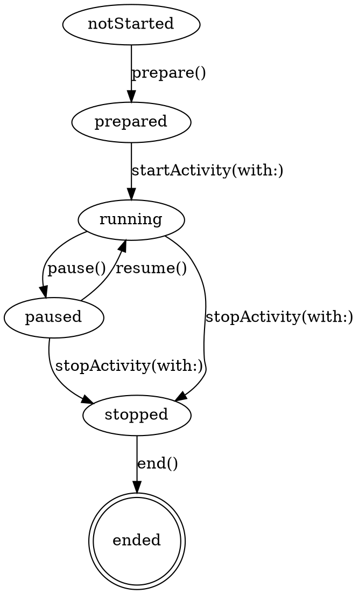

# HealthKit Workouts

## When to Use This Skill

Use when:
- Building a workout tracking app on watchOS, iOS, or iPadOS
- Deciding between a live workout session (`HKWorkoutSession`) and just logging a finished `HKWorkout`
- Implementing workout pause/resume, multi-activity (triathlon-style), or mirroring between watch and iPhone
- Handling workout recovery after an app or process termination
- Adopting iOS 26's new ability to originate workout sessions from iPhone (previously watch-only)
- Implementing Always On support for workout views
- Querying or reading historical `HKWorkout` and `HKWorkoutActivity` data
- Reading or tracking **workout zones** — heart-rate / cycling-power effort bands — live or retrospectively (`OS27`)

#### Related Skills

- Use `fundamentals.md` for the HKObjectType hierarchy and `HKHealthStore` setup
- Use `authorization-and-privacy.md` before adding workout write access (workouts require write authorization)
- Use `workoutkit.md` for planned/scheduled custom workouts — distinct from live sessions
- Use `axiom-watchos` (`skills/platform-basics.md`) for watch-specific presentation concerns (Always On, Smart Stack, background mode)
- Use `axiom-concurrency` for actor isolation around session delegates

## Two Distinct Workouts APIs

| API | Purpose | Notes |
|---|---|---|
| `HKWorkoutSession` + `HKLiveWorkoutBuilder` | Live in-progress workout — collects data from sensors, persists an `HKWorkout` at the end | Covered here |
| `HKWorkoutBuilder` (non-live) + `finishWorkout` | Logging a historical workout (e.g., from a server or manual entry) | The `HKWorkout.init(...)` convenience initializers are **deprecated (iOS 17 / watchOS 10)** — build retrospective workouts with a non-live `HKWorkoutBuilder` (`add(_:)` samples → `finishWorkout`), not the old initializer + `save`. See `queries.md` |
| WorkoutKit | Planned or scheduled custom workouts that the Workout app executes | Covered in `workoutkit.md` |

This skill covers the first path — live sessions with sensor collection.

## Platform Availability — Read Carefully

| Class | Platform |
|---|---|
| `HKWorkoutSession` | iOS 17+, iPadOS 17+, watchOS 2+ |
| `HKLiveWorkoutBuilder`, `HKLiveWorkoutDataSource`, `HKLiveWorkoutBuilderDelegate` | **watchOS 5+; iOS 26+, iPadOS 26+** |
| `HKWorkoutSession.startMirroringToCompanionDevice` | **watchOS 10+ only** |
| `HKHealthStore.recoverActiveWorkoutSession` | **iOS 26+, iPadOS 26+, watchOS 5+** (unavailable on Mac Catalyst, macOS, visionOS) |
| Workout zones — stored (`HKWorkoutZoneGroup`, `HKWorkout.zoneGroupsByType`) | **all platforms 27** (`anyAppleOS 27`) |
| Workout zones — live (`HKLiveWorkoutZoneUpdate`, `didUpdateWorkoutZone`) | **iOS 27+, watchOS 27+** (not macOS/visionOS) |

The critical new-in-2025 change: iPhone could *receive* a mirrored workout session since iOS 17, but iOS 26 is the first release where iPhone can **originate** a session and drive a local `HKLiveWorkoutBuilder`. Before iOS 26, iPhone workout tracking meant calling `HKWorkout(init:)` retrospectively — no live sensor collection.

## The Session State Machine



**The six states** (`HKWorkoutSessionState`):

| State | Meaning |
|---|---|
| `.notStarted` | Session created, not yet prepared |
| `.prepared` | Readied for fast start (sensors warm) |
| `.running` | Activity tracking live |
| `.paused` | Paused, ready to resume |
| `.stopped` | Activity halted but session not yet ended — **builder still needs to finish** |
| `.ended` | Terminal; session is fully closed |

**`.stopped` is not `.ended`.** This is the single most common bug. `stopActivity(with:)` transitions to `.stopped` — the workout sample has NOT been saved yet. You must run the end sequence below before calling `session.end()`.

## The End Sequence (Do This Exactly)

```swift
// 1. In the UI event that finishes the workout:
session.stopActivity(with: .now)

// 2. In the session delegate:
func workoutSession(
    _ session: HKWorkoutSession,
    didChangeTo toState: HKWorkoutSessionState,
    from fromState: HKWorkoutSessionState,
    date: Date
) {
    guard toState == .stopped, let builder = self.builder else { return }

    Task {
        try await builder.endCollection(at: date)
        let finishedWorkout = try await builder.finishWorkout()
        session.end()
        // finishedWorkout is now saved as an HKWorkout in the store.
    }
}
```

If you call `session.end()` before `builder.endCollection(at:) + builder.finishWorkout()`, the workout is not persisted. There is no "save-on-end" convenience.

## Canonical Session Setup

```swift
import HealthKit

@MainActor
final class WorkoutController: NSObject {
    let store = HKHealthStore()
    var session: HKWorkoutSession?
    var builder: HKLiveWorkoutBuilder?

    func startRun() throws {
        let config = HKWorkoutConfiguration()
        config.activityType = .running
        config.locationType = .outdoor

        let session = try HKWorkoutSession(healthStore: store, configuration: config)
        let builder = session.associatedWorkoutBuilder()

        builder.dataSource = HKLiveWorkoutDataSource(
            healthStore: store,
            workoutConfiguration: config
        )

        session.delegate = self
        builder.delegate = self

        session.startActivity(with: .now)
        Task { try await builder.beginCollection(at: .now) }

        self.session = session
        self.builder = builder
    }
}

extension WorkoutController: HKWorkoutSessionDelegate {
    nonisolated func workoutSession(
        _ session: HKWorkoutSession,
        didFailWithError error: Error
    ) {
        // Log and degrade — HKWorkoutSessionError.anotherWorkoutSessionStarted is a common one.
    }

    nonisolated func workoutSession(
        _ session: HKWorkoutSession,
        didChangeTo toState: HKWorkoutSessionState,
        from fromState: HKWorkoutSessionState,
        date: Date
    ) {
        // Handle .stopped transition here for end sequence.
    }
}

extension WorkoutController: HKLiveWorkoutBuilderDelegate {
    nonisolated func workoutBuilder(
        _ builder: HKLiveWorkoutBuilder,
        didCollectDataOf types: Set<HKSampleType>
    ) {
        // For each type in `types`, call builder.statistics(for: type) to update UI.
    }

    nonisolated func workoutBuilderDidCollectEvent(_ builder: HKLiveWorkoutBuilder) {
        // Fires when a pause/resume/lap event is appended.
    }
}
```

**Delegate method isolation.** HealthKit calls these on its own queue — mark them `nonisolated` and hop to `@MainActor` inside when updating UI. See `axiom-concurrency` for the full pattern.

## `HKLiveWorkoutDataSource` — What Data Is Collected

Data sources tell the builder which quantity types to auto-collect from sensors. Default collection depends on the activity type in the configuration (running gets heart rate + distance + energy; swimming adds stroke count and SWOLF).

```swift
let source = HKLiveWorkoutDataSource(
    healthStore: store,
    workoutConfiguration: config
)

// Add a type the default set doesn't include:
source.enableCollection(for: HKQuantityType(.runningPower), predicate: nil)

// Remove a default if you don't need it:
source.disableCollection(for: HKQuantityType(.basalEnergyBurned))
```

For multi-activity workouts, update the data source's `typesToCollect` when switching activities — swimming and cycling collect different types, and leaving stale types wastes sensor time.

## Workout Zones `OS27`

HealthKit models **workout zones** natively — the effort bands (heart-rate zones, cycling-power zones) that classify intensity during a workout. Before 27 you computed and stored time-in-zone yourself; now HealthKit tracks it live and attaches a retrospective breakdown to every finished `HKWorkout`.

A breakdown is built from four `Sendable` value types. Stored zone data reads on every platform (`anyAppleOS 27`); only *live* tracking is `iOS27`/`watchOS27` (not macOS/visionOS):

| Type | What it holds |
|------|----------------|
| `HKWorkoutZone` | One zone: `index` + optional `minimum`/`maximum` `HKQuantity` (the first zone is unbounded below, the last unbounded above, so one bound is nil) |
| `HKWorkoutZoneConfiguration` | The zone set for one quantity type: `zones` (contiguous, non-overlapping, **3–9 zones**), `quantityType`, `source` (`.system`/`.user`/`.app`), `configurationType` (`.automatic`/`.manual`/`.custom`) |
| `HKWorkoutZoneDuration` | Time in one zone: `zone` + `duration` |
| `HKWorkoutZoneGroup` | A workout's full breakdown for one type: `configuration` + `zoneDurations` |

### Retrospective zones on a finished workout

`HKWorkout` and `HKWorkoutActivity` expose zone groups keyed by quantity type:

```swift
@available(anyAppleOS 27, *)
func heartRateZones(_ workout: HKWorkout) {
    guard let group = workout.zoneGroupsByType?[HKQuantityType(.heartRate)] else { return }
    let zoneCount = group.configuration.zones.count
    let durations = group.zoneDurations.map(\.duration)   // ordered by threshold
    // ... drive a post-workout chart
}
```

Use `HKWorkoutActivity.zoneGroup(for:)` for per-leg zones in a multi-activity (triathlon) workout.

### Live zone changes

Implement the new optional `HKLiveWorkoutBuilderDelegate` method. It fires **only when the current zone changes**, not on every sample:

```swift
@available(iOS 27, watchOS 27, *)
func workoutBuilder(
    _ builder: HKLiveWorkoutBuilder,
    didUpdateWorkoutZone zoneUpdate: HKLiveWorkoutZoneUpdate
) {
    guard let group = zoneUpdate.zoneGroup else { return }
    let currentIndex = zoneUpdate.currentZoneDuration?.zone.index
    // zoneUpdate.previousZoneDuration and .lastSampleProcessedDate are also available
}
```

### Preferred vs. custom zones

Zones come from the user's Health settings (auto-calculated from age/resting HR or manually set, synced across devices). Read the resolved configuration first; only supply your own if none exists:

```swift
@available(iOS 27, watchOS 27, *)
func configureZones(_ builder: HKLiveWorkoutBuilder) async throws {
    let heartRate = HKQuantityType(.heartRate)

    if try await builder.zoneConfiguration(for: heartRate) == nil {
        let bpm = HKUnit.count().unitDivided(by: .minute())
        let boundaries = defaultHeartRateZoneThresholds.map {
            HKQuantity(unit: bpm, doubleValue: $0)
        }
        let config = try HKWorkoutZoneConfiguration(
            quantityType: heartRate,
            zoneBoundaries: boundaries
        )
        // MUST be set before beginCollection:
        try await builder.setCustomZoneConfiguration(config, for: heartRate)
    }

    try await builder.beginCollection(at: Date())
}
```

To read the user's preferred zones outside a builder (e.g. to preview them), use `HKHealthStore.preferredWorkoutZoneConfiguration(for:)`.

**Custom-zone gotchas:**

- **Set before `beginCollection`.** Calling `setCustomZoneConfiguration` after collection starts is too late for that workout.
- **HealthKit does not persist custom zones.** They are scoped to a single workout — to reuse them, your app saves and re-applies them itself.
- Supported quantity types are **heart rate** and **cycling power** (functional-threshold-power based; defaults to 6 zones).
- **Time-in-zone isn't comparable across configurations.** A 5-zone and an 8-zone workout bucket effort differently — re-bucket raw samples if you need to compare across workouts.

## Recovery — Different Entry Points Per Platform

Workout sessions survive app termination. If iOS force-quits your app or the app crashes mid-session, the workout continues recording on the watch's sensors, and you can reconnect to it on next launch.

### watchOS recovery

```swift
class ExtensionDelegate: NSObject, WKExtensionDelegate {
    func handleActiveWorkoutRecovery() {
        Task {
            do {
                let session = try await store.recoverActiveWorkoutSession()
                // Reattach delegate, update UI.
            } catch {
                // No active session to recover.
            }
        }
    }
}
```

### iOS 26+ recovery

```swift
@UIApplicationMain
class AppDelegate: UIResponder, UIApplicationDelegate {
    func application(
        _ application: UIApplication,
        configurationForConnecting connectingSceneSession: UISceneSession,
        options: UIScene.ConnectionOptions
    ) -> UISceneConfiguration {
        if options.shouldHandleActiveWorkoutRecovery {
            // Configure a scene that calls recoverActiveWorkoutSession on launch.
        }
        return UISceneConfiguration(name: nil, sessionRole: connectingSceneSession.role)
    }
}
```

On both platforms, `recoverActiveWorkoutSession` throws if no session is active. Always wrap in `do/try/catch` and degrade.

## Multi-Device Mirroring

As of watchOS 10 + iOS 17, a watch-originated session can mirror to the paired iPhone so that a companion app on iPhone shows live metrics.

```swift
// On watchOS (the primary):
try await session.startMirroringToCompanionDevice()

// On iOS (receives):
// Register HKWorkoutSessionMirroringStartHandler on the HKHealthStore.
store.workoutSessionMirroringStartHandler = { session in
    // A watch workout just started mirroring. Attach UI.
}
```

**Constraints:**

- Handler fires on a background queue; hop to `@MainActor` for UI.
- The handler may fire multiple times during a single workout — every time the iPhone reconnects (user picks up phone, network hiccup). Handle re-entry idempotently.
- **10-second launch budget:** if the iPhone app is backgrounded, iOS wakes it for up to 10 seconds to receive the mirror-start event. If your app doesn't register state fast enough, the mirror is missed. Register `workoutSessionMirroringStartHandler` in `application(_:didFinishLaunchingWithOptions:)`, not later.
- Use `session.sendToRemoteWorkoutSession(data:)` for custom cross-device messaging during the workout (e.g., chat, coach signals).

## Multi-Activity Workouts (Triathlons)

For workouts where activity type changes (swim → bike → run), use multi-activity mode.

```swift
// Initial configuration sets the container:
let container = HKWorkoutConfiguration()
container.activityType = .swimBikeRun

let session = try HKWorkoutSession(healthStore: store, configuration: container)
session.startActivity(with: .now)

// Begin each sub-activity:
let swim = HKWorkoutConfiguration()
swim.activityType = .swimming
swim.swimmingLocationType = .openWater
session.beginNewActivity(configuration: swim, date: .now, metadata: nil)

// Later, transition:
session.beginNewActivity(configuration: cycleConfig, date: .now, metadata: nil)
// HealthKit ends the previous activity automatically.
```

Activities cannot overlap in time and need not be contiguous — insert an activity of type `.transition` between the sports to capture transition metrics.

Per-activity statistics are available via `HKWorkoutActivity.statistics(for:)` on the saved workout.

## Always On Considerations (watchOS)

When the watch locks mid-workout, the workout view must continue to display. Apple mandates a **1 Hz maximum refresh rate** in the low-power state — one update per second, nothing finer.

```swift
struct WorkoutView: View {
    var body: some View {
        TimelineView(.periodic(from: .now, by: 1)) { context in
            Text(duration.formatted())
        }
    }
}
```

Branch on `TimelineView`'s `mode == .lowFrequency` to show a simpler view during locked state. Avoid animation during low-frequency updates — the system won't render it anyway.

## Info.plist and Entitlements

**Session-capable apps require:**

- Xcode capability: **HealthKit** (adds `com.apple.developer.healthkit`)
- `NSHealthShareUsageDescription` and `NSHealthUpdateUsageDescription` in Info.plist
- For watchOS: add `WKBackgroundModes` with `workout-processing` to `Info.plist`
- For iOS 26 session origination: background mode key is documented in Apple's "Building a workout app for iPhone and iPad" sample (verify against the latest sample before shipping — this key is new enough that multiple names have circulated)

**Mirroring iPhone app:** must include a corresponding watchOS app target in the same bundle.

## Querying Workouts After the Fact

Workouts are just `HKSample` subtypes — read them with a sample query:

```swift
let predicate = HKSamplePredicate<HKWorkout>.workout(
    NSCompoundPredicate(andPredicateWithSubpredicates: [
        HKQuery.predicateForWorkouts(with: .running),
        HKQuery.predicateForSamples(withStart: thirtyDaysAgo, end: nil)
    ])
)

let descriptor = HKSampleQueryDescriptor(
    predicates: [predicate],
    sortDescriptors: [SortDescriptor(\.startDate, order: .reverse)],
    limit: 50
)

let runs: [HKWorkout] = try await descriptor.result(for: store)
```

For per-activity statistics, iterate `workout.workoutActivities` — each `HKWorkoutActivity` carries its own type + duration + stats.

## Common Mistakes

| Mistake | Fix |
|---|---|
| Calling `session.end()` without first running `endCollection` + `finishWorkout` | The workout is not saved. Always: `stopActivity` → wait for `.stopped` → `endCollection` → `finishWorkout` → `end`. |
| Treating `.stopped` as the terminal state | It's not. `.ended` is terminal. `.stopped` means "activity halted but builder still needs to finish." |
| Not implementing recovery | After app termination, the session keeps running on the watch. Without `recoverActiveWorkoutSession`, users see "you don't have an active workout" even though their heart rate is still being logged. |
| Assuming iOS can originate sessions before iOS 26 | Pre-26, iPhone can only mirror a watch-initiated session. It cannot drive a local `HKLiveWorkoutBuilder`. |
| Registering `workoutSessionMirroringStartHandler` in a view's `onAppear` | The iPhone gets 10 seconds after wake to receive the mirror event. Register in app-launch code. |
| Using `@MainActor` delegate callbacks directly | HealthKit calls these on its own queue. Mark methods `nonisolated` and hop to `@MainActor` internally. |
| Collecting all quantity types "just in case" with `HKLiveWorkoutDataSource` | Only enable types you actually display or save. Extra types waste battery. |
| Full-screen animation during Always On | The 1 Hz refresh cap means your animation won't render smoothly anyway. Use a simplified view in the `.lowFrequency` timeline branch. |
| Creating multiple concurrent sessions | `HKWorkoutSessionError.anotherWorkoutSessionStarted` fires and ends your session. Enforce one-at-a-time at your UI layer. |
| Missing `workout-processing` background mode on watch | Session runs only while app is foreground. Add `WKBackgroundModes` → `workout-processing`. |
| Hand-building an `HKWorkout(activityType:start:end:)` to "save" a live session | Those convenience initializers are deprecated (iOS 17 / watchOS 10) and produce an empty shell — no samples, route, or totals. Only the live builder's `endCollection` + `finishWorkout` persists collected data; for retrospective non-sensor logging use a non-live `HKWorkoutBuilder`. |
| Writing retrospective workouts and also running live sessions for the same activity | You get duplicates. Choose one path per activity. |
| Calling `setCustomZoneConfiguration` after `beginCollection` (`OS27`) | Too late — it won't apply to that workout. Set custom zones *before* `beginCollection(at:)`. |
| Expecting HealthKit to remember your custom zones (`OS27`) | It doesn't persist app-set zones; they live for one workout. Save and re-apply them yourself. |
| Comparing raw time-in-zone across workouts with different zone counts (`OS27`) | A 5-zone vs 8-zone configuration buckets effort differently. Re-bucket raw samples before comparing. |

## Resources

**WWDC**: 2021-10009, 2022-10005, 2023-10023, 2025-322, 2026-207

**Docs**: /healthkit/workouts-and-activity-rings, /healthkit/running-workout-sessions, /healthkit/hkworkoutsession, /healthkit/hkliveworkoutbuilder, /healthkit/hkliveworkoutbuilderdelegate, /healthkit/hkliveworkoutdatasource, /healthkit/hkworkoutconfiguration, /healthkit/hkworkout, /healthkit/hkworkoutactivity, /healthkit/hkhealthstore/recoveractiveworkoutsession(completion:), /healthkit/build-a-workout-app-for-apple-watch, /healthkit/building-a-workout-app-for-iphone-and-ipad, /healthkit/accessing-workout-zone-data, /healthkit/hkworkoutzonegroup, /healthkit/hkworkoutzoneconfiguration

**Skills**: axiom-health (fundamentals, authorization-and-privacy, queries, workoutkit), axiom-watchos, axiom-concurrency
