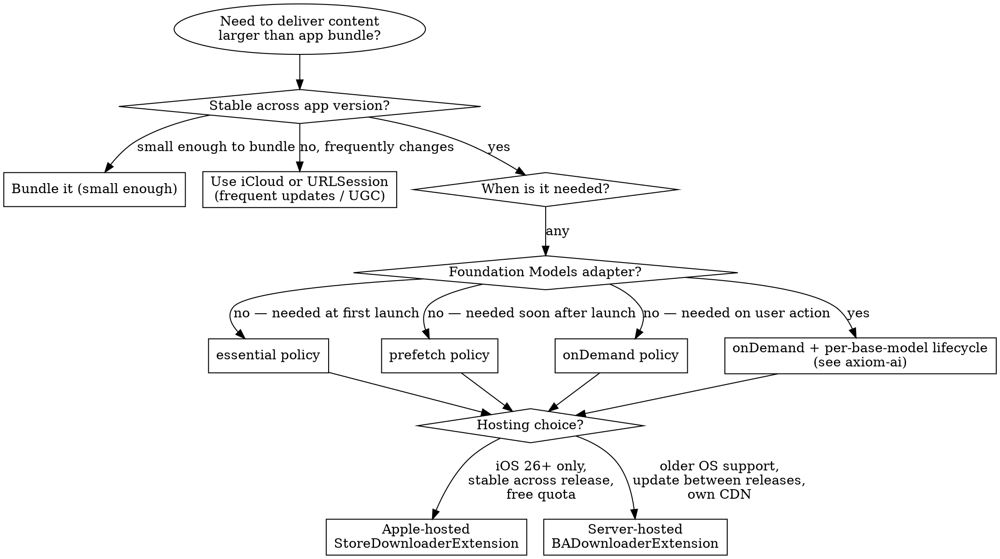

# Background Assets

## Overview

Background Assets delivers content too large for the app bundle — ML model variants, game levels, design-tool kits, media libraries, **and Foundation Models custom adapters** — through a system-managed channel. The system handles network resilience, retries, install-time scheduling, and quota; you describe what to deliver and when. **Core principle**: the bundle is for code and first-launch UX, Background Assets is for everything else.

**Key insight**: Asset delivery is a *system integration* concern, not a download problem. Building a custom URLSession stack to fetch assets reinvents what `BackgroundAssets` already does correctly — and ships with App Store install-progress integration, charging-aware scheduling, and per-user quota you can't replicate.

**Foundation Models adapters**: `.fmadapter` packs (~160 MB each, per-OS-version pinning) **must** be delivered via Background Assets — Apple's own documentation rules out bundling. See `axiom-ai (skills/foundation-models-adapters-ref.md)` for the adapter-specific delivery pattern.

**Requirements**: iOS 26+ / iPadOS 26+ / macOS 26+ / tvOS 26+ / visionOS 26+ for managed asset packs and Apple-hosted delivery. Older OS uses the legacy unmanaged `BADownloadManager` path.

**Distribution**: "All platforms except watchOS" for App Store delivery.

**On-Demand Resources is deprecated**: the `NSBundleResourceRequest` (ODR) family is deprecated in the 27 SDKs with the message "Use Background Assets instead" — migrate ODR tag-based delivery to asset packs.

---

## Example Prompts

Real questions developers ask that this skill answers:

#### 1. "Where should I put this 500 MB game level pack?"
→ The skill covers the bundle-vs-Background-Assets decision and the three download policies (`essential`, `prefetch`, `onDemand`).

#### 2. "Apple-hosted or self-hosted asset packs — which should I pick?"
→ The skill covers the cost / latency / quota / App Review tradeoffs between `StoreDownloaderExtension` (Apple-hosted) and `BADownloaderExtension` (server-hosted).

#### 3. "How do I ship a Foundation Models adapter?"
→ The skill covers adapter-specific lifecycle (per-base-model compatibility, `removeObsoleteAdapters()` at launch, `onDemand` download policy) with a cross-reference to the FM adapter runtime API.

#### 4. "My users report the asset pack 'isn't downloading'."
→ The skill covers `BAErrorCode.downloadBackgroundActivityProhibited`, the "Background Activity" Settings toggle, and `AssetPack.Status` interpretation.

#### 5. "How do I test asset pack downloads without uploading to App Store Connect?"
→ The skill covers `xcrun ba-serve` local HTTPS mock server + developer-mode + URL override workflow.

#### 6. "How big can my asset packs be?"
→ The skill covers the 200 GB / 100-pack Apple-hosted quota, per-pack practical limits, and the "asset pack total" calculation rules.

---

## Red Flags — Asset Delivery Mistakes

If you see ANY of these, you're heading toward either an oversized IPA, a brittle custom download stack, or quota surprises:

- **Bundling assets ≥10 MB that aren't needed at first launch**: Inflates first-install size, blocks updates, costs App Store ranking
- **Custom `URLSession` stack to fetch asset packs**: Reinvents what Background Assets does correctly, loses install-progress integration
- **Using `BGProcessingTask` to schedule asset downloads**: Wrong tool — `BGProcessingTask` is for compute, Background Assets is for fetching
- **Treating asset pack download as instant**: Even `essential` packs can fail under poor network; always check `AssetPack.Status` before consuming
- **Not handling `BAErrorCode.downloadBackgroundActivityProhibited`**: User has "Background Activity" disabled in Settings; you need a foreground fallback
- **Bundling Foundation Models `.fmadapter` files in the app bundle**: Apple explicitly prohibits this — adapters are ~160 MB and per-OS-version; bundle bloat compounds across OS versions
- **Assuming asset packs auto-evict**: The system does NOT remove asset packs while your app is installed; call `remove(assetPackWithID:)` when done
- **Hyphens in adapter names**: The identifier regex `/fmadapter-\w+-\w+/` breaks on hyphens; use underscores

---

## Mandatory First Steps

Before writing any Background Assets code, complete these:

### Step 1: Decide if Background Assets is the right channel (5 minutes)

| Asset profile | Channel |
|---------------|---------|
| Needed at first launch, <10 MB | App bundle |
| Needed at first launch, ≥10 MB | Background Assets with `essential` policy |
| Needed soon after launch | Background Assets with `prefetch` policy |
| Needed on user demand (level pack, advanced feature) | Background Assets with `onDemand` policy |
| Foundation Models `.fmadapter` (any size) | Background Assets with `onDemand` policy (never bundle) |
| User-generated content | iCloud / your own storage, NOT Background Assets |
| Frequently-changing data (≤ daily) | URLSession + your cache, NOT Background Assets |

Background Assets is optimized for content that's relatively stable across an app version. If you're updating assets more often than the app itself, you're using the wrong channel.

### Step 2: Decide Apple-hosted vs server-hosted (5 minutes)

| Concern | Apple-hosted | Server-hosted |
|---------|--------------|----------------|
| Hosting cost | Free (200 GB / 100-pack quota included) | Your CDN bill |
| Asset upload | Transporter / `altool` / iTMSTransporter / App Store Connect REST API | Push to your server |
| Update latency | Goes through App Store review | Whenever you push |
| Per-platform availability | iOS 26+ only | iOS 26+ (managed) / iOS 16.1+ (unmanaged legacy) |
| App Review burden | Asset packs reviewed alongside app | App Review checks your manifest URL serves what you described |
| Extension code | Minimal `StoreDownloaderExtension` (two-line boilerplate) | `ManagedDownloaderExtension` (managed) or `BADownloaderExtension` (unmanaged legacy) |
| Right for | Stable content versioned with app releases | Content that needs to ship between app releases, content tied to live server features |

**Default recommendation**: Apple-hosted unless you have a specific reason for server-hosted. For Foundation Models adapters specifically, either works, but Apple-hosted lets you reuse the included 200 GB quota and avoid running your own CDN.

### Step 3: Configure Info.plist correctly (2 minutes)

For **managed Apple-hosted** asset packs (the common new-app case):

```xml
<key>BAHasManagedAssetPacks</key>
<true/>
<key>BAUsesAppleHosting</key>
<true/>
<key>BAAppGroupID</key>
<string>group.com.example.app</string>
```

For **managed server-hosted**:

```xml
<key>BAHasManagedAssetPacks</key>
<true/>
<key>BAAppGroupID</key>
<string>group.com.example.app</string>
<!-- No BAUsesAppleHosting; manifest URL configured via your extension -->
```

For **legacy unmanaged** (iOS 16.1+):

```xml
<key>BAManifestURL</key>
<string>https://example.com/assets/Manifest.json</string>
<key>BAEssentialMaxInstallSize</key>
<integer>...</integer>
<key>BAMaxInstallSize</key>
<integer>...</integer>
```

**Common mistake**: omitting `BAAppGroupID`. Without an app group, your app and its downloader extension cannot share data; the asset pack downloads succeed but your app can't see them.

---

## Decision Tree



### Download Policy Cheatsheet

| Policy | When downloaded | App Store install progress | Use case |
|--------|-----------------|----------------------------|----------|
| `essential` | During install | Counts toward | Content the app cannot start without |
| `prefetch` | Starts during install, may continue after | Doesn't block install | First-session features beyond the first launch |
| `onDemand` | Only when your code calls `ensureLocalAvailability(of:)` | None | Optional content, FM adapters, level packs |

**For Foundation Models adapters**: always `onDemand`. Adapters are variant-keyed by base-model version; bundling one variant via `essential` or `prefetch` would force every device to download an adapter that doesn't match its OS.

---

## Common Patterns

### Pattern 1: Apple-Hosted Managed Asset Pack (default)

**Use when**: Content is stable per app release, you want zero hosting bill, and iOS 26+ is your floor.

#### Authoring (developer Mac)

```bash
# Generate manifest template
xcrun ba-package template -o Manifest.json

# Edit Manifest.json to declare your asset pack(s):
# {
#     "assetPackID": "Tutorial",
#     "downloadPolicy": {"essential": {"installationEventTypes": ["firstInstallation"]}},
#     "fileSelectors": [{"file": "Videos/Introduction.m4v"}],
#     "platforms": []
# }

# Package into .aar archive
xcrun ba-package Manifest.json -o Tutorial.aar
```

Upload `Tutorial.aar` to App Store Connect via Transporter, `altool`, iTMSTransporter, or the App Store Connect REST API. The pack is reviewed alongside the next app release.

#### Extension (two-line boilerplate)

```swift
import BackgroundAssets
import ExtensionFoundation
import StoreKit

@main
struct DownloaderExtension: StoreDownloaderExtension {
    func shouldDownload(_ assetPack: AssetPack) -> Bool { true }
}
```

Apple's `StoreDownloaderExtension` handles every download mechanic for you — return `true` to allow the system to manage the pack.

#### App-side consumption

```swift
// Ensure available before consuming
// (26 path — on OS 27, AssetPackManager.shared.assetPack(withID:) is deprecated;
//  use `try await AssetPackManager.shared.manifest` and look up packs on it)
let assetPack = try await AssetPackManager.shared.assetPack(withID: "Tutorial")
try await AssetPackManager.shared.ensureLocalAvailability(of: assetPack)

// Read file contents
let descriptor = try AssetPackManager.shared.descriptor(
    for: "Videos/Introduction.m4v"
)
defer { try descriptor.close() }
```

**Lifecycle responsibilities**: call `AssetPackManager.shared.checkForUpdates()` after OS upgrades and `remove(assetPackWithID:)` when you're done with a pack — the system does NOT auto-evict.

---

### Pattern 2: Server-Hosted Managed Asset Pack

**Use when**: You need to ship content updates between app releases or have a CDN strategy in place. (Targeting OS versions before 26 means the unmanaged-legacy `BADownloaderExtension` path instead.)

```swift
import BackgroundAssets
import ExtensionFoundation

@main
struct DownloaderExtension: ManagedDownloaderExtension {
    func shouldDownload(_ assetPack: AssetPack) -> Bool {
        // Custom logic: which packs do we actually want on this device?
        return true
    }
}
```

(`shouldDownload(_:)` is declared on `ManagedDownloaderExtension`; the lower-level `BADownloaderExtension` protocol — `downloads(for:manifestURL:extensionInfo:)` plus the finished/failed handlers — is the unmanaged-legacy surface. See `skills/background-assets-ref.md`.)

Configure your manifest URL via the extension and host the `.aar` files yourself. Your server is responsible for serving the manifest with the same `assetPackID` and version your app expects; mismatches surface as `ManagedBackgroundAssetsError.assetPackNotFound`.

---

### Pattern 3: Foundation Models Adapter Delivery

**Use when**: Shipping a custom `.fmadapter` package trained with Apple's Foundation Models Adapter Training Toolkit. For the training and runtime API, see `axiom-ai (skills/foundation-models-adapters.md)` and `axiom-ai (skills/foundation-models-adapters-ref.md)`.

> **27 SDK status**: the `SystemLanguageModel.Adapter` runtime is retroactively deprecated from 26.4 and **obsoleted at 27.0** in the 27 SDK — this pattern compiles only for pre-27 deployment targets, and beta 1 names no replacement. The Background Assets delivery side is unaffected.

```swift
import BackgroundAssets
import FoundationModels

// 1. At app launch — clean up adapters that no longer match the current base model.
try? SystemLanguageModel.Adapter.removeObsoleteAdapters()

// 2. Pick the adapter variant that matches the current system model.
let assetPackIDs = SystemLanguageModel.Adapter
    .compatibleAdapterIdentifiers(name: "MyAdapter")

guard let assetPackID = assetPackIDs.first else {
    // No compatible adapter — fall back to base FM model
    return
}

// 3. Stream status, surface progress to the user, react to errors.
let statusUpdates = AssetPackManager.shared
    .statusUpdates(forAssetPackWithID: assetPackID)

for await status in statusUpdates {
    switch status {
    case .began(let pack), .paused(let pack):
        // Update UI
        break
    case .downloading(let pack, let progress):
        // Bind progress to a SwiftUI ProgressView
        break
    case .finished:
        // Adapter ready — load it
        let adapter = try SystemLanguageModel.Adapter(name: "MyAdapter")
        let model = SystemLanguageModel(adapter: adapter)
        let session = LanguageModelSession(model: model)
        // Use session
        break
    case .failed(let pack, let error):
        // Surface error, allow retry
        break
    @unknown default:
        break
    }
}

// 4. After OS upgrades, prompt the system to re-check.
try? await AssetPackManager.shared.checkForUpdates()
```

**Why the `compatibleAdapterIdentifiers(name:)` indirection**: each adapter is pinned to one specific base-model version. The function returns the asset pack IDs whose adapter variants match the current device's system model, in descending preference order. Never hardcode the asset pack ID.

For the full adapter runtime contract (compile, error cases, draft model), see `axiom-ai (skills/foundation-models-adapters-ref.md)`. For the Background Assets surface used here, see `skills/background-assets-ref.md`.

---

### Pattern 4: Local Testing Without App Store Connect

**Use when**: Iterating on asset pack manifests, download policies, or extension logic locally.

```bash
# Serve packed asset archives over HTTPS on localhost
xcrun ba-serve --host localhost Tutorial.aar HighQualityTextures.aar

# Or override the base URL the device uses for asset lookups
xcrun ba-serve url-override "https://localhost:PORT"
```

Then on the test device:
1. Enable Developer Mode (Settings > Privacy & Security > Developer Mode)
2. Install the root CA cert generated by `ba-serve` via Apple Configurator
3. For iOS / iPadOS / tvOS / visionOS, configure the URL override under Settings > Developer > Development Overrides

The mock server runs HTTPS only — plain HTTP is not supported by the framework.

**Xcode 27 shortcut**: running your project in Xcode 27 automatically starts a Background Assets mock server attached to the debug session — pick the folder of packaged asset packs in Edit Scheme > Run, next to the StoreKit Configuration drop-down. Manual `ba-serve` remains the path for on-device testing outside a debug session.

---

## Pressure Scenarios

### Scenario 1: "I'll just bundle the assets, it's simpler"

**The temptation**: "Background Assets adds an extension, an Info.plist, an upload step, and lifecycle code. The IPA just works."

**The reality**:
- App Store install size affects download conversion, especially on cellular ("over the air" cap forces Wi-Fi for >200 MB installs)
- Updates re-download the entire bundle every time — users on metered connections pay for unchanged assets every release
- For Foundation Models adapters specifically, Apple explicitly prohibits bundling — multiple adapter versions would compound the install bloat
- Once you ship a 500 MB IPA, you can't easily separate assets later without a major version migration

**Time cost comparison**:
- Bundle 500 MB now, switch to Background Assets in 6 months: 1-2 day migration plus user re-download
- Background Assets up front: 4-6 hours total (extension boilerplate + manifest + app-side glue)

**What actually works**:
- Bundle only what's needed for first-launch UX
- Anything else: Background Assets with the policy that matches when it's needed
- For Foundation Models adapters: always Background Assets, always `onDemand`

**Pushback template**: "Bundling lets you skip the extension wiring once, but you'll pay the cost on every update download for the rest of the app's life — and for Foundation Models adapters, Apple's docs don't allow it. The four hours to wire up Background Assets pay off after the first update."

---

### Scenario 2: "We'll just use URLSession in the background"

**The temptation**: "URLSession with `URLSessionConfiguration.background` does background downloads. Why introduce another framework?"

**The reality**:
- Background URLSession doesn't integrate with App Store install progress — users can't see the asset download as part of installing the app
- You handle quotas, retries, version management, and concurrent download coordination yourself
- For server-hosted asset packs, you'd be implementing what `BADownloaderExtension` already provides
- For Apple-hosted asset packs, you can't even reach Apple's CDN with URLSession — the asset packs are not addressable URLs you can fetch directly
- Apple's framework hooks into `Background Activity` Settings, `Low Power Mode`, and per-app energy budgets; a custom stack doesn't

**Time cost comparison**:
- URLSession path: 2-3 days to ship something that approximates Background Assets badly
- Background Assets: 4-6 hours total

**What actually works**:
- Use Background Assets for asset delivery
- Use URLSession for *user-driven, foreground* downloads, real-time streaming, or content the system shouldn't manage on your behalf

**Pushback template**: "URLSession is the right tool for foreground downloads and streaming. For *asset delivery* — content the system should manage with App Store install integration — Background Assets is the supported channel. We'd reimplement half its features badly and still not get the install-progress hookup."

---

### Scenario 3: "We'll ship one adapter for all users"

**The temptation**: "We trained one adapter, let's just ship it. Why complicate things with version-pinning?"

**The reality**:
- Each `.fmadapter` is bound to **one specific system model version**
- An adapter trained against the toolkit shipped with iOS 26.0 will fail at runtime on a device that's been updated to iOS 26.1 with a different base-model signature, surfacing as `SystemLanguageModel.Adapter.AssetError.compatibleAdapterNotFound`
- Your install base spans multiple OS versions; supporting them all means training one adapter per system-model version and shipping them as separate asset packs
- The `compatibleAdapterIdentifiers(name:)` runtime API selects the right variant — but only if you've uploaded one
- A new adapter training toolkit ships with every system-model OS release

**Time cost comparison**:
- Ship one adapter, accept that users on a different OS get no adapter: degraded UX, support tickets, potential App Store rejection if behavior is materially worse
- Train and ship per-OS adapters: an afternoon per OS once you've automated the training pipeline; far cheaper than building eval / training infrastructure once you've done it the first time

**What actually works**:
- Train one adapter per base-model version you support
- Ship each as a separate asset pack (server-hosted or Apple-hosted)
- Let the runtime pick via `compatibleAdapterIdentifiers(name:)`
- Run `removeObsoleteAdapters()` at every launch to clean up old variants

**Pushback template**: "Apple's adapter design pins each adapter to one base-model version. We need one adapter per OS version in our install base, picked at runtime via the framework — not a single static adapter. Plan to retrain per OS as a recurring task, the same way we'd retest after a major iOS update."

---

## Audit Checklists

### Setup

- [ ] `BAHasManagedAssetPacks` set in Info.plist?
- [ ] `BAAppGroupID` matches an App Group both the app and the extension belong to?
- [ ] For Apple-hosted: `BAUsesAppleHosting=YES`?
- [ ] Extension is `StoreDownloaderExtension` (Apple-hosted), `ManagedDownloaderExtension` (managed server-hosted), or `BADownloaderExtension` (unmanaged legacy)?
- [ ] Asset pack `assetPackID` values match between manifest and app code?
- [ ] Download policy matches actual need (`essential` / `prefetch` / `onDemand`)?

### Lifecycle

- [ ] App calls `AssetPackManager.shared.checkForUpdates()` after OS upgrades?
- [ ] App calls `remove(assetPackWithID:)` when done with a pack?
- [ ] For Foundation Models adapters: `SystemLanguageModel.Adapter.removeObsoleteAdapters()` called at launch?
- [ ] App reads `AssetPack.Status` before consuming pack contents?
- [ ] Error handling for `ManagedBackgroundAssetsError.assetPackNotFound` and `ManagedBackgroundAssetsError.fileNotFound`?
- [ ] Error handling for `BAErrorCode.downloadBackgroundActivityProhibited` (foreground fallback)?

### Quota and size

- [ ] Total of all Apple-hosted asset packs across versions ≤ 200 GB?
- [ ] Total asset pack count ≤ 100?
- [ ] Old versions archived in App Store Connect to reclaim quota when needed?
- [ ] 80% quota warning email handled by someone on the team?
- [ ] No asset pack relies on macOS executables (excluded — CPU + GPU code only)?

### Production

- [ ] Tested on real device, not just simulator?
- [ ] Tested with Background Activity disabled in Settings?
- [ ] Tested with Low Power Mode enabled?
- [ ] Tested cold-install path (essential / prefetch downloads visible in install progress)?
- [ ] For adapters: tested across at least two adjacent base-model versions?

---

## Quick Reference

### API entry points (managed, iOS 26+)

| Need | API |
|------|-----|
| Fetch metadata | `AssetPackManager.shared.assetPack(withID:)` (deprecated 27 → `manifest.assetPack(withID:)`) |
| Ensure available | `AssetPackManager.shared.ensureLocalAvailability(of:)` |
| Stream status | `AssetPackManager.shared.statusUpdates(forAssetPackWithID:)` |
| Read file | `AssetPackManager.shared.contents(at:searchingInAssetPackWithID:options:)` or `.descriptor(for:...)` |
| Force update check | `AssetPackManager.shared.checkForUpdates()` |
| Remove pack | `AssetPackManager.shared.remove(assetPackWithID:)` |
| Localized packs `OS27` | `manifest` `language` tag, `resolvedLanguage`, `reconcilePreferredLanguages()`, `contents(at:asLocalizedFor:options:)` — see `skills/background-assets-ref.md` |

### Tooling

| Task | Command |
|------|---------|
| Generate manifest template | `xcrun ba-package template -o Manifest.json` |
| Package into `.aar` | `xcrun ba-package Manifest.json -o Pack.aar` |
| Convert Steam depot (Xcode 27) | `xcrun ba-package convert --asset-pack-id <id> -l <lang> --on-demand depot.vdf -o Manifest.json` |
| Local HTTPS test server | `xcrun ba-serve --host localhost Pack.aar` |
| Override base URL on device | `xcrun ba-serve url-override "https://..."` |

### Errors

| Error | Meaning | Response |
|-------|---------|----------|
| `ManagedBackgroundAssetsError.assetPackNotFound` | Pack ID not on Apple/your server | Verify manifest and pack ID |
| `ManagedBackgroundAssetsError.fileNotFound` | File missing within pack | Verify file selectors in manifest |
| `BAErrorCode.downloadBackgroundActivityProhibited` | User disabled Background Activity | Prompt user, offer foreground fallback |
| `BAErrorCode.downloadWouldExceedAllowance` | Pack would push storage over quota | Free up packs with `remove(assetPackWithID:)` |
| `SystemLanguageModel.Adapter.AssetError.compatibleAdapterNotFound` | No adapter variant matches current base model | Retrain per OS; degrade to base FM |

For full type signatures, all Info.plist keys, and the unmanaged (legacy) `BADownloadManager` surface, see `skills/background-assets-ref.md`.

---

## Resources

**WWDC**: 2025-325, 2026-378

**Docs**: /backgroundassets, /backgroundassets/creating-managed-asset-packs, /backgroundassets/testing-asset-packs-locally, /backgroundassets/downloading-apple-hosted-asset-packs, /help/app-store-connect/reference/app-uploads/apple-hosted-asset-pack-size-limits

**Skills**: skills/background-assets-ref.md, skills/background-processing.md, skills/in-app-purchases.md, axiom-ai (skills/foundation-models-adapters-ref.md)

---

**Last Updated**: 2026-06-11
**Platforms**: iOS 26+, iPadOS 26+, macOS 26+, tvOS 26+, visionOS 26+ (managed); iOS 16.1+ (unmanaged legacy)
**Status**: Phase A — discipline file; reference and TDD pressure-test pass to follow
