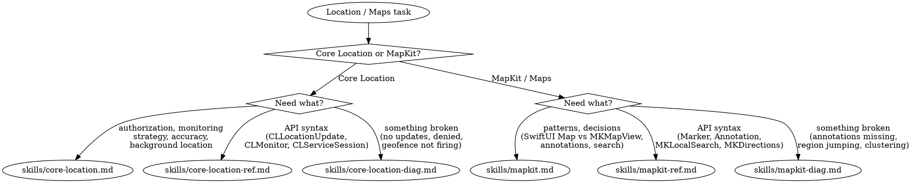

# Location & Maps

**You MUST use this skill for ANY location services, mapping, geofencing, or Core Location / MapKit work.**

## Quick Reference

| Symptom / Task | Reference |
|----------------|-----------|
| Authorization strategy (When In Use vs Always) | See `skills/core-location.md` |
| Monitoring approach (continuous, significant-change, CLMonitor) | See `skills/core-location.md` |
| Accuracy selection, background location | See `skills/core-location.md` |
| CLLocationUpdate, CLMonitor, CLServiceSession APIs | See `skills/core-location-ref.md` |
| Authorization API patterns, geofencing API | See `skills/core-location-ref.md` |
| Compass heading, heading reference body (`headingBody`) | See `skills/core-location-ref.md` (Part 12) |
| Location updates never arrive | See `skills/core-location-diag.md` |
| Background location stops working | See `skills/core-location-diag.md` |
| Authorization always denied, geofence failures | See `skills/core-location-diag.md` |
| SwiftUI Map, annotations, markers, clustering | See `skills/mapkit.md` |
| MKMapView vs SwiftUI Map decision | See `skills/mapkit.md` |
| Search, directions, routing | See `skills/mapkit.md` |
| MapKit API: Marker, Annotation, MKLocalSearch, MKDirections | See `skills/mapkit-ref.md` |
| Look Around, MKMapSnapshotter, MKMapItem | See `skills/mapkit-ref.md` |
| Annotations not appearing, region jumping | See `skills/mapkit-diag.md` |
| Clustering not working, search failures | See `skills/mapkit-diag.md` |
| Overlay rendering, user location not showing | See `skills/mapkit-diag.md` |

## Decision Tree

1. Authorization strategy, monitoring approach, accuracy? → `skills/core-location.md`
1a. Need specific API syntax (CLLocationUpdate, CLMonitor, CLServiceSession)? → `skills/core-location-ref.md`
1b. Location not working? → `skills/core-location-diag.md`
2. Adding a map, annotations, search, directions? → `skills/mapkit.md`
2a. Need specific MapKit API syntax (Marker, MKLocalSearch, MKDirections)? → `skills/mapkit-ref.md`
2b. Map display broken? → `skills/mapkit-diag.md`
3. Location draining battery? → See axiom-performance (skills/energy.md)
4. Background task scheduling for location? → See axiom-integration
5. Privacy manifest for location? → See axiom-integration

## Conflict Resolution

**location vs axiom-performance**: When location is draining battery:
1. **Try location FIRST** — Excessive accuracy or continuous updates are the #1 cause. `skills/core-location.md` covers accuracy selection and monitoring strategy.
2. **Only use axiom-performance** if location settings are already correct — Profile after ruling out obvious over-tracking.

**location vs axiom-integration**: When implementing background location:
- Background location configuration (Info.plist, capabilities, CLServiceSession) → **use location**
- BGTaskScheduler for periodic location processing → **use axiom-integration**

**location vs axiom-data**: When storing or syncing location data:
- Getting location updates, geofencing → **use location**
- Persisting location history, CloudKit sync → **use axiom-data**

**location vs axiom-build**: When location permissions fail in simulator:
- Authorization dialogs, Info.plist keys → **use location** (`skills/core-location-diag.md`)
- Simulator GPS simulation, `simctl location` → **use axiom-build**

## Critical Patterns

**Core Location** (`skills/core-location.md`):
- Authorization escalation strategy (When In Use first, Always later)
- Monitoring decision tree (continuous vs significant-change vs CLMonitor)
- Accuracy selection with battery impact
- Background location configuration
- Anti-patterns with time costs (premature Always authorization, unnecessary continuous updates)

**Core Location API** (`skills/core-location-ref.md`):
- CLLocationUpdate AsyncSequence (iOS 17+)
- CLMonitor condition-based geofencing (iOS 17+)
- CLServiceSession declarative authorization (iOS 18+)
- Authorization API patterns, background mode configuration

**Core Location Diagnostics** (`skills/core-location-diag.md`):
- Location updates never arrive
- Background location stops working
- Authorization always denied
- Geofence events not triggering
- Location accuracy unexpectedly poor

**MapKit** (`skills/mapkit.md`):
- SwiftUI Map vs MKMapView decision tree
- Annotation patterns (Marker, custom Annotation)
- Search (MKLocalSearch, autocomplete)
- Directions and routing
- Anti-patterns (annotations in view body, no view reuse, setRegion loops)

**MapKit API** (`skills/mapkit-ref.md`):
- SwiftUI Map API (MapCameraPosition, content builders, controls)
- MKMapView delegate patterns
- MKLocalSearch, MKDirections
- Look Around, MKMapSnapshotter
- Clustering configuration

**MapKit Diagnostics** (`skills/mapkit-diag.md`):
- Annotations not appearing (lat/lng swapped, missing delegate)
- Map region jumping/looping (updateUIView guard)
- Clustering not working (missing clusteringIdentifier)
- Search returning no results (resultTypes, region bias)
- Overlay rendering failures

## Anti-Rationalization

| Thought | Reality |
|---------|---------|
| "Just request Always authorization upfront" | 30-60% denial rate. Request When In Use first, escalate later. `skills/core-location.md` covers the strategy. |
| "Continuous updates are fine for my use case" | Continuous updates drain battery even when the app doesn't need sub-second location. Use significant-change or CLMonitor. |
| "I'll use MKMapView, it's more flexible" | SwiftUI Map covers most use cases since iOS 17. MKMapView means UIViewRepresentable boilerplate. `skills/mapkit.md` has the decision tree. |
| "Annotations in the view body is fine for a few items" | Annotations recreate on every view update. Even 50 items cause hitches. Move to model with `@State` or `@Observable`. |
| "I know how geofencing works" | CLMonitor (iOS 17+) replaces legacy region monitoring with conditions. The API changed significantly. |
| "Background location just needs the capability" | It needs Info.plist keys, capability, CLServiceSession (iOS 18+), AND correct authorization level. Missing any one silently fails. |
| "I'll handle location errors later" | Authorization denial is not an error — it's the default state. Handle it from the start. |

## Example Invocations

User: "How do I request location permissions?"
→ Read: `skills/core-location.md`

User: "What's the CLLocationUpdate API?"
→ Read: `skills/core-location-ref.md`

User: "My location updates never arrive"
→ Read: `skills/core-location-diag.md`

User: "How do I add a map with pins?"
→ Read: `skills/mapkit.md`

User: "What's the SwiftUI Map API?"
→ Read: `skills/mapkit-ref.md`

User: "My annotations aren't showing on the map"
→ Read: `skills/mapkit-diag.md`

User: "How do I implement geofencing?"
→ Read: `skills/core-location.md` then `skills/core-location-ref.md`

User: "Location is draining battery"
→ Read: `skills/core-location.md`, then See axiom-performance (skills/energy.md)

User: "How do I add search to my map?"
→ Read: `skills/mapkit.md` then `skills/mapkit-ref.md`
