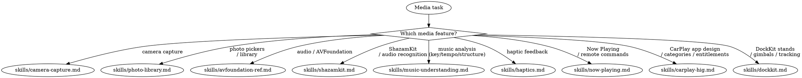

# Media

**You MUST use this skill for ANY camera, photo, audio, haptic, or media playback work.**

## Quick Reference

| Symptom / Task | Reference |
|----------------|-----------|
| Camera capture, AVCaptureSession | See `skills/camera-capture.md` |
| Slow camera launch / deferred start (iOS 26+), ProRes recording via Pro Video Storage (`OS27`) | See `skills/camera-capture.md` Patterns 8-9 |
| Camera API (RotationCoordinator, etc.) | See `skills/camera-capture-ref.md` |
| Center Stage front camera (iPhone 17), dynamic aspect ratio, smart framing, 24/48 MP capture | See `skills/camera-capture-ref.md` |
| Camera freezes, black preview, rotation | See `skills/camera-capture-diag.md` |
| Photo pickers, library access | See `skills/photo-library.md` |
| PHPicker, PhotosPicker API reference | See `skills/photo-library-ref.md` |
| Audio, AVFoundation, spatial audio | See `skills/avfoundation-ref.md` |
| Audio recognition, ShazamKit | See `skills/shazamkit.md` |
| ShazamKit API reference | See `skills/shazamkit-ref.md` |
| On-device music analysis (key, tempo, structure, loudness), MusicUnderstanding (`OS27`) | See `skills/music-understanding.md` |
| Haptic feedback, Core Haptics | See `skills/haptics.md` |
| Now Playing metadata, remote commands | See `skills/now-playing.md` |
| Animated lock-screen artwork (iOS 26+) | See `skills/now-playing.md` Pattern 8 |
| NowPlaying framework (`import NowPlaying`, Swift-native `MediaSession`, `OS27`) | See `skills/now-playing.md` (NowPlaying Framework section) |
| CarPlay HIG, app categories, design rules, entitlements | See `skills/carplay-hig.md` |
| CarPlay templates reference (all 12 templates, availability matrix, depth limits) | See `skills/carplay-templates-ref.md` |
| CarPlay navigation reference (base view, route guidance, cluster/HUD, multitouch, voice prompts, map panels + EV charging iOS 27) | See `skills/carplay-navigation-ref.md` |
| CarPlay Now Playing template customization + sports mode | See `skills/now-playing-carplay.md` |
| MusicKit Now Playing | See `skills/now-playing-musickit.md` |
| DockKit motorized stands / gimbals, subject tracking, custom motor control | See `skills/dockkit.md` |

## Decision Tree

1. Camera capture? → `skills/camera-capture.md` (patterns), `skills/camera-capture-ref.md` (API), `skills/camera-capture-diag.md` (debugging)
2. Photo pickers / library? → `skills/photo-library.md`, `skills/photo-library-ref.md`
3. Audio / AVFoundation? → `skills/avfoundation-ref.md`
4. ShazamKit / audio recognition? → `skills/shazamkit.md`, `skills/shazamkit-ref.md`
5. On-device music analysis (key, tempo, structure, pace, instruments, loudness)? → `skills/music-understanding.md` (`OS27`)
6. Haptics? → `skills/haptics.md`
7. Now Playing / remote commands? → `skills/now-playing.md`, `skills/now-playing-carplay.md`, `skills/now-playing-musickit.md`
8. CarPlay app design, category selection, entitlement request? → `skills/carplay-hig.md` (start here for any CarPlay work)
9. DockKit motorized stands / gimbals, subject tracking, custom motor control? → `skills/dockkit.md`
10. Want camera code audit? → Launch `camera-auditor` agent (detects deprecated APIs and architectural gaps: missing interruption handlers, runtime-error recovery, audio session deactivation, permission-denied UX, RotationCoordinator on iOS 17+; scores RELIABLE / FRAGILE / BROKEN)

## Cross-Domain Routing

**Camera + permissions** (camera access denied, Info.plist missing):
- Camera code → **stay here** (camera-capture)
- Privacy manifest / Info.plist → **invoke axiom-integration** (privacy-ux reference)
- Build/entitlement errors → **invoke axiom-build**

**ShazamKit + microphone permissions**:
- Microphone NSMicrophoneUsageDescription → **invoke axiom-integration** (privacy-ux reference)
- ShazamKit API and matching → **stay here** (shazamkit)

**Now Playing + background audio**:
- Now Playing metadata/controls → **stay here** (now-playing)
- Background audio mode / BGTaskScheduler → **invoke axiom-integration** (background-processing reference)

**Photo library + privacy**:
- Photo picker (PHPicker, PhotosPicker) → **stay here** (photo-library) — no permissions needed
- Full PHPhotoLibrary access → **stay here** (photo-library-ref) — limited access model
- Privacy manifest for photo usage → **invoke axiom-integration** (privacy-ux reference)

**DockKit + camera / custom inference**:
- DockKit stand control, framing, motor, tracking states → **stay here** (dockkit)
- Underlying AVCaptureSession setup → **stay here** (camera-capture)
- Custom Vision / Core ML inference feeding observations → **invoke axiom-vision**
- Camera permission (NSCameraUsageDescription) → **invoke axiom-integration** (privacy-ux reference)

## Anti-Rationalization

| Thought | Reality |
|---------|---------|
| "Camera capture is just AVCaptureSession setup" | Camera has interruption handlers, rotation, and threading requirements. |
| "Camera launch is fast enough if I startRunning() early" | Output initialization dominates launch; iOS 26 deferred start halves time-to-preview. |
| "I'll add haptics with a simple API call" | Haptic design has patterns for each interaction type matching HIG. |
| "ShazamKit is just SHSession + a delegate" | iOS 17+ has SHManagedSession which eliminates all AVAudioEngine boilerplate. |
| "Now Playing info is just setting metadata" | Remote commands, artwork handling, and state sync have 15+ gotchas. |
| "I'll use UIImagePickerController for photos" | PHPicker/PhotosPicker are the modern API — no permissions required. |
| "DockKit is just pairing a stand" | Custom control needs system tracking disabled, handles inverted dock states, and two different coordinate origins. |

## Example Invocations

User: "How do I set up a camera preview?"
→ Read: `skills/camera-capture.md`

User: "My camera app takes a second before preview appears"
→ Read: `skills/camera-capture.md` (Pattern 8, deferred start)

User: "Support the Center Stage front camera" / "Capture 48MP photos"
→ Read: `skills/camera-capture-ref.md`

User: "Camera freezes when I get a phone call"
→ Read: `skills/camera-capture-diag.md`

User: "How do I let users pick photos in SwiftUI?"
→ Read: `skills/photo-library.md`

User: "Implement haptic feedback for button taps"
→ Read: `skills/haptics.md`

User: "Now Playing info doesn't appear on Lock Screen"
→ Read: `skills/now-playing.md`

User: "How do I identify songs with ShazamKit?"
→ Read: `skills/shazamkit.md`

User: "How do I detect a song's tempo / key / beat grid on-device?" / "Analyze audio loudness or structure"
→ Read: `skills/music-understanding.md`

User: "Track a subject with a motorized stand" / "Control a DockKit gimbal"
→ Read: `skills/dockkit.md`

User: "Check my camera code for issues"
→ Launch: `camera-auditor` agent
