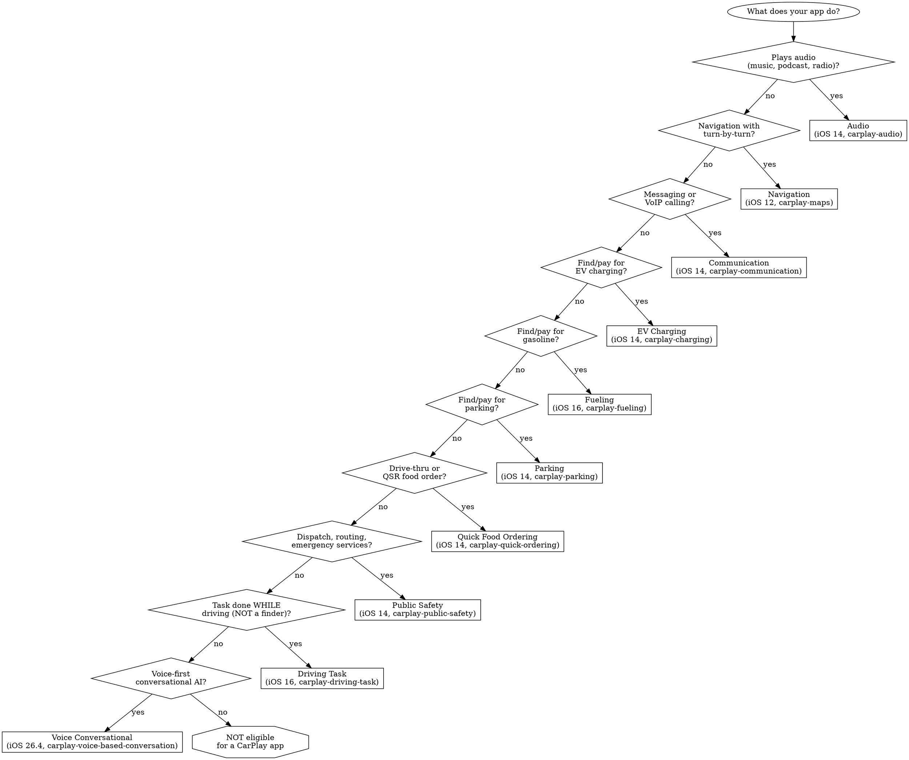

# CarPlay HIG & Design Discipline

Authoritative design rules for CarPlay apps. Covers app category selection, Apple's 8 Universal Guidelines plus category-specific rules, driver distraction framing, and iOS 26 additions (widgets, Live Activities, CarPlay Ultra, multitouch).

## Overview

**CarPlay is stricter than iOS HIG.** The iPhone HIG is a set of recommendations. CarPlay is a regulated surface with hard rules enforced by Apple during entitlement review. Ignoring them means your entitlement request is rejected before your app ever reaches the App Store.

**Templates, not custom UI.** CarPlay apps don't draw their own controls. They pick from a fixed set of templates and supply data. iOS renders the UI onto the vehicle's display. Exception: navigation apps draw a map in the base view — and *only* a map.

**Driver distraction is the framing principle.** "CarPlay is designed for the driver, not for passengers" (CarPlay HIG). Every rule in this document exists to keep eyes on the road.

**Time cost**: 5-15 minutes for category selection + guideline review. 30-60 minutes if you need to redo an app that missed category rules during entitlement review.

## When to Use This Skill

- Choosing which CarPlay app category applies to your app
- Requesting a CarPlay entitlement (Apple reviews design before approval)
- Designing any CarPlay screen, flow, or notification
- Adding widgets or Live Activities to CarPlay (iOS 26+)
- Responding to Apple feedback on CarPlay design
- Reviewing a CarPlay implementation for HIG compliance
- Supporting CarPlay Ultra (which requires multitouch-aware layouts)

## System Requirements

- **iOS 12+** for navigation apps
- **iOS 14+** for audio, communication, EV charging, parking, public safety, quick food ordering, automaker
- **iOS 16+** for driving task, fueling
- **iOS 17+** for the action sheet template in audio apps and in Now Playing for communication apps
- **iOS 17.4+** for metadata in instrument cluster/HUD and programmatic re-route
- **iOS 18.4+** for Now Playing sports mode and notifications in driving task apps
- **iOS 26+** for widgets, Live Activities, multitouch, CarPlay Ultra, new list element styles
- **iOS 26.4+** for voice-based conversational apps and updated voice control template

---

## Red Flags — Anti-Rationalization

These thoughts mean STOP — you're about to violate a CarPlay rule:

| Thought | Reality | Source |
|---|---|---|
| "I'll just show a one-time setup screen in CarPlay" | **"Don't require sign in or configuration steps in CarPlay. Don't ask the user to perform setup steps on the car's display."** Your app must be fully configured on iPhone before CarPlay use. | HIG + Dev Guide p.4 (#2, #3) |
| "I'll show the message body — it's useful info" | **"Never show the content of messages, texts, or emails on the CarPlay screen."** Sender + group name in title/subtitle only. | Dev Guide p.4 (#6), p.25 |
| "I'll direct users to finish this on iPhone" | **"Never direct people to pick up their iPhone to read or resolve an error."** This is the most-cited rule in the Developer Guide. | HIG + Dev Guide p.4 (#2), 2017 Audio Guide p.18 |
| "I'll add a settings screen to tweak playback behavior" | **"Don't include features in CarPlay that aren't related to the primary task (e.g. unrelated settings, maintenance features, etc.)."** | Dev Guide p.4 (#4) |
| "I'll show lyrics below the Now Playing album art" | **"Never show song lyrics on the CarPlay screen."** (Audio apps only.) | Dev Guide p.4 (audio additional rule) |
| "I'll use a custom view for the selected route" | **"The base view must be used exclusively to draw a map. Do not draw windows, alerts, panels, overlays, or user interface elements in the base view."** All UI goes through templates. | Dev Guide p.6 (nav #2) |
| "I'll auto-play audio as soon as CarPlay connects" | **"Avoid beginning playback automatically unless your app's purpose is to play a single source."** | HIG + 2017 Audio Guide p.17 |
| "We can add gamified challenges for long trips" | **"No gaming or social networking."** CarPlay apps must meaningfully help with driving. | Dev Guide p.4 (#5) |
| "I'll use the Now Playing template to show our restaurant menu" | **"Use templates for their intended purpose, and only populate templates with the specified information types."** | Dev Guide p.4 (#7) |
| "I'll handle voice in my app directly with AVAudioEngine" | **"All voice interaction must be handled using SiriKit"** — except CarPlay navigation and voice-based conversational apps. | Dev Guide p.4 (#8) |
| "CarPlay apps are just iOS apps on a second screen" | They are not. Templates are rendered by iOS, not your app. Your app supplies data; iOS handles layout, input hardware abstraction, and screen resolution. | Dev Guide p.10 |

---

## The 8 Universal Guidelines

These apply to **every** CarPlay app, regardless of category. Apple labels them "Guidelines for all CarPlay apps" in the Developer Guide, and adds separate "Additional guidelines" per category (see per-category sections below). Source: *CarPlay Developer Guide*, Feb 2026, p.4.

1. **Primary purpose.** "Your CarPlay app must be designed primarily to provide the specified feature (e.g. CarPlay audio apps must be designed primarily to provide audio playback services, CarPlay parking apps must be designed primarily to provide parking services, etc.)."

2. **Never direct to iPhone.** "Never instruct people to pick up their iPhone to perform a task. If there is an error condition, such as a required log in, you can let them know about the condition so they can take action when safe. However, alerts or messages must not include wording that asks people to manipulate their iPhone."

3. **All flows possible in CarPlay.** "All CarPlay flows must be possible without interacting with iPhone."

4. **Relevant to driving.** "All CarPlay flows must be meaningful to use while driving. Don't include features in CarPlay that aren't related to the primary task (e.g. unrelated settings, maintenance features, etc.)."

5. **No gaming or social networking.**

6. **No message content.** "Never show the content of messages, texts, or emails on the CarPlay screen."

7. **Templates as intended.** "Use templates for their intended purpose, and only populate templates with the specified information types (e.g. a list template must be used to present a list for selection, album artwork in the now playing screen must be used to show an album cover, etc.)."

8. **SiriKit for voice.** "All voice interaction must be handled using SiriKit (with the exception of CarPlay navigation and voice-based conversational apps)."

Apple separately defines "Additional guidelines" per category (see per-category sections below). The no-lyrics rule for audio apps is the most commonly cited; navigation adds its own 10 rules.

---

## App Category Selection

CarPlay has **10 app categories**, each with a distinct entitlement and design rulebook. Pick exactly one (EV charging and fueling may be combined). Source: *Developer Guide* p.12.

### Decision Tree



### Category Matrix

| Category | Entitlement | Min iOS | Template depth | Primary use |
|---|---|---|---|---|
| Audio | `com.apple.developer.carplay-audio` | 14 | 5 | Music, podcasts, audiobooks, radio |
| Communication | `com.apple.developer.carplay-communication` | 14 | 5 | SiriKit messaging or VoIP calling |
| Driving task | `com.apple.developer.carplay-driving-task` | 16 | 2 (iOS ≤26.3) / 3 (iOS 26.4+) | Tasks that *help with* the drive itself |
| EV charging | `com.apple.developer.carplay-charging` | 14 | 5 | Find/pay for charging sessions |
| Fueling | `com.apple.developer.carplay-fueling` | 16 | 3 | Find/pay for gasoline |
| Navigation | `com.apple.developer.carplay-maps` | 12 | 5 | Turn-by-turn directions |
| Parking | `com.apple.developer.carplay-parking` | 14 | 5 | Find/pay for parking |
| Public safety | `com.apple.developer.carplay-public-safety` | 14 | 5 | Dispatch, routing, vehicle/location search |
| Quick food ordering | `com.apple.developer.carplay-quick-ordering` | 14 | 2 (iOS ≤26.3) / 3 (iOS 26.4+) | Drive-thru / pickup QSR only |
| Voice-based conversational | `com.apple.developer.carplay-voice-based-conversation` | 26.4 | 3 | Voice-first conversational AI |

*Source: Developer Guide p.12, p.13.*

### Entitlement request flow

"To request a CarPlay app entitlement, go to http://developer.apple.com/carplay and provide information about your app, including the category of entitlement that you are requesting. You also need to agree to the CarPlay Entitlement Addendum. Apple will review your request. If your app meets the criteria for the CarPlay app category, Apple will assign a CarPlay app entitlement to your Apple Developer account and notify you." (Dev Guide p.11)

**Implication:** Apple reads your app description and judges whether it actually fits the category. Shoehorning a finder-style app into "driving task" will fail. Apple's category-specific rules below are what they check against.

---

## Per-Category Design Rules

Each subsection lists Apple's published rules verbatim where possible. Source: *Developer Guide* pp.5-6.

### Audio apps

- Use CarPlay framework; the older MediaPlayer-only path (`com.apple.developer.playable-content`) is deprecated (Dev Guide p.62).
- **Never show song lyrics on the CarPlay screen.**
- Don't open an audio session until ready to play — "People expect FM radio to continue to play until they explicitly choose to play an audio stream in your app" (Dev Guide p.27).
- "Avoid beginning playback automatically unless your app's purpose is to play a single source" (HIG).
- "Adjust relative levels, not overall volume" — don't override the car's volume (HIG).
- Provide a "navigable hierarchy of audio information — radio stations, albums, artists, titles, and so forth" (HIG).
- Ensure the app works when iPhone is locked: no access to `NSFileProtectionComplete` files, certain Keychain items, or `SQLITE_OPEN_FILEPROTECTION_COMPLETE` databases (Dev Guide p.27, 2017 Audio Guide p.19).

### Communication apps (SiriKit Messaging or VoIP Calling)

- Must provide **short-form text messaging**, VoIP calling, or both. Email is not short-form text messaging and is not permitted (Dev Guide p.5).
- **Text messaging requires all three SiriKit intents**: `INSendMessageIntent`, `INSearchForMessagesIntent`, `INSetMessageAttributeIntent` (Dev Guide p.5).
- **VoIP calling** must use CallKit and support `INStartCallIntent` (Dev Guide p.5).
- Notification content: "must only include information such as the sender and group name in the title and subtitle. **The contents of the message must never be shown in CarPlay**" (Dev Guide p.25).
- Deprecated entitlements: `com.apple.developer.carplay-messaging` and `com.apple.developer.carplay-calling` are required only to support iOS 13 and earlier. Apps targeting iOS 14+ use the CarPlay framework via `com.apple.developer.carplay-communication` (Dev Guide p.62).

### Driving task apps

- "Tasks must actually *help* with the drive, not just be tasks that are done while driving" (Dev Guide p.5).
- Must use the provided templates — no custom maps or real-time video.
- **Do not show CarPlay UI for tasks unrelated to driving** (account setup, detailed settings).
- **Refresh rate caps**: UI data items no more than every 10 seconds; points of interest no more than every 60 seconds (Dev Guide p.5).
- "Do not create POI (point of interest) apps that are focused on finding locations on a map. Driving task apps must be primarily designed to accomplish tasks and are not intended to be location finders (e.g. store finders)" (Dev Guide p.5).
- "Use cases outside of the vehicle environment are not permitted."

### EV charging / Fueling / Parking

Shared rules (Dev Guide p.5):
- "Must provide meaningful functionality relevant to driving (e.g. your app can't just be a list of [EV chargers / fueling stations / parking locations])."
- "When showing locations on a map, do not expose locations other than [the category]."

EV charging and fueling entitlements may be combined in a single app (Dev Guide p.12).

### Public safety apps

- "Your app must be designed primarily to assist public safety organizations (firefighters, law enforcement, and ambulance) in the performance of their responsibilities such as dispatch, routing, and vehicle and location search" (Dev Guide p.6).

### Navigation apps (turn-by-turn directions)

Ten rules, all load-bearing. Source: *Developer Guide* p.6.

1. Must provide turn-by-turn directions with upcoming maneuvers.
2. **Base view must be used exclusively to draw a map.** Do not draw windows, alerts, panels, overlays, or UI elements. "Don't draw lane guidance information in the base view. Instead, draw lane guidance information as a secondary maneuver using the provided template."
3. Use each provided template for its intended purpose (maneuver images represent maneuvers only).
4. Must provide a way to enter panning mode — if panning is supported, include a pan button in the map template, since drag gestures aren't available in all vehicles.
5. Touch gestures only for their intended purpose (pan, zoom, pitch, rotate).
6. Immediately terminate route guidance when the vehicle's native system starts guidance (respond to `mapTemplateDidCancelNavigation`).
7. Correctly handle audio: voice prompts must mix with the vehicle's audio, and you must not needlessly activate sessions when no audio plays.
8. Map must be appropriate in each supported country.
9. "Be open and responsive to feedback. Apple may contact you in the event that Apple or automakers have input to design or functionality."
10. Voice control must be limited to navigation features.

For the implementation layer (CPMapTemplate, CPNavigationSession, instrument cluster/HUD metadata, multitouch on iOS 26+), see the separate `carplay-navigation-ref` skill (planned).

### Quick food ordering apps

- Must be Quick Service Restaurant (QSR) apps "designed primarily for driving-oriented food orders (e.g. drive thru, pick up) when in CarPlay and are not intended to be general retail apps (e.g. supermarkets, curbside pickup)" (Dev Guide p.6).
- "Provide meaningful functionality relevant to driving."
- **Simplified ordering only. Don't show a full menu.** Recent orders or favorites limited to 12 items each.
- Map locations must expose QSR locations only.

### Voice-based conversational apps (iOS 26.4+)

- "Voice-based conversational apps must have a primary modality of voice upon launch; and after launch, appropriately respond to questions or requests and perform actions" (Dev Guide p.6).
- "Only hold an audio session open when voice features are actively being used."
- "Optimize for voice interaction in the driving environment (e.g. don't show text or imagery in response to queries)."

---

## Widgets & Live Activities in CarPlay (iOS 26+)

Added in iOS 26. Source: *Developer Guide* p.8-9, *WWDC25-216* @ 2:14 (widgets) and 5:07 (Live Activities).

### Widgets

- Support the `.systemSmall` family: `.supportedFamilies([.systemSmall])` (Dev Guide p.8).
- If your widget is unsuitable for the car, mark it disfavored: `.disfavoredLocations([.carPlay], for: [.systemSmall])` (Dev Guide p.8). "People can still choose to show your widget but interaction will be disabled."

**Disfavor your widget** when (Dev Guide p.4):
- It's a game or requires extensive interaction (more than ~6 taps/refreshes)
- It relies on data protection class A or B (generally non-functional because iPhone is locked)
- Its primary purpose is to launch your app on iPhone, and your app isn't a CarPlay app

Your app does **not** need to be a CarPlay app to support widgets. Widgets in CarPlay launch your app — but only if your app is *also* a CarPlay app. Use `widgetURL` or `Link`.

### Live Activities

- "Live Activities are supported with iOS 26 in CarPlay and CarPlay Ultra" (Dev Guide p.9).
- Support the `.small` activity family: `.supplementalActivityFamilies([.small])`.
- If you don't support `.small`, CarPlay falls back to the compact leading + compact trailing views from your Dynamic Island configuration.
- Your app does **not** need to be a CarPlay app to support Live Activities.

### CarPlay Ultra

"CarPlay Ultra builds on the capabilities of CarPlay and provides the ultimate in-car experience by deeply integrating with the vehicle" (Dev Guide p.3). Any vehicle that supports CarPlay Ultra supports multitouch — design for multitouch input in navigation apps (see navigation-ref skill).

---

## Layout, Color & Assets (cross-category)

Source: CarPlay HIG (developer.apple.com/design/human-interface-guidelines/carplay).

### Layout

- Support resolutions **800×480 to 1920×720**; test portrait up to 900×1200 (Dev Guide p.56).
- "Place critical content in the upper half."
- "Don't clutter the screen with nonessential details."

### Color

- Use a limited palette coordinated with your app logo.
- Test under varied real-world lighting (direct sun, night, tunnel).
- Support both light and dark appearances — CarPlay signals via `contentStyle` / `contentStyleDidChange` (Dev Guide p.33).
- Ensure inclusive color usage (not the sole information channel).

### Icons

- Supply @2x and @3x assets.
- Icon sizes: **120×120** and **180×180 px**.
- Mirror your iPhone app icon design.
- **Don't use black for the icon's background.**

### Per-template asset sizes

| Element | Max points | 3x pixels | 2x pixels |
|---|---|---|---|
| Contact action button | 50×50 | 150×150 | 100×100 |
| Grid icon | 40×40 | 120×120 | 80×80 |
| Now playing action button | 20×20 | 60×60 | 40×40 |
| Tab bar icon | 24×24 | 72×72 | 48×48 |
| First maneuver symbol (1-line) | 50×50 | 150×150 | 100×100 |
| Dashboard junction image | 140×100 | 420×300 | 280×200 |

*Source: Developer Guide p.26, p.38.*

For tab bar icons, prefer SF Symbols for seamless integration with the system font.

---

## Error Handling & iPhone-Locked State

From HIG and *Developer Guide* p.27:

- **Report errors in CarPlay, not on the connected iPhone.** Populate the item list or present an alert within CarPlay with a localized error description.
- **"Never direct people to pick up their iPhone to read or resolve an error"** (HIG).
- CarPlay is typically used while iPhone is locked. Test this path. You won't be able to access:
  - Files saved with `NSFileProtectionComplete` or `NSFileProtectionCompleteUnlessOpen`
  - Keychain items with `kSecAttrAccessibleWhenPasscodeSetThisDeviceOnly`, `kSecAttrAccessibleWhenUnlocked`, or `kSecAttrAccessibleWhenUnlockedThisDeviceOnly`
  - SQLite databases opened with `SQLITE_OPEN_FILEPROTECTION_COMPLETE` or `…COMPLETEUNLESSOPEN`

---

## Notifications in CarPlay

Source: *Developer Guide* p.25.

- Supported in: communication, EV charging, parking, public safety, and (iOS 18.4+) driving task apps.
- **Not** supported in audio, navigation (route guidance uses the CarPlay framework directly, not UNNotification), quick food ordering, fueling, or voice-based conversational apps.
- Request authorization with the `.carPlay` option:

```swift
let options: UNAuthorizationOptions = [.badge, .sound, .alert, .carPlay]
UNUserNotificationCenter.current().requestAuthorization(options: options) { granted, error in
    // Enable or disable features based on authorization
}
```

- Create a notification category with `UNNotificationCategoryOptions.allowInCarPlay`.
- Users can show/hide your app's notifications in Settings — disable related features gracefully if the driver declines.
- "Notifications should be used sparingly in CarPlay and must be reserved for important tasks required while driving" (Dev Guide p.25).
- Communication apps: notifications must include sender/group name only, never message body.

---

## Expert Review Checklist

Before requesting the CarPlay entitlement or shipping, run through:

### Category fit
- [ ] My app fits exactly one CarPlay category (or EV+fueling combined)
- [ ] My app is *primarily* designed for that category's purpose (not tacking CarPlay onto an unrelated app)
- [ ] I've read the category-specific rules for my category
- [ ] My app launches and is fully usable without any iPhone interaction

### Universal guidelines
- [ ] No gaming, no social networking, no unrelated settings
- [ ] No message/email/text body ever shown on the CarPlay screen
- [ ] No lyrics (audio apps)
- [ ] No prompts directing the user to iPhone — not in UI, not in errors
- [ ] Voice interaction uses SiriKit (unless nav or voice-conversational)
- [ ] Templates used only for their intended purpose

### Layout and assets
- [ ] @2x AND @3x icons supplied (120×120, 180×180)
- [ ] Light AND dark appearances tested
- [ ] Tested at 800×480, 1920×720, 900×1200 (portrait)
- [ ] Icon background is not black
- [ ] Critical content is in the upper half

### Error and locked-state
- [ ] Errors surface in CarPlay with a localized message
- [ ] No error message references iPhone
- [ ] Tested with iPhone locked (files, keychain, SQLite paths)

### iOS 26 additions (if applicable)
- [ ] Widget supports `.systemSmall` or is marked `.disfavoredLocations([.carPlay])`
- [ ] Live Activity supports `.small` activity family (or falls back to Dynamic Island)
- [ ] Navigation app handles multitouch callbacks on `CPMapTemplate`

---

## Common Mistakes

| Mistake | Why it fails | Fix |
|---|---|---|
| Shoehorning a finder app into "driving task" | Driving task apps are for tasks *during* driving, not location finders | Pick the correct category (parking/fueling/EV/QSR) or no CarPlay support |
| Building a custom UI with overlays on the map | "Base view must be used exclusively to draw a map" | Use templates (list, alert, navigation alert) for all non-map UI |
| Showing a setup/login screen on CarPlay launch | All flows must be possible without iPhone interaction | Require iPhone setup before first use; gracefully disable features in CarPlay with a CarPlay-native message |
| Auto-playing audio on connect | "Avoid beginning playback automatically unless your app's purpose is to play a single source" | Wait for the user to select content; exception only for single-source apps with `UIBrowsableContentSupportsImmediatePlayback` |
| Notification body contains message text | "The contents of the message must never be shown in CarPlay" | Title = sender name, subtitle = group name (if applicable), body empty |
| Widget endlessly refreshes in CarPlay | Widgets that require ≥ 6 taps/refreshes should be disfavored | `.disfavoredLocations([.carPlay], for: [.systemSmall])` |
| Letting users adjust playback audio via absolute volume | "Adjust relative levels, not overall volume" | Use audio session mixing and ducking; let the car own overall volume |
| Forgetting to terminate route guidance on native system start | Navigation rule #6 | Handle `mapTemplateDidCancelNavigation`; end session immediately |

---

## Testing Your CarPlay App

- **CarPlay Simulator** (standalone Mac app) — closest match to real-vehicle behavior. Install via Xcode → Open Developer Tool → More Developer Tools… (downloads the *Additional Tools for Xcode* package; CarPlay Simulator is in the Hardware folder). Supports screen-size configuration, light/dark content style, and instrument cluster (navigation apps).
- **Xcode Simulator** — quick iteration via Simulator menu → I/O → External Displays → CarPlay. Enable extra options: `defaults write com.apple.iphonesimulator CarPlayExtraOptions -bool YES`. Limitations: no instrument cluster, no locked-iPhone testing, no FM-radio interruption, no Siri features.
- **Real vehicle or aftermarket head unit** — required for iPhone-locked flows, actual audio-session behavior, Siri, and instrument-cluster displays.

For navigation-specific testing (cluster configurations, HUD metadata, screen sizes at 748×456 up to 1920×720), see `carplay-navigation-ref.md`. For the CarPlay audio testing loop and debugger-interference gotchas, see `now-playing-carplay.md`. Source: *Developer Guide* p.7, pp.56-57.

---

## Resources

**Primary sources (Apple):**

| Source | Location |
|---|---|
| CarPlay HIG | developer.apple.com/design/human-interface-guidelines/carplay |
| CarPlay Developer Guide (Feb 2026) | developer.apple.com/download/files/CarPlay-Developer-Guide.pdf |
| CarPlay Audio App Programming Guide (Mar 2017) | developer.apple.com/carplay/documentation/CarPlay-Audio-App-Programming-Guide.pdf |
| CarPlay for developers (entitlement request) | developer.apple.com/carplay |

**WWDC sessions:**

- **WWDC25-216** "Turbocharge your app for CarPlay" — iOS 26 widgets, Live Activities, CarPlay Ultra, multitouch
- **WWDC22-10016** "Get more mileage out of your app with CarPlay" — iOS 16 EV charging, parking, QSR, driving task
- **WWDC20-10635** "Accelerate your app with CarPlay" — framework coverage, audio, communication
- **WWDC18-213** "CarPlay Audio and Navigation Apps" — audio architecture, maneuver model, right-hand-drive / dark mode adaptation
- **WWDC17-719** "Enabling Your App for CarPlay" — foundational design rules

**Related Axiom skills:**

- `now-playing-carplay.md` — CPNowPlayingTemplate customization (API mechanics)
- `carplay-templates-ref.md` — per-template reference *(planned)*
- `carplay-navigation-ref.md` — navigation-specific (base view, instrument cluster, HUD, multitouch) *(planned)*
- `avfoundation-ref.md` — AVAudioSession configuration for voice prompts
- `/skill axiom-integration` — App Intents and SiriKit integration for voice-first flows
- `/skill axiom-design` — general HIG principles (typography, color, Liquid Glass)

**Regulatory backdrop (why CarPlay rules are stricter than iOS):**

- NHTSA *Visual-Manual Driver Distraction Guidelines for In-Vehicle Electronic Devices* — the 2-second glance / 12-second total-task rule
- Alliance of Automobile Manufacturers *Driver Focus-Telematics Guidelines*
- ISO 15005 — ergonomic principles for transport information and control systems
