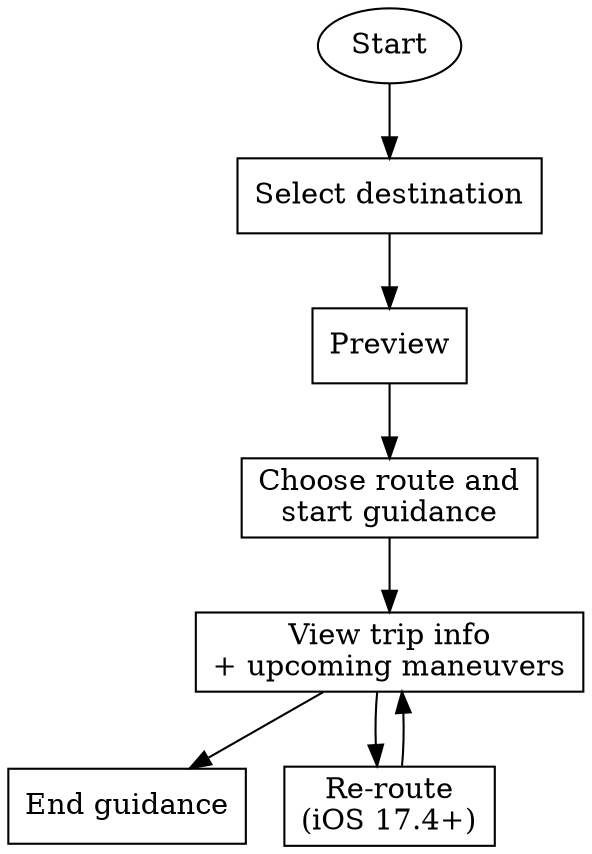

# CarPlay Navigation Reference

Reference for CarPlay turn-by-turn navigation apps — base view rules, route guidance lifecycle, map template specifics, CarPlay Dashboard, instrument cluster, HUD metadata, voice prompts, multitouch, and testing.

**Start with `carplay-hig.md`** for the 10 navigation-app design rules (base-view restriction, voice control scope, audio handling, etc.). This file documents the navigation framework and APIs.

## Overview

Navigation apps have more capabilities than any other CarPlay category:

- **Base view** for drawing maps (iOS 12+)
- **CarPlay Dashboard** second map (iOS 13.4+)
- **Instrument cluster** map display (iOS 16.4+)
- **HUD metadata** for maneuver display in head-up displays and smaller cluster screens (iOS 17.4+)
- **Multitouch gestures** (iOS 26+)

This additional surface area carries additional rules. The base-view-is-for-maps-only rule (Dev Guide p.6 rule #2) is the one most navigation devs violate.

## Supported Displays

Source: *CarPlay Developer Guide*, Feb 2026, p.32.

| iOS version | Center display | CarPlay Dashboard | Instrument cluster | HUD metadata |
|---|---|---|---|---|
| iOS 12 | ● |   |   |   |
| iOS 13.4 | ● | ● |   |   |
| iOS 16.4 | ● | ● | ● |   |
| iOS 17.4+ | ● | ● | ● | ● |

"Support all capabilities in your app for a seamless experience in all vehicle configurations."

## Base View

Source: *Developer Guide* p.33, reinforced at p.6 (Guidelines rule #2).

**Rule:** "The base view must be used exclusively to draw a map, and cannot be used to draw alerts, overlays, or other UI elements. All UI elements that appear on the screen, including the navigation bar and map buttons, must be implemented using other templates."

- Your app won't receive direct tap or drag events in the base view — the map template routes input.
- Draw on different aspect ratios, resolutions, and light/dark modes.
- Read the current mode via `contentStyle` on your `CPTemplateApplicationScene` delegate.
- React to mode changes via `contentStyleDidChange`.
- Observe the **safe area** — the portion of the map not obscured by buttons.

## Startup

Source: *Developer Guide* p.40.

### Application scene manifest

Navigation apps declare two CarPlay scenes — one for the main window, one for the CarPlay Dashboard — plus (optionally) instrument cluster.

```xml
<key>UIApplicationSceneManifest</key>
<dict>
    <!-- Declare support for CarPlay Dashboard. -->
    <key>CPSupportsDashboardNavigationScene</key>
    <true/>
    <!-- Declare support for instrument cluster displays. -->
    <key>CPSupportsInstrumentClusterNavigationScene</key>
    <true/>
    <!-- Declare support for multiple scenes. -->
    <key>UIApplicationSupportsMultipleScenes</key>
    <true/>
    <key>UISceneConfigurations</key>
    <dict>
        <!-- Device scenes -->
        <key>UIWindowSceneSessionRoleApplication</key>
        <array>
            <dict>
                <key>UISceneClassName</key><string>UIWindowScene</string>
                <key>UISceneConfigurationName</key><string>Phone</string>
                <key>UISceneDelegateClassName</key><string>MyAppWindowSceneDelegate</string>
            </dict>
        </array>
        <!-- Main CarPlay scene -->
        <key>CPTemplateApplicationSceneSessionRoleApplication</key>
        <array>
            <dict>
                <key>UISceneClassName</key><string>CPTemplateApplicationScene</string>
                <key>UISceneConfigurationName</key><string>CarPlay</string>
                <key>UISceneDelegateClassName</key><string>MyAppCarPlaySceneDelegate</string>
            </dict>
        </array>
        <!-- CarPlay Dashboard scene -->
        <key>CPTemplateApplicationDashboardSceneSessionRoleApplication</key>
        <array>
            <dict>
                <key>UISceneClassName</key><string>CPTemplateApplicationDashboardScene</string>
                <key>UISceneConfigurationName</key><string>CarPlay-Dashboard</string>
                <key>UISceneDelegateClassName</key><string>MyAppCarPlayDashboardSceneDelegate</string>
            </dict>
        </array>
        <!-- Instrument cluster scene -->
        <key>CPTemplateApplicationInstrumentClusterSceneSessionRoleApplication</key>
        <array>
            <dict>
                <key>UISceneClassName</key><string>CPTemplateApplicationInstrumentClusterScene</string>
                <key>UISceneConfigurationName</key><string>CarPlay-Instrument-Cluster</string>
                <key>UISceneDelegateClassName</key><string>MyAppCarPlayInstrumentClusterSceneDelegate</string>
            </dict>
        </array>
    </dict>
</dict>
```

Source: *Developer Guide* p.58-59.

### Scene delegate lifecycle

```swift
// Main CarPlay scene
func templateApplicationScene(
    _ scene: CPTemplateApplicationScene,
    didConnect interfaceController: CPInterfaceController,
    to window: CPWindow
) {
    self.interfaceController = interfaceController
    self.carWindow = window

    // Create map view controller and assign as window root
    let rootViewController = MapRootViewController()
    window.rootViewController = rootViewController

    // Create map template and set as root template
    let mapTemplate = createRootMapTemplate()
    interfaceController.setRootTemplate(mapTemplate, animated: false)
}
```

Retain references to both the `CPInterfaceController` and the `CPWindow` for the duration of the CarPlay session. Source: *Developer Guide* p.40.

### Initial map template buttons

"Create a default set of navigation bar buttons and map buttons and assign them to the root map template. Specify navigation bar buttons by setting up the `leadingNavigationBarButtons` and `trailingNavigationBarButtons` arrays. Specify map buttons by setting up the `mapButtons` array."

"If your CarPlay navigation app supports panning, one of the buttons you create must be a pan button that lets people enter panning mode. The pan button is essential in vehicles that don't support panning via the touch screen."

## Route Guidance Lifecycle

Source: *Developer Guide* p.41.



### Select destination

"Use `CPInterfaceController` to present templates that allow people to specify a destination. To present a new template, use `pushTemplate` with a supported `CPTemplate` class such as `CPGridTemplate`, `CPListTemplate`, `CPSearchTemplate`, or `CPVoiceControlTemplate`."

"You may present multiple templates in succession to support hierarchical selection. Be sure to set `showsDisclosureIndicator` to `true` for list items that support hierarchical browsing, and push a new list template when the list item is selected. **Hierarchical selections must never exceed five levels of depth.**"

Source: *Developer Guide* p.42.

### Preview

"After the driver has selected a destination and you are ready to show trip previews, use `CPMapTemplate.showTripPreviews` to provide an array of up to **12 `CPTrip` objects**."

- Each `CPTrip` represents a journey: origin, destination, up to 3 route choices, and estimates for remaining time and distance.
- Use `CPRouteChoice` for each route. "Your descriptions for each route are provided as arrays of variable length strings in descending order of length (longest string first). CarPlay will display the longest string that fits in the available space on the screen."
- Always provide travel estimates via `CPMapTemplate.updateEstimates(_:for:)` and update them when remaining time or distance changes.
- You can customize the names of the start, overview, and additional-routes buttons in the trip preview panel.

Source: *Developer Guide* p.42.

### Trip preview panel

Displays up to 12 potential destinations. "The trip preview panel is typically the result of a destination search. When a trip is previewed, show a visual representation of that trip in your base view." (p.36)

### Route choice panel

Displays potential routes for a trip. "Each route should have a clear description so people can choose their preferred route. For example, a summary and optional description for a route could be 'Via I-280 South' and 'Traffic is light.'" (p.36)

### Map panels `iOS27`

On iOS 27 navigation apps gain **map panels** — overlay panels you drive independently of the map, pushed onto a panel stack over `CPMapTemplate`. They generalize the trip-preview and route-choice panels above into a composable, scrollable UI built from sections of typed items. The older `showTripPreviews`/route-choice path above still works; map panels are the iOS 27 way to build richer, multi-section trip UI. iOS-only (unavailable tvOS/macOS/watchOS).

```swift
let section = CPMapPanelSection(title: "Routes", items: [
    CPMapPanelItem(trip: trip) { item, done in /* selected */ done() },
    CPMapPanelItem(routeChoice: choice) { item, done in done() },
    CPMapPanelItem(routeDetails: [detail]) { item, done in done() },
    CPMapPanelItem(chargingStationConnection: connection) { item, done in done() },
    CPMapPanelItem(mapTemplateWaypoint: waypoint, image: nil) { item, done in done() },
])
let panel = CPMapPanel(
    title: "Trip",
    sections: [section],
    buttonConfiguration: CPMapPanelButtonConfiguration(
        primaryAction: goButton, symbolButton: nil, travelEstimates: nil))
panel.delegate = self                            // CPMapPanel.Delegate: panelDidShow(_:) / panelDidHide(_:)

mapTemplate.showPanel(panel) { success, error in }   // or pushPanel(_:completion:) onto the stack
// mapTemplate.popPanel(completion:) / mapTemplate.hidePanel(completion:)
```

- `CPMapPanel` (a `CPPanel`) holds `sections` of `CPMapPanelSection`, each with `CPMapPanelItem`s, plus an optional `CPMapPanelButtonConfiguration` for the bottom action (e.g. "Go" / "End"), which can carry `travelEstimates` and a `symbolButton`.
- `CPMapPanelItem` (a `CPPanelItem`) is built from a `CPTrip`, `CPTravelEstimates`, `CPRouteChoice`, an array of `CPRouteDetail`, a `CPChargingStationConnection`, a `CPMapTemplateWaypoint` (+ optional image), grid buttons (`init(gridButtons:)`), or a plain `CPListItem` — each (except the list item) taking a selection handler.
- `CPMultiStopCardConfiguration` configures a multi-stop card within a panel.

**EV charging** `iOS27` — `CPChargingStationConnection` describes a charger a vehicle can route to: a `connector` (`CPChargingStationConnectionConnector` — `.ccs1`/`.ccs2`/`.j1772`/`.chaDeMo`/`.mennekes`/`.gbtDC`/`.gbtAC`/`.nacsDC`/`.nacsAC`), a `voltage` (`Measurement<UnitElectricPotentialDifference>`), and a `power` (`Measurement<UnitPower>`). Surface it as a `CPMapPanelItem` so the driver can pick a charging stop; an EV vehicle can also propose one back through CarPlay's route-sharing flow (`CPMapTemplateDelegate.mapTemplateShouldProvideRouteSharing` + `CPTrip.routeSegmentsAvailableForRegion`, iOS 26.4+).

Source: WWDC26-212; CarPlay SDK headers (iOS 27.0).

### Choose route and start guidance

```swift
// selectedPreviewFor: — driver picked a different route; update base view
// startedTrip: — driver confirmed; start guidance
func mapTemplate(_ mapTemplate: CPMapTemplate, startedTrip trip: CPTrip, using routeChoice: CPRouteChoice) {
    mapTemplate.hideTripPreviews()

    let session = mapTemplate.startNavigationSession(for: trip)
    // While calculating initial maneuvers, set pause state so CarPlay displays the correct state
    session.pauseTrip(for: .loading, description: nil)

    // Update nav bar and map buttons for in-guidance state
    mapTemplate.leadingNavigationBarButtons = endGuidanceButtons
}
```

Source: *Developer Guide* p.43.

### View trip information and upcoming maneuvers

During turn-by-turn guidance, update `upcomingManeuvers` with information on upcoming turns. Each `CPManeuver` can include:

- **Symbol** (`symbolSet`) — two-variant `CPImageSet` (one for light backgrounds, one for dark). Shown in the route guidance card and related notifications.
- **Instruction** (`instructionVariants`) — array of strings in **descending length order** (longest first). CarPlay picks the longest that fits. Example: `["Turn Right on Solar Circle", "Turn Right on Solar Cir.", "Turn Right"]`.
- **Attributed instruction** (`attributedInstructionVariants`) — optional, supports embedded images (e.g. a highway shield). "Note that other text attributes including text size and fonts will be ignored. If you provide `attributedInstructionVariants`, always provide text-only `instructionVariants` since CarPlay vehicles may not always support attributed strings."
- **Metadata** — maneuverType, maneuverState, junctionType, trafficSide, and lane guidance for display in the instrument cluster or HUD (see below).

"Add as many maneuvers as possible to `upcomingManeuvers`. At minimum, your app must maintain at least one upcoming turn in the `maneuvers` array at all times, and in cases where there are two maneuvers in quick succession, provide a second maneuver which may be shown on the screen simultaneously."

If you provide a second maneuver, customize its appearance via `CPManeuverDisplayStyle` returned by `CPMapTemplateDelegate`. The display style only applies to the second maneuver.

Source: *Developer Guide* p.44.

### Lane guidance (via the second maneuver)

"If your app provides lane guidance information, you must use the second maneuver to show lane guidance. Create a second maneuver containing `symbolSet` with dark and light images that occupy the full width of the guidance panel (**maximum size 120pt × 18pt**), provide an empty array for `instructionVariants`, and in the `CPMapTemplateDelegate`, return a symbol style of `CPManeuverDisplayStyleSymbolOnly` for the maneuver."

Source: *Developer Guide* p.45.

### Estimate updates

- Use `CPNavigationSession.updateEstimates(_:for:)` to update estimates for each maneuver.
- Use `CPMapTemplate.updateEstimates(_:for:)` to update overall trip estimates.
- "Only update the values when significant changes occur, such as when the number of remaining minutes changes."

### Navigation alerts

```swift
let alert = CPNavigationAlert(
    titleVariants: ["Heavy traffic ahead", "Traffic ahead"],
    subtitleVariants: ["Alternate route available, arrives 10 min earlier", "Alternate 10 min faster"],
    image: trafficImage,
    primaryAction: CPAlertAction(title: "Re-route", style: .default, handler: { _ in }),
    secondaryAction: CPAlertAction(title: "Continue", style: .cancel, handler: { _ in }),
    duration: 30.0  // 0 for no auto-dismiss
)
mapTemplate.present(alert, animated: true)
```

"Navigation alerts can be configured to automatically disappear after a fixed interval. They may also be shown as a notification, even when your app is not in the foreground."

iOS 16+ adds: longer subtitle text (prior versions limited to 3 lines), no action buttons (simple close), and action buttons with custom colors.

Source: *Developer Guide* p.39, p.45.

### End guidance

"When route guidance is paused, canceled, or finished, call the appropriate method in `CPNavigationSession`. In some cases, CarPlay route guidance may be canceled by the system. For example, if the car's native navigation system starts route guidance, CarPlay route guidance automatically terminates. In this case, your delegate will receive `mapTemplateDidCancelNavigation` and you should end route guidance immediately."

Source: *Developer Guide* p.45, reinforcing navigation rule #6 on p.6.

### Re-route (iOS 17.4+)

"Starting in iOS 17.4, your app can programmatically return to an active guidance state. Use the `CPNavigationSession` method `resumeTrip` and provide a `CPRouteInformation` object with details about the new route."

Source: *Developer Guide* p.45.

## Multitouch (iOS 26+)

Source: *Developer Guide* p.46, *WWDC25-216*.

"Many new vehicles support multitouch interactions, including any vehicle that supports CarPlay Ultra. If a vehicle supports multitouch interactions in CarPlay, drivers can also interact with your navigation app."

`CPMapTemplate` receives callbacks for multitouch gestures:

- **Zoom**: pinch to zoom, double tap (zoom in), two-finger double tap (zoom out).
- **Pitch**: two-finger slide up, two-finger slide down.
- **Rotate**: two-finger clockwise rotate, two-finger counterclockwise rotate.

Respect the HIG: "Touch gestures must only be used for their intended purpose on the map (pan, zoom, pitch, rotate)" (*Developer Guide* p.6 navigation rule #5).

## Keyboard and List Restrictions

Source: *Developer Guide* p.47.

"Some cars limit keyboard use and the lengths of lists while driving. iOS automatically disables the keyboard and reduces list lengths when the car indicates it should do so. However, if your app needs to adjust other user interface elements in response to these changes, you can receive notifications when the limits change."

```swift
let sessionConfig = CPSessionConfiguration(delegate: self)

// In delegate:
func sessionConfiguration(
    _ sessionConfiguration: CPSessionConfiguration,
    limitedUserInterfacesChanged limitedUserInterfaces: CPLimitableUserInterface
) {
    if limitedUserInterfaces.contains(.keyboard) {
        // Disable keyboard icon, show alternative affordance
    }
    if limitedUserInterfaces.contains(.lists) {
        // Shorter list expected — prioritize most-relevant items
    }
}
```

## Voice Prompts

Source: *Developer Guide* p.48-49, and *Developer Guide* p.6 navigation rule #7 ("Correctly handle audio").

### Audio session configuration

CarPlay navigation apps must use this configuration when playing voice prompts:

1. Set the audio session category to `AVAudioSession.Category.playback`.
2. Set the audio session mode to `AVAudioSession.Mode.voicePrompt`.
3. Set the audio session category options to `[.interruptSpokenAudioAndMixWithOthers, .duckOthers]`.

```swift
try AVAudioSession.sharedInstance().setCategory(
    .playback,
    mode: .voicePrompt,
    options: [.interruptSpokenAudioAndMixWithOthers, .duckOthers]
)
```

- Voice prompts play over a separate channel and mix with car audio sources including FM radio.
- `interruptSpokenAudioAndMixWithOthers` pauses spoken-audio apps (podcasts, audiobooks) and mixes with music apps.
- `duckOthers` lowers the volume of other audio while your prompt plays.

### Activate and deactivate

"Keep your audio session deactivated until you are ready to play a voice prompt. Call `setActive` with `YES` only when a voice prompt is ready to play. You may keep the audio session active for short durations if you know that multiple audio prompts are going to be played in rapid succession. However, while your `AVAudioSession` is active, music apps will remain ducked, and apps with spoken audio will remain paused. Don't hold on to the active state for more than a few seconds if audio prompts are not playing."

"When you are done playing a voice prompt, call `setActive` with `NO` to allow other audio to resume."

### Prompt style

"In some cases it doesn't make sense to play a voice prompt. For example, the driver may be on a phone call or in the middle of using Siri."

Check `AVAudioSession.promptStyle` before playing each voice prompt:

| Prompt style | Action |
|---|---|
| `.none` | Don't play any sound |
| `.short` | Play a tone |
| `.normal` | Play a full spoken prompt |

## Second Map in CarPlay Dashboard or Instrument Cluster

Source: *Developer Guide* p.50-51.

"People using your navigation app want to see important information, even when your app is not the foreground app in CarPlay."

### Dashboard (iOS 13.4+)

- `CPTemplateApplicationDashboardScene` subclass of `UIScene`.
- `CPDashboardController` manages the dashboard; `CPDashboardButton` for in-card buttons.
- Two buttons can appear in the guidance card area when not actively navigating — drivers interact via dashboard buttons as well as within your main app interface.

### Instrument cluster (iOS 16.4+)

- `CPTemplateApplicationInstrumentClusterScene` subclass of `UIScene`.
- `CPInstrumentClusterController` manages the cluster display.
- Some cars may allow the driver to zoom in and out — respond in your delegate.
- If your app includes a compass or speed limit, the corresponding delegate will tell your app whether it's appropriate to draw them.

### Drawing guidelines

"When drawing maps in the instrument cluster, you must follow these guidelines:

- Draw a minimal version of your map with minimal clutter
- Show a detailed view of the upcoming route, not an overview
- Ensure the current heading is facing up (the top of the screen)"

Observe safe areas and light/dark mode (via `contentMode` on the scene). The view area may be partially obscured — override `viewSafeAreaInsetsDidChange` and use `safeAreaLayoutGuide` to keep important content visible.

## Metadata in Instrument Cluster or HUD (iOS 17.4+)

Source: *Developer Guide* p.52-55. "Starting with iOS 17.4, your app can provide metadata for upcoming maneuvers. This includes maneuver state, maneuver type (e.g. 'turn right', 'make a U-turn'), junction type, and lane guidance information."

### Declaring support

```swift
func mapTemplateShouldProvideNavigationMetadata(_ mapTemplate: CPMapTemplate) -> Bool {
    return true
}
```

### Providing maneuvers

Supply multiple maneuvers including maneuver type and lane guidance when route guidance starts. Use `CPManeuver.add(_:)` and `CPLaneGuidance.add(_:)`.

"Provide as many maneuvers as possible to support vehicles that display multiple maneuvers in the instrument cluster or HUD, and to improve performance. Additional maneuvers can be added during route guidance."

### Maneuver state machine

"Your app should also set the current road name, and update the maneuver state which indicates progress within a maneuver. When approaching a maneuver, the maneuver state should transition from `continue` → `initial` → `prepare` → `execute` → `continue`."

| State | Description |
|---|---|
| `continue` | Continue along this route until next maneuver |
| `initial` | Maneuver is in the near future |
| `prepare` | Maneuver is in the immediate future |
| `execute` | In maneuver |

### Required maneuver properties

- `maneuverType`
- `junctionType`
- `trafficSide`

"Note that maneuver metadata supplements the `symbol` and `instruction` which is used on the CarPlay screen." The metadata drives what instrument clusters and HUDs render; the symbol/instruction drive the main CarPlay screen.

### Lane guidance

Use `CPLaneGuidance` and `CPLane` to provide lane guidance metadata for the vehicle. Lane guidance metadata **supplements** showing lane guidance via `symbolSet` on the CarPlay screen — you typically do both.

### Maneuver type enum (full values)

`arriveAtDestination`, `arriveAtDestinationLeft`, `arriveAtDestinationRight`, `arriveEndOfDirections`, `arriveEndOfNavigation`, `changeFerry`, `changeHighway`, `changeHighwayLeft`, `changeHighwayRight`, `enterRoundabout`, `enter_Ferry`, `exitFerry`, `exitRoundabout`, `followRoad`, `highwayOffRampLeft`, `highwayOffRampRight`, `keepLeft` (compare `slightLeftTurn`), `keepRight` (compare `slightRightTurn`), `leftTurn` (angle -45° to -135°), `leftTurnAtEnd`, `noTurn` (default), `offRamp` (leave highway), `onRamp` (merge onto highway), `rightTurn` (angle 45° to 135°), `rightTurnAtEnd`, `roundaboutExit1`…`roundaboutExit19`, `sharpLeftTurn` (angle -135° to -180°), `sharpRightTurn` (angle 135° to 180°), `slightLeftTurn`, `slightRightTurn`, `startRoute`, `startRouteWithUTurn`, `straightAhead` (road name change implied), `uTurn`, `uTurnAtRoundabout`, `uTurnWhenPossible`.

### Junction type, traffic side, lane angles and status

| Junction type | |
|---|---|
| `intersection` | Single intersection with junction elements representing roads coming to a common point |
| `roundabout` | Roundabout with junction elements representing roads exiting the roundabout |

| Traffic side | |
|---|---|
| `right` | Right (or anti-clockwise for roundabouts) |
| `left` | Left (or clockwise for roundabouts) |

Lane angles specify angles (or a single angle) between -180° and +180°. Lane status:

| Lane status | |
|---|---|
| `notGood` | The vehicle should not take this lane |
| `good` | The vehicle can take this lane, but may need to move lanes again before upcoming maneuvers |
| `preferred` | The vehicle should take this lane to be in the best position for upcoming maneuvers |

Source: *Developer Guide* p.53-55.

## Maneuver Symbol Asset Sizes

Source: *Developer Guide* p.38. Provide variants for light and dark interfaces.

| Element | Max points | 3x pixels | 2x pixels |
|---|---|---|---|
| First maneuver symbol (one line) | 50 × 50 | 150 × 150 | 100 × 100 |
| First maneuver symbol (two lines) | 120 × 50 | 360 × 150 | 240 × 100 |
| Second maneuver symbol (symbol + instructions) | 18 × 18 | 54 × 54 | 36 × 36 |
| Second symbol (symbol only, lane guidance) | 120 × 18 | 360 × 54 | 240 × 36 |
| CarPlay Dashboard junction image | 140 × 100 | 420 × 300 | 280 × 200 |

### Dashboard variants

By default `symbolImage` defines what appears in both your app and the CarPlay Dashboard. If you need a different treatment for the Dashboard, also specify `dashboardSymbolImage` — CarPlay uses that variant when rendering in Dashboard. The same pattern applies to `junctionImage` / `dashboardJunctionImage`, `notificationImage` / `dashboardNotificationImage`, etc.

## Testing Your Navigation App

Source: *Developer Guide* p.56-57. Test different display configurations to ensure your map drawing code works correctly. CarPlay supports landscape and portrait and scales from 2x at low resolutions to 3x at high resolutions.

### Recommended screen sizes

| Config | Size | Scale |
|---|---|---|
| Minimum (smallest CarPlay screen) | 748 × 456 px | 2.0 |
| Standard (typical default) | 800 × 480 px | 2.0 |
| High resolution (larger screens) | 1920 × 720 px | 3.0 |
| Portrait | 900 × 1200 px | 3.0 |

In CarPlay Simulator, click **Configure** to change the display configuration.

In Xcode Simulator, enable extra options first:

```bash
defaults write com.apple.iphonesimulator CarPlayExtraOptions -bool YES
```

Xcode Simulator does not simulate the instrument cluster or show metadata — use CarPlay Simulator for those.

### Recommended instrument cluster configurations

| Config | Scale | Size | Safe Area Origin | Safe Area Size |
|---|---|---|---|---|
| Minimum | 3x | 300 × 200 | 0, 0 | 300 × 200 |
| Basic | 2x | 640 × 480 | 0, 0 | 640 × 480 |
| Widescreen (wide safe area) | 3x | 1920 × 720 | 420, 0 | 1080 × 720 |
| Widescreen (small safe area) | 2x | 1920 × 720 | 640, 120 | 640 × 480 |

In CarPlay Simulator: **Configure** → **Cluster Display**, turn on **Instrument Cluster Display enabled** and specify scale factor, screen size, safe area origin, and safe area size.

### Testing metadata

In CarPlay Simulator, start an active navigation session, click **Navigation** to view the next upcoming maneuver, then **Show More** to see the full sequence and lane guidance details.

## Common Mistakes

| Mistake | Why it fails | Fix |
|---|---|---|
| Drawing a route summary card inside the base view | Base view is map-only (HIG rule #2) | Use the map template's nav bar + panels, or push a list/information template |
| Omitting text-only `instructionVariants` when using `attributedInstructionVariants` | Not all CarPlay vehicles support attributed strings | Always provide both |
| Providing `instructionVariants` in random order | CarPlay picks the longest that fits — requires descending-length order | Sort longest-first |
| Using `traitCollection` for screen scale | Returns iPhone scale, not car scale | Use `carTraitCollection` |
| Not responding to `mapTemplateDidCancelNavigation` | Rule #6: must immediately terminate route guidance when native system takes over | Implement the delegate method; call `CPNavigationSession.cancelTrip()` |
| Holding audio session active between voice prompts | Keeps music ducked/spoken-audio paused even when not speaking | Only `setActive(YES)` when about to play; `setActive(NO)` immediately after |
| Skipping the HUD metadata because you already draw instructions on screen | Cluster/HUD renders from metadata, not from your screen drawing | Provide maneuver metadata via `mapTemplateShouldProvideNavigationMetadata` + add maneuvers/lanes (iOS 17.4+) |
| Overlaying extra UI on the instrument cluster | Cluster guidelines: minimal clutter, upcoming route only, heading up | Trim aggressively; no overview maps in the cluster |
| Testing only at 800×480@2x | Missing bugs at portrait, high-res, and cluster sizes | Test all four screen sizes + at least 2 cluster configs |
| Forgetting scene manifest for Dashboard/Cluster | Scenes never created; second map never appears | Add `CPSupportsDashboardNavigationScene` and `CPSupportsInstrumentClusterNavigationScene` to `UIApplicationSceneManifest` |

## Resources

**Primary source**: *CarPlay Developer Guide*, Feb 2026, pp.32-59.

**Related Axiom skills:**

- `carplay-hig.md` — 10 navigation-app design rules; driver-distraction framing (**start here**)
- `carplay-templates-ref.md` — all template APIs
- `avfoundation-ref.md` — `AVAudioSession` configuration details

**WWDC:**

- WWDC26-212 "Rev up your CarPlay app" — iOS 27 map panels (CPMapPanel/CPMapPanelItem/CPMapPanelSection), route details, EV charging connections
- WWDC25-216 "Turbocharge your app for CarPlay" — iOS 26 multitouch, CarPlay Ultra
- WWDC22-10016 "Get more mileage out of your app with CarPlay" — metadata in HUD (iOS 17.4)
- WWDC20-10635 "Accelerate your app with CarPlay" — Dashboard (iOS 13.4); instrument cluster added later in iOS 16.4
- WWDC18-213 "CarPlay Audio and Navigation Apps" — CPManeuver, CPTrip, CPNavigationSession origins
