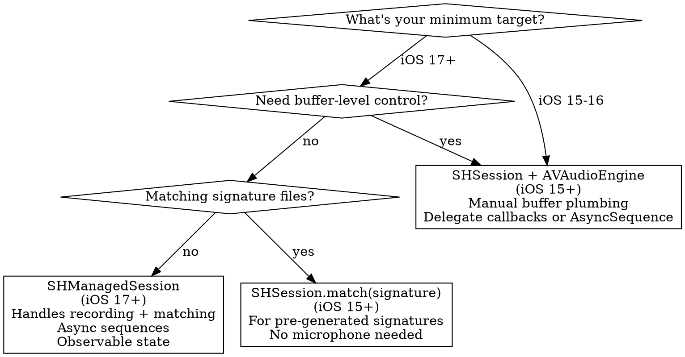
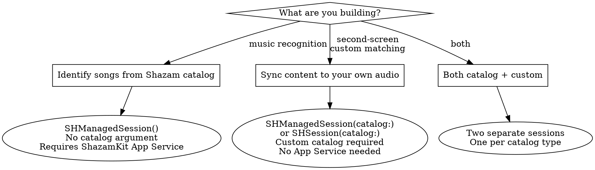

# ShazamKit — Discipline

## Core Philosophy

> "Use SHManagedSession unless you need buffer-level control."

**Mental model**: ShazamKit has two eras. The iOS 15-16 era required manual AVAudioEngine plumbing via `SHSession`. The iOS 17+ era introduced `SHManagedSession` which handles recording, format conversion, and matching in a few lines. Always default to the modern path unless you need custom audio sources or signature-file matching.

## When to Use This Skill

Use this skill when:
- Adding song identification to an app (Shazam catalog matching)
- Building second-screen experiences synced to audio/video
- Creating custom audio catalogs for proprietary content
- Matching prerecorded audio (podcasts, TV episodes, lessons)
- Managing the user's Shazam library (add, read, remove)
- Generating audio signatures from files or buffers
- Debugging recognition failures or entitlement issues

Do NOT use this skill for:
- Sound classification (laughter, applause, speech) — use `SoundAnalysis`/`MLSoundClassifier`
- Audio playback or recording — use **avfoundation-ref**
- MusicKit integration — use MusicKit docs
- General microphone permission patterns — use **privacy-ux**

## Related Skills

- **shazamkit-ref** — Complete ShazamKit API reference (all classes, methods, properties)
- **avfoundation-ref** — Audio engine patterns if using SHSession with custom buffers
- **privacy-ux** — Microphone permission UX best practices
- **swift-concurrency** — Async/await patterns for managed sessions

---

## API Era Decision Tree



---

## Use Case Decision Tree



### Dual-Session Pattern (Both Catalogs)

When you need to match against both the Shazam catalog and a custom catalog simultaneously, run two `SHManagedSession` instances concurrently:

```swift
let shazamSession = SHManagedSession()
let customSession = SHManagedSession(catalog: customCatalog)

// Match both concurrently
async let songResult = shazamSession.result()
async let customResult = customSession.result()

let (song, custom) = await (songResult, customResult)

// Handle whichever matched
switch song {
case .match(let match): handleSongMatch(match)
default: break
}
switch custom {
case .match(let match): handleCustomMatch(match)
default: break
}

// Stop both
shazamSession.cancel()
customSession.cancel()
```

A single session can only target one catalog. Do not try to switch catalogs on a live session — create two sessions and let them share the microphone internally.

---

## Setup Checklist

### For Shazam Catalog Matching

1. **Enable ShazamKit App Service** in Certificates, Identifiers & Profiles:
   - Identifiers → your App ID → App Services tab → check ShazamKit
   - This step is NOT needed for custom catalog matching

2. **Add microphone usage description** to Info.plist:
   ```xml
   <key>NSMicrophoneUsageDescription</key>
   <string>Identifies songs playing nearby</string>
   ```

3. **Import ShazamKit** and create session:
   ```swift
   import ShazamKit
   let session = SHManagedSession()  // Shazam catalog
   ```

### For Custom Catalog Matching

1. **Generate signatures** from your audio content (see Signature Generation below)
2. **Build a custom catalog** with metadata (see Custom Catalogs below)
3. **Bundle the `.shazamcatalog` file** in your app or download at runtime
4. No ShazamKit App Service enablement needed
5. Microphone description still required if capturing from mic

---

## Modern Path: SHManagedSession (iOS 17+)

This is the recommended approach. It handles recording, format conversion, and matching.

### Single Match

```swift
let session = SHManagedSession()

let result = await session.result()

switch result {
case .match(let match):
    let item = match.mediaItems.first
    print("\(item?.title ?? "") by \(item?.artist ?? "")")
case .noMatch(_):
    print("No match found")
case .error(let error, _):
    print("Error: \(error.localizedDescription)")
}
```

### Continuous Matching

```swift
let session = SHManagedSession()

for await result in session.results {
    switch result {
    case .match(let match):
        handleMatch(match)
    case .noMatch(_):
        continue
    case .error(let error, _):
        print("Error: \(error.localizedDescription)")
        continue
    }
}
```

### Preparation for Faster First Match

Call `prepare()` to preallocate resources and start prerecording before the user taps "identify." This reduces perceived latency on the first match.

**When to use `prepare()`:**
- The UI has a visible "identify" button and the user is likely to tap it soon
- You want the first match to feel instant (e.g., music discovery apps)

**When to skip `prepare()`:**
- One-shot recognition triggered by a user action (the latency difference is small)
- Background or automated matching where perceived speed doesn't matter

```swift
let session = SHManagedSession()
await session.prepare()  // Starts prerecording, transitions to .prerecording state

// Later, when user taps "identify":
let result = await session.result()  // Returns faster than without prepare()
```

Calling `prepare()` also triggers the microphone permission prompt if not already granted — useful for requesting permission at a natural moment (e.g., when the recognition screen appears) rather than on first tap.

### Observing Session State in SwiftUI

`SHManagedSession` conforms to `Observable` (iOS 17+), so SwiftUI views update automatically:

```swift
struct MatchView: View {
    let session: SHManagedSession

    var body: some View {
        VStack {
            Text(session.state == .idle ? "Hear Music?" : "Matching")
            if session.state == .matching {
                ProgressView()
            } else {
                Button("Identify Song") {
                    Task { await startMatching() }
                }
            }
        }
    }
}
```

Three states: `.idle`, `.prerecording`, `.matching`.

### Stopping

```swift
session.cancel()  // Stops recording and cancels current match attempt
```

### With Custom Catalog

```swift
let catalog = SHCustomCatalog()
try catalog.add(from: catalogURL)
let session = SHManagedSession(catalog: catalog)
```

---

## Legacy Path: SHSession + AVAudioEngine (iOS 15+)

Use when targeting iOS 15-16, needing buffer-level control, or matching pre-generated signatures.

### Microphone Matching with SHSession

```swift
import ShazamKit
import AVFAudio

class AudioMatcher: NSObject, SHSessionDelegate {
    private let session = SHSession()
    private let audioEngine = AVAudioEngine()

    func startMatching() throws {
        session.delegate = self

        let audioFormat = AVAudioFormat(
            standardFormatWithSampleRate: audioEngine.inputNode.outputFormat(forBus: 0).sampleRate,
            channels: 1
        )

        audioEngine.inputNode.installTap(onBus: 0, bufferSize: 2048, format: audioFormat) {
            [weak self] buffer, audioTime in
            self?.session.matchStreamingBuffer(buffer, at: audioTime)
        }

        try AVAudioSession.sharedInstance().setCategory(.record)
        try audioEngine.start()
    }

    func stopMatching() {
        audioEngine.stop()
        audioEngine.inputNode.removeTap(onBus: 0)
    }

    // MARK: - SHSessionDelegate

    func session(_ session: SHSession, didFind match: SHMatch) {
        guard let item = match.mediaItems.first else { return }
        // Handle match: item.title, item.artist, item.artworkURL
    }

    func session(_ session: SHSession, didNotFindMatchFor signature: SHSignature, error: (any Error)?) {
        // Handle no match or error
    }
}
```

### AsyncSequence Alternative (iOS 16+)

```swift
// Instead of delegate, use async sequence:
for await case .match(let match) in session.results {
    handleMatch(match)
}
```

### Matching a Pre-Generated Signature

```swift
let session = SHSession()  // or SHSession(catalog: customCatalog)
let signatureData = try Data(contentsOf: signatureURL)
let signature = try SHSignature(dataRepresentation: signatureData)
session.match(signature)
```

---

## Custom Catalogs

### When to Use Custom Catalogs

- Second-screen experiences (sync app content to video/audio playback)
- Education apps (trigger activities synced to lessons)
- Podcast companions (show notes timed to audio)
- Media apps that need to recognize their own content

### Building a Catalog Programmatically

```swift
let catalog = SHCustomCatalog()

// Create signature from audio
let generator = SHSignatureGenerator()
let signature = try await generator.signature(from: avAsset)

// Create metadata
let mediaItem = SHMediaItem(properties: [
    .title: "Episode 3: Count on Me",
    .subtitle: "FoodMath Series",
    .artist: "FoodMath",
    .timeRanges: [14.0..<31.0, 45.0..<60.0]  // Timed content
])

// Add to catalog
try catalog.addReferenceSignature(signature, representing: [mediaItem])

// Save to disk
try catalog.write(to: catalogURL)
```

### Building at Scale with Shazam CLI (macOS 13+)

```bash
# Generate signature from media file
shazam signature --input video.mp4 --output video.shazamsignature

# Create catalog from signature + CSV metadata
shazam custom-catalog create --input video.shazamsignature --media-items metadata.csv --output catalog.shazamcatalog

# Update existing catalog with new content
shazam custom-catalog update --input newvideo.shazamsignature --media-items newmeta.csv --catalog catalog.shazamcatalog

# Display catalog contents
shazam custom-catalog display --catalog catalog.shazamcatalog
```

CSV format maps headers to `SHMediaItemProperty` keys. Run `shazam custom-catalog create --help` for the full mapping.

### Timed Media Items (iOS 16+)

Associate metadata with specific time ranges in your audio. ShazamKit delivers match callbacks synced to time range boundaries.

```swift
let mediaItem = SHMediaItem(properties: [
    .title: "Chapter 1: Introduction",
    .timeRanges: [0.0..<30.0]  // Active for first 30 seconds
])

// Media items with multiple time ranges (e.g., recurring chorus)
let chorusItem = SHMediaItem(properties: [
    .title: "Chorus",
    .timeRanges: [60.0..<90.0, 180.0..<210.0, 300.0..<330.0]
])
```

**Return rules**:
1. Media items outside their time range are NOT returned
2. Media items within range are returned, most recent first
3. Media items with no time ranges are always returned last (global metadata)
4. If all items have time ranges and none are in scope, a basic match with `predictedCurrentMatchOffset` is returned

### Frequency Skew (Differentiating Similar Audio)

When multiple assets share similar audio (e.g., TV episodes with same intro):

```swift
let mediaItem = SHMediaItem(properties: [
    .title: "Episode 2",
    .frequencySkewRanges: [0.03..<0.04]  // 3-4% skew
])
```

Keep skew under 5% — noticeable to ShazamKit but inaudible to humans.

### Combining Catalogs

```swift
let parentCatalog = SHCustomCatalog()
try parentCatalog.add(from: episode1URL)
try parentCatalog.add(from: episode2URL)
try parentCatalog.add(from: episode3URL)
```

**Best practice**: Keep catalog files focused (per track or album, not entire discography). Combine at runtime as needed.

---

## Shazam Library

### SHLibrary (iOS 17+) — Preferred

Read, add, and remove items from the user's synced Shazam library. Your app can only read and delete items it has added.

```swift
// Add recognized song
try await SHLibrary.default.addItems([matchedMediaItem])

// Read (only items your app added)
let items = SHLibrary.default.items

// Remove
try await SHLibrary.default.removeItems([mediaItem])
```

`SHLibrary` conforms to `Observable` — SwiftUI views update automatically:

```swift
List(SHLibrary.default.items) { item in
    MediaItemView(item: item)
}
```

### SHMediaLibrary (iOS 15+) — Legacy

```swift
SHMediaLibrary.default.add([matchedMediaItem]) { error in
    if let error { print("Error: \(error)") }
}
```

- Only accepts items matching songs in the Shazam catalog (must have valid Shazam ID)
- Write-only — no read or delete capability
- No special permission required, but inform users before writing
- Items synced across devices via iCloud, attributed to your app
- End-to-end encrypted, requires two-factor authentication

---

## Signature Generation

### From AVAsset (iOS 16+, Preferred)

```swift
let asset = AVURLAsset(url: audioFileURL)
let generator = SHSignatureGenerator()
let signature = try await generator.signature(from: asset)
```

Accepts any `AVAsset` with an audio track (`AVURLAsset` is the concrete subclass — `AVAsset(url:)` is deprecated for Swift since iOS 18). Multiple tracks are mixed automatically.

### From Audio Buffers (iOS 15+)

```swift
let generator = SHSignatureGenerator()
// In your audio engine tap:
try generator.append(buffer, at: audioTime)
// When done:
let signature = generator.signature()
```

Audio must be PCM format. iOS 17+ supports most PCM format settings and sample rates with automatic conversion. iOS 15-16 requires specific sample rates.

### Saving and Loading Signatures

```swift
// Save
let data = signature.dataRepresentation
try data.write(to: signatureFileURL)

// Load
let data = try Data(contentsOf: signatureFileURL)
let signature = try SHSignature(dataRepresentation: data)
```

File extension: `.shazamsignature`

---

## Common Anti-Patterns

### NEVER create many small signatures for one piece of media

```swift
// WRONG — splits audio into segments
for segment in audioSegments {
    let sig = try await generator.signature(from: segment)
    try catalog.addReferenceSignature(sig, representing: [mediaItem])
}
```

```swift
// RIGHT — one signature per media asset, use timed media items
let sig = try await generator.signature(from: fullAsset)
let items = timeRanges.map { range in
    SHMediaItem(properties: [.title: range.title, .timeRanges: [range.interval]])
}
try catalog.addReferenceSignature(sig, representing: items)
```

One signature per asset gives better accuracy and avoids query signatures overlapping reference boundaries.

### NEVER use SHSession for simple microphone matching on iOS 17+

```swift
// WRONG — 30+ lines of AVAudioEngine boilerplate
let audioEngine = AVAudioEngine()
let session = SHSession()
session.delegate = self
let format = AVAudioFormat(standardFormatWithSampleRate: audioEngine.inputNode.outputFormat(forBus: 0).sampleRate, channels: 1)
audioEngine.inputNode.installTap(onBus: 0, bufferSize: 2048, format: format) { buffer, time in
    session.matchStreamingBuffer(buffer, at: time)
}
try audioEngine.start()

// RIGHT — 3 lines with SHManagedSession
let session = SHManagedSession()
let result = await session.result()
session.cancel()
```

### NEVER write to library without user awareness

```swift
// WRONG — silently adds to Shazam library
try await SHLibrary.default.addItems([item])

// RIGHT — let user opt in
if userWantsToSave {
    try await SHLibrary.default.addItems([item])
}
```

All saved songs are attributed to your app in the user's Shazam library.

### NEVER keep the microphone recording after getting results

```swift
// WRONG — keeps recording after match
case .match(let match):
    handleMatch(match)
    // session still recording...

// RIGHT — stop immediately after getting result
case .match(let match):
    session.cancel()
    handleMatch(match)
```

### NEVER forget the ShazamKit App Service for catalog matching

Custom catalogs don't need it, but Shazam catalog matching silently fails without it. If matching returns no results for clearly identifiable songs, check:
1. ShazamKit App Service enabled in Certificates, Identifiers & Profiles
2. App ID matches your entitlements
3. Provisioning profile regenerated after enabling

---

## Pressure Scenarios

### Scenario 1: "We already have the SHSession delegate code working"

**Pressure**: Sunk cost — team has existing SHSession + AVAudioEngine implementation, iOS 17+ is the minimum target.

**Why resist**: SHManagedSession eliminates 30+ lines of AVAudioEngine boilerplate, handles format conversion automatically, conforms to Observable for SwiftUI, and supports AirPod audio recognition. The delegate code is maintenance burden, not an asset.

**Response**: "The existing code works, but SHManagedSession is a net deletion of complexity. The migration is straightforward — replace SHSession with SHManagedSession, delete the audio engine setup, delete the delegate, use async sequences instead. The result is fewer bugs and less code to maintain."

### Scenario 2: "We'll enable the ShazamKit App Service later"

**Pressure**: Deadline — developer skips App Service enablement during prototyping, plans to add it before release.

**Why resist**: Shazam catalog matching silently returns no results without the App Service. The developer will spend 30+ minutes debugging "why isn't it matching?" when the fix is a 2-minute configuration step. Custom catalog matching works without it, creating false confidence that the setup is correct.

**Response**: "Enable the App Service now. It takes 2 minutes in Certificates, Identifiers & Profiles. Skipping it means your Shazam catalog matching will silently fail with no error message, and you'll waste debugging time on a configuration issue."

---

## Provisioning Troubleshooting

| Symptom | Cause | Fix |
|---------|-------|-----|
| No matches from Shazam catalog | App Service not enabled | Enable ShazamKit in App ID → App Services |
| "The operation couldn't be completed" | Missing entitlement | Regenerate provisioning profile after enabling App Service |
| Custom catalog works, Shazam catalog doesn't | App Service vs custom confusion | App Service only needed for Shazam catalog |
| Works in debug, fails in release | Profile mismatch | Ensure release profile also has ShazamKit enabled |

---

## Platform Support

| Feature | iOS | iPadOS | macOS | tvOS | watchOS | visionOS |
|---------|-----|--------|-------|------|---------|----------|
| SHSession | 15+ | 15+ | 12+ | 15+ | 8+ | 1+ |
| SHManagedSession | 17+ | 17+ | 14+ | 17+ | 10+ | 1+ |
| SHCustomCatalog | 15+ | 15+ | 12+ | 15+ | 8+ | 1+ |
| SHLibrary | 17+ | 17+ | 14+ | 17+ | 10+ | 1+ |
| SHMediaLibrary | 15+ | 15+ | 12+ | 15+ | 8+ | 1+ |
| Shazam CLI | — | — | 13+ | — | — | — |
| signatureFromAsset | 16+ | 16+ | 13+ | 16+ | 9+ | 1+ |
| Timed media items | 16+ | 16+ | 13+ | 16+ | 9+ | 1+ |
| SHManagedSession Sendable | 18+ | 18+ | 15+ | 18+ | 11+ | 2+ |

---

## HIG Guidance

Supported use cases per Apple HIG:
- Enhancing experiences with graphics that correspond to the genre of currently playing music
- Making media content accessible (closed captions or sign language synced with audio)
- Synchronizing in-app experiences with virtual content (online learning, retail)

**Best practices** (verbatim from HIG):

- **Stop recording as soon as possible.** "When people allow your app to record audio for recognition, they don't expect the microphone to stay on. To help preserve privacy, only record for as long as it takes to get the sample you need."
- **Let people opt in to storing recognized songs to iCloud.** "If your app can store recognized songs to iCloud, give people a way to first approve this action. Even though both the Music Recognition control and the Shazam app show your app as the source of the recognized song, people appreciate having control over which apps can store content in their library."
- **Show Apple Music attribution** when displaying matched song details (required by Apple Music Identity Guidelines)

---

## Resources

**WWDC**: 2021-10044, 2021-10045, 2022-10028, 2023-10051

**Docs**: /shazamkit, /shazamkit/shmanagedsession, /shazamkit/shsession, /shazamkit/shcustomcatalog

**Skills**: shazamkit-ref, avfoundation-ref, privacy-ux, swift-concurrency
