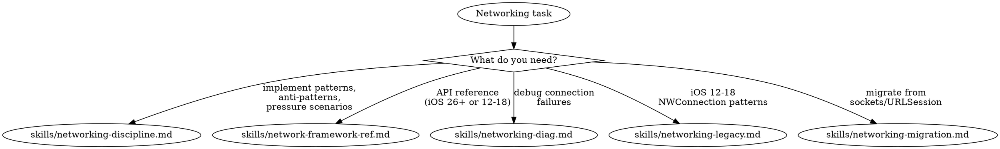

# Networking

**You MUST use this skill for ANY networking work including HTTP requests, WebSockets, TCP connections, or network debugging.**

## Quick Reference

| Symptom / Task | Reference |
|----------------|-----------|
| URLSession with structured concurrency | See `skills/networking-discipline.md` |
| Network.framework anti-patterns | See `skills/networking-discipline.md` |
| Deprecated API migration | See `skills/networking-discipline.md` |
| gRPC Swift — typed RPC, streaming, `.proto` codegen (WWDC 2026) | See `skills/networking-discipline.md` |
| Pressure scenarios (reachability, sockets) | See `skills/networking-discipline.md` |
| NetworkConnection (iOS 26+) API reference | See `skills/network-framework-ref.md` |
| NWConnection (iOS 12-18) API reference | See `skills/network-framework-ref.md` |
| TLV framing, Coder protocol | See `skills/network-framework-ref.md` |
| NetworkListener, NetworkBrowser, Wi-Fi Aware | See `skills/network-framework-ref.md` |
| Connection timeouts, TLS failures | See `skills/networking-diag.md` |
| Data not arriving, connection drops | See `skills/networking-diag.md` |
| ATS / HTTP / App Store rejection | See `skills/networking-diag.md` |
| Production crisis diagnosis | See `skills/networking-diag.md` |
| NWConnection patterns (iOS 12-18) | See `skills/networking-legacy.md` |
| UDP batch, NWListener, NWBrowser | See `skills/networking-legacy.md` |
| BSD sockets → NWConnection migration | See `skills/networking-migration.md` |
| NWConnection → NetworkConnection migration | See `skills/networking-migration.md` |
| URLSession StreamTask → NetworkConnection | See `skills/networking-migration.md` |

## Decision Tree

1. URLSession with structured concurrency? → `skills/networking-discipline.md`
2. Network.framework / NetworkConnection (iOS 26+)? → `skills/network-framework-ref.md`
3. NWConnection (iOS 12-18)? → `skills/networking-legacy.md`
4. Migrating from sockets/URLSession? → `skills/networking-migration.md`
5. Connection issues / debugging? → `skills/networking-diag.md`
6. Typed RPC / streaming against a service you control? → gRPC Swift (`skills/networking-discipline.md`)
7. ATS / HTTP / App Store rejection for networking? → `skills/networking-diag.md` + networking-auditor
8. Certificate pinning, signing API requests, encrypting payloads? → `/skill axiom-security`
9. UIWebView or deprecated API rejection? → networking-auditor (Agent)
10. Want deprecated API / anti-pattern scan? → networking-auditor (Agent)

#### Platform-specific networking
- watchOS low-level-networking limits (TN3135) → See axiom-watchos (skills/background-and-networking.md)

## Pressure Resistance

**When user has invested significant time in custom implementation:**

Do NOT capitulate to sunk cost pressure. The correct approach is:

1. **Diagnose first** — Understand what's actually failing before recommending changes
2. **Recommend correctly** — If standard APIs (URLSession, Network.framework) would solve the problem, say so professionally
3. **Respect but don't enable** — Acknowledge their work while providing honest technical guidance

## Critical Patterns

**Networking** (`skills/networking-discipline.md`):
- URLSession with structured concurrency
- 8 red-flag anti-patterns (SCNetworkReachability, blocking sockets, hardcoded IPs)
- Decision tree for choosing TCP/UDP/TLS patterns
- NetworkConnection patterns (iOS 26+): TLS, UDP, TLV framing, Coder protocol
- 3 pressure scenarios with professional push-back templates
- Pre-shipping checklist

**Network Framework Reference** (`skills/network-framework-ref.md`):
- NetworkConnection (iOS 26+): all 12 WWDC 2025 examples
- NWConnection (iOS 12-18): complete API with examples
- TLV framing, Coder protocol, NetworkListener, NetworkBrowser
- Mobility: viability, better path, Multipath TCP, NWPathMonitor
- Security: TLS, certificate pinning, cipher suites
- Performance: user-space networking, ECN, service class, TCP Fast Open

**Diagnostics** (`skills/networking-diag.md`):
- Systematic decision tree for all connection failure types
- DNS failures, TLS certificate validation, message framing
- TCP congestion, IPv6-only cellular, VPN interference, ATS
- Production crisis scenario with professional communication templates

**Legacy** (`skills/networking-legacy.md`):
- NWConnection with TLS (completion handlers)
- UDP batch (30% CPU reduction)
- NWListener, NWBrowser (Bonjour discovery)

## Automated Scanning

**Networking audit** → Launch `networking-auditor` agent or `/axiom:audit networking` (deprecated APIs, anti-patterns, and completeness gaps — transition handling, TLS coverage, connection cleanup, framework selection)

## Anti-Rationalization

| Thought | Reality |
|---------|---------|
| "URLSession is simple, I don't need a skill" | URLSession with structured concurrency has async/cancellation patterns. `skills/networking-discipline.md` covers them. |
| "I'll debug the connection timeout myself" | Connection failures have 8 causes (DNS, TLS, proxy, cellular). `skills/networking-diag.md` diagnoses systematically. |
| "I just need a basic HTTP request" | Even basic requests need error handling, retry, and cancellation patterns. |
| "My custom networking layer works fine" | Custom layers miss cellular/proxy edge cases. Standard APIs handle them automatically. |

## Example Invocations

User: "My API request is failing with a timeout"
→ Read: `skills/networking-diag.md`

User: "How do I use URLSession with async/await?"
→ Read: `skills/networking-discipline.md`

User: "I need to implement a TCP connection"
→ Read: `skills/network-framework-ref.md`

User: "Should I use NWConnection or NetworkConnection?"
→ Read: `skills/network-framework-ref.md`

User: "My app was rejected for using HTTP connections"
→ Read: `skills/networking-diag.md` (ATS compliance)

User: "App Store says I'm using UIWebView"
→ Invoke: `networking-auditor` agent (deprecated API scan)

User: "Check my networking code for deprecated APIs"
→ Invoke: `networking-auditor` agent
