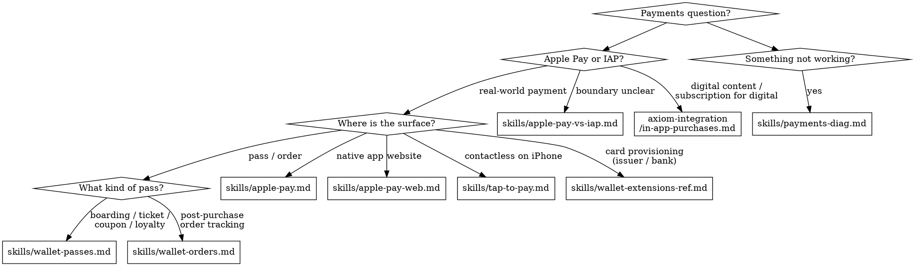

# Real-World Payments (Apple Pay / Wallet / Tap to Pay)

**You MUST use this skill when accepting ANY real-world payment — physical goods, services, donations, ticketing, loyalty cards, contactless card-present, or post-purchase order tracking. NOT for in-app purchase or digital content.**

## When to Use

Use this skill when you encounter:
- Adding Apple Pay to an iOS / iPadOS / macOS / Catalyst / visionOS / watchOS app
- Adding Apple Pay to a website (Apple Pay JS or W3C Payment Request API)
- Building Wallet passes (boarding passes, event tickets, coupons, loyalty cards, store cards)
- Accepting contactless card payments on iPhone (Tap to Pay on iPhone / ProximityReader)
- Surfacing post-purchase order tracking in Wallet (Orders in Wallet, FinanceKitUI add-order helpers)
- Issuer or bank card provisioning into Wallet (issuer extensions)
- Apple Pay merchant ID, processing certificate, or merchant identity certificate setup
- Pass Type ID or Order Type ID certificates and PKCS #7 signing chains
- Tap to Pay managed entitlement (`com.apple.developer.proximity-reader.payment.acceptance`)
- App Review rejections that mention payments, IAP, Apple Pay, Wallet, or Acceptable Use Guidelines
- Domain verification for Apple Pay on the web (`.well-known/apple-developer-merchantid-domain-association.txt`)
- Sandbox testing with Apple Pay sandbox cards or sandbox tester accounts

## When NOT to Use

| Issue | Correct Skill | Why NOT axiom-payments |
|-------|---------------|------------------------|
| In-app purchase, subscriptions for digital content | **axiom-integration** | StoreKit 2 / digital goods boundary; see `axiom-integration (skills/in-app-purchases.md)` |
| Generic NFC tag reads (Core NFC, non-Wallet) | **axiom-integration** | Different framework; PassKit NFC is Wallet-specific |
| Code signing / provisioning fundamentals | **axiom-security** | Code signing is generic; payment certs are *added* to that flow |
| App Store rejection workflow & appeals | **axiom-shipping** | Rejection workflow lives there; payment-specific rejection patterns route from there into here |
| HIG cross-cutting design guidance | **axiom-design** | Apple Pay / Wallet HIG specifics live here, but design overview lives in axiom-design |
| Consumer banking surface (FinanceKit) | *Out of scope* | This suite uses FinanceKitUI only for Orders. Account aggregation / transaction queries are not covered. |
| PKSecureElementPass, transit cards, car keys | *Out of scope* | Issuer-controlled, not relevant to merchant developers |

## Quick Reference

| Symptom / Task | Reference |
|----------------|-----------|
| Should this be Apple Pay or IAP? | See `skills/apple-pay-vs-iap.md` |
| Selling physical goods, services, or donations | See `skills/apple-pay-vs-iap.md` |
| App was rejected for using IAP for physical goods | See `skills/apple-pay-vs-iap.md` |
| Native Apple Pay (iOS / iPadOS / macOS / Catalyst / visionOS / watchOS) | See `skills/apple-pay.md` |
| PassKit / PKPaymentRequest API surface | See `skills/apple-pay-ref.md` |
| Apple Pay on the web (Apple Pay JS or Payment Request API) | See `skills/apple-pay-web.md` |
| Web ApplePaySession / Payment Request API surface | See `skills/apple-pay-web-ref.md` |
| Domain verification, merchant identity cert, third-party browser support | See `skills/apple-pay-web.md` |
| Tap to Pay on iPhone (ProximityReader) | See `skills/tap-to-pay.md` |
| ProximityReader / PaymentCardReader API surface | See `skills/tap-to-pay-ref.md` |
| Tap to Pay entitlement stuck in "Submitted" | See `skills/tap-to-pay.md` |
| Wallet passes (boarding, event ticket, coupon, loyalty, store card) | See `skills/wallet-passes.md` |
| pass.json schema, semantic tags, barcodes, NFC payloads | See `skills/wallet-passes-ref.md` |
| Poster generic style, featured actions, new barcode types `OS27` | See `skills/wallet-passes-ref.md` |
| Pass Designer app, Pass Builder server package | See `skills/wallet-passes-ref.md` |
| Customer engagement on a paired device (CustomerEngagementSession) `OS27` | See `skills/tap-to-pay-ref.md` |
| Pass signing, manifest hashing, PKCS #7 | See `skills/wallet-passes.md` |
| Pass updates not arriving (web service / APNs) | See `skills/wallet-passes.md` |
| Orders in Wallet, signed order packages, fulfillment status | See `skills/wallet-orders.md` |
| Issuer / bank card provisioning extensions | See `skills/wallet-extensions-ref.md` |
| "No payment sheet appears" / merchant validation 503 / pass won't import | See `skills/payments-diag.md` |
| Sandbox testing failures, prod-vs-sandbox cert mismatch | See `skills/payments-diag.md` |
| Apple Pay button vs Apple Pay Mark confusion | See `skills/apple-pay.md` |
| App Review rejection for Apple Pay / Wallet / Tap to Pay | See `skills/payments-diag.md` |

## Decision Tree

Simplified routing:

1. Is this a digital good or subscription for digital content? → **Use `axiom-integration/skills/in-app-purchases.md` instead.**
2. Selling physical goods / services / donations, or unsure? → `skills/apple-pay-vs-iap.md`
3. Native Apple Pay (iOS / iPadOS / macOS / Catalyst / visionOS / watchOS)? → `skills/apple-pay.md` + `skills/apple-pay-ref.md`
4. Apple Pay on the web? → `skills/apple-pay-web.md` + `skills/apple-pay-web-ref.md`
5. Tap to Pay on iPhone (ProximityReader)? → `skills/tap-to-pay.md` + `skills/tap-to-pay-ref.md`
6. Wallet passes (ticket / coupon / loyalty / store card)? → `skills/wallet-passes.md` + `skills/wallet-passes-ref.md`
7. Orders in Wallet (post-purchase tracking)? → `skills/wallet-orders.md`
8. Issuer / bank card provisioning? → `skills/wallet-extensions-ref.md`
9. Something not working (no sheet / merchant validation fails / pass won't import / Tap to Pay never enables)? → `skills/payments-diag.md`

## Cross-Suite Routing

**Apple Pay vs IAP boundary** (the most common cross-suite question):
- Selling physical goods, services, or donations → **stay here** (`skills/apple-pay-vs-iap.md`)
- Selling digital content, premium app features, subscriptions for digital content → **use axiom-integration** (`skills/in-app-purchases.md`)
- App was rejected for using the wrong one → `skills/apple-pay-vs-iap.md` then `skills/payments-diag.md`

**Payments + App Review rejection**:
- Rejection cites Section 3.1 / 3.2 / Apple Pay AUG → **stay here** (`skills/payments-diag.md`) for the root cause; **also invoke axiom-shipping** (`skills/app-store-diag.md`) for appeal workflow

**Payments + cert management**:
- Merchant Identity Certificate, Pass Type ID Certificate, Order Type ID Certificate, Payment Processing Certificate — operational discipline → **stay here**
- Generic Keychain export / `.p12` mechanics → **also invoke axiom-security** (`skills/keychain-ref.md`)
- Tap to Pay managed entitlement → **stay here** (`skills/tap-to-pay.md`); generic managed-capability mental model → axiom-security (`skills/code-signing.md`)

**Payments + Xcode capability / provisioning**:
- Apple Pay capability checkbox in Xcode, merchant ID selection, Tap to Pay entitlement plumbing in the provisioning profile → **also invoke axiom-build** for capability/profile mechanics; payment-specific guidance stays here

**Payments + HIG**:
- Apple Pay button vs Apple Pay Mark, Wallet pass design specs, Tap to Pay button label → **stay here**
- Cross-cutting design context → **also invoke axiom-design** (`skills/hig.md`)

**Payments + Catalyst / macOS**:
- Apple Pay on Mac and Catalyst (window requirement, web security model, static merchant validation URL) → **stay here** (`skills/apple-pay.md` Catalyst section)
- Generic Catalyst patterns → axiom-macos

**Payments + Apple Watch**:
- WKInterfacePaymentButton, watchOS payment delegate flow → **stay here** (`skills/apple-pay-ref.md` watchOS section)
- Generic watchOS patterns → axiom-watchos

## Anti-Rationalization

| Thought | Reality |
|---------|---------|
| "We sell physical stuff but we'll use IAP — easier integration" | Guaranteed App Review rejection (Section 3.1.1 / 3.1.3(e)). Use Apple Pay for physical goods, services, donations. |
| "Our app is digital content, we'll use Apple Pay because IAP fees are higher" | Guaranteed App Review rejection. Digital content + subscriptions for digital content must use IAP. |
| "I'll just embed our PSP's raw card form on the web — it's faster" | Acceptable Use Guidelines violate parity rule. If you accept any other payment method on the web, you must offer Apple Pay at least as prominently. |
| "Tap to Pay just needs a capability checkbox like other features" | Tap to Pay uses a managed entitlement requested via a separate form. The Xcode capability flow doesn't apply. Two-step request (dev → distribution); rejection or "Submitted" stalls add 1–4 weeks per loop. |
| "We'll roll our own pass signing — it's just zip + sign" | PKCS #7 detached signature, manifest hashing, WWDR Intermediate cert, S/MIME signing-time, PEM/DER format gotchas — most signing failures originate from rolled-from-scratch implementations. Use a server library. |
| "The Apple Pay Mark is just a button graphic" | The Mark is "Apple Pay accepted" signage — never tappable. The Button is API-provided and initiates payment. Using the Mark as a button is an HIG violation and a known conversion killer. |
| "Production cards will work the same as sandbox cards" | Sandbox transactions decline pre-fulfillment by design. Production transactions need production keys + activated certs. Test on real devices with real cards before launch. |
| "Apple Pay merchant ID expires every year" | Merchant IDs never expire. Payment Processing Certificates expire after 25 months. These are different things. |
| "I can call merchant validation from the browser" | The browser must never call `paymentSession`. Server-only call using two-way TLS with the merchant identity cert. Calling from the browser leaks the cert. |
| "FinanceKit will let our app see the user's bank transactions" | Out of scope for this suite. FinanceKit consumer banking surface is not covered. We use FinanceKitUI only for the order-add helpers. |

## Out of Scope

This suite intentionally does **not** cover:

- **In-App Purchase (StoreKit 2)** — Use `axiom-integration/skills/in-app-purchases.md` and `axiom-integration/skills/storekit-ref.md`. The boundary rule lives in `skills/apple-pay-vs-iap.md`.
- **FinanceKit consumer banking** (account aggregation, transaction queries) — not covered. We only use FinanceKitUI for order-add buttons.
- **PKSecureElementPass, transit cards, car keys** — issuer-controlled Wallet surfaces, not merchant-developer territory.
- **Tap to Present ID (`MobileDocumentReader`)** — uses ProximityReader but for identity verification, not payment. Brief cross-ref appears in `skills/tap-to-pay-ref.md`; identity-verification UX as a whole is axiom-integration territory if it lands anywhere.
- **Generic NFC reads (Core NFC)** — different framework. PassKit NFC is Wallet-specific (loyalty / contactless ticket / boarding).

## Example Invocations

User: "Should I use Apple Pay or IAP for my hotel-booking app?"
→ See `skills/apple-pay-vs-iap.md`

User: "How do I set up Apple Pay in my iOS app?"
→ See `skills/apple-pay.md`

User: "What's the structure of PKPaymentRequest?"
→ See `skills/apple-pay-ref.md`

User: "Apple Pay on my website doesn't show the button in Chrome"
→ See `skills/apple-pay-web.md`

User: "Domain verification keeps failing"
→ See `skills/payments-diag.md`

User: "I want to add Tap to Pay on iPhone to my point-of-sale app"
→ See `skills/tap-to-pay.md`

User: "My Tap to Pay entitlement has been Submitted for two weeks"
→ See `skills/tap-to-pay.md` and `skills/payments-diag.md`

User: "How do I build a Wallet pass for my event tickets?"
→ See `skills/wallet-passes.md`

User: "My .pkpass file won't import — Wallet says invalid"
→ See `skills/payments-diag.md`

User: "I want order tracking to appear in Wallet after Apple Pay checkout"
→ See `skills/wallet-orders.md`

User: "App Review rejected my app for using IAP for restaurant delivery"
→ See `skills/apple-pay-vs-iap.md` then `skills/payments-diag.md`

User: "How does Apple Pay differ from In-App Purchase?"
→ See `skills/apple-pay-vs-iap.md`

User: "Implementing card provisioning for our bank's iOS app"
→ See `skills/wallet-extensions-ref.md`

## Resources

**WWDC**: 2020-10662, 2021-10092, 2022-10041, 2023-10114, 2024-10108

**Tech Talks**: 111381 (Apple Pay on the Web), 110336 (Implementing Apple Pay Orders)

**MIG**: Apple Pay Merchant Integration Guide (2026 edition) — operational spine, cited throughout this suite

**Docs**: /passkit, /applepayontheweb, /proximityreader, /walletpasses, /design/human-interface-guidelines/apple-pay, /design/human-interface-guidelines/wallet, /apple-pay/acceptable-use-guidelines-for-websites

**App Review**: Section 3.1 (In-App Purchase), Section 3.1.3(e) (Goods and Services Outside of the App), Section 3.2 (Other Business Model Issues), Section 4.9 (Apple Pay)

**Skills**: axiom-integration (in-app-purchases, storekit-ref), axiom-shipping (app-store-diag, app-review-guidelines), axiom-security (keychain-ref, code-signing), axiom-design (hig, hig-ref), axiom-macos
