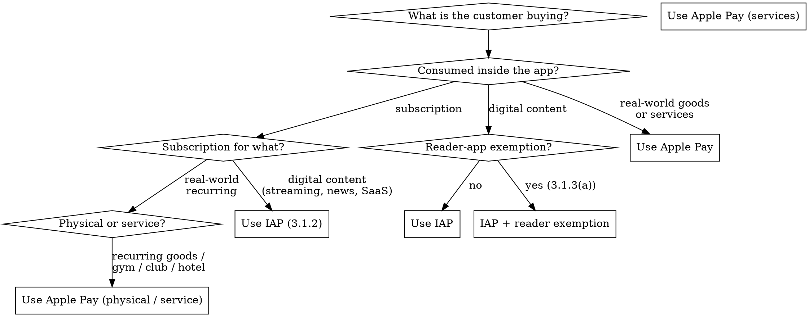

# Apple Pay vs In-App Purchase — The Boundary

**You MUST resolve this boundary before writing any payment code.** Picking the wrong one is a guaranteed App Store rejection — App Review enforces this in both directions.

## The Rule (Apple-canonical wording)

From the **Apple Pay HIG** and the **Apple Pay Merchant Integration Guide** p.4 (identical wording, both Apple-controlled):

> Use Apple Pay in your app to sell **physical goods** like groceries, clothing, and appliances; for **services** such as club memberships, hotel reservations, and tickets for events; and for **donations**. Use In-App Purchase to sell **virtual goods**, such as premium content for your app, and **subscriptions for digital content**.

That paragraph is the entire decision in one sentence. Everything below is applying it to specific cases.

The App Review Guidelines codify it in Section 3.1.1 (IAP is required to "unlock features or functionality within your app" — premium content, subscriptions, in-game currency, full-version unlocks) and Section 3.1.3(e) (goods and services that will be **consumed outside of the app** must use other purchase methods such as Apple Pay or traditional credit card entry, not IAP).

Treat the "consumed inside vs outside the app" framing throughout this skill as a heuristic that matches §3.1.1 + §3.1.3(e) in 95%+ of cases — but when in doubt, the canonical wording is the one cited in §3.1.1 ("unlock features or functionality within your app").

## Decision Tree

Three short-circuit answers cover ~95% of cases:

1. **Selling something the customer touches or experiences in the real world** (groceries, hotel, gym membership, event ticket, ride, food delivery, donation) → **Apple Pay**.
2. **Selling something that exists only inside your app or another digital experience** (premium features, extra levels, in-game currency, streaming subscription, news subscription, cloud storage) → **In-App Purchase**.
3. **Recurring revenue** → use the type of subscription that matches the underlying product. Digital subscription → IAP §3.1.2. Physical/service subscription (e.g. monthly meal kit, gym auto-renew) → Apple Pay (typically `PKRecurringPaymentRequest`).

## Concrete Category Mapping

| Category | Use | App Review reference |
|----------|-----|----------------------|
| Groceries, clothing, appliances, electronics | Apple Pay | 3.1.3(e) |
| Restaurant order, food delivery, grocery delivery | Apple Pay | 3.1.3(e) |
| Hotel booking, vacation rental, flight, train | Apple Pay | 3.1.3(e) |
| Event ticket (concert, sports, theatre) | Apple Pay | 3.1.3(e) |
| Parking, transit, tolls | Apple Pay | 3.1.3(e) |
| Gym, club, professional association membership | Apple Pay | 3.1.3(e) |
| Donations to nonprofits | Apple Pay (only by approved nonprofits — see "Donations" below) | 3.2.1(vi), 3.2.2(iv), HIG |
| **One-to-one** real-time person-to-person services (tutoring, telemed, real estate tour, fitness training) | Apple Pay | 3.1.3(d) |
| **One-to-few** or **one-to-many** real-time services (group fitness class, group telemed, classroom tutoring) | IAP | 3.1.3(d) |
| Premium app features, ad removal, themes, additional UI | IAP | 3.1.1 |
| In-game currency, extra levels, character unlocks | IAP | 3.1.1 |
| Streaming media subscription (audio, video) | IAP | 3.1.2 |
| News / magazine subscription | IAP | 3.1.2 |
| Cloud storage, SaaS subscription consumed in app | IAP | 3.1.2 |
| Reader-app account management (existing subscriber) | Out-of-app web link allowed under 3.1.3(a) entitlement | 3.1.3(a) |
| Marketplace where you broker payment between unrelated buyer + merchant | Apple Pay, label "Pay [Merchant] (via [You])" | HIG §"Streamlining checkout" |
| Self-checkout in someone else's physical store | Apple Pay, label both businesses on Pay line | HIG §"Streamlining checkout" |
| Free app companion to paid web service (3.1.3(f)) | No payment in-app | 3.1.3(f) |

The "via" label is required by HIG when you are an intermediary — App Review reads the Pay line and rejects flows where the actual merchant is hidden.

## Donations

Donations have their own narrow rule that often surprises developers:

- **§3.2.1(vi)** — Approved nonprofits may fundraise in their own apps or in third-party apps, **and must offer Apple Pay support**. Apps that broker donations between donors and nonprofits ("nonprofit platforms") must ensure every listed nonprofit has gone through the approval process.
- **§3.2.2(iv)** — If you are **not** an approved nonprofit and **not** otherwise covered by §3.2.1(vi), you **may not collect donations in-app at all**. Such apps must be free on the App Store and may only collect funds outside the app (Safari, SMS).

There is no "donation IAP" path for non-approved fundraisers. The choice is: be an approved nonprofit (then use Apple Pay), or collect outside the app entirely.

## Subscriptions — Pick by Underlying Product

Subscriptions are where developers most often pick the wrong rail.

- **Digital content subscription** (Spotify, Netflix, news, productivity SaaS) → IAP §3.1.2.
- **Physical recurring delivery** (meal kit, contact lenses, coffee subscription) → Apple Pay with `PKRecurringPaymentRequest`. See `apple-pay.md`.
- **Service subscription consumed in the real world** (gym auto-renew, club dues, parking pass, transit pass) → Apple Pay `PKRecurringPaymentRequest`.
- **Hybrid app that sells both** (a fitness app with a digital coaching subscription AND optional physical equipment) → both rails, with each product on the rail that fits it. App Review rejects either side if it's on the wrong rail.

## Web — Acceptable Use Guidelines

The rules above govern apps. Apple Pay on the **web** has a separate set of rules — the **Acceptable Use Guidelines for Apple Pay on the Web** (see Resources). They prohibit Apple Pay on websites that offer:

- Tobacco, marijuana, or vaping products
- Firearms, weapons, or ammunition
- Illegal drugs or non-legally-prescribed controlled substances
- Items that create consumer safety risks
- Items intended to be used to engage in illegal activities
- Pornography
- Counterfeit or stolen goods
- Personal fundraising or collections of nonprofit donations unless approved by Apple
- Sites that primarily offer or sell drug paraphernalia or sexually-oriented items or services
- Promotion of hate, violence, or intolerance based on race, age, gender, gender identity, ethnicity, religion, or sexual orientation
- Purchase or transfer of currency (including cryptocurrencies) unless approved by Apple
- Staged digital wallets (a second transaction conducted to complete the first, or a substitute merchant of record)
- Fraud, IP / publicity / privacy violations, or content showing Apple in a false or derogatory light

Cross-ref the full list in Resources. **AUG enforcement is independent of App Review** — Apple can disable Apple Pay on a website at any time without affecting your app status.

The AUG also enforces a **parity rule**: if any other payment method appears on a page, Apple Pay must appear with at-least-equal prominence on the same page. And if `applePayCapabilities()` indicates an active card is provisioned, Apple Pay must be the **primary** displayed option (not necessarily the sole one). Hiding Apple Pay below other options is the most common AUG violation.

## PSP-Direct (Raw Card Entry) — When Is It Allowed?

| Surface | Selling physical / service / donation | Selling digital content |
|---------|---------------------------------------|-------------------------|
| iOS / iPadOS / macOS / visionOS / watchOS app | **Not allowed for raw-card-only.** App must offer Apple Pay; may additionally offer a PSP-direct PCI form alongside, with Apple Pay shown at least as prominently per HIG ("Offering Apple Pay" — feature Apple Pay at least as prominently on every page or screen that offers payment methods). | **Not allowed at all** — must use IAP. |
| Mac AppKit app | Same as iOS app rules | Same as iOS app rules |
| Catalyst app | Treated as iOS app for App Review purposes | Same as iOS app rules |
| Website (consumer-facing) | Allowed alongside Apple Pay, with parity. Apple Pay required if any other payment method shown. | N/A — IAP doesn't apply to websites. Use whatever PSP supports. |
| Mac AppKit app sold outside Mac App Store | Outside App Review jurisdiction (notarization only, not App Review) | Outside App Review jurisdiction |

**Rule of thumb:** if your app ships through the App Store and accepts payment for physical goods, Apple Pay must be present. Adding a PSP-direct card form *in addition* is fine but doesn't satisfy the requirement.

## Common Rejection Patterns

The patterns below are cited from real App Review rejection reasons (failure corpus tracked in `payments-diag.md`). They map 1:1 to the rule.

| Rejection Reason | Root Cause | Fix |
|------------------|-----------|-----|
| "Your app uses IAP for selling [physical good or service]" | Wrong rail — physical/service products went through IAP | Switch checkout to Apple Pay; resubmit. See `apple-pay.md`. |
| "Your app sells [digital content] using a payment method other than IAP" | Wrong rail — digital content went through Apple Pay or PSP | Switch checkout to IAP. See `axiom-integration/skills/in-app-purchases.md`. |
| "Apple Pay must be at parity with other payment methods" | Web AUG parity violation — Apple Pay shown below or smaller than other options | Promote Apple Pay to at-least-equal prominence on every page that shows payment methods |
| "Custom button mimics or displays Apple Pay branding" | HIG violation — non-API button used "Apple Pay" text or logo | Use the system-provided Apple Pay button API. See `apple-pay.md`. |
| "Apple Pay marked as 'unavailable' inappropriately" | HIG — button greyed out before user interaction | Always show the button; gracefully handle missing requirements after tap |
| "Marketplace transaction obscures the end merchant" | HIG — Pay line shows only the intermediary's name | Use the "Pay [Merchant] (via [You])" format on the Pay line |

For full diagnostic flow on each rejection, see `payments-diag.md` — it maps these to specific code fixes.

## Anti-Rationalization

| Thought | Reality |
|---------|---------|
| "IAP fees are higher, we'll route digital content through Apple Pay" | Guaranteed rejection. The rail is determined by the *product*, not by what you'd prefer to pay Apple. |
| "Apple Pay is 'just credit cards' so it's the safer choice for everything" | Apple Pay is for real-world purchases. Using it for in-app digital content is rejected the same as any non-IAP payment for digital content. |
| "Other apps in my category use IAP for delivery — App Review approved them" | App Review is not bound by past approvals. The rail is defined by 3.1.1 vs 3.1.3(e). Recent enforcement has tightened, not loosened. |
| "We'll mix the two — IAP for premium features, raw card for the physical product" | Allowed, as long as each product is on the correct rail. The bug is using *the wrong rail for the product*, not having both rails. |
| "Donations should obviously use IAP" | No — §3.2.1(vi) requires approved nonprofits to **offer Apple Pay support** when fundraising in-app, and §3.2.2(iv) prohibits non-approved apps from collecting donations in-app at all. There is no IAP donation rail to fall back on; the choice is approved-nonprofit-with-Apple-Pay or no-in-app-collection. |
| "We're a registered 501(c)(3), so we can collect donations in-app via Apple Pay" | IRS 501(c)(3) status is **not** Apple's nonprofit approval. Apple runs its own verification: U.S. nonprofits need a **Candid Seal of Transparency**; non-U.S. nonprofits apply through **Benevity** with their Developer Program Team ID (§3.2.1(vi)). A charity must clear *that* before donations can be collected in-app — even a genuine 501(c)(3) can't until Apple-approved. A commercial app brokering donations to a charity partner must verify the partner has cleared Apple's process, not just confirm their tax status. |
| "We'll just use a PSP-direct card form on web — no Apple Pay needed" | If your site shows any other payment method, Apple Pay is required at parity per AUG. Going PSP-direct without Apple Pay is what gets the site AUG-flagged. |
| "Reader app exemption covers our streaming app, so we don't need IAP" | §3.1.3(a) lets Reader apps offer **account creation for free tiers** and **account management for existing customers**, plus an informational external link via the External Link Account Entitlement. It does **not** authorize any in-app payment rail other than IAP. Reader apps that monetize in-app must use IAP; otherwise, redirect to web for payment. |
| "Our subscription is 'physical' because we mail a sticker once a year" | App Review evaluates the *primary value* of the subscription. A digital service with token physical delivery is still digital. |
| "Crypto purchases work on web with Apple Pay because it's not 'in the app'" | Web AUG explicitly prohibits currency / cryptocurrency without Apple approval. Web jurisdiction cuts both ways. |
| "We're a marketplace, the seller's business name doesn't need to appear on Pay" | HIG explicitly requires "Pay [End_Merchant_Business_Name (via Your_Business_Name)]" when you're an intermediary. Hiding the end merchant is a rejection trigger. |

## Red Flags — STOP and Re-Check

- You picked IAP and the product is consumable in the real world (food, stay, ride, ticket)
- You picked Apple Pay and the product is consumed only inside your app
- You're a marketplace and the Pay line shows only your business
- You're on the web and Apple Pay sits below other payment methods, or is smaller, or is hidden under a "more options" disclosure
- You're using a PSP-direct card form in your iOS app for physical goods *without* Apple Pay alongside it
- You added a custom button that says "Apple Pay" or shows the Apple Pay logo

Each of these is a known rejection trigger. Resolve before submitting.

## Boundary Summary

| You sell… | Surface | Use |
|-----------|---------|-----|
| Physical goods | App | Apple Pay |
| Physical goods | Web | Apple Pay (with PSP-direct allowed alongside, at parity) |
| Real-world services | App or Web | Apple Pay |
| Donations (approved nonprofits only; non-approved apps may not collect in-app) | App or Web | Apple Pay (3.2.1(vi)) |
| Premium app content / in-game items | App | IAP |
| Digital subscription consumed in app | App | IAP §3.1.2 |
| Reader-app subscription (existing customer account management) | App | IAP for in-app monetization; account-management UI + External Link Entitlement allowed under 3.1.3(a) for existing customers / free tiers |
| One-to-one real-time person-to-person service | App | Apple Pay (3.1.3(d)) |
| One-to-few or one-to-many real-time service | App | IAP (3.1.3(d) — exemption is 1:1 only) |
| Hardware-tied feature unlock | App | May skip IAP under 3.1.4 narrow exception; otherwise IAP |

Once the boundary is settled, see `apple-pay.md` (native), `apple-pay-web.md` (web), or `axiom-integration/skills/in-app-purchases.md` (digital).

## Resources

**App Review**: 3.1.1 (IAP requirement), 3.1.2 (Subscriptions), 3.1.3 (Other Purchase Methods, esp. (a) Reader, (d) P2P, (e) Goods Outside the App, (f) Free Stand-alone), 3.1.4 (Hardware-Specific), 3.2 (Other Business Models), 4.9 (Apple Pay)

**MIG**: p.4 ("Apple Pay vs In-App Purchases" guideline box)

**HIG**: /design/human-interface-guidelines/apple-pay (the Tip box)

**Docs**: /apple-pay/acceptable-use-guidelines-for-websites

**Skills**: apple-pay (native discipline), apple-pay-web (web discipline), payments-diag (rejection root causes), axiom-integration/in-app-purchases (digital content), axiom-shipping/app-store-diag (rejection workflow)
