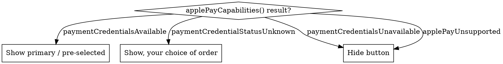

# Apple Pay on the Web — API Reference

API surface for both Apple Pay JS and the W3C Payment Request API form. For the discipline (when, how, why), see `apple-pay-web.md`. For native, see `apple-pay-ref.md`.

## API Choice

| API | Identifier | Browsers |
|-----|-----------|----------|
| Apple Pay JS | `ApplePaySession` global | Safari (Mac / iOS / iPadOS / visionOS) |
| Payment Request API | `PaymentRequest` global; method identifier `https://apple.com/apple-pay` | Cross-browser (Safari + third-party on iOS 18+ via JS SDK 1.2.0+) |

Both produce the same encrypted token; differences are in event-handler shape and request structure. You can ship either, both, or pick by `navigator.userAgent` + capability detection.

## Apple Pay JS — `ApplePaySession`

### Constructor

```js
const session = new ApplePaySession(version, paymentRequest);
```

`version` is the Apple Pay JS API version. WWDC24 introduced version 14; later versions may exist — check `/applepayontheweb/apple-pay-on-the-web-version-history` for current. Pin to the lowest version you actually need; new versions add features but require capability fallbacks for older clients.

### Session lifecycle methods

| Method | Purpose |
|--------|---------|
| `session.begin()` | Display the payment sheet. Triggers `onvalidatemerchant`. |
| `session.abort()` | Dismiss the sheet (e.g. user navigated away from checkout). |
| `session.completeMerchantValidation(sessionObject)` | Pass the opaque session JSON returned from your server to advance past validation. |
| `session.completePayment(result)` | Resolve the authorization with success or error status (see Status Codes). |
| `session.completePaymentMethodSelection(update)` | Resolve `onpaymentmethodselected` with updated total + line items. |
| `session.completeShippingContactSelection(update)` | Resolve `onshippingcontactselected`. |
| `session.completeShippingMethodSelection(update)` | Resolve `onshippingmethodselected`. |
| `session.completeCouponCodeChange(update)` | Resolve `oncouponcodechanged`. |

### Event handlers

| Handler | Signature | Trigger |
|---------|-----------|---------|
| `onvalidatemerchant` | `(event: ApplePayValidateMerchantEvent) => void` | Sheet appeared; `event.validationURL` ready for server-side merchant session request. |
| `onpaymentauthorized` | `(event: ApplePayPaymentAuthorizedEvent) => void` | Customer authenticated; `event.payment` carries token + contact data. Call `completePayment()`. |
| `onpaymentmethodselected` | `(event) => void` | Customer switched cards. Recalculate any card-specific surcharge / fee. |
| `onshippingcontactselected` | `(event) => void` | Customer changed shipping address (redacted form). |
| `onshippingmethodselected` | `(event) => void` | Customer chose a shipping option. |
| `oncouponcodechanged` | `(event: { couponCode }) => void` | Customer entered / cleared coupon. |
| `oncancel` | `(event) => void` | Sheet dismissed without authorization. |

### Static methods

| Static | Returns | Purpose |
|--------|---------|---------|
| `ApplePaySession.canMakePayments()` | `Boolean` | Device hardware supports Apple Pay |
| `ApplePaySession.canMakePaymentsWithActiveCard(merchantId)` | `Promise<Boolean>` | **Deprecated** WWDC24 — use `applePayCapabilities()` |
| `ApplePaySession.openPaymentSetup(merchantId)` | `Promise<Boolean>` | Open Wallet's setup flow |
| `ApplePaySession.supportsVersion(version)` | `Boolean` | Capability check for a specific JS API version |

### Top-level `applePayCapabilities()` (WWDC24)

```js
const result = await applePayCapabilities("merchant.com.example.shop");
// result.paymentCredentialStatus: one of
//   "paymentCredentialsAvailable"
//   "paymentCredentialsUnavailable"
//   "paymentCredentialStatusUnknown"
//   "applePayUnsupported"
```

Replaces `canMakePaymentsWithActiveCard`. Drives the show-primary / show-secondary / hide UX decisions per HIG + AUG. Returns from a global, not a session method — call before constructing the session.

## `ApplePayPaymentRequest`

Object passed to `new ApplePaySession(version, request)`:

| Property | Type | Notes |
|----------|------|-------|
| `countryCode` | `String` | ISO 3166 2-letter |
| `currencyCode` | `String` | ISO 4217 3-letter |
| `merchantCapabilities` | `String[]` | `"supports3DS"`, `"supportsCredit"`, `"supportsDebit"`, `"supportsEMV"`, `"supportsInstantFundsOut"` (WWDC24) |
| `supportedNetworks` | `String[]` | `"visa"`, `"masterCard"`, `"amex"`, `"discover"`, `"chinaUnionPay"`, `"interac"`, `"jcb"`, `"mada"`, `"electron"`, `"maestro"`, `"vPay"`, `"eftpos"` |
| `total` | `ApplePayLineItem` | Final amount; `label` is your customer-facing business name |
| `lineItems` | `ApplePayLineItem[]` | Line items shown above the total |
| `requiredBillingContactFields` | `String[]` | `"postalAddress"`, `"name"`, `"phoneNumber"`, `"emailAddress"`, `"phoneticName"` |
| `requiredShippingContactFields` | `String[]` | Same set |
| `billingContact`, `shippingContact` | `ApplePayPaymentContact` | Pre-populate known data |
| `shippingMethods` | `ApplePayShippingMethod[]` | Each carries `label`, `detail`, `amount`, optional `dateComponentsRange` |
| `shippingType` | `String` | `"shipping"`, `"delivery"`, `"storePickup"`, `"servicePickup"` |
| `applicationData` | `String` | Base64-encoded; SHA-256 binds into token's `header.applicationData` |
| `supportsCouponCode` | `Boolean` | Show coupon-code field on sheet |
| `couponCode` | `String` | Pre-populate field |
| `recurringPaymentRequest` | `ApplePayRecurringPaymentRequest` | Subscription variant |
| `automaticReloadPaymentRequest` | `ApplePayAutomaticReloadPaymentRequest` | Stored-balance reload variant |
| `deferredPaymentRequest` | `ApplePayDeferredPaymentRequest` | Pay-later-at-delivery variant |
| `multiTokenContexts` | `ApplePayPaymentTokenContext[]` | Multi-merchant in one sheet |

`ApplePayLineItem`:

```js
{
    label: "Subtotal",
    amount: "89.99",      // string — never JS Number
    type: "final"         // or "pending" for unknown amounts
}
```

## Payment Request API form

```js
const methodData = [{
    supportedMethods: "https://apple.com/apple-pay",
    data: {
        version: 14,
        merchantIdentifier: "merchant.com.example.shop",
        merchantCapabilities: ["supports3DS"],
        supportedNetworks: ["visa", "masterCard", "amex", "discover"],
        countryCode: "US"
    }
}];
const details = {
    displayItems: [{ label: "Subtotal", amount: { currency: "USD", value: "89.99" } }],
    total: { label: "Example Shop", amount: { currency: "USD", value: "94.99" } },
    shippingOptions: [...],
    modifiers: [...]
};
const options = {
    requestPayerName: true,
    requestPayerEmail: false,
    requestPayerPhone: false,
    requestShipping: true,
    shippingType: "shipping"   // or "delivery", "pickup"
};
const request = new PaymentRequest(methodData, details, options);
```

| `PaymentRequest` method | Purpose |
|-------------------------|---------|
| `request.show()` | Display the sheet; returns `Promise<PaymentResponse>` |
| `request.abort()` | Programmatic dismissal |
| `request.canMakePayment()` | Promise<Boolean> — capability check |

| Event on `PaymentRequest` | Apple Pay JS analog |
|---------------------------|---------------------|
| `merchantvalidation` | `onvalidatemerchant` |
| `shippingaddresschange` | `onshippingcontactselected` |
| `shippingoptionchange` | `onshippingmethodselected` |
| `paymentmethodchange` | `onpaymentmethodselected` |
| `couponcodechange` | `oncouponcodechanged` |

`PaymentResponse.complete(result)` resolves the flow. `result` is `"success"`, `"fail"`, or `"unknown"`.

## Modifiers (Payment Request API)

`details.modifiers` carries Apple-Pay-specific overrides on a per-method basis. Use for:

| Modifier shape | Purpose |
|----------------|---------|
| `recurringPaymentRequest` | Subscription |
| `automaticReloadPaymentRequest` | Auto top-up |
| `deferredPaymentRequest` | Pay later |
| `multiTokenContexts` | Multi-merchant |
| `additionalLineItems: [{ type: "disbursement", ... }]` | Web disbursement (WWDC24) |

Each variant requires the matching capability declared in `methodData[].data.merchantCapabilities`. Disbursements specifically require `"supportsInstantFundsOut"`.

## `ApplePayPayment` (Authorization Result)

Delivered as `event.payment` on `onpaymentauthorized`:

```js
{
    token: ApplePayPaymentToken,
    billingContact?: ApplePayPaymentContact,
    shippingContact?: ApplePayPaymentContact
}
```

## `ApplePayPaymentToken`

```js
{
    paymentMethod: {
        displayName: "Visa 1234",
        network: "Visa",
        type: "credit"           // "credit" | "debit" | "prepaid" | "store"
    },
    transactionIdentifier: "<hex>",
    paymentData: { ... }         // The encrypted payload — same structure as native PKPaymentToken.paymentData
}
```

`paymentData` shape is identical to the native form (`version`, `data`, `signature`, `header`). See `apple-pay-ref.md` § "Payment Token Format" for the EC_v1 / RSA_v1 details.

## `ApplePayPaymentContact`

```js
{
    phoneNumber?: string,
    emailAddress?: string,
    givenName?: string,
    familyName?: string,
    phoneticGivenName?: string,
    phoneticFamilyName?: string,
    addressLines?: string[],
    subLocality?: string,
    locality?: string,
    postalCode?: string,
    subAdministrativeArea?: string,
    administrativeArea?: string,
    country?: string,
    countryCode?: string
}
```

Pre-auth (returned in `onshippingcontactselected`) is **redacted** — only `country`, `countryCode`, `administrativeArea`, `locality`, `postalCode`. Post-auth (returned in `onpaymentauthorized`) is the **full** form.

## Apple Pay Errors

```js
new ApplePayError(code, contactField?, message?)
```

| `code` | When |
|--------|------|
| `"shippingContactInvalid"` | Bad shipping address field; pass field name as `contactField` |
| `"billingContactInvalid"` | Bad billing address field |
| `"addressUnserviceable"` | Address valid, you don't ship there |
| `"couponCodeInvalid"` | Coupon malformed |
| `"couponCodeExpired"` | Coupon past expiry |
| `"unknown"` | Generic |

Contact-field names: `"postalAddress"`, `"name"`, `"phoneNumber"`, `"emailAddress"`, `"phoneticName"`, plus address sub-fields `"locality"`, `"postalCode"`, `"administrativeArea"`, `"country"`, `"countryCode"`, `"addressLines"`.

Errors flow back via the `errors` property on each completion update object, or via `completePayment({ status, errors })` for final auth.

## Status Codes

`ApplePaySession.completePayment({ status, errors })` accepts:

| Code | Constant | Meaning |
|------|----------|---------|
| `0` | `STATUS_SUCCESS` | Authorization succeeded |
| `1` | `STATUS_FAILURE` | Authorization failed |
| `2` | `STATUS_INVALID_BILLING_POSTAL_ADDRESS` | Invalid billing postal address |
| `3` | `STATUS_INVALID_SHIPPING_POSTAL_ADDRESS` | Invalid shipping postal address |
| `4` | `STATUS_INVALID_SHIPPING_CONTACT` | Invalid shipping name / email / phone |
| `5` | `STATUS_PIN_REQUIRED` | (legacy) |
| `6` | `STATUS_PIN_INCORRECT` | (legacy) |
| `7` | `STATUS_PIN_LOCKOUT` | (legacy) |

Prefer the `errors: [ApplePayError, ...]` shape over numeric status codes — it surfaces field-specific feedback to the user, which the numeric codes don't.

## Apple Pay Later Merchandising Widget (WWDC23)

A pre-checkout banner that informs eligible US customers Apple Pay Later is available. Renders as a custom element from the JS SDK:

```html
<apple-pay-later-merchandising
    amount="89.99"
    currency="USD">
</apple-pay-later-merchandising>
```

Place on product / cart pages — *before* the customer reaches checkout. The widget adapts to amount thresholds and handles localization automatically. Common attributes shown; see `/applepayontheweb/adding-an-apple-pay-later-visual-merchandising-widget` for full attribute list (`presentation`, locale handling, etc.).

## Track with Apple Wallet Button (WWDC23)

For order tracking handoff to Wallet (see `wallet-orders.md`):

```html
<apple-pay-wallet-button
    type="track"
    locale="en-US">
</apple-pay-wallet-button>
```

Common attributes shown; see `/applepayontheweb/adding-a-track-with-apple-wallet-button` for the full type set and customization options. Pairs with the order package URL flow described in `wallet-orders.md`.

## Web Sequence Diagrams

### In-Safari direct flow (MIG p.27)

```
[1]  User taps Apple Pay button
[2]  JS creates ApplePaySession, calls .begin()
[3]  Sheet appears
[4]  Browser fires onvalidatemerchant with validationURL
[5]  JS POSTs validationURL to your server
[6]  Server POSTs to apple-pay-gateway.apple.com (two-way TLS, merchant identity cert)
[7]  Apple Pay returns opaque session JSON
[8]  Server returns session JSON to browser
[9]  JS calls session.completeMerchantValidation(sessionJson)
[10] User interacts with sheet (shipping / coupon / method changes → events)
[11] User authenticates (Face/Touch/Optic ID on linked iPhone or Mac TouchID)
[12] Browser fires onpaymentauthorized with payment.token
[13] JS POSTs token to your server
[14] Server forwards token to PSP (encrypted blob OR self-decrypted)
[15] PSP authorizes via acquirer / network / issuer
[16] Server returns to browser
[17] JS calls session.completePayment({ status: STATUS_SUCCESS })
[18] Sheet dismisses with success animation
```

### PSP-hosted page flow (MIG p.28)

When checkout is hosted on the PSP's domain (Stripe Checkout, Adyen Drop-in, etc.):

```
[1]  Your site embeds PSP iframe / redirects to PSP-hosted page
[2]  PSP page renders Apple Pay button (may be CSS or JS SDK)
[3]  Apple Pay flow runs against PSP's merchant ID + cert (not yours)
[4]  PSP receives token, decrypts, processes
[5]  PSP returns to your site with order ID / status
```

In this model you don't directly handle merchant validation or token decryption — the PSP does. Your integration concern shifts to PSP-specific webhook handling and idempotency.

## Maintaining Your Environment

Three things expire on the web side:

| What | Expiry | Renewal |
|------|--------|---------|
| Payment Processing Certificate | 25 months | Create-but-don't-activate workflow (see `apple-pay.md` § "Cert renewal") |
| Merchant Identity Certificate | Documented expiry | Re-create + redeploy to server |
| Domain verification | Periodic re-verification | Re-download `apple-developer-merchantid-domain-association.txt` and re-verify |

The Merchant ID itself never expires.

## Capability Detection Decision Tree



Combine with `ApplePaySession.canMakePayments()` (sync, hardware-only) for fast initial gating before the async capabilities call resolves.

## Resources

**MIG**: pp.10–14 (config + validation), p.27 (in-Safari sequence), p.28 (PSP-hosted sequence)

**WWDC**: 2021-10092 (JS SDK button, coupon codes, date ranges), 2022-10041 (multi-merchant, automatic-reload), 2023-10114 (Apple Pay Later merchandising widget, deferred, disbursements), 2024-10108 (third-party browser, JS SDK 1.2.0, applePayCapabilities, web disbursements, MCC)

**Tech Talks**: 111381 (Get started with Apple Pay on the Web)

**Docs**: /applepayontheweb/applepaysession, /applepayontheweb/apple-pay-js-api, /applepayontheweb/payment-request-api, /applepayontheweb/applepayvalidatemerchantevent, /applepayontheweb/applepaypaymentauthorizedevent, /applepayontheweb/checking-for-apple-pay-availability, /applepayontheweb/creating-an-apple-pay-session, /applepayontheweb/providing-merchant-validation, /applepayontheweb/requesting-an-apple-pay-payment-session, /applepayontheweb/apple-pay-status-codes, /applepayontheweb/displaying-apple-pay-buttons-using-javascript, /applepayontheweb/loading-the-latest-version-of-apple-pay-js, /applepayontheweb/adding-an-apple-pay-later-visual-merchandising-widget, /applepayontheweb/adding-a-track-with-apple-wallet-button, /applepayontheweb/apple-pay-on-the-web-version-history

**Skills**: apple-pay-web (discipline), apple-pay-ref (native API parallels), wallet-orders (order tracking handoff), payments-diag (cert / validation failures)
