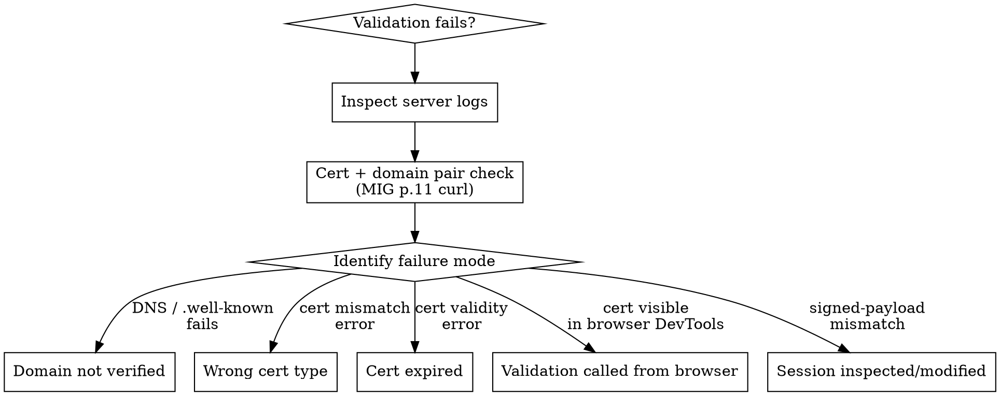

# Payments Diagnostic — Cross-Cutting Failure Modes

**You MUST use this skill when something in the axiom-payments suite isn't working.** The discipline skills (`apple-pay.md`, `apple-pay-web.md`, `tap-to-pay.md`, `wallet-passes.md`, `wallet-orders.md`) cover *how* to do things right; this skill covers *what's wrong* when symptoms appear. Each diagnostic branch maps a symptom to a root cause and points back at the discipline skill that fixes it.

## Red Flags

Stop and reconsider the moment you catch yourself in any of these. Each is a baseline mistake that *looks* correct.

| Red flag | Why it's wrong | What's actually true |
|----------|----------------|----------------------|
| Gating the Apple Pay button's *visibility* on `canMakePayments(usingNetworks:)` | This produces an "Apple Pay shown as unavailable" App Review rejection (HIG). `usingNetworks:` is a *content* signal, not a *visibility* gate. | Per HIG, show the button whenever `canMakePayments()` is true. Let the system drive card set-up when `usingNetworks:` is false — it presents the add-card flow inside the sheet. Only `canMakePayments() == false` (no Secure Element) hides the button. |
| Reaching for Apple Pay because it's "cheaper than IAP" for a digital subscription | "Cheaper than IAP" is the *exact* rationalization App Review enforces against. Digital content via any non-IAP rail is a 3.1.1 rejection ("sells digital content using a payment method other than In-App Purchase"). | The rail is product-determined, not cost-determined. Digital/in-app → **IAP only**. Real-world goods/services → Apple Pay (IAP for these is itself a 3.1.3(e) rejection). The legitimate cost lever is the **App Store Small Business Program** (15% vs 30%), not switching rails. |
| Treating "the certs are set up" as a one-time, permanent state | The **Payment Processing Certificate expires every 25 months** and renewal is a two-stage create-*then-activate* flow. Skipping activation, or activating early, fails *all* live transactions at cutover. | Renew before expiry; coordinate the **Activate** click with your PSP so the old cert stays live until the new one is active. Merchant ID never expires; the cert does. |

## Top-Level Decision Tree

```dot
digraph diag {
    "Symptom?" [shape=diamond];

    "No payment sheet appears" [shape=box];
    "Sheet appears, merchant validation fails (web)" [shape=box];
    "Sheet completes, PSP rejects" [shape=box];
    "Tap to Pay never enables / button greyed" [shape=box];
    "Tap to Pay never readyForTap" [shape=box];
    "Wallet pass won't import" [shape=box];
    "Pass imports, updates don't arrive" [shape=box];
    "Order won't add to Wallet" [shape=box];
    "App Review rejection (payment-related)" [shape=box];

    "Symptom?" -> "No payment sheet appears" [label="no sheet"];
    "Symptom?" -> "Sheet appears, merchant validation fails (web)" [label="web sheet errors\nat onmerchantvalidation"];
    "Symptom?" -> "Sheet completes, PSP rejects" [label="auth fails\npost-payment"];
    "Symptom?" -> "Tap to Pay never enables / button greyed" [label="entitlement /\ndevice / region"];
    "Symptom?" -> "Tap to Pay never readyForTap" [label="reader doesn't\nfire readyForTap"];
    "Symptom?" -> "Wallet pass won't import" [label="pass invalid\nor silent"];
    "Symptom?" -> "Pass imports, updates don't arrive" [label="updates don't\nreach device"];
    "Symptom?" -> "Order won't add to Wallet" [label="order package\nrejected"];
    "Symptom?" -> "App Review rejection (payment-related)" [label="rejection cites\npayments"];
}
```

## No Payment Sheet Appears

The button does nothing, or `canMakePayments()` returns false unexpectedly, or the system returns silently from `begin()` / `present()`.

| Surface | Check | Fix |
|---------|-------|-----|
| Native | `canMakePayments()` returns false | Device hardware lacks Secure Element (older iPhone), or you're in a Simulator. Hide the button on these. |
| Native | `canMakePayments(usingNetworks:)` returns false | Customer has no card provisioned. Show the button anyway (HIG); system handles set-up flow. |
| Native | Sheet `present()` returns immediately | Merchant ID not selected in Xcode capability, or capability not enabled on App ID. See `apple-pay.md` § "Pre-Flight Checklist". |
| Native | Capability enabled but Apple Pay still fails | Provisioning profile is stale — re-download. |
| Web | `applePayCapabilities()` returns `applePayUnsupported` | Browser is unsupported (e.g. desktop Chrome on Linux). Hide the button. |
| Web | Sheet doesn't render in third-party browser | CSS-implemented button instead of JS SDK custom element, or JS SDK older than 1.2.0. Switch to `<apple-pay-button>` from SDK 1.2.0+. See `apple-pay-web.md`. |
| Web | Sheet doesn't render in Safari | Domain not verified, or `.well-known/apple-developer-merchantid-domain-association.txt` not at apex. Re-verify domain. |
| Web | Sheet renders briefly, then dismisses | Region mismatch — sandbox tester locale differs from cert region; or browser TLS doesn't support TLS 1.2+. |
| Sandbox | Sandbox card prompts but transaction can't complete | Sandbox is iCloud-account-scoped. Sign out of personal iCloud first; sign in with sandbox tester. |

## Sheet Appears But Merchant Validation Fails (Web)

The sheet displays, the customer taps Apple Pay, then the sheet disappears with an error or the auth flow never completes. This is **the most common single web-integration blocker** after domain verification.

| Failure | Symptom | Fix |
|---------|---------|-----|
| Domain not verified | curl test from MIG p.11 fails | Re-place `apple-developer-merchantid-domain-association.txt` at apex `.well-known/`; remove redirects/proxies; re-verify in Apple Developer portal |
| Wrong cert type used for validation | curl returns "merchant identity mismatch" | You must use the **Merchant Identity Certificate** (RSA 2048), not the Payment Processing Certificate. Two different certs. See `apple-pay-web.md` § "Pre-Flight". |
| Cert expired | curl returns TLS error | Both certs expire — Payment Processing every 25 months, Merchant Identity also has expiry. Renew + redeploy. |
| Validation request from browser | merchant cert is visible in DevTools / network tab | Move the `paymentSession` POST to your server. The browser must never call this endpoint. |
| Session object inspected or modified | `completeMerchantValidation()` rejects with a parse error | Pass through verbatim. Don't pretty-print, don't re-encode. |
| Session expired | Single-use, 5-minute lifetime — error fires when retried | Get a fresh session per checkout |
| Production cert used in sandbox | Sandbox transactions decline | `apple-pay-gateway-cert.apple.com` for sandbox, `apple-pay-gateway.apple.com` for production |

## Sheet Completes But PSP Rejects (Decryption / Authorization Fails)

Customer authenticates, the encrypted token arrives at your server, but PSP authorization fails.

| Failure | Where | Fix |
|---------|-------|-----|
| Wrong CSR uploaded for Payment Processing Cert | When you generated the cert | If your PSP decrypts, **PSP provides the CSR** — you can't generate it yourself. Restart cert flow with PSP-supplied CSR. |
| Cert not activated after creation | Cert renewal cutover | Click **Activate** in Apple Developer portal at agreed time with PSP. The "create-but-don't-activate" workflow is two stages; many teams skip stage 2. |
| Production key vs sandbox key mismatch | When you ship | Sandbox transactions decline by design. Production needs production keys + activated certs. Test in production with real cards before launch. |
| Multi-PSP setup with one merchant ID | When self-decrypting fails | Only valid if you self-decrypt. If your PSP decrypts, one merchant ID per PSP. |
| Self-decrypted card data sent to wrong PSP API | Routing | Verify which PSP endpoint accepts the decrypted shape; some PSPs require encrypted blob even when you've decrypted. |
| `applicationData` doesn't match request hash | Token validation | Token's `header.applicationData` is SHA-256 of `request.applicationData`. If they don't match, the token's been tampered with — investigate before processing. |

### Certificate and artifact lifetimes

Most "it worked, then everything broke" payment failures trace to one of these. Know them before you debug live transactions.

| Artifact | Lifetime | Renewal gotcha |
|----------|----------|----------------|
| Merchant ID | Never expires | Reusable across apps; one per PSP if the PSP decrypts |
| Payment Processing Certificate | Expires every 25 months | Two-stage **create-then-Activate**. Apple allows only 2 at a time — revoke the old non-activated one if "Create" is greyed. Coordinate the Activate cutover with your PSP or all live transactions fail. If your PSP decrypts, the **PSP supplies the CSR** — you can't generate it. |
| Merchant Identity Certificate (web only) | Expires (RSA 2048) | Used for `onmerchantvalidation` only — never for decryption. Renew + redeploy to your server. |

**Eligibility gate:** Apple Pay is unavailable to **Apple Developer Enterprise Program** accounts. If your merchant ID won't provision or the capability never appears, confirm you're on the standard Apple Developer Program, not Enterprise.

## Tap to Pay Entitlement Stuck

Submitted the Tap to Pay entitlement request, weeks have passed, no response.

This is a known issue in Apple's intake flow. Resolution path:

1. **Wait 7 business days** before escalating
2. **Open an Apple Developer Support case** (not a Feedback Assistant ticket — the support case at `developer.apple.com/contact/topic/select`)
3. Reference the original request submission date and the entitlement key (`com.apple.developer.proximity-reader.payment.acceptance`)
4. **Quinn the Eskimo's "Determining if an entitlement is real"** forum post is the canonical Apple-channel guidance for managed-capability mental model — confirm yes, this entitlement is real

There is **no self-service path** to escalate. Plan release timelines with this delay buffer.

### Common entitlement gotchas

- **Submitted from individual account**: Tap to Pay requires an org-level Apple Developer account; resubmit from the org's Account Holder login
- **Distribution entitlement not re-requested**: development entitlement allows local builds + sideloading, but TestFlight + App Store requires the *distribution* entitlement (separate request, reply to the original email when ready for distribution)
- **Extension bundle not requested**: each extension bundle requires a separate request; main app approval doesn't extend
- **Region mismatch**: requested for region X, deployed in region Y — entitlement is region-bounded for some PSPs

## Tap to Pay Never `readyForTap`

Reader appears configured but never fires the `readyForTap` event; first tap hangs indefinitely.

| Symptom | Cause | Fix |
|---------|-------|-----|
| First read after app foreground hangs | `prepare(using:)` not called on foreground transition | Wire `prepare()` into `scenePhase == .active` handler; **call every foregrounding** |
| `prepare()` throws "token invalid" | PSP token expired or malformed | Refresh from PSP; check token TTL with PSP docs |
| `linkAccount()` flow doesn't appear | Already linked, or `isAccountLinked()` returned true | Call `relinkAccount()` if you need to switch the linked Apple Account |
| `isSupported` returns false | Device unsupported (older iPhone) or region not enabled | Hide Tap to Pay UI on this device; offer alternative |
| Reader created but `events` stream never emits | Configuration in progress; PSP-side delay | Wait for `updateProgress` events; show indeterminate progress in UI |

## Wallet Pass Won't Import

User taps the `.pkpass` file or "Add to Apple Wallet" button — Wallet shows nothing, or shows "invalid pass," or silently fails.

This is the most common single Wallet integration blocker. Nine failure modes:

| Failure | How to spot | Fix |
|---------|-------------|-----|
| **Missing WWDR Intermediate cert** in PKCS #7 `extracerts` | Most common; pass imports as "invalid" | Add `-certfile WWDR.pem` to your OpenSSL signing call (or equivalent in your library). Use **current** WWDR Intermediate from `apple.com/certificateauthority/`. |
| **Wrong WWDR generation** (G4 expired; current is G6) | Older WWDR certs expire | Download current WWDR Intermediate; check the cert's expiry against today |
| **`manifest.json` missing files** (must include all bundle files except `manifest.json` and `signature` themselves) | Wallet rejects with hash mismatch | Re-walk the bundle directory; SHA-1 every file; relative paths with forward slashes |
| **`passTypeIdentifier` in `pass.json` doesn't match cert** | Wallet rejects with identity mismatch | Edit `pass.json` to match Pass Type ID Cert exactly |
| **`teamIdentifier` doesn't match dev account** | Wallet rejects with team mismatch | Use your Apple Developer Team ID (10-char) |
| **`.DS_Store` accidentally included** in zip | Manifest hashes a file Wallet rejects | `zip -x ".DS_Store"` |
| **Cert expired** | Pass type cert has expiry | Renew cert; re-sign passes |
| **PEM/p12/DER format confusion** | OpenSSL errors during signing | PEM has BEGIN/END headers (text); DER is binary; p12 is the bundled keypair format. Common server-side gotcha: OpenSSL bindings in some languages need absolute paths or specific URI prefixes. Test with hand-run OpenSSL first. |
| **Date keys not ISO 8601** | Wallet shows "missing field" | All date fields must be valid ISO 8601 with timezone |

If all signing checks pass and the pass still fails: drop the `.pkpass` onto a running iOS Simulator. Check the system log via Console app — the rejection reason is usually logged there.

## Pass Imports But Updates Don't Arrive

Pass added successfully; subsequent updates pushed via APNs don't reach the device.

| Failure | Diagnosis | Fix |
|---------|-----------|-----|
| `webServiceURL` malformed | Wallet ignores | Must be HTTPS; must respond to specific endpoints (5 of them — see `wallet-passes-ref.md`) |
| `authenticationToken` shorter than 16 chars | Registration silently rejected | Generate ≥16 chars (32+ recommended); rotate per pass |
| APNs misconfigured | Push reaches Apple but device never receives | The APNs cert is the **same Pass Type ID Cert**. Don't create a separate APNs cert. Use the pass type ID as the **topic**. |
| Device not registered | Your server logs show no incoming registration call | Wallet registers when the pass is added; if missing, the user's device is in a state where it can't reach your server (firewall, captive portal, etc.) |
| Wrong push topic | Push delivered but Wallet ignores | Topic = pass type identifier (e.g. `pass.com.example.event`) |
| Updated pass not properly re-signed | Wallet fetches but rejects | Each updated `.pkpass` needs fresh manifest + signature; you can't just edit pass.json in-place |
| Conditional response headers wrong | Wallet refetches every push | Implement `If-Modified-Since` / `Last-Modified` correctly to avoid unnecessary downloads |

## Order Won't Add to Wallet

Apple Pay payment succeeded; `PKPaymentOrderDetails` set; user expects an order to appear in Wallet — nothing shows up.

| Failure | Fix |
|---------|-----|
| Wrong cert used to sign order package | **Order Type ID Certificate**, not Pass Type ID Cert, not Apple Pay Merchant Cert. Three separate certs for three separate Wallet surfaces. |
| Order package not signed at all | Sign with PKCS #7 detached + WWDR + S/MIME signing-time (same pattern as Wallet passes) |
| `PKPaymentOrderDetails` set via init parameter | It's a property; set after `PKPaymentAuthorizationResult` construction. See `apple-pay.md` § "Order tracking handoff" |
| `authenticationToken` not unique per order | Each order needs its own token (≥16 chars) |
| `webServiceURL` doesn't respond | Wallet async-pulls the order package; if your server returns 4xx/5xx, the order silently doesn't appear |
| `orderTypeIdentifier` mismatch with cert | Edit so they match |
| `orderIdentifier` collides with existing order | Each order needs a unique identifier within the type |
| Missing `lineItems` or required `merchantData` fields | Order package validation fails server-side |

## Order Updates Don't Arrive

Symmetric to "Pass imports but updates don't arrive" — order is added but subsequent fulfillment-status changes never reach the device.

| Failure | Diagnosis | Fix |
|---------|-----------|-----|
| Wrong APNs cert used | Order updates push from a different cert | The APNs cert is the **Order Type ID Certificate** (not the Pass Type ID Cert, not Apple Pay Merchant Cert). Same cert, dual purpose: signs the order package AND authenticates APNs push. |
| Wrong push topic | Push delivered but Wallet ignores | Topic = **order type identifier** (e.g. `order.com.example.shop`). Don't reuse a pass topic. |
| `webServiceURL` returns 4xx/5xx | Wallet pulls fail silently | Server must respond to the order-equivalent of the wallet-passes endpoints (substitute `order` for `pass` in paths) |
| Updated order package not properly re-signed | Wallet fetches but rejects | Each updated order needs fresh signature; you can't just edit fields on a previously-signed package |
| `authenticationToken` rotation broke registered devices | Devices registered with old token; new token doesn't authenticate | Tokens are per-order — don't rotate mid-order; issue a new order if you must |

## App Store Rejection Patterns (Payment-Related)

| Rejection text | Root cause | Fix |
|----------------|-----------|-----|
| "Your app uses In-App Purchase to sell physical goods" | Wrong rail (3.1.3(e)) | Switch checkout to Apple Pay; see `apple-pay-vs-iap.md` |
| "Your app sells digital content using a payment method other than IAP" | Wrong rail (3.1.1) — often chosen because Apple Pay "looked cheaper" | Switch to IAP; the rail is product-determined, not cost-determined. For lower fees use the Small Business Program (15%), not a different rail. See `axiom-integration/skills/in-app-purchases.md` |
| "Apple Pay is not at parity with other payment methods" | Web AUG parity violation | Promote Apple Pay to at-least-equal prominence on every page that shows payment methods |
| "Apple Pay must be the primary option when active card detected" | Web AUG primary-option rule | When `applePayCapabilities()` returns `paymentCredentialsAvailable`, pre-select Apple Pay |
| "Custom button mimics Apple Pay branding" | HIG violation | Use Apple-provided Apple Pay Button API; don't put "Apple Pay" or the logo on custom buttons |
| "Apple Pay button shown as unavailable" | HIG violation | Always show the button; gracefully handle missing requirements *after* tap |
| "Marketplace transaction obscures end merchant" | HIG | Use "Pay [Merchant] (via [You])" Pay-line format |
| "Tap to Pay button used for non-payment action" | HIG violation | Generic labels (Look Up, Verify, Refund, Store Card) for non-payment uses |
| "Donations collected by non-approved app" | App Review §3.2.1(vi) / §3.2.2(iv) | Approved nonprofits must offer Apple Pay; non-approved apps may not collect in-app at all |
| "Reader app collecting first-time digital subscription via non-IAP" | §3.1.3(a) misuse | Reader-app exemption is account-management only; first-time subscriptions need IAP or external (web) |
| "Tap to Pay entitlement absent in submitted build" | Distribution entitlement not re-requested | Submit re-request via reply to original email; wait for approval |
| "App Privacy Statement missing on Apple Pay web pages" | App Review + AUG | Add privacy link on every page that initiates Apple Pay |

For appeal workflow, see `axiom-shipping/skills/app-store-diag.md`.

## Sandbox vs Production Failure Modes

Sandbox is fragile by design. Working sandbox correctly refusing fake money is **not a bug**.

| Symptom | Sandbox vs Production |
|---------|----------------------|
| Sandbox transaction succeeds, production fails | Production-key vs sandbox-key mismatch; or Payment Processing Cert not activated; or wrong PSP endpoint |
| Sandbox transaction declines | Expected behavior. Sandbox transactions decline pre-fulfillment by design. |
| OTP prompt in sandbox | Sandbox FPANs use OTP `111111` |
| Country code mismatch in sandbox | Device region must match cert region for some sandbox cards |
| iCloud account collision | Sandbox testers require signing out of personal iCloud first |

## Failure Corpus References (You're Not Alone)

These resources document failure patterns at scale; don't establish discipline rules from them but use as "this isn't unique to you" texture:

- **AvoHQ Rails post** — common Rails-side gotchas for Wallet pass signing in Ruby on Rails
- **WalletWallet.dev anatomy reference** — third-party visual pass-anatomy walkthrough
- **Apple Developer Forums "Entitlements" tag** — entitlement-stuck patterns, especially for Tap to Pay
- **Stack Overflow PHP `openssl_pkcs7_sign` thread** — signing-in-PHP gotchas (`file://` prefix, PEM/DER conversion)

These corpora confirm a pattern is widespread; they don't establish what's correct. The discipline-skill citations (Apple docs, MIG, WWDC, HIG) are authoritative.

## Quick-Reference Crisis Card

In production triage:

1. **Symptom: payment fails post-auth** → check cert activation status + production-key correctness first
2. **Symptom: Tap to Pay first-tap hangs** → 95% chance `prepare()` not called on foreground
3. **Symptom: pass invalid** → 60% chance missing WWDR; 20% chance wrong identifier match; 20% other
4. **Symptom: web validation fails** → curl test from MIG p.11 isolates cert vs domain in 30 seconds
5. **Symptom: orders don't appear** → 40% chance wrong cert (Order Type ID vs Pass Type ID); 30% chance webServiceURL unreachable
6. **Symptom: App Review rejection** → check the rail (Apple Pay vs IAP) first, then HIG button compliance, then AUG parity

## Resources

**MIG**: pp.11 (cert curl test), p.22 (sandbox testing), p.25 (troubleshooting links)

**WWDC**: 2020-10662, 2021-10092, 2022-10041, 2023-10114, 2024-10108

**Forums**: developer.apple.com/forums (Entitlements tag)

**Apple-channel authority**: Quinn the Eskimo "Determining if an entitlement is real" (Apple DTS)

**Skills**: apple-pay, apple-pay-web, apple-pay-ref, apple-pay-web-ref, tap-to-pay, tap-to-pay-ref, wallet-passes, wallet-passes-ref, wallet-orders, wallet-extensions-ref, apple-pay-vs-iap, axiom-shipping (skills/app-store-diag.md), axiom-integration (skills/in-app-purchases.md)
