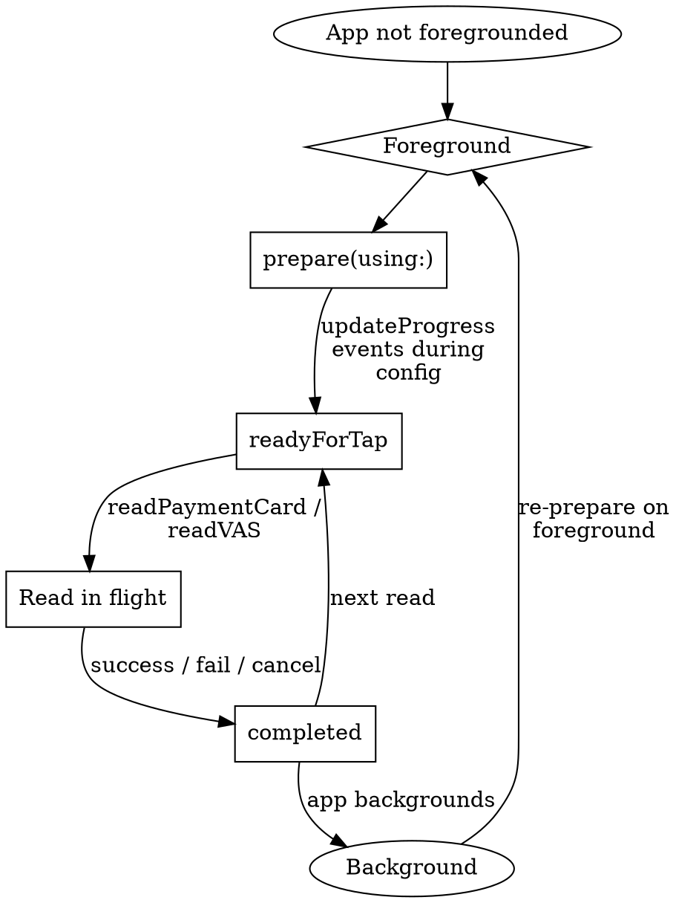

# Tap to Pay on iPhone — ProximityReader API Reference

API surface for the `ProximityReader` framework. For the discipline (entitlement workflow, PSP onboarding, HIG, lifecycle rules), see `tap-to-pay.md`.

## Framework Availability

`ProximityReader` — iOS 15.4+, iPadOS 15.4+, Mac Catalyst 17.0+. **Cannot be used in iOS Simulator.** Real-device testing required.

## `PaymentCardReader`

The top-level coordinator for Tap to Pay sessions. Conforms to `Sendable` and `SendableMetatype`.

| Member | Purpose |
|--------|---------|
| `init(options:)` | Create reader with PSP-supplied options |
| `static var isSupported: Bool` | Class property — does this device model support Tap to Pay? Check before showing the button anywhere. |
| `var readerIdentifier: String` | Unique identifier for this reader instance |
| `var options: PaymentCardReader.Options` | The configuration the reader was created with |
| `var events` | Async sequence of `PaymentCardReader.Event` values; iterate with `for await` |
| `func prepare(using:) async throws -> PaymentCardReaderSession` | Configure pipeline; **call on app start AND each foreground transition** |
| `func isAccountLinked(using:) async throws -> Bool` | Has the merchant account accepted T&C? |
| `func linkAccount(using:) async throws` | Present system T&C sheet for first-time acceptance |
| `func relinkAccount(using:) async throws` | Re-link to a different Apple Account |
| `func fetchPaymentCardReaderStore() async throws` | Retrieve cached read results from a Store and Forward session |
| `func prepareStoreAndForward() async throws` | Configure pipeline for offline / Store and Forward mode |

All async methods that take a token take `PaymentCardReader.Token`.

### `PaymentCardReader.Options`

PSP-supplied configuration. Treat as opaque from your code — your PSP's SDK constructs it. Some fields are PSP-specific; others map to general session settings.

### `PaymentCardReader.Token`

Secure token issued by your **participating PSP**. Used for `linkAccount`, `relinkAccount`, `isAccountLinked`, and `prepare`. Not a static value — fetch from your PSP's API at runtime; refresh per the PSP's TTL policy.

### Deprecated

| Deprecated | Replacement |
|------------|-------------|
| `id` (was instance property) | `readerIdentifier` |
| `prepare(using:updateHandler:)` | `prepare(using:)` + observe `events` async stream |
| `PaymentCardReader.UpdateEvent` | `PaymentCardReader.Event` (simpler, sendable across actors) |

## `PaymentCardReader.Event`

Cases delivered through the `events` stream. Verify exact case set against current `/proximityreader/paymentcardreader/event` docs before depending on a specific name.

| Case | Payload | When |
|------|---------|------|
| `.updateProgress` | `Int` (0–100) | Configuration progress; use for determinate progress UI |
| `.readyForTap` | — | Reader ready; you can call `readPaymentCard(_:)` |

Per-transaction success / failure is delivered through the `PaymentCardReaderSession` async API (the read methods return or throw), not as separate stream events.

## `PaymentCardReaderSession`

Returned from `prepare(using:)`. Carries the active read pipeline.

| Method | Purpose |
|--------|---------|
| `func readPaymentCard(_ request: PaymentCardTransactionRequest) async throws -> PaymentCardReadResult` | Charge **or refund** a payment card. Refund is a `TransactionType` (`.refund` vs `.purchase`) on the request — **not** a separate method. |
| `func readPaymentCard(_ request: PaymentCardVerificationRequest) async throws -> PaymentCardReadResult` | Non-charging card read — for refund-without-receipt, store-card-on-file, etc. |
| `func readVAS(_ request: VASRequest) async throws -> VASReadResult` | Read NFC pass / Value Added Services from Wallet (independent of payment) |
| `func cancelRead() async throws -> Bool` | Abort the in-flight read |

`PaymentCardReader.Options.returnReadResultImmediately` (iOS 16.4+) lets the read return **before** the system completes its checkmark animation. Saves 1–2 seconds per transaction; most PSPs support it.

### `PaymentCardReadResult`

Result of a successful read (charge, refund, or verification). Wraps the encrypted payment data + PSP-specific metadata. Treat as opaque; pass to your PSP for processing.

### `VASReadResult`

Result of a VAS / NFC-pass read. Carries the pass payload read from Wallet, independent of any payment.

## NFC Pass Reading from Wallet

Separate method on `PaymentCardReaderSession` for reading loyalty / NFC passes:

| Method | Purpose |
|--------|---------|
| `session.readVAS(_ request: VASRequest)` | Read a pass / Value Added Services independently of payment |
| `session.readPaymentCard(_:vasRequest:stopOnVASResult:)` | Combined-mode read — pass + payment in one tap (returns `(PaymentCardReadResult?, VASReadResult?)`) |

The pass-side schema (what's in the NFC payload) is defined in `pass.json`'s `nfc` block — see `wallet-passes.md` § "NFC Payloads" and `wallet-passes-ref.md` for the schema.

## Read Errors

Errors are **exhaustive published enums you can pattern-match on** — not an unenumerated surface:

- `PaymentCardReaderSession.ReadError: Error, Sendable` — read / refund / VAS failures (`readNotAllowed`, `readerSessionExpired`, `readerTokenExpired`, `paymentCardDeclined`, `pinEntryTimeout`, `cardReadFailed`, `paymentReadFailed`, etc.)
- `PaymentCardReaderError: Error, Sendable` — reader prepare / link / token failures (`notReady`, `prepareFailed`, `prepareExpired`, `tokenExpired`, `accountNotLinked`, etc.)

Both expose `errorDescription` and `errorName`. `switch` over them and gate version-specific cases behind `@available`:

- `ReadError.readerInitializationFailed` / `.readerNotAvailable` / `.cardNotSupported` are iOS 26.0+
- `ReadError` store-and-forward cases (`storeAndForwardDeclineFailed`, `storeAndForwardResultNotFound`) and `.unknown(code:)` are iOS 18.4+
- `PaymentCardReaderError.unknown(code:)` is iOS 18.0+

Always handle `.unknown(code:)` plus a `default` clause for forward-compatibility with cases Apple adds in later releases.

Categories you'll handle in practice (map to the enum cases above):

| Category | Recovery |
|----------|----------|
| User / system cancellation | Show neutral UI, allow retry |
| Timeout (no card presented) | Allow retry |
| Unsupported card / network | Suggest alternative payment |
| Issuer decline | Display the PSP-supplied localized reason |
| SCA / PIN required after the tap | PSP-specific fallback (often a payment-link redirect) |
| Reader not configured (prepare not called or session expired) | Re-prepare and retry |
| Entitlement missing (`com.apple.developer.proximity-reader.payment.acceptance`) | Fix entitlements file + provisioning profile |

Display PSP-provided localized messages where available — they handle region-specific decline reasons better than generic strings. PSP SDKs (Stripe Terminal, Adyen, Square) typically wrap these errors in their own typed hierarchies; consult the PSP SDK docs for the matching case names.

## Store and Forward Mode

For environments where network connectivity is intermittent (warehouse counters, food trucks, outdoor markets), some PSPs support **Store and Forward** — record taps offline and submit to the PSP later.

| API | Purpose |
|-----|---------|
| `reader.prepareStoreAndForward()` | Configure pipeline for offline reads |
| `reader.fetchPaymentCardReaderStore()` | Retrieve buffered read results |

Store and Forward is **PSP-supported, not Apple-supported**. Stripe Terminal supports it on Tap to Pay; Adyen and Square coverage varies. Check your PSP's docs.

> Risk: offline transactions decline at later submission carry settlement risk. PSPs limit Store and Forward to specific transaction-amount thresholds and require chargeback agreements.

## `MobileDocumentReader` (Tap to Present ID, WWDC23)

A separate reader class on the same framework for reading **driver's licenses / state IDs** from Wallet. Not a payment surface.

```swift
class MobileDocumentReader: Sendable
```

| Member | Purpose |
|--------|---------|
| `static var isSupported: Bool` | Class property |
| `init(options:)` | PSP / use-case-specific options |
| `func prepare(using:)` | Same prepare-on-foreground pattern as PaymentCardReader |
| Document-read method | Verify name + signature against `/proximityreader/mobiledocumentreader` — Apple's API surface for ID reading evolves with each iOS release |

**Out of scope for axiom-payments** — listed here so developers searching ProximityReader land in the right place. Identity-verification UX (when / why / how) lives in `axiom-integration` if it lands anywhere.

### ID Verification Additions `OS27`

- New `.name` element on the mobile-document data, display, AND raw-data requests (driver's license, national ID card, photo ID) returning `MobileDocumentHolderName` (`name: String` + `components: PersonNameComponents` — components are derived from the full-name string when the document doesn't provide them separately). On the data responses, the old `nameComponents` is deprecated, renamed to `name`.
- `issuerIdentifiers: [Data]` on the document request types — per the docs, the subject key identifiers of issuers the reader trusts (empty = any). The three raw-data requests gain it as a property plus an `init(retainedElements:nonRetainedElements:issuerIdentifiers:)` and a static factory. PassKit's `PKIdentityDocumentDescriptor` (in-app identity requests) has the same-named property — there described as X.509 authority key identifiers, with a **hard limit in the PassKit header: at most 1,000 identifiers of at most 64 bytes each, or the app terminates**. PassKit also gains the matching name element (`PKIdentityElement.name`, iOS 27; its header notes the mDL standard has no full-name field, hence the components-based type).

These carry `visionOS 27` annotations in the iOS interface, but ProximityReader.framework does not ship in the visionOS 27 SDK — treat them as iOS 27 (PassKit's `issuerIdentifiers` IS on visionOS 27).

## `CustomerEngagementSession` `OS27`

New session class (iOS/iPadOS/macCatalyst 27; unavailable on macOS/tvOS/watchOS; its `@available` line also claims visionOS 27, but the framework is absent from the visionOS SDK) — per the docs, "the object you use to share and request customer information": merchants collect customer details, process payments, and update transaction status on a **paired customer device**. Capabilities listed in the docs: requesting contact info, signups with consent options, collecting addresses, processing payments, status displays, shopping carts, and adding Wallet passes.

| Member | Purpose |
|--------|---------|
| `init(configuration:)` | `Configuration(currency:region:privacyPolicyURL:websiteURL:storeName:deviceName:passTypeIdentifiers:)` |
| `open(using:)` / `close()` | Session lifecycle; token bridges from Tap to Pay via `CustomerEngagement.Token(using: PaymentCardReader.Token)` |
| `events` | Async sequence of session events |
| `customerConfiguration` | Connected peer details (`PeerClientType`, locale, version) |
| `Error` | Rich enum: `.notSupported`, `.invalidCredential`, `.userDeclined`, `.paymentRequestFailed`, `.pairingFailed`, `.sessionBusy`, `.wifiDisabled`, … |

No WWDC 2026 session covers this class at beta 1 — the API surface above is SDK- and doc-derived; verify flow details against /proximityreader/customerengagementsession as the docs fill in.

## ProximityReaderDiscovery

System-provided merchant tutorial UI. Apple maintains the content and localizations.

```swift
import ProximityReader

ProximityReaderDiscovery.show()  // present the tutorial
```

The tutorial covers all supported payment types (contactless card, Apple Pay, other digital wallets, loyalty pass) and the gesture for each. Use this instead of building your own tutorial — Apple updates it as Tap to Pay's market expands.

## Pipeline State Diagram



The "re-prepare on foreground" loop is the most-violated invariant — see `tap-to-pay.md` § "Step 2".

## Threading Model

`PaymentCardReader` and `MobileDocumentReader` conform to `Sendable`. The async APIs are safe to call from any actor / Task. The `events` async stream is iterable from one consumer at a time — use `.receive(on:)` patterns or a dedicated Task to fan out.

## Capability Detection (for Defensive UI)

```swift
guard PaymentCardReader.isSupported else {
    // Hide Tap to Pay UI; offer alternative payment methods
    return
}
```

`isSupported` is a class property — no instance needed. Returns `false` on:

- iPhones older than XS
- Devices in regions where Tap to Pay isn't yet enabled
- Catalyst targets running on Macs without compatible hardware

## Resources

**Docs**: /proximityreader, /proximityreader/paymentcardreader, /proximityreader/paymentcardreadersession, /proximityreader/paymentcardreader/event, /proximityreader/paymentcardreader/token, /proximityreader/paymentcardreader/options-swift.struct, /proximityreader/setting-up-the-entitlement-for-tap-to-pay-on-iphone, /proximityreader/adding-support-for-tap-to-pay-on-iphone-to-your-app, /proximityreader/accepting-loyalty-passes-from-wallet

**WWDC**: 2022-10041 (Tap to Pay on iPhone introduction), 2023-10114 (Tap to Present ID, MobileDocumentReader)

**HIG**: /design/human-interface-guidelines/tap-to-pay-on-iphone

**Skills**: tap-to-pay (discipline), wallet-passes (NFC pass schema), payments-diag (entitlement / device / PSP failure modes), apple-pay-ref (sibling under axiom-payments)
