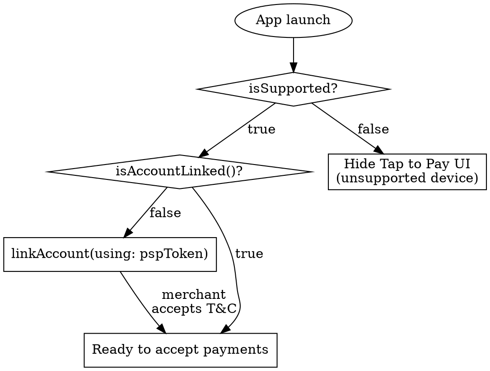

# Tap to Pay on iPhone — ProximityReader + PSP Onboarding

**You MUST use this skill for ANY contactless payment acceptance on iPhone.** Tap to Pay on iPhone replaces external card readers — no terminals, no Bluetooth dongles. The Apple-side integration via ProximityReader is roughly half the work; **the other half is PSP onboarding**, which Apple's documentation barely mentions but which is usually where projects stall.

For card provisioning *into* Wallet (issuer / bank apps) see `wallet-extensions-ref.md` (issuer / bank scope only). For Wallet pass NFC reads at point-of-sale (loyalty cards), this skill covers them — `accepting-loyalty-passes` is part of the ProximityReader surface; the pass-side schema lives in `wallet-passes.md` § "NFC Payloads".

## What Tap to Pay Actually Is

Tap to Pay on iPhone uses the iPhone's NFC + Secure Element to accept:

- **Contactless credit / debit cards** (most issuers in supported regions)
- **Apple Pay** (from the customer's iPhone or Apple Watch)
- **Other smartphone digital wallets** (Google Pay, Samsung Pay, etc.)
- **NFC-enabled loyalty cards** in Apple Wallet — independently of payment, alongside payment, or instead of payment

Hardware requirement: **iPhone XS or later**. The framework headers list iOS 15.4+, iPadOS 15.4+, Mac Catalyst 17.0+, but in practice the **only fully-supported merchant device is iPhone** — Tap to Pay on iPhone is the marketing name and the iPad / Mac surfaces are minimally exercised. Don't ship Tap to Pay on iPad or Mac without verifying with your PSP first.

Region availability is gated. As of writing: US, UK, Australia, Canada, France, Italy, Netherlands, Germany, Czech Republic, Brazil, Taiwan, and others — Apple expands continuously. **Verify current regions** at `/tap-to-pay` countries page before committing to launch markets.

## The PSP-Onboarding Reality

You **cannot** ship Tap to Pay without a PSP relationship. Apple's docs gloss this over; in practice, PSP integration is the actual blocker for most teams.

Three Apple-supported PSPs as of writing:

| PSP | Region availability | SDK / framework | Capability flag |
|-----|---------------------|-----------------|------------------|
| **Stripe Terminal** | US, UK, Australia, Canada, FR, IT, NL, DE, CZ, IE, FI, ES, NZ + more | Stripe Terminal SDK (iOS) | Tap to Pay enabled on Stripe account, processor-side certification |
| **Adyen** | US, UK, AU, CA, EU markets | Adyen Mobile SDK iOS | Tap to Pay license added to Adyen merchant account |
| **Square** | US, UK, IE + more | Square Mobile Payments SDK | Tap to Pay capability enabled on Square seller account |

**Each PSP's SDK runs on top of ProximityReader** (or wraps it). You typically choose one PSP, get their SDK working with their backend, and let them handle the certification details for the regions they cover. Multi-PSP setups are unusual and add operational complexity (separate token issuance, separate failure paths).

PSP-side onboarding usually requires:

1. Approved merchant account in each region you'll launch
2. Tap to Pay capability formally enabled on that account (not always automatic)
3. PSP-specific certification tests (test transactions against PSP sandbox)
4. PSP-issued **token** for `linkAccount(using:)` — see "PaymentCardReader Lifecycle" below

> **Decision rule:** before spending engineering time on ProximityReader integration, confirm in writing with your PSP that they support Tap to Pay in your target regions on your account type. PSP support varies by tier and account configuration.

## Entitlement Workflow — Quinn the Eskimo's Mental Model

Tap to Pay's entitlement is a **managed capability** — not a regular Xcode-pickable capability. The mental model is documented authoritatively by Apple DTS engineer Quinn the Eskimo's "Determining if an entitlement is real" forum post: managed capabilities are gated by Apple-side review and don't appear in Xcode's capability picker.

| Step | Owner | What |
|------|-------|------|
| 1. Submit Tap to Pay request form | Org Account Holder | `developer.apple.com/contact/request/tap-to-pay-on-iphone/` — provide use case, region, PSP. **Org-level account; cannot be done from individual account.** |
| 2. Apple review | Apple | Predefined criteria; review takes days to weeks |
| 3. Receive **development entitlement** email | Apple → Account Holder | Adds the entitlement to your developer account; appears under "Additional Capabilities" for that App ID |
| 4. Enable Tap to Pay on iPhone capability on your App ID | Account Holder | In Certificates, IDs & Profiles → your App ID → Additional Capabilities |
| 5. Generate / refresh provisioning profile | Developer | New profile required; auto-managed signing handles this |
| 6. Add `com.apple.developer.proximity-reader.payment.acceptance = true` to entitlements file | Developer | XML Boolean key in `your_project.entitlements` |
| 7. Build, test on device | Developer | Cannot test in Simulator |
| 8. **Re-request distribution entitlement** | Org Account Holder | Reply to the original email — TestFlight + App Store submission requires the *distribution* entitlement, separate from dev |
| 9. Submit for App Review | Developer | App Review checks Tap to Pay flow against HIG + marketing guidelines |

### Common entitlement failure: "Submitted" with no response

A persistent forum-corpus pattern: the Tap to Pay entitlement request sits in "Submitted" status for weeks with no email or response. This is a known issue in Apple's intake flow. Resolution path:

1. Wait 7 business days
2. Open an Apple Developer Support case (not a Feedback Assistant ticket — the support case)
3. Reference the original request submission date and the entitlement key

There is no self-service path to escalate. Plan your release timeline with this delay buffer.

### Extension bundles need separate requests

If your app uses extensions (widgets, Siri intents, etc.) that also need Tap to Pay, **each extension bundle requires a separate entitlement request**. Main app approval doesn't extend. This is undocumented and surprises teams late in development.

## Configure Xcode

After receiving the entitlement (Step 3 above):

```xml
<!-- your_project.entitlements -->
<key>com.apple.developer.proximity-reader.payment.acceptance</key>
<true/>
```

If using auto-managed signing, Xcode handles the profile refresh automatically. If using manual signing:

1. Project → Signing & Capabilities → All
2. Deselect "Automatically manage signing"
3. Provisioning Profile → Download Profile → select the new ProximityReader profile

`Info.plist` does **not** need any Tap to Pay key. The entitlement file is the only declaration.

## Merchant Onboarding Flow

Before any tap, the merchant must accept Tap to Pay's terms and conditions. ProximityReader provides system UI for this; **don't roll your own T&C sheet**.



| API | When |
|-----|------|
| `PaymentCardReader.isSupported` | Class property; check before showing the Tap to Pay button anywhere in your app |
| `isAccountLinked(using: token)` | Per-merchant check (`async throws -> Bool`); called every app launch + after account changes |
| `linkAccount(using: token)` | `async throws` — presents Apple's T&C sheet; merchant accepts (via Face ID / Touch ID confirmation) |
| `relinkAccount(using: token)` | `async throws` — switching the linked Apple Account — e.g. shared device, multiple seller accounts |

The `token` is a **PSP-issued** authentication token; you obtain it from your PSP's API at runtime. It's not a static value you embed at build time.

### HIG: Always offer the Tap to Pay button — even during configuration

Don't hide the button while configuration is in progress. From the HIG:

> "Make sure the Tap to Pay on iPhone checkout option is available even if configuration is continuing in the background. Merchants must always be able to select the Tap to Pay on iPhone checkout option in a checkout flow."

If the merchant taps Tap to Pay before configuration completes:

- Show **determinate** progress indicator if `PaymentCardReader.Event.updateProgress` events are flowing
- Show **indeterminate** progress otherwise
- Block the actual transaction until the session is ready, but never block the *button*

### Educate merchants — `ProximityReaderDiscovery`

Apple ships a **pre-built tutorial UI** via `ProximityReaderDiscovery`. Use it instead of building your own:

> "You can build your app's tutorial using Apple-approved assets from the Tap to Pay on iPhone marketing guidelines, or you can use the ProximityReaderDiscovery API to provide a pre-built merchant education experience. Apple ensures that the API is up to date and is localized for the merchant's region."

Surface the tutorial:

- After T&C acceptance (first-launch flow)
- In Settings → Help / Tutorial
- After repeated failed taps (proactive help)

## PaymentCardReader Lifecycle

Apple's API surface is small but has one critical discipline rule.

### Step 1 — Create the reader (at app launch)

```swift
let options = PaymentCardReader.Options( /* PSP-specific config */ )
let reader = PaymentCardReader(options: options)
```

`PaymentCardReader` conforms to `Sendable` — safe to pass between actors / tasks.

### Step 2 — Prepare on launch AND on each foregrounding

```swift
let session = try await reader.prepare(using: pspToken)
```

> "**You need to perform a subsequent configuration each time your app becomes frontmost.** To minimize potential wait times, prepare the feature as soon as your app starts and immediately after each transition to the foreground." — Tap to Pay HIG

Skipping `prepare()` on a foreground transition is the most common runtime bug: the first transaction after the app returns from background hangs indefinitely. Wire `prepare()` into your `scenePhase == .active` handler.

`prepare(using:updateHandler:)` (legacy signature) is **deprecated**. Use `prepare(using:)` returning `PaymentCardReaderSession`, and observe the `events` async stream for progress.

### Step 3 — Observe events

```swift
for await event in reader.events {
    switch event {
    case .updateProgress(let percent):       // Int 0–100
        progressFraction = Double(percent) / 100.0
    case .readyForTap:
        // session is ready; you can present `session.readPaymentCard(...)`
    @unknown default:
        break
    }
}
```

`PaymentCardReader.Event` covers configuration-pipeline state. Per-transaction completion is delivered through the `PaymentCardReaderSession` async API (`readPaymentCard(_:)` returns or throws) rather than as a separate `.completed` event on the reader stream. Verify exact case set against current `/proximityreader/paymentcardreader/event` docs before relying on a specific case.

Set `returnReadResultImmediately = true` on `PaymentCardReader.Options` at construction to start PSP processing **before** the system completes its checkmark animation — saves 1–2 seconds per transaction. Most PSPs support this.

### Step 4 — Read payment

```swift
let result = try await session.readPaymentCard(/* PSP-specific request */)
```

The result carries a PSP-specific token format; PSP SDKs typically wrap this. The encrypted payment data is then routed via the PSP's network for authorization (same downstream as Apple Pay — the PSP decrypts and presents to acquirer / network / issuer).

### Step 5 — Complete the UI

The system displays its own success / failure animation. Your app shows the post-transaction receipt screen.

## Checkout UX (HIG)

| Rule | Detail |
|------|--------|
| **Tap to Pay button label** | "Tap to Pay on iPhone" (preferred) or "Tap to Pay" (space-constrained). **Never** include the Apple logo. **Never** abbreviate further. |
| **Optional icon** | SF Symbols `wave.3.right.circle` or `wave.3.right.circle.fill`. Tap to Pay marketing guidelines have approved alternatives. |
| **Always offer** | Even while configuration is in progress (see above) |
| **Progress indicator** | Determinate when `updateProgress` events available; indeterminate otherwise |
| **Pre-payment actions** | Tip, donation, additional line items — handle before launching the read |
| **Result display** | Wait for PSP authorization (can take seconds); show clear success / failure UI |
| **Decline reasons** | Display PSP-provided reason ("insufficient funds", "fraud suspicion", "wrong PIN") in plain language |
| **SCA fallback** | Some banks request a PIN after the tap (Strong Customer Authentication); PSP-specific UX, often a payment-link redirect |
| **Offline PIN markets** | Markets requiring offline PIN entry (UK, parts of EU) need PSP fallback to a payment-link or chip-card path |

## Non-Payment Uses

ProximityReader supports **card lookup without a charge** and **NFC pass reads independent of payment**. Both are extremely common — refund without receipt, store-card-on-file, loyalty pass scan.

### Card lookup without charging

Use `session.readPaymentCard(...)` (no payment amount) to:

- Add a card to a customer's file for future payments
- Look up a previous purchase by card identifier (refund without receipt)
- Verify a card matches a saved one (refund verification)

This bills as a non-payment read; PSP charges differ.

### Loyalty / NFC pass reads from Wallet

A separate API path on `PaymentCardReader` accepts NFC passes from Wallet — independently of, alongside, or instead of payment. Use cases:

- Stand-alone loyalty card scan at the start of checkout
- Combined "loyalty + payment" tap (one user gesture; two reads in one session)
- Loyalty-only redemption (no transaction)

For the loyalty pass schema (`pass.json` `nfc` block), see `wallet-passes.md` § "NFC Payloads".

### HIG: never label non-payment actions "Tap to Pay"

> Use generic labels — **"Look Up"**, **"Verify"**, **"Refund"**, **"Store Card"** — for non-payment uses. **Never label non-payment actions as "Tap to Pay" — that's an HIG violation and a known App Review rejection trigger.**

## Tap to Present ID (WWDC23) — Brief Cross-Reference

ProximityReader also supports reading **driver's licenses / state IDs** that customers have provisioned into Wallet — this is **Tap to Present ID**, not payment. The framework class is `MobileDocumentReader` (separate from `PaymentCardReader`), with its own delegate / event stream.

Tap to Present ID is **out of scope for axiom-payments**. If you're integrating identity verification, the surface lives in `axiom-integration` territory (where Verify with Wallet patterns also live). The brief mention here is so that developers searching for "tap" + "iPhone" + "ID" land in the right neighborhood. See `tap-to-pay-ref.md` for the API-surface stub.

## Marketing Requirements

App Review enforces Tap to Pay marketing guidelines:

- Use Apple-approved assets (Tap to Pay marketing kit) for any in-app messaging that mentions Tap to Pay
- Don't claim Tap to Pay availability in regions where you're not actually launched
- Don't use the Apple logo in your Tap to Pay button or any in-app messaging that depicts the button
- Reference the **EMVCo Contactless Symbol** correctly (it's a registered trademark)

These rules apply to App Store listings, in-app onboarding, and external marketing.

## Anti-Patterns

| Anti-Pattern | Why it fails | Fix |
|--------------|--------------|-----|
| Treating ProximityReader entitlement like a regular capability | Won't appear in Xcode's capability picker; managed-only | Submit Tap to Pay request form, wait for approval, then add via Additional Capabilities |
| Skipping `prepare()` on app foregrounding | First transaction after background hangs | Call `prepare(using:)` in `scenePhase == .active` |
| Building a custom "tap your card here" UI | System provides this UI; custom violates HIG and App Review | Let `readPaymentCard(_:)` present the system sheet |
| Using "Tap to Pay" label for refund / lookup actions | HIG violation, rejection trigger | Use generic labels (Look Up, Verify, Refund, Store Card) |
| Including the Apple logo in the Tap to Pay button | HIG violation | Plain text label or wave-3-right icon, no logo |
| Roll-your-own T&C sheet | The system T&C is the only Apple-approved acceptance flow | Use `linkAccount(using:)` |
| Hard-coding PSP-specific UI assumptions | Couples to one PSP; breaks if you switch | Use ProximityReader events; PSP SDK overlays sit on top |
| Skipping the distribution-entitlement re-request | Dev entitlement works locally; TestFlight + App Store reject | Reply to original email when ready for distribution |
| Submitting Tap to Pay in a region where your PSP doesn't support it | App Review may approve but transactions fail in production | Confirm PSP region support in writing before launch |
| Using `prepare(using:updateHandler:)` | Deprecated | Use `prepare(using:)` + `events` async stream |
| Using `reader.id` instead of `readerIdentifier` | `id` deprecated; surfaces in legacy code grep | Use `readerIdentifier` |

## PSP-Readiness Checklist

- [ ] PSP confirmed to support Tap to Pay in every launch region
- [ ] Merchant account approved with PSP for each region
- [ ] Tap to Pay capability flag set on PSP account (PSP-specific portal)
- [ ] PSP SDK integrated; non-Tap-to-Pay flows working first
- [ ] PSP token-issuance endpoint live (for `linkAccount` / `relinkAccount`)
- [ ] PSP sandbox transactions exercised end-to-end

## Entitlement-Request Checklist

- [ ] Tap to Pay request form submitted from Org Account Holder login
- [ ] Use case + region + PSP listed accurately on the form
- [ ] Development entitlement received and configured
- [ ] App ID has Tap to Pay capability enabled
- [ ] Provisioning profile refreshed
- [ ] `.entitlements` file contains `com.apple.developer.proximity-reader.payment.acceptance = true`
- [ ] **Distribution entitlement re-requested** before TestFlight or App Store submission
- [ ] Each extension bundle has its own entitlement request submitted

## HIG-Compliance Checklist

- [ ] Tap to Pay button label is "Tap to Pay on iPhone" or "Tap to Pay"
- [ ] No Apple logo in button or in-app messaging
- [ ] Button always offered (even during configuration)
- [ ] Progress indicator shown during configuration (determinate when `updateProgress` available)
- [ ] T&C presented inline via `linkAccount(using:)` — not a custom sheet
- [ ] Result UI clearly shows success / failure / decline reason
- [ ] Non-payment actions use generic labels (Look Up, Verify, Refund, Store Card)
- [ ] Merchant tutorial available (custom or via `ProximityReaderDiscovery`)
- [ ] Tutorial accessible from Settings / Help

## Resources

**Docs**: /proximityreader, /proximityreader/setting-up-the-entitlement-for-tap-to-pay-on-iphone, /proximityreader/adding-support-for-tap-to-pay-on-iphone-to-your-app, /proximityreader/paymentcardreader, /proximityreader/paymentcardreadersession, /proximityreader/accepting-loyalty-passes-from-wallet, /tap-to-pay (countries + marketing)

**HIG**: /design/human-interface-guidelines/tap-to-pay-on-iphone

**Marketing**: /tap-to-pay/resources (marketing kit, country list)

**Entitlement Request Form**: /contact/request/tap-to-pay-on-iphone (Account Holder login required)

**WWDC**: 2022-10041 (Tap to Pay on iPhone introduced), 2023-10114 (Tap to Present ID context), 2024-10108

**Apple-channel authority on managed entitlements**: Quinn the Eskimo (Apple DTS), "Determining if an entitlement is real" — Apple Developer Forums

**PSP docs (vendor-neutral surface)**: Stripe Terminal Tap to Pay, Adyen Tap to Pay, Square Mobile Payments SDK Tap to Pay

**Skills**: tap-to-pay-ref (API surface), wallet-passes (NFC pass schema for loyalty reads), payments-diag (entitlement-stuck patterns), apple-pay (sibling), axiom-shipping/app-review-guidelines (App Review section on Tap to Pay marketing), axiom-security/code-signing (managed-capability mental model)
