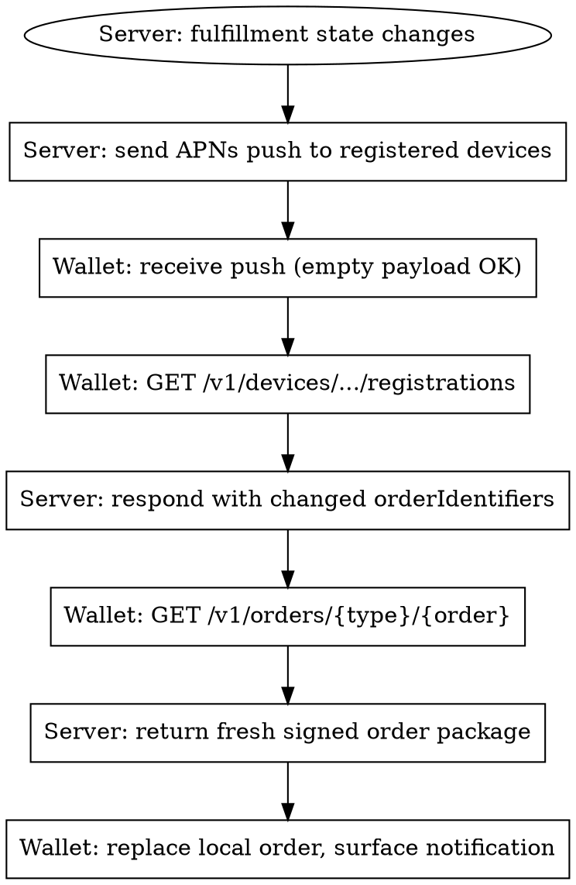

# Orders in Wallet — Post-Purchase Tracking

**You MUST use this skill when surfacing post-purchase order tracking in Wallet.** Orders are *not* Passes, *not* Receipts, and *not* the same as your app's order-history screen — they're signed structured packages with native Wallet UI, system notifications, and lock-screen surfacing. For Wallet passes (boarding / event ticket / loyalty), see `wallet-passes.md`. For the Apple Pay handoff that triggers an order add, see `apple-pay.md`.

## Distinguish: Orders vs Passes vs Receipts

| Surface | When to use | Schema |
|---------|-------------|--------|
| **Orders in Wallet** | Post-purchase fulfillment tracking — physical goods or services with a state lifecycle (placed → shipped → delivered) | Signed order package + Order Type ID Cert |
| **Wallet Passes** | Reusable artifacts the customer carries — tickets, coupons, loyalty cards, store cards | `.pkpass` + Pass Type ID Cert |
| **Receipts (PassKit)** | Per-transaction proof attached to an order or transaction | PDF / image attached to an order package (iOS 17+) |
| **Your app's order history** | App-internal browsing experience | Whatever you store; not a Wallet surface |

The boundaries are: **Order = "what's happening to my purchase"**, **Pass = "what I show to use a thing"**, **Receipt = "proof of a transaction"**. An e-commerce purchase typically generates an Order (in Wallet) and may also include receipt PDFs. An event purchase generates a Pass (the ticket) and optionally an Order (for shipping the printed ticket / merchandise).

## When to Use Orders

Use Wallet Orders when **all four** are true:

1. Customer made a purchase you can attribute (typically post-Apple-Pay)
2. Fulfillment has a meaningful state lifecycle (more than just "completed")
3. You want native Wallet tracking, system notifications, and lock-screen surfacing — not just an app push
4. You can sign and host the order package on your servers

If any of these is false, use a Pass (for ticketing) or just send an in-app push (for trivial fulfillment without state changes).

## Setup

| Step | What |
|------|------|
| 1. **Create an Order Type ID** | Apple Developer portal → Identifiers → Order Type IDs → +. Reverse-DNS form: `order.com.example.shop`. Order Type IDs are independent from Pass Type IDs and Apple Pay merchant IDs. |
| 2. **Generate Order Type ID Certificate** | Same flow as Pass Type ID Cert: CSR → upload → download. Used to **sign the order package**. |
| 3. **Configure server endpoints** | Same five-endpoint pattern as Wallet pass updates (registrations, GET passes, log) — substitute `order` for `pass`. |
| 4. **Configure APNs** | Order Type ID Certificate doubles as the APNs cert. Topic = order type identifier. |

**Order Type ID Certificate ≠ Pass Type ID Certificate ≠ Apple Pay Merchant Cert.** Three separate certs for three separate Wallet surfaces. Mixing them up is a common Phase-6 integration bug.

## Three Paths to Add an Order to Wallet

### Path 1 — Apple Pay Handoff (preferred, WWDC22)

The cleanest path. After a successful Apple Pay payment, attach `PKPaymentOrderDetails` to the auth result. Wallet async-pulls the order package from your server.

```swift
let orderDetails = PKPaymentOrderDetails(
    orderTypeIdentifier: "order.com.example.shop",
    orderIdentifier: "ORD-12345",
    webServiceURL: URL(string: "https://orders.example.com")!,
    authenticationToken: "shared-secret-for-this-order"
)
let result = PKPaymentAuthorizationResult(status: .success, errors: nil)
result.orderDetails = orderDetails    // property; not init parameter
completion(result)
```

This is the most common path because it ties order tracking to the Apple Pay confirmation moment — zero extra customer interaction.

### Path 2 — `AddOrderToWalletButton` (FinanceKitUI, iOS 17+)

For non-Apple-Pay purchases, or when you want an explicit add-to-wallet step:

```swift
import FinanceKitUI

AddOrderToWalletButton(signedArchive: signedOrderPackageData) { result in
    switch result {
    case .success(let saveResult): // FinanceStore.SaveOrderResult
        // order added to Wallet
        break
    case .failure(let error):
        // surface the failure
        break
    }
}
.addOrderToWalletButtonStyle(.black)   // or .blackOutline
```

The initializer takes the **signed order package** as `Data` plus an `onCompletion` handler — there is no `action:` closure. UIKit equivalent surfaces exist for non-SwiftUI hosts; check `/financekitui` for the current names. Use this path when:

- Customer paid with a non-Apple-Pay method but you still want Wallet tracking
- Purchase happened outside the app (web checkout) and the user opens the app to add the order
- You're displaying an existing order in your app's order-history view and want a direct add-to-Wallet shortcut

### Path 3 — Email Attachment

Send the signed order package as an email attachment with MIME type `application/vnd.apple.finance.order`. Customer taps → Wallet opens an Add sheet → order is added.

Useful for legacy / B2B flows where email is the canonical communication channel.

## Order Package Structure

A **signed order package** is the equivalent of a `.pkpass` for orders — a signed bundle with structured data:

| Field | Required | Purpose |
|-------|----------|---------|
| `orderTypeIdentifier` | Yes | Must match your Order Type ID Cert |
| `orderIdentifier` | Yes | Unique within the type |
| `authenticationToken` | Yes | Per-order shared secret (≥16 chars; same rule as pass tokens) |
| `webServiceURL` | Yes | HTTPS base for updates |
| `merchantData` | Yes | Business name, contact info, support links |
| `lineItems` | Yes | Array — each with image (300×300, solid background per HIG), name, price |
| `fulfillment` | Yes | Status, tracking number, carrier, estimated arrival |
| `payment` | Optional | Total + payment method display info |
| `receipts` | Optional (iOS 17+) | Per-transaction receipt attachments — PDF or image |

The package is signed by the **Order Type ID Certificate**, with the Apple WWDR Intermediate Certificate in `extracerts`, the same PKCS #7 detached + S/MIME signing-time pattern as Wallet passes (see `wallet-passes.md` § "Cert + Signing Workflow").

Use a server library if one exists for your stack. Roll-your-own signing for orders has the same gotchas as for passes (missing WWDR, wrong key format, stale manifest).

## Update Flow

Updates use the **same web-service + APNs push** model as Wallet passes:



Wallet-side state is end-to-end encrypted via iCloud sync — your server sees only what it sends; Wallet's UI state isn't readable by you.

## Status Values

| Status | When |
|--------|------|
| `orderPlaced` | Initial state |
| `processing` | Merchant has the order; not yet shipped |
| `readyForPickup` | In-store pickup orders only — ready for the customer |
| `pickedUp` | Pickup order collected |
| `shipped` | Shipped (carrier / tracking unknown or not yet visible) |
| `onTheWay` | In transit with carrier — show tracking |
| `outForDelivery` | Last-mile dispatch |
| `delivered` | Final delivery confirmed |
| `issue` | Problem (delivery failure, refund pending, customer service contact required) |
| `cancelled` | Order cancelled |

### `shippingType` (iOS 17+)

Tells Wallet how to render the fulfillment surface:

| `shippingType` | Use |
|----------------|-----|
| `shipping` | Standard shipping with carrier tracking |
| `delivery` | Local / same-day delivery |
| `pickup` | Customer-pickup-at-location |

Set this consistently with the status values you'll send. A `shippingType: pickup` order using `outForDelivery` doesn't make sense.

## HIG Discipline

| Rule | Why |
|------|-----|
| **Add the order with partial data** if needed | Wallet displays the order even if shipping details aren't known yet — "Check back later for full details." Don't wait until you have everything. |
| **Per-line-item images: solid background, 300×300, no lifestyle photos** | Orders render at small sizes; lifestyle imagery doesn't scale |
| **Universal links for "Manage Order" buttons** | Open the app if installed; web fallback otherwise |
| **Provide multiple contact methods** | Phone, Messages for Business, email, website — different customers prefer different channels |
| **Avoid duplicate notifications** | If Wallet has the order, **disable your in-app push for the same status change**. Wallet shows the system notification; an additional in-app push is noise. Use the `associatedStoreIdentifiers` array on the order package for App Store linkage and suppress your own push when the order is in Wallet. |
| **Don't use Orders for things that aren't orders** | Subscription renewals → use the appropriate Wallet pass type. Orders are for bounded fulfillment lifecycles. |

## Sharing Orders via Messages (iOS 16.4+)

Built-in. Customer can long-press an order in Wallet → Share via Messages. Recipients see a rich preview. **No extra integration on your side** — the system handles it. The only thing to verify: your order package's `merchantData.contactInfo` should be complete, since Messages renders that in the share sheet.

## Order Tracking Widget (iOS 16.4+)

System-provided widget. Automatically picks up active orders from Wallet. Customer adds it to home screen. **No integration on your side** — the system populates it from Wallet's order list.

You don't ship a widget for this; Apple's widget is what customers see.

## Maps Integration (iOS 17+)

For pickup orders, Siri Suggestions surface time + location prompts via Maps:

- Set `pickupLocation` on the fulfillment data with a real `MKPlacemark` / lat-lng
- Set the pickup window (date range)
- The customer gets a "Time to leave for pickup" suggestion based on travel estimate

Don't fabricate the pickup location to a generic address — Siri Suggestions misroute users. Use the actual store's geo coordinates.

## FinanceKit / FinanceKitUI Note

This skill uses `FinanceKitUI` only for the **order-add helpers** (`AddOrderToWalletButton`). The broader **FinanceKit** (consumer banking surface — account aggregation, transaction queries) is **out of scope for axiom-payments** and would belong in a future banking-app suite. Don't conflate the two; the order-add buttons are a small, isolated FinanceKitUI affordance.

## Misuse Cost — Why "It Will Probably Work" Doesn't

When teams propose using Orders for things that aren't orders (subscription renewals, free-trial-to-paid transitions, "engagement" tracking, in-app event reminders), the argument is usually "the cert pipeline is already built; this is free infrastructure." The infrastructure may be cheap to wire up, but the misuse pollutes **shared system surfaces** that other apps' Orders depend on:

| System surface | What misuse breaks |
|----------------|--------------------|
| **Order Tracking widget** (iOS 16.4+) | Renders your "subscription" alongside real e-commerce Orders on the user's home screen with the same status pills (`processing`, `delivered`). User can't distinguish "my Netflix renewed" from "my package shipped." |
| **Messages share sheet** (iOS 16.4+) | Long-press → Share renders the rich preview using `merchantData.contactInfo`. Subscription "Orders" produce share previews that say "I just shared my Netflix delivery with you." |
| **Maps Siri Suggestions** (iOS 17+) | If you set `pickupLocation` on a fake "pickup" subscription order, Siri proactively suggests "Time to leave for pickup" — routing the user to a store for a streaming service. If you skip `pickupLocation`, the system widget renders an empty pickup affordance. Either way, broken UX. |
| **Wallet's order grouping** | Wallet groups Orders by recency and status. A subscription that flips `processing` → `delivered` every billing cycle thrashes the grouping algorithm — stale "active" orders pile up; "Recently delivered" shows your subscription rebill alongside real arrivals. |
| **App Review** | Reviewers screenshot the system widget and the Messages share preview. "Renewal day delivered today" reads as misleading. The rejection language varies but the underlying rule is: don't pretend platform schemas mean what they don't mean. |

The cost isn't "Apple might reject you." The cost is **the user's shared Wallet experience degrades**, your reviews start mentioning "weird Wallet behavior," and removing the misuse later requires invalidating every order package in flight (because rolling status forward to `cancelled` triggers another notification cycle, and there's no schema for "ignore me, I shouldn't have been here").

## Canonical Subscription-Tracking Surface (When the Real Need Is "Show Renewal Date / Trial Countdown")

If the underlying request is "show the user when their subscription renews" or "remind them when their trial ends," the platform-blessed surfaces — none of which require Order Type ID Certs, signing servers, APNs topics, or web service URLs — are:

| Need | Surface | API |
|------|---------|-----|
| Read current subscription state, renewal date, expiration, trial-end | StoreKit 2 | `Product.SubscriptionInfo.Status` (latest verification, renewal info, expiration intent) |
| Show renewal countdown / trial countdown on lock screen + Dynamic Island | ActivityKit | `ActivityAttributes` + `Activity<Attributes>.request(...)` |
| Show renewal date on home screen / Smart Stack | WidgetKit | TimelineProvider keyed off `Product.SubscriptionInfo.Status.renewalDate` |
| Send the user to Apple's cancel/manage UI | StoreKit | `AppStore.showManageSubscriptions(in:)` (iOS 15+) or `Environment(\.openURL)` to `itms-apps://...` |
| Notify on renewal / lapse server-side | App Store Server Notifications V2 | `RENEWAL`, `DID_FAIL_TO_RENEW`, `EXPIRED` events |

This stack:
- Doesn't require Apple-managed certs
- Doesn't pollute system Wallet surfaces
- Surfaces the cancel affordance (which Manage Subscriptions does and Wallet Orders does not — relevant under §3.1.2 customer-trust rules)
- Is what App Review expects when the goal is "render subscription state on system surfaces"

Cite this stack when pushing back on Wallet-Orders-for-subscriptions proposals; it's not "we can't" but "the platform already gave you the right surface, and it's cheaper."

## Anti-Patterns

| Anti-Pattern | Why it fails | Fix |
|--------------|--------------|-----|
| Using Orders for subscription renewals | Subscriptions don't have an order-fulfillment lifecycle | Use the right Wallet pass type, or stick with IAP / Apple Pay confirmations |
| Signing order packages with the Apple Pay merchant cert | Wrong cert; Wallet rejects | Use Order Type ID Certificate |
| Signing order packages with the Pass Type ID cert | Different surface, different cert | Use Order Type ID Certificate |
| Sending Wallet-style change notifications when in-app push covers the same change | Customer gets duplicate notifications | Configure dedup; pick one channel for the same state change |
| Setting `PKPaymentAuthorizationResult.orderDetails` via init parameter | The orderDetails is a property, not an init arg | Set on the result after construction |
| Treating Orders like Passes | Different schema, different signing identity, different lifecycle | Read this skill plus `wallet-passes.md` to see the boundary |
| `authenticationToken` shorter than 16 chars | Same constraint as pass tokens | ≥16 chars (32+ recommended) |
| Lifestyle photos for line-item images | Don't scale at Wallet's display sizes | 300×300 solid-background product shots |
| Forgetting `shippingType` on iOS 17+ | Wallet renders generic UI; loses pickup-vs-delivery distinction | Always set `shippingType` for iOS 17+ targets |

## Pre-Launch Checklist

- [ ] Order Type ID created in Apple Developer portal
- [ ] Order Type ID Certificate generated, exported, deployed to signing server
- [ ] WWDR Intermediate Certificate available in signing pipeline
- [ ] Order package signing tested (PKCS #7 + S/MIME signing-time + WWDR)
- [ ] Five web-service endpoints implemented (registrations + GET orders + log)
- [ ] APNs configured with Order Type ID Cert as topic
- [ ] Notification dedup configured between in-app push and Wallet push
- [ ] All status values mapped from your fulfillment system
- [ ] `shippingType` set for iOS 17+ targets
- [ ] Per-line-item images at 300×300 with solid backgrounds
- [ ] Universal link for "Manage Order" tested (app fallback to web)
- [ ] Pickup orders include real geo coordinates for Maps integration
- [ ] Apple Pay handoff path tested (`PKPaymentOrderDetails`)
- [ ] FinanceKitUI `AddOrderToWalletButton` path tested if applicable
- [ ] Email-attachment path tested if applicable

## Resources

**Docs**: /walletorders, /walletorders/order, /walletorders/orderfulfillment, /financekit, /financekitui, /financekitui/addordertowalletbutton, /passkit/pkpaymentorderdetails

**WWDC**: 2022-10041, 2023-10114

**Tech Talks**: 110336

**HIG**: /design/human-interface-guidelines/wallet

**Skills**: wallet-passes, apple-pay, wallet-passes-ref, payments-diag, axiom-design/hig
