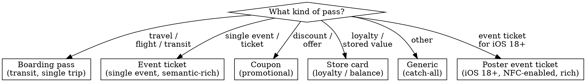

# Wallet Passes — Building, Signing, Distributing, Updating

**You MUST use this skill for ANY Wallet pass integration** — boarding passes, event tickets, coupons, loyalty cards, store cards, generic passes. The signing chain (PKCS #7 detached + WWDR intermediate + S/MIME signing-time + manifest hashing) is the most long-lived and confusing part of the entire payments suite. Most teams burn 4–8 hours debugging signing on first integration before discovering missing WWDR, wrong key format, or a stale manifest — use a maintained server library to skip this. For order tracking (post-purchase) see `wallet-orders.md`. For pass.json schema details see `wallet-passes-ref.md`.

## Pass Anatomy

A **`.pkpass`** is a signed zip bundle. Required contents:

| File | Purpose | Required |
|------|---------|----------|
| `pass.json` | Pass description + metadata | Yes |
| `manifest.json` | SHA-1 hash dictionary covering every other file in the bundle (except `manifest.json` and `signature` themselves) | Yes |
| `signature` | PKCS #7 detached signature of `manifest.json`, signed by the pass-type-cert private key | Yes |
| `icon.png`, `icon@2x.png`, `icon@3x.png` | Pass icon (lock-screen + notifications + email attachment) | Yes |
| `logo.png` (+ `@2x`, `@3x`) | Top-of-pass branding | Common |
| `strip.png`, `background.png`, `thumbnail.png`, `footer.png` | Pass-style-specific imagery | Optional |
| `<lang>-<region>.lproj/` | Localization directories — image overrides + `pass.strings` | Optional |

**`.pkpass` is a renamed `.zip` file.** That's the entire packaging spec. Most signing failures originate from skipping the manifest hashing step or signing the wrong file.

## Pass Type Identifier + Serial Number

Two strings form the unique key:

| Key | Format | Behavior |
|-----|--------|----------|
| `passTypeIdentifier` | Reverse DNS — e.g. `pass.com.example-company.passes.ticket` | Created in Certificates, IDs & Profiles. **One certificate per identifier.** Multiple passes share an identifier. |
| `serialNumber` | Any string | You choose. Unique within an identifier. Re-issuing a pass with the same `(passTypeIdentifier, serialNumber)` **replaces** the prior pass on the user's device. |

Re-using `(identifier, serialNumber)` is how you push updates without explicit web-service round-trips — a fresh `.pkpass` overwrites the old. Don't recycle serial numbers across customers; each unique pass needs its own.

## Pass Styles



| Style key in pass.json | Use |
|------------------------|-----|
| `boardingPass` | Transit, single trip — flight, train, bus, ferry |
| `eventTicket` | Single-event admission |
| `coupon` | Promotional / discount; supports NFC for lock-screen contactless |
| `storeCard` | Loyalty card, store balance, gift card |
| `generic` | Anything that doesn't fit a typed style |

A pass declares **exactly one** of these style keys. They are mutually exclusive.

**Poster Event Ticket (iOS 18+)** is *not* a separate style key — it's a rendering scheme layered on top of `eventTicket`. Opt in via the top-level `preferredStyleSchemes: ["posterEventTicket"]` plus rich semantic tags + poster art. **Not compatible with QR/barcode-only entry** — pair with NFC or fall back to legacy event-ticket rendering. See § "iOS 18 Poster Event Ticket Migration" below.

## Required Keys

Every pass must include these top-level keys:

```json
{
  "formatVersion": 1,
  "passTypeIdentifier": "pass.com.example.event",
  "serialNumber": "EVT-2026-00042",
  "teamIdentifier": "ABCDE12345",
  "organizationName": "Example Events",
  "description": "Event ticket for Apr 15 Concert"
}
```

`description` is the **VoiceOver-accessible** description — it's read aloud by VoiceOver. Don't repeat the visible label; describe the pass meaningfully.

## Cert + Signing Workflow (the long-lived pain point)

This is where most integrations break. The mechanics are unchanged since 2012, but every step has a documented gotcha.

### Step 1 — Create the Pass Type ID

Apple Developer portal → Certificates, IDs & Profiles → Identifiers → Pass Type IDs → +. Reverse-DNS form. Pass Type IDs are independent of merchant IDs (Apple Pay) — they don't overlap.

### Step 2 — Generate a CSR

On the Mac that will hold the signing key:

```
Keychain Access → Certificate Assistant → Request a Certificate from a Certificate Authority
→ Save to Disk
```

This produces a `.certSigningRequest` file containing your public key + identity info.

### Step 3 — Generate the Pass Type ID Certificate

Apple Developer portal → Certificates → + → Pass Type ID Certificate → select the Pass Type ID → upload CSR → download `.cer`.

Double-click the `.cer` to add it to Keychain. The private key generated in Step 2 is now paired with this certificate in your Keychain.

### Step 4 — Get the Apple WWDR Intermediate Certificate

The PKCS #7 signature must include Apple's WWDR (Worldwide Developer Relations) Intermediate Certificate as an `extracerts` entry. This is the cert that signs the leaf Pass Type ID Certificate.

Download from `apple.com/certificateauthority/`. Use the **current** WWDR intermediate (G6 as of writing; verify expiry — it rotates every several years).

> **Common signing failure: "missing WWDR cert".** Pass type cert is a leaf. Without the WWDR intermediate in `extracerts`, Wallet can't validate the signature chain. The pass imports as "invalid."

### Step 5 — Build the Manifest

Compute SHA-1 of every file in the pass bundle **except `manifest.json` and `signature`**. Use forward-slash relative paths. Result is a JSON dictionary:

```json
{
  "icon.png": "2a1625e1e1b3b38573d086b5ec158f72f11283a0",
  "icon@2x.png": "7321a3b7f47d1971910db486330c172a720c3e4b",
  "logo.png": "0e12af882204c3661fd937f6594c6b5ffc6b8a49",
  "pass.json": "ef3f648e787a16ac49fff2c0daa8615e1fa15df9",
  "en.lproj/logo.png": "cff02680b9041b7bf637960f9f2384738c935347",
  "en.lproj/pass.strings": "aaf7d9598f6a792755be71f492a3523d507bc212"
}
```

Write to `manifest.json` at the bundle root.

### Step 6 — Sign the Manifest

PKCS #7 detached signature of `manifest.json`:

| Property | Value |
|----------|-------|
| Signed data | `manifest.json` bytes |
| Signing key | Pass Type ID Certificate's private key (RSA) |
| `extracerts` | Apple WWDR Intermediate Certificate |
| Hash algorithm | SHA-1 (OpenSSL default; matches the SHA-1 manifest hashes). Wallet also accepts SHA-256 — pass `-md sha256` if your environment requires it. |
| **Detached** | Yes (the `signature` file does **not** contain the manifest itself, only the signed envelope) |
| **S/MIME signing-time attribute** | Required |

Output goes to a binary file named `signature` at the bundle root.

OpenSSL one-liner (after splitting your pass-type cert's `.p12`):

```bash
openssl smime -binary -sign \
    -certfile WWDR.pem \
    -signer pass_cert.pem \
    -inkey pass_key.pem \
    -in manifest.json \
    -out signature \
    -outform DER
```

**Common failure modes:**
- Missing `-certfile WWDR.pem` → cert chain incomplete; pass imports as "invalid"
- Wrong-format key (PEM vs DER vs PKCS #1 vs PKCS #8) → `openssl` errors during signing
- `-in manifest.json` from a stale build → signature valid but doesn't match current bundle contents
- Path-handling quirks in OpenSSL bindings for PHP / Node / Ruby — some environments require absolute paths; some require stripping `file://` URIs. Test with hand-run OpenSSL first, then port to your binding

### Step 7 — Zip and Rename

```bash
cd path/to/pass-bundle
zip -r ../my.pkpass . -x ".DS_Store"
```

Note the `-x ".DS_Store"` exclusion — `.DS_Store` files include themselves in the manifest = invalid pass. macOS creates them automatically; you must exclude during zip.

### Step 8 — Test on Simulator

Drag the `.pkpass` onto a running iOS Simulator. Wallet shows the "Add" sheet if valid. If silent, the pass failed validation; check signing chain and manifest hashes.

### Step 9 — Verify the signature before distributing

A silent Simulator failure doesn't tell you *why*. Run two checks before emailing a single real pass — together they catch the #1 failure (missing WWDR intermediate) without waiting for a customer to report a broken pass.

**1. Confirm the WWDR intermediate is actually embedded.** A leaf-only signature imports as "invalid":

```bash
openssl pkcs7 -inform DER -in signature -print_certs -noout
# You must see TWO certificates: your Pass Type ID leaf AND the Apple WWDR intermediate.
# Only one (the leaf) = WWDR is missing → Wallet rejects the pass.
```

**2. Confirm the detached signature matches the current manifest** (catches a stale `manifest.json`, a tampered bundle, or the wrong signing key):

```bash
openssl smime -verify -in signature -inform DER -content manifest.json -noverify
# "Verification successful" = the envelope is well-formed and the signature matches manifest.json.
# A digest/verify error = stale manifest, tampered bundle, or wrong key.
```

`-noverify` disables trust-root checking — so you don't need Apple's root on hand to validate structure + content match. It does **not** inspect the cert chain, which is exactly why check 1 lists the embedded certs directly. (To also verify against a trust store, drop `-noverify` and pass `-CAfile` with Apple's root.) A clean result from both checks plus a successful Simulator "Add" is the minimum gate before distribution.

> **Recommendation: don't roll your own signing.** Server-side libraries exist for Node (`passkit-generator`), Ruby (`pkpass`), Python (`wallet-py3k`, `python-passkit`), Go, and others. Use one. Most signing failures in production come from scratch implementations.

## Distribution Channels

| Channel | Implementation | UX |
|---------|---------------|-----|
| **In-app `PKAddPassButton`** | UIKit button → `PKAddPassesViewController` | Customer reviews then taps Add |
| **Email attachment** | MIME type `application/vnd.apple.pkpass` | Customer taps attachment → Wallet opens Add sheet |
| **Web download** | Same MIME type, `Content-Disposition: attachment` (or omit; Wallet handles) | Customer taps "Add to Apple Wallet" button → file downloads → Add sheet appears |
| **Multi-pass bundle** | Zip multiple `.pkpass` files into a `.pkpasses` (note plural) zip; MIME type `application/vnd.apple.pkpasses` | Up to 10 passes per bundle; max 150 MB total |

Use the **"Add to Apple Wallet"** button graphic (HIG-supplied) on web/email, not a custom CTA. See `axiom-design/skills/hig.md` for placement rules.

## Web Service for Updates

The web service lets you push pass changes (gate change, time change, balance change) without re-emailing.

### Required `pass.json` keys for updates

```json
{
  "webServiceURL": "https://api.example.com/wallet/v1",
  "authenticationToken": "shared-secret-per-pass-instance"
}
```

`authenticationToken` is per-pass and per-user; rotate when needed. Apple specifies **at least 16 characters** — a long random token (32+ chars from a CSPRNG) is the safe default.

### Required HTTPS endpoints (Apple-defined)

| Method | Path | Purpose |
|--------|------|---------|
| POST | `/v1/devices/{deviceLibraryIdentifier}/registrations/{passTypeIdentifier}/{serialNumber}` | Register a device for pass updates |
| DELETE | Same path | Unregister |
| GET | `/v1/devices/{deviceLibraryIdentifier}/registrations/{passTypeIdentifier}?passesUpdatedSince={tag}` | List updated passes |
| GET | `/v1/passes/{passTypeIdentifier}/{serialNumber}` | Fetch latest pass bundle (return updated `.pkpass`) |
| POST | `/v1/log` | Wallet-side error log relay |

Authentication is via `Authorization: ApplePass <authenticationToken>` header on every request. Validate it.

### Update flow

```
[1] You change the pass on your server (e.g. gate change)
[2] You send an APNs push to all device tokens registered for that pass
[3] Wallet receives push, calls GET /v1/devices/.../registrations/...
[4] Your server returns list of changed serialNumbers
[5] Wallet calls GET /v1/passes/{type}/{serial} for each
[6] Your server returns updated, signed .pkpass
[7] Wallet replaces the local pass
```

### APNs config

The APNs cert for pass updates is the **same Pass Type ID Certificate** you used to sign the pass. Don't create a separate APNs cert.

- **Topic:** the pass type identifier (e.g. `pass.com.example.event`)
- **Production:** `api.push.apple.com:443`
- **Token-based** (HTTP/2): preferred over legacy binary APNs
- **Empty payload is allowed** — Wallet doesn't read the payload; the push is just a "go check for updates" trigger

### Discipline: only push for time-critical changes

> Only send change messages for changes the customer actually needs to see immediately. **Gate change: yes.** Customer service phone number change: no.

Wallet displays a notification banner when `changeMessage` strings are set on changed fields. Spammy updates erode trust and Apple may rate-limit your push topic.

## Lock-Screen Relevance

A pass becomes "relevant" — and Wallet surfaces it on the lock screen — based on date and/or location:

| Key | Type | Use |
|-----|------|-----|
| `relevantDate` | W3C ISO 8601 timestamp | Show pass starting around this time |
| `locations` | array (max 10) of `{ latitude, longitude, altitude?, relevantText? }` | Show pass when user is near any location |
| `beacons` | array (max 10) of `{ proximityUUID, major?, minor?, relevantText? }` | iBeacon-based proximity (rare; mostly retail) |

| Pass style | Relevance rule |
|------------|----------------|
| `boardingPass` | `relevantDate` is the primary driver; add `locations` (departure airport/terminal) to broaden surfacing |
| `eventTicket` | `relevantDate` is the primary driver; add `locations` (venue) to broaden surfacing |
| `coupon` | `locations` only (where the customer can redeem) |
| `storeCard` | `locations` only (where the card is useful) |
| `posterEventTicket` rendering (iOS 18+) | `relevantDate` drives Live Activity auto-start |

Set `relevantDate` even if the event is days away — Wallet auto-hides expired passes if you also set `expirationDate` and/or `voided`.

## NFC Payloads (Issuer-Controlled)

For passes that act as a contactless tag — boarding gates, transit, loyalty redemption — include an `nfc` object:

```json
{
  "nfc": {
    "message": "your-encoded-payload",
    "encryptionPublicKey": "<base64 ECC P-256 public key>"
  }
}
```

NFC pass payloads require a **separate Apple Developer entitlement** (NFC Pass Encoding). Submit a request with your use case; Apple gates approval. NFC for payment cards (issuer/bank apps) is `wallet-extensions-ref.md` territory.

For Wallet **reading** an NFC pass (merchant-side, e.g. loyalty pass at point-of-sale), see `tap-to-pay.md` — accepting loyalty passes via ProximityReader is part of the Tap to Pay surface.

## iOS 18 Poster Event Ticket Migration (WWDC24)

iOS 18 introduced `posterEventTicket` — a richer ticket experience with full-bleed poster art, automatic event guide (Maps shortcut, weather, venue map, parking, music integration via MusicKit), and Live Activity auto-start.

### Migration checklist

- Add `preferredStyleSchemes: ["posterEventTicket"]` to the pass
- Populate **semantic tags** richly: `eventName`, `eventStartDate`, `eventEndDate`, `venueName`, `venueLocation`, `performerNames`, `seats`, etc.
- Provide **poster art** at the required resolutions (see `wallet-passes-ref.md` image table for `posterEventTicket` specs)
- Use the **footer color** to declare the action-tile color
- Keep `primaryFields` / `secondaryFields` / `auxiliaryFields` populated for backward compatibility — older OS versions render the legacy event ticket layout
- For NFC-gated entry, add an `nfc` block (requires entitlement)

> `posterEventTicket` is **not compatible with QR/barcode-only entry**. If your venue scans QR codes, either render the poster style with NFC or skip the new style and use the legacy `eventTicket`.

### Event guide

Wallet auto-generates the event guide from semantic tags + Maps + Apple Music. You don't write the event guide content — it appears automatically when semantic tags are populated. Sparse tags = sparse guide.

## Auto-Hide Expired Passes (WWDC21)

Set these and Wallet will auto-hide:

```json
{
  "expirationDate": "2026-04-15T22:00:00-08:00",
  "voided": false,
  "relevantDate": "2026-04-15T18:00:00-08:00"
}
```

Set `voided: true` after a coupon is redeemed, a ticket is scanned, or a gift card is depleted. Wallet hides voided passes from the main list automatically.

## Localization

Two mechanisms work together:

### 1. System-formatted values (automatic)

Date / currency / number values use field formatters and localize automatically — no `.lproj` directory needed:

```json
{
  "key": "expires",
  "label": "Expires",
  "value": "2026-04-15T20:00:00Z",
  "dateStyle": "PKDateStyleShort",
  "timeStyle": "PKDateStyleShort",
  "isRelative": true
}
```

A device set to French / Arabic / etc. renders the date in that locale even if you provide no localization files.

### 2. Strings localization (`.lproj/pass.strings`)

For translatable labels and values, set them as **keys** in `pass.json` and provide `pass.strings` per locale:

```
my-pass.pass/
├── pass.json
├── manifest.json
├── signature
├── icon.png ...
├── en.lproj/
│   ├── logo.png
│   └── pass.strings
└── zh-Hans.lproj/
    ├── logo.png
    └── pass.strings
```

`en.lproj/pass.strings`:

```
"OfferAmount" = "100% off";
"OfferAmountLabel" = "Anything you want!";
```

**Use UTF-16 encoding** for non-ASCII pass.strings files.

Localized images go in the `.lproj` directory and override top-level files. Each locale directory must contain the same file set.

## Anti-Patterns

| Anti-Pattern | Why it fails | Fix |
|--------------|--------------|-----|
| Roll-your-own pass bundling instead of a server library | PKCS #7 detached signature + WWDR + S/MIME signing-time + manifest + zip is fragile to assemble correctly; most signing failures originate here | Use a maintained server library |
| Forgetting WWDR Intermediate cert in PKCS #7 signature | Pass imports as "invalid" — chain doesn't verify | Pass `-certfile WWDR.pem` to OpenSSL or equivalent in your library |
| Including `.DS_Store` in the bundle | Manifest hashes a file Wallet rejects | `zip -x ".DS_Store"` |
| Embedding text in images | Images don't render on Apple Watch; text isn't accessible to VoiceOver | Use `pass.json` fields for text |
| Putting essential info in fields that don't appear on Apple Watch | Watch shows primary + secondary fields only — back fields, thumbnail, footer don't surface | Put critical info in primary/secondary |
| Modifying the APNs cert separately from pass-type cert | They're the same cert; you reuse it | One cert, two purposes |
| Using deprecated `barcode` (singular) without `barcodes` array | Doesn't render on iOS 9+ | Use `barcodes` array |
| Setting `webServiceURL` without an authenticationToken | Wallet won't register | Provide both, or neither |
| `authenticationToken` shorter than 16 chars | Apple specifies ≥16 chars; non-conforming tokens are rejected at registration in practice | Generate ≥16 chars (32+ recommended) per pass |
| Wrong WWDR generation (using G4 when G6 is current) | Chain doesn't verify | Use the current WWDR Intermediate from `apple.com/certificateauthority/` |
| Using `file://` prefix in OpenSSL paths from server bindings | OpenSSL bindings in PHP / Node sometimes need it; sometimes break with it | Strip when calling OpenSSL directly; check binding-specific behavior |

## Pre-Build Pre-Flight Checklist

- [ ] All required `pass.json` keys present (`formatVersion`, `passTypeIdentifier`, `serialNumber`, `teamIdentifier`, `organizationName`, `description`)
- [ ] Exactly one style key present (`boardingPass` / `eventTicket` / `coupon` / `storeCard` / `generic`)
- [ ] If using poster-event-ticket rendering: `preferredStyleSchemes: ["posterEventTicket"]` set on an `eventTicket` pass; semantic tags + poster art populated
- [ ] `passTypeIdentifier` matches your Pass Type ID Certificate
- [ ] `teamIdentifier` matches your Apple Developer Team ID
- [ ] All required images present at `1x`, `@2x`, `@3x` resolutions for each asset the style requires
- [ ] No `.DS_Store` files in the bundle
- [ ] `manifest.json` present with SHA-1 of every other file (forward-slash paths, no leading `./`)
- [ ] `signature` file present, PKCS #7 detached, signed by pass-type private key
- [ ] WWDR Intermediate Certificate included in `extracerts`
- [ ] S/MIME signing-time attribute present
- [ ] Date strings are valid ISO 8601
- [ ] `description` is meaningful (it's read by VoiceOver)
- [ ] Localization folders contain matching file sets

## Web Service Pre-Flight Checklist

- [ ] `webServiceURL` is HTTPS (not HTTP)
- [ ] `authenticationToken` is ≥16 chars and unique per pass instance
- [ ] All five Apple-defined endpoints implemented
- [ ] Each endpoint validates the `Authorization: ApplePass <token>` header
- [ ] APNs configured with the **same** Pass Type ID Certificate
- [ ] APNs topic = pass type identifier
- [ ] Push test: a known-registered device receives a push and your server logs the GET /devices/.../registrations call
- [ ] Updated `.pkpass` from `GET /v1/passes/{type}/{serial}` is properly re-signed (manifest + signature regenerated)

## Resources

**Docs**: /walletpasses, /walletpasses/building-a-pass, /walletpasses/creating-the-source-for-a-pass, /walletpasses/distributing-and-updating-a-pass, /walletpasses/adding-a-web-service-to-update-passes, /walletpasses/pass, /walletpasses/passfields, /passkit/pkaddpassbutton, /passkit/pkaddpassesviewcontroller, /passkit/pkpasslibrary

**Archived (still authoritative for PKCS #7 + manifest internals)**: Wallet Developer Guide — `library/archive/documentation/UserExperience/Conceptual/PassKit_PG`

**WWDC**: 2021-10092 (multipass downloads, auto-hide expired), 2024-10108 (poster event ticket style for iOS 18, semantic tags, event guide)

**HIG**: /design/human-interface-guidelines/wallet (image specs, Apple Watch layout, design rules)

**Apple Cert Authority**: apple.com/certificateauthority (download Apple WWDR Intermediate Certificate)

**Add to Apple Wallet button**: /wallet/add-to-apple-wallet-guidelines

**Skills**: wallet-passes-ref (pass.json schema), wallet-orders (post-purchase tracking), tap-to-pay (NFC pass reading at point-of-sale), payments-diag (signing failure modes), apple-pay (sibling under axiom-payments), axiom-security/keychain-ref (cert export), axiom-design/hig (Wallet pass design + Add button placement), axiom-shipping (Wallet pass distribution outside app)
