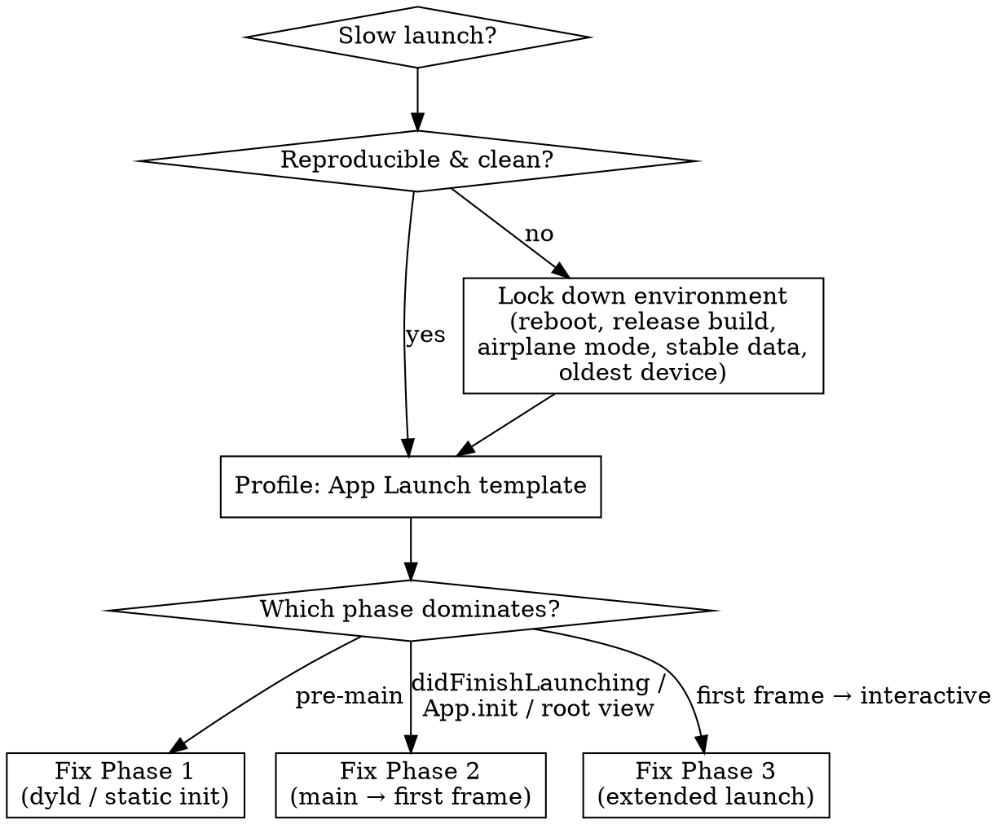

# App Launch Performance

Diagnose and fix slow app launch — from the moment the user taps the icon to the moment the first frame is interactive. The target Apple sets is **first frame within ~400 ms**, app interactive by the time the launch animation finishes. iOS runs a watchdog that *terminates* apps that overrun the launch budget.

This skill owns the launch-specific workflow. It cross-links — does not duplicate — Instruments/signpost mechanics (`performance-profiling`, `xctrace-ref`), `MXAppLaunchMetric` field data (`metrickit-ref`), and main-thread analysis (`hang-diagnostics`).

## Red Flags — Check This Skill When

| Symptom | This skill applies |
|---|---|
| App takes >1 s (new device) or >2 s (old device) to show its first screen | Yes |
| Launch is fine on your phone, slow on users' older phones | Yes — measure on the oldest supported device |
| First screen appears but is frozen for a moment before it responds | Yes — Phase 3 / extended launch |
| Xcode Organizer "Launches" pane flags a regression | Yes |
| App is slow to come up after tapping a push notification | Yes — notification-launch path |
| App is slow only when returning from the background (app switcher) | No — that's a *resume*, not a launch. Don't measure it as one. |
| App is responsive but generally sluggish during use | No → `performance-profiling` |
| UI is completely frozen mid-session | No → `hang-diagnostics` |

## Launch vs Resume — Get the Vocabulary Right

| Type | When | Cost | Reproduce |
|---|---|---|---|
| **Cold launch** | After reboot, or after the system evicted the app from memory | Highest, most variable | Restart device, wait ~30 s for boot work to settle, then launch |
| **Warm launch** | App relaunched soon after being force-quit; frameworks still cached in memory | Lower, more consistent — Apple recommends measuring this | Force-quit (swipe up in app switcher), wait ~5 s, launch |
| **Hot launch / resume** | User re-enters from app switcher or Home Screen; process still alive | Near-instant | Background the app, immediately return — **this is not a launch; never measure it as one** |
| **Notification launch** | User taps a push notification; a launch carrying a deep-link/action payload | Cold or warm + payload resolution | Background, send a push (`xcrun simctl push` or server), tap it |

## The Launch Phase Model


In Instruments these map to the **App Life Cycle timeline**: process initialization → UIKit initialization → UIKit initial scene rendering → initial frame rendering, plus the app-owned "extended" tail.

### Phase 1 — Pre-main (before your `main()` runs)

The dynamic loader (`dyld`) maps the executable, loads every linked framework/dylib, and resolves symbols. Then the runtime runs static initializers. Roughly 100 ms of fixed system work *plus* whatever your dependencies add.

What costs time here:
- **Number of dynamically-linked frameworks.** Each one adds dyld work. Built-in system frameworks (CoreFoundation, etc.) are nearly free (shared memory across processes); third-party embedded frameworks are not.
- **Static initializers that run before `main()`:** C++ static constructors, Objective-C `+load` methods, `__attribute__((constructor))` functions, and entries in `__DATA,__mod_init_func`.
- **Forced eager evaluation in Swift.** Swift global `let`/`var` and stored type properties are computed *lazily* on first access — they do **not** run pre-main. Pre-main Swift cost shows up only via Obj-C-interop `+load`, C/C++ constructors, or code you force to run eagerly.
- `dlopen` / `NSBundle.load` at launch — forfeits the dyld launch-closure win.

Measure it with the **`dyld Activity`** instrument (static-initializer timings) or the App Launch template's pre-main lanes.

### Phase 2 — main → first frame

System creates `UIApplication` and your delegate, then your code runs:
- UIKit (no scenes): `application(_:willFinishLaunchingWithOptions:)` → `application(_:didFinishLaunchingWithOptions:)` → create root view controllers here.
- UIKit (UIScene): `willFinish`/`didFinishLaunching` still fire, but **create root view controllers in `scene(_:willConnectTo:options:)`**, not in `didFinishLaunching`. Doing both is a common bug.
- SwiftUI: `App.init()` then `App.body` (`Scene`/root `View`). Heavy work in either blocks the first frame.
- Then layout + draw of the first frame's view hierarchy.

The launch cycle does not complete until your delegate methods *return*. Anything synchronous and slow here — disk I/O, network, decoding, big data loads — is straight-up launch time.

### Phase 3 — first frame → interactive (extended launch)

The launch metric stops at the first frame, but the user's experience doesn't. If your first frame has placeholders for async data, the app must already be interactive — and you should *measure* the extended tail yourself with signposts (and optionally `MXMetricManager.extendLaunchMeasurement(forTaskID:)` for field data).

## Decision Path



## Triage Without Instruments (deadline mode)

You do **not** need an Instruments session to start — a code-review pass of the launch path is a legitimate first move, and there's a zero-setup pre-main breakdown:

- **`DYLD_PRINT_STATISTICS=1`** (Xcode → Edit Scheme → Run → Arguments → Environment Variables) prints Phase-1 timings to the console at launch — total pre-main time, dylib loading, rebase/bind, ObjC setup, initializers — with no Instruments needed. If pre-main is small (~100–200 ms), the problem is your code (Phase 2/3) — go to the next bullet. If it's large, the cause is framework count and/or `+load` work — that's usually *not* a safe same-night fix (file it for the next release) so pivot to Phase 2 anyway for the quick win.
- **Read the launch path directly:** `application(_:didFinishLaunchingWithOptions:)` / `scene(_:willConnectTo:options:)` / `App.init()` / `App.body` / root `viewDidLoad` / first `View.body`. Walk the "Fixes by Phase → Phase 2" list below as a checklist — analytics/SDK init, synchronous network, `SELECT *` at launch, `ModelContainer`/`@Query` setup, heavy view hierarchy, priority inversions.
- **Bisect on a real device:** comment out SDK initializers one at a time, watch `DYLD_PRINT_STATISTICS` + the launch console log.
- **Verify the win** with the `XCTApplicationLaunchMetric` test (below), ideally on a real device — minutes, not an Instruments session.

Do the full Instruments + hygiene pass when you have time; this is the under-deadline path, not a replacement.

## Measurement Hygiene (do this before profiling)

Field devices are noisy; an unstable baseline tells you nothing. Before you measure:
- **Reboot the device** and wait a few minutes for boot-time work to settle.
- **Use a Release build** (Profile scheme) — debug overhead and missing optimizations distort everything.
- **Cut network variance** — airplane mode, or mock network dependencies in code.
- **Stabilize iCloud** — use an unchanging account/data, or sign out.
- **Use fixed mock data sets** — ideally one small and one large; load only what the first screen needs.
- **Pick a device set and stick to it** — include your oldest supported device; performance characteristics differ wildly from the newest.
- **Measure warm launches** for consistency; measure cold launches separately when that's the case you care about.
- **Profiling ≠ measuring.** Instruments adds overhead (a 6 ms phase can show 149 ms under the profiler). Profile to *find* the work; use `XCTApplicationLaunchMetric` to *measure* the real number.

## Tools

| Tool | Use it for | Cross-link |
|---|---|---|
| Instruments **App Launch** template | The triage workhorse — time profile + thread-state trace, broken into launch phases. Configure target, hit record, read which phase dominates and which thread is blocked. "Extended Launch" captures the full flow. | `performance-profiling` |
| Instruments **dyld Activity** | Static-initializer timings, dyld closure cost | `performance-profiling` |
| `xctrace record --template 'App Launch' --launch -- <app>` | Headless / CI launch profiling | `xctrace-ref` |
| Xcode Organizer — **Launch Time** pane | Field ms (50th/90th pct) by device & OS, version-over-version | — |
| Xcode Organizer — **Launches** pane | Longest functions during startup, with stack traces and a 14-day trend | — |
| `XCTApplicationLaunchMetric` (XCTest) | Regression gate in CI — see snippet below | `axiom-testing` |
| `MXAppLaunchMetric` (MetricKit) | Field histograms: `histogrammedTimeToFirstDraw`, `histogrammedOptimizedTimeToFirstDraw` (prewarmed), `histogrammedApplicationResumeTime`, `histogrammedExtendedLaunch`; `MXDiagnosticPayload.appLaunchDiagnostics` for slow-launch stacks | `metrickit-ref` |
| MetricKit 27 launch family `OS27` | Typed field metrics `.timeToFirstDraw` / `.optimizedTimeToFirstDraw` / `.applicationResumeTime` / `.extendedLaunch`, the `.appLaunch` diagnostic with launch stacks, and `MetricManager.trackLaunchTask(id:)` to instrument named extended-launch work (`@MainActor`, sync/async overloads) | `metrickit-ref` Part 1 |
| App Store Connect — "App Extended Launch Usage" report | Field extended-launch data (iOS 17.4+, daily) | — |
| Custom **Points of Interest** signpost | Marking your own "app is interactive" boundary | `performance-profiling` |

### Custom "app is interactive" signpost

When your real interactive point is *after* the first frame (async data, document open), bracket it with a signpost so it shows up in the Points of Interest instrument.

Swift:
```swift
import OSLog
let launchLog = OSSignposter(subsystem: "com.example.app", category: .pointsOfInterest)

// at the start of launch-critical setup
let state = launchLog.beginInterval("Launch → interactive")
// ... later, once the screen is genuinely usable
launchLog.endInterval("Launch → interactive", state)
```

Objective-C uses `os_signpost(OS_SIGNPOST_INTERVAL_BEGIN/END, log, "Launch → interactive")` with an `OSLog` created with the `OS_LOG_CATEGORY_POINTS_OF_INTEREST` category. In SwiftUI, begin in `App.init()` (or a root-view `task`) and end from the first view's `.onAppear` once data has loaded.

### Regression test (XCTest)

```swift
func testLaunchPerformance() {
    measure(metrics: [XCTApplicationLaunchMetric()]) {
        XCUIApplication().launch()
    }
}
```

One throwaway launch, then (by default) five measured iterations with statistics. `XCTApplicationLaunchMetric(waitUntilResponsive:)` extends the window to first-responsive. (`XCTApplicationLaunchMetric` supersedes the old `XCTOSSignpostMetric.applicationLaunch`.) For field monitoring, wrap your extended-launch tasks in `MXMetricManager.shared.extendLaunchMeasurement(forTaskID:)` / `finishExtendedLaunchMeasurement(forTaskID:)`.

## Fixes by Phase

### Phase 1 — Pre-main

- **Reduce dynamic framework count.** Consolidate small frameworks; statically link what you can. Use **mergeable libraries** (Xcode 15+) to keep many-small-modules ergonomics in debug while shipping a merged binary with static-like launch cost in release.
- **Move `+load` work to `+initialize`** (lazy, first message) or to an explicit init API you call after launch.
- **Don't force Swift globals/type properties eager.** Let them stay lazy. If a framework you own does heavy module-load work, expose an init-early API instead.
- **No `dlopen`/`NSBundle.load` on the launch path.**

### Phase 2 — main → first frame

- **Defer everything not needed for the first frame** out of `didFinishLaunchingWithOptions` / `scene(_:willConnectTo:)` / `App.init` / `App.body` / root `viewDidLoad` / first `View.body`: analytics SDK init, network sync (→ background queue or `BGTask`), non-view services (persistence, location) → init on first use.
- **Load only first-screen data.** A table view shows ~10–20 cells; load those synchronously, fetch the rest in the background and update when done. Don't `SELECT *` at launch.
- **Watch SwiftData/Core Data stack cost.** Building a `ModelContainer` (or a Core Data stack) in `App.init()` and a `@Query` / `FetchRequest` on the root view both run on the launch path — keep store setup off the critical path where you can (migrations especially), scope `@Query` predicates/`fetchLimit` to what the first screen shows, and load the rest after first frame.
- **Get GCD priorities right.** A user-interactive main thread waiting on a background-QoS queue is a priority inversion — it stalls launch. Use the correct concurrency primitive so priority propagates; offload heavy main-actor work (cross-link `axiom-concurrency`).
- **Simplify the first view hierarchy** — flatten views, fewer Auto Layout constraints, lazily load views not visible at launch, avoid unnecessary custom `draw(_:)`.

### Phase 3 — first frame → interactive

- **Placeholders + async load** — render a usable frame immediately, fill in data asynchronously, keep the UI responsive throughout.
- **Signpost the extended phase** so you can see where the tail goes.
- **No speculative pre-warming.** Pre-building screens the user hasn't navigated to (e.g. a detail VC inside `cellForRowAt`) is a classic launch regression — measure before assuming a "pre-warm" helps.

## Push-Notification Launch

A notification tap is a launch entry path that arrives with a deep-link/action payload. Targets: **tap → first pixel ≈ 200 ms**, **tap → interactive content ≈ 1 s**.

- **Don't do heavy work in `UNUserNotificationCenterDelegate` handlers** (`didReceive`) — they run on the launch path. Resolve the deep link to a route, then render; defer network/database fetches until after the first pixel.
- **Cache deep-link routing data** so resolving a payload to a destination is cheap.
- **Background-app-refresh pre-warming is opportunistic, not guaranteed** — design the tap path to be fast from a cold state; treat any pre-warmed state as a bonus.
- **Profile it on a real device** with the App Launch template ("Extended Launch") plus a custom signpost around the notification-handling flow; simulator timing isn't representative. Send a test push with `xcrun simctl push`.
- Handler-side detail (categories, actions, content extensions) → cross-link `axiom-integration` (push notifications).

## Common Launch Mistakes

| Mistake | Why it bites | Fix |
|---|---|---|
| Measuring in the Simulator / a Debug build | Numbers are meaningless — different perf characteristics, debug overhead | Release build, real device, oldest supported model |
| Measuring a resume and calling it a launch | Resumes are ~free; you'll think launch is fine when it isn't | Force-quit (or reboot) before each measurement |
| Synchronous I/O or network in `didFinishLaunching` / `App.init` | The launch cycle blocks until those return | Background queue; load on first use |
| Loading all data at launch | Scales with the user's data, not the screen | Load the first screen's data only; lazy-load the rest |
| Heavy `+load` / many embedded dynamic frameworks | Runs before `main()`, before you can do anything | `+initialize`/runtime init; consolidate/merge frameworks |
| Speculative pre-warming of unseen screens | Adds guaranteed cost for a maybe-benefit | Measure first; usually just delete it |
| Big allocations during launch | Raises memory pressure → watchdog-termination risk | Allocate lazily; stream large data |
| "Profiled it, it's 400 ms" | Profiler overhead inflates numbers | Profile to find work; `XCTApplicationLaunchMetric` to measure |

## Quick Reference — Commands

```bash
# Headless launch profile
xctrace record --template 'App Launch' --launch -- /path/to/Your.app

# Clean-boot a simulator for consistent dev-time measurement (real device for real numbers)
xcrun simctl shutdown all && xcrun simctl erase <device-udid> && xcrun simctl boot <device-udid>

# Send a test push to a booted simulator (notification-launch testing)
xcrun simctl push <device-udid> com.example.app payload.apns
# payload.apns: {"aps":{"alert":"Test","sound":"default"}, "deep_link":"app://detail/42"}

# Run the launch regression test
xcodebuild test -scheme MyApp -destination 'platform=iOS,name=...' -only-testing:MyAppPerfTests/LaunchPerfTests
```

In Instruments: File → New → choose **App Launch** template → select your app as the target → Record. Triple-click a phase band to see its stack traces; gray thread = blocked, red = runnable-but-starved, orange = preempted, blue = running.

## Resources

**WWDC**: 2019-423, 2019-411, 2021-10181, 2022-110362, 2023-10268, 2024-10181

**Docs**: /xcode/reducing-your-app-s-launch-time, /metrickit/mxapplaunchmetric, /xctest/xctapplicationlaunchmetric, /uikit/about-the-app-launch-sequence

**Skills**: performance-profiling, xctrace-ref, metrickit-ref, hang-diagnostics, axiom-concurrency, axiom-integration
