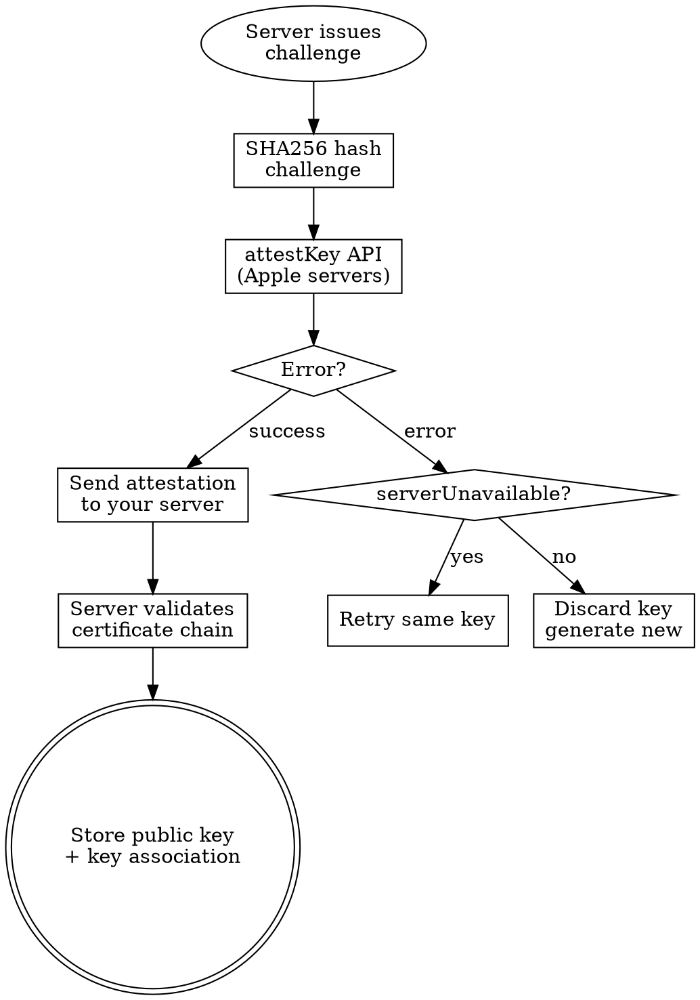

# App Attest

Device-backed app integrity verification for fraud prevention. Proves three things to your server: the request came from a genuine Apple device, running your genuine app, with an untampered payload.

## When to Use This Skill

Use when you need to:
- Verify requests come from legitimate app instances (not modified/cloned apps)
- Prevent fraud in purchases, promotions, or competitive features
- Implement DCAppAttestService attestation or assertion flows
- Handle DeviceCheck 2-bit per-device state for promotional abuse
- Build server-side validation for attestation objects or assertion signatures
- Plan a gradual App Attest rollout for a large install base

## Example Prompts

"How do I verify my app hasn't been tampered with?"
"DCAppAttestService attestKey keeps failing with serverUnavailable"
"How do I prevent users from claiming a free trial multiple times?"
"What's the difference between attestation and assertion?"
"How do I validate an attestation object on my server?"
"isSupported returns false — should I block the user?"
"We have 2M DAU, how do I roll out App Attest safely?"
"How do I detect if someone is creating fake app instances?"

## Red Flags

Signs you're headed for trouble:

- **Validating app integrity on-device** — Modified apps control the runtime. Any local check can be patched out. Verification MUST happen server-side.
- **Not guarding with isSupported** — DCAppAttestService crashes on unsupported devices. Always check before calling any API.
- **Blocking users when isSupported returns false** — Some legitimate devices return false. Treat as risk signal, not hard block.
- **Reusing keys across multiple users on same device** — One key per user per device. Shared keys break account-level trust association.
- **Enabling App Attest for all users at once** — `attestKey` calls Apple's servers. At scale, rate limiting causes failures. Gradual rollout required (WWDC 2021-10244).
- **Using assertions for every API call** — Cryptographic cost per call. Reserve for sensitive operations (purchases, account changes), not routine fetches.
- **Discarding key on serverUnavailable error** — Transient Apple server issue. Retry with same key. Only discard on other errors.
- **Skipping counter validation on server** — Counter must be ever-increasing. Without this, replay attacks succeed.

## Three Properties Verified

App Attest proves three things about each request:

| Property | What It Proves | How |
|----------|---------------|-----|
| Genuine device | Request comes from real Apple hardware | Hardware-backed key in Secure Enclave |
| Genuine app | Your app binary, unmodified | App identity hash in attestation |
| Untampered payload | Request data hasn't been altered | Digest signing in assertions |

**Privacy design**: Anonymous. No hardware identifiers. Keys don't survive reinstall/migration/restore. Apple can't correlate across apps or users.

## Platform Availability

App Attest is supported on all Apple platforms — **including macOS starting with macOS27** (the `DCAppAttestService` API existed on macOS before, but the service was not supported). Support also varies by app type on a given platform: Action and SSO app extensions are supported, other extension types are not. Always gate on `isSupported`, and treat a `false` from a device that should support it as a fraud signal in your risk assessment.

On macOS, App Attest configures each generated key with a policy requiring **Full Security mode** and **System Integrity Protection** (both Mac defaults); attestations surface that policy to your server (see the key access control row in "What the Attestation Carries" below). `DCErrorInvalidKey` can also mean the key access control policy couldn't be enforced on macOS.

## Key Generation

```swift
import DeviceCheck

func generateAppAttestKey(for userId: String) async throws -> String {
    let service = DCAppAttestService.shared

    guard service.isSupported else {
        // NOT an error — use as risk signal, not blocker
        reportUnattestedDevice()
        throw AppAttestError.unsupported
    }

    let keyId = try await service.generateKey()
    // Store in the Keychain — one key per user per device
    try keychainStore(keyId, account: "appAttestKeyId_\(userId)")
    return keyId
}
```

**Key lifecycle**: One key per user per device (never shared across your user population). Store `keyId` in the **Keychain**. Keys survive app updates but not reinstall, migration, or restore (including iCloud backup restore); they're per-device and don't sync across a user's devices. App Clips share identity with full app. Generate new key on sign-out.

## Attestation Flow

Attestation registers the key with Apple and your server. Happens once per key.



```swift
func attestKey(userId: String) async throws {
    guard let keyId = storedKeyId(for: userId) else {
        throw AppAttestError.noKey
    }

    // 1. Get one-time challenge from YOUR server (minimum 16 bytes)
    let challenge = try await server.fetchAttestationChallenge()

    // 2. Hash the challenge
    let hash = Data(SHA256.hash(data: challenge))

    // 3. Request attestation from Apple
    do {
        let attestation = try await service.attestKey(keyId, clientDataHash: hash)
        // 4. Send attestation object to YOUR server for validation
        try await server.verifyAttestation(attestation, keyId: keyId, challenge: challenge)
    } catch DCError.serverUnavailable {
        // Transient — retry with SAME key later
        scheduleAttestationRetry(keyId: keyId, userId: userId)
    } catch {
        // Other error — key is compromised or invalid
        // Discard and generate a new key
        clearStoredKey(for: userId)
        try await generateAndAttestNewKey(userId: userId)
    }
}
```

**Challenge requirements**: Server-generated, single-use, minimum 16 bytes, short-lived (expire after minutes, not hours).

**Collection best practices** (WWDC 2026-201): your **server initiates** attestation (keeps you inside a safe requests-per-second bound); retry failures with **exponential backoff**, never hard-coded retry loops (uncontrolled spikes hit Apple's global rate limits); collect attestations **outside user flows** on a background task; and validate only on the server — a compromised app can't be trusted to validate itself.

### What the Attestation Carries

The attestation object has three sections — format, attestation statement (certificate chain + receipt), and authenticator data. Store the receipt server-side: it's your key to the fraud metric. The 27 cycle adds tampering signals:

| Signal | Where | Detects |
|--------|-------|---------|
| Relying party ID (teamId.bundleId) | Leaf certificate | Re-signing with a different team's profile |
| Key access control (ACL Blob OID) `macOS27` | Leaf certificate | Disabled Full Security mode / SIP on the Mac |
| `extensions` — launch validation category `iOS27` | End of authenticator data (WebAuthn format) | App Store build running via an unexpected channel (e.g. TestFlight category) |
| `extensions` — bundle version `iOS27` | End of authenticator data | Re-signed copy with a bundle version you never shipped |

Monitor these for unexpected values and feed them into your per-user risk assessment. Example: a fraudster disables SIP, modifies your Mac app, and re-signs it — the attestation surfaces the SIP state via the key access control property, plus any modified team ID, launch category, or bundle version.

## Assertion Flow

Assertions prove ongoing request integrity. No Apple server involvement — on-device only.

```swift
func assertRequest(payload: Data, userId: String) async throws -> Data {
    guard let keyId = storedKeyId(for: userId) else {
        throw AppAttestError.noKey
    }

    // Hash the payload you want to protect
    let hash = Data(SHA256.hash(data: payload))

    // Generate assertion (on-device, no network)
    let assertion = try await service.generateAssertion(keyId, clientDataHash: hash)

    // Send assertion + original payload to server
    // Server verifies signature and checks counter
    return assertion
}
```

**When to assert**: Reserve for moments that cost you money or trust if faked.

| Assert | Don't Assert |
|--------|-------------|
| In-app purchases | Content fetches |
| Account changes (email, password) | Read-only API calls |
| Competitive actions (leaderboard scores) | Analytics events |
| Promotional claims (free trial) | UI configuration |
| Reward redemptions | Search queries |

**Performance**: Secure Enclave operations. Fast enough for individual actions, expensive on every request. Generate on demand at the point you need them — assertions are local-only (no Apple round-trip).

On iOS27, assertion authenticator data carries the same appended `extensions` (launch validation category, bundle version) as attestations — handle them the same way server-side.

## Server-Side Validation

Your server does the actual trust verification. The app only generates cryptographic material.

### Attestation Validation (once per key)

1. **Certificate chain** — Verify roots to Apple's App Attest root CA (Apple Private PKI)
2. **Nonce** — Recompute SHA256(challenge || clientDataHash), match against credential certificate
3. **App identity hash** — SHA256(teamId + "." + bundleId) must match your app
4. **Counter** — Store initial value (assertions increment from here)
5. **Key association** — Extract and store public key, associate with user account
6. **Receipt** — Validate relying party ID, attested key, and challenge inside it; **store it** (needed for the fraud metric)
7. **Extensions / key access control** — Check launch validation category and bundle version (`iOS27`), and the key access control property (`macOS27`) for unexpected values

**Key rotation tolerance**: don't reject new attestations for an existing user outright, and don't immediately invalidate their previous keys — reinstalls and device restores legitimately rotate keys. Treat the per-user attestation map as a fraud signal alongside the fraud metric. If you do reject an attestation or assertion, degrade gracefully: limited access with heightened monitoring, not a hard block without a risk assessment.

### Assertion Validation (per sensitive request)

1. **Signature** — Verify using stored public key from attestation
2. **App identity hash** — Must match attestation's hash (prevents cross-app replay)
3. **Counter** — Must be strictly greater than last seen value (replay protection)
4. **Client data hash** — Recompute from request payload, must match what was signed

**Counter is critical**: Without strictly-increasing counter validation, replay attacks succeed indefinitely.

## Rollout Strategy

From WWDC 2021-10244: `attestKey` makes a network call to Apple's servers. Apple rate-limits these calls per app.

| Install Base | Recommended Ramp Time |
|-------------|----------------------|
| <100K DAU | Days |
| ~1M DAU | ~1 day gradual ramp |
| ~100M DAU | Weeks |
| ~1B DAU | 1+ month gradual ramp |

### Gradual Enablement Pattern

```swift
func shouldEnableAppAttest(userId: String) -> Bool {
    guard DCAppAttestService.shared.isSupported else { return false }
    // Server controls rollout percentage — start at 1%, ramp daily
    return server.isAppAttestEnabled(for: userId)
}
```

**Rollout process**: Start at 1%. Monitor attestation success rate. If above 95%, double daily. If rate limiting errors spike, pause. Treat unattested requests as lower-trust during rollout (additional fraud signals), not blocked.

## DeviceCheck Integration

DeviceCheck stores 2 bits of state per device on Apple's servers. Different purpose from App Attest.

| Feature | App Attest | DeviceCheck |
|---------|-----------|-------------|
| Purpose | Verify app integrity | Track per-device state |
| Survives reinstall | No | Yes (tied to hardware) |
| Apple servers | Attestation only | Every query |

### Promotional Fraud Prevention

```swift
import DeviceCheck

func checkTrialEligibility() async throws -> Bool {
    guard DCDevice.current.isSupported else { return true }

    let token = try await DCDevice.current.generateToken()
    // Server calls Apple: POST https://api.devicecheck.apple.com/v1/query_two_bits
    let state = try await server.queryDeviceState(token: token)
    return !state.bit0  // bit0 = has claimed trial
}

func markTrialClaimed() async throws {
    let token = try await DCDevice.current.generateToken()
    // Server calls Apple: POST https://api.devicecheck.apple.com/v1/update_two_bits
    try await server.updateDeviceState(token: token, bit0: true)
}
```

**2 bits, your rules**: Apple stores bits + timestamp. Semantics are yours (e.g., bit0=trial claimed, bit1=abuse flagged). Reset on your schedule. Shared across all apps from the same developer team — coordinate meaning across your portfolio.

## Fraud Metric (Risk Metric Service)

After attestation, redeem the stored receipt with Apple to get the fraud metric — an **approximate count of unique attested keys associated with your app on a device over the past 30 days**. It catches broker devices: a compromised device that passes attestation and generates valid attestations on behalf of modified app instances running elsewhere.

**Server-side**: POST the receipt to `https://data.appattest.apple.com/v1/attestationData` (use `data-development.appattest.apple.com` for sandbox). The response is a new receipt (signature + certificate chain + payload) containing the metric in the **risk metric** field — use this new receipt for subsequent fetches. The **not before** field is the earliest you can refresh; **expiration time** is when the receipt can no longer be refreshed.

**How to use**: Most devices have 1-3 keys. High counts signal an attacker creating many fake identities — but legitimate key rotation (reinstall, device restore) also contributes. Treat it as an **investigation signal, never an outright block**: monitor, baseline per app, and flag spikes, combined with other fraud signals (velocity, behavioral analysis, attestation extensions).

## Anti-Rationalization Table

| Rationalization | Why It Fails | What To Do Instead |
|----------------|-------------|-------------------|
| "We'll validate integrity on-device" | Modified apps control the runtime and can patch out any local check | All validation on your server. Device only generates crypto material. |
| "isSupported is always true on modern devices" | Some configurations and enterprise MDM setups return false | Always guard. Handle false as risk signal, not crash. |
| "One key per device is enough" | Multi-user devices need per-user keys for accurate account association | One key per user per device. New key on sign-out. |
| "We'll enable App Attest for everyone on launch day" | Apple rate-limits attestKey calls. Large install bases will see widespread failures. | Server-controlled gradual rollout. Monitor success rate. |
| "Assert every API call for maximum security" | Secure Enclave operations have real cost. Assertion latency on every request degrades UX. | Assert sensitive operations only. Use session tokens for routine calls. |
| "serverUnavailable means the key is bad" | It's a transient Apple server issue. Discarding the key forces re-attestation unnecessarily. | Retry with same key. Only discard on non-transient errors. |
| "We don't need counter validation" | Without strictly-increasing counters, replay attacks succeed indefinitely. | Store counter server-side. Reject assertions with counter <= last seen. |
| "DeviceCheck replaces App Attest" | DeviceCheck is 2-bit state storage, not integrity verification. Different threat models. | Use both: App Attest for integrity, DeviceCheck for per-device flags. |

## Pressure Scenarios

### Scenario 1: "Block users who fail attestation"

**Pressure**: "If they can't attest, they're probably running a modified app. Block them."

**Reality**: `isSupported` returns false on legitimate devices (older hardware, enterprise MDM, simulator). During rollout, most users simply haven't been enrolled yet. Blocking = blocking real customers.

**Correct action**: Trust tiers on server. Attested = high trust. Unattested = lower trust with additional fraud signals. Never hard-block on attestation failure alone.

**Push-back template**: "Some legitimate devices return isSupported=false. Let's use attestation as one signal in a risk score — high trust for attested, additional checks for unattested."

### Scenario 2: "Enable App Attest for everyone at once"

**Pressure**: "We've been building this for weeks. Ship it to everyone."

**Reality**: `attestKey` calls Apple's servers. Apple rate-limits per app. At 5M DAU, flipping the switch causes a thundering herd — mass failures, error floods, confused users. WWDC 2021-10244 explicitly recommends gradual rollout.

**Correct action**: Server-controlled rollout starting at 1%. At 5M DAU, expect ~1 week to full rollout.

**Push-back template**: "Apple rate-limits attestKey calls — their WWDC session recommends gradual rollout. I'll set up server-side percentage control starting at 1%, ramping to 100% over about a week."

## Checklist

Before shipping App Attest:

**Key Generation**:
- [ ] `isSupported` checked before any DCAppAttestService call
- [ ] Graceful handling when `isSupported` returns false (risk signal, not block)
- [ ] Key ID cached persistently per user
- [ ] One key per user per device (not shared)

**Attestation**:
- [ ] Challenge from server is single-use, minimum 16 bytes, short-lived
- [ ] `serverUnavailable` retries with same key
- [ ] Other errors discard key and generate new
- [ ] Attestation object sent to server for validation (not validated on-device)

**Assertion**:
- [ ] Used only for sensitive operations (not every API call)
- [ ] Payload hash covers the actual request data being protected
- [ ] Server validates signature with stored public key
- [ ] Server validates counter is strictly increasing

**Server**:
- [ ] Certificate chain validated against Apple's App Attest root CA
- [ ] App identity hash (teamId + bundleId) verified
- [ ] Counter stored and checked for strict increase
- [ ] Public key associated with user account
- [ ] Receipt stored for fraud-metric redemption
- [ ] Extensions monitored — launch validation category + bundle version (`iOS27`); key access control property (`macOS27`)
- [ ] New-key attestations for existing users tolerated (reinstall/restore rotation), old keys not invalidated immediately

**Rollout**:
- [ ] Server-controlled percentage (not client-side)
- [ ] Gradual ramp with monitoring
- [ ] Unattested users handled gracefully (lower trust, not blocked)
- [ ] Rollback plan if attestation success rate drops

## Resources

**WWDC**: 2021-10244, 2026-201

**Docs**: /devicecheck, /devicecheck/establishing-your-app-s-integrity, /devicecheck/validating-apps-that-connect-to-your-server, /devicecheck/assessing-fraud-risk

**Skills**: axiom-security (skills/cryptokit.md), skills/agentic-security.md
