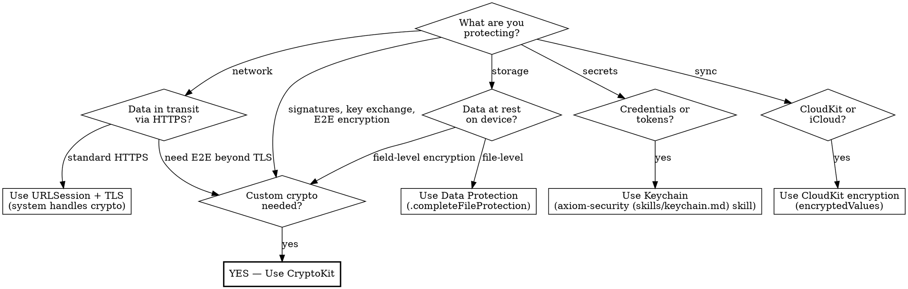

# CryptoKit

Authenticated encryption, digital signatures, key agreement, Secure Enclave key management, and quantum-secure cryptography for iOS apps.

## When to Use This Skill

Use when you need to:
- ☑ Encrypt data at rest or in transit beyond what TLS/Data Protection provides
- ☑ Sign payloads for integrity verification (receipts, tokens, API requests)
- ☑ Generate or manage cryptographic keys (including Secure Enclave hardware keys)
- ☑ Migrate from CommonCrypto C API to CryptoKit
- ☑ Implement key agreement (ECDH) for end-to-end encryption
- ☑ Use HPKE for modern asymmetric encryption
- ☑ Adopt quantum-secure algorithms (ML-KEM, ML-DSA) for post-quantum readiness
- ☑ Interoperate with server-side Swift Crypto or non-Apple platforms

## Example Prompts

"How do I encrypt user data with AES-GCM?"
"How do I sign a payload and verify it on my server?"
"How do I use the Secure Enclave to protect a signing key?"
"I'm using CommonCrypto — should I migrate to CryptoKit?"
"How do I do ECDH key agreement for end-to-end encryption?"
"How do I make my app quantum-secure?"
"My server can't verify signatures from my iOS app"
"What's the difference between P256 and Curve25519?"

## Red Flags

Signs you're making this harder or less secure than it needs to be:

- ❌ Using CommonCrypto C API when CryptoKit exists — Buffer management nightmares, no authenticated encryption, manual IV handling. CryptoKit provides memory-safe, authenticated encryption in one call. Migration takes minutes per call site.
- ❌ AES-CBC without authentication — Ciphertext is malleable. Padding oracle attacks let an attacker decrypt data one byte at a time without the key. AES-GCM (CryptoKit's default) provides authenticated encryption — tampering is detected automatically.
- ❌ Rolling your own crypto protocol — Timing attacks, padding oracles, nonce reuse. Unless you are a professional cryptographer, use CryptoKit's high-level APIs. Apple's security team designed them to prevent exactly these mistakes.
- ❌ Ignoring Secure Enclave for signing keys — "Too complex" is wrong. The SE API is nearly identical to software P256. SE keys survive jailbreaks. If the key protects money, health data, or identity, SE is the correct choice at zero extra effort.
- ❌ Using AES-128 when AES-256 costs nothing extra — Grover's algorithm halves symmetric key strength on quantum computers. AES-128 drops to 64-bit security. AES-256 drops to 128-bit — still safe. The performance difference is negligible.
- ❌ Force-unwrapping crypto operations — `AES.GCM.open` and signature verification throw on failure. Force-unwrapping masks authentication failures and turns security errors into crashes. Always use `try`/`catch`.
- ❌ Storing raw private keys in UserDefaults — Readable from device backups, accessible on jailbroken devices, visible in plaintext in the app's plist. Use Keychain for software keys, Secure Enclave for hardware-bound keys.

## Do You Actually Need CryptoKit?



From WWDC 2019-709: "We strongly recommend you rely on higher level system frameworks when you can." CryptoKit is for when system frameworks don't cover your use case — custom signatures, field-level encryption, key agreement, interop with non-Apple systems.

## Secure Enclave Key Management

The Secure Enclave is a hardware security module built into Apple devices. Keys generated in the SE never leave the hardware — not even Apple can extract them.

### When to Use Secure Enclave

| Scenario | Use SE? | Why |
|----------|---------|-----|
| Signing API requests | Yes | Key can't be extracted from device |
| Biometric-gated decryption | Yes | SE ties key to Face ID/Touch ID |
| End-to-end encryption key | Yes (key agreement) | Private key hardware-bound |
| Encrypting data for another device | No | Key must be exportable |
| Server-shared symmetric key | No | SE only does asymmetric (P256, ML-KEM, ML-DSA) |
| Cross-device sync | No | SE keys are device-bound |

### SE Key Generation with Biometric Gating

```swift
import CryptoKit
import LocalAuthentication

guard SecureEnclave.isAvailable else {
    let softwareKey = P256.Signing.PrivateKey()
    return
}

let context = LAContext()
context.localizedReason = "Authenticate to sign transaction"

guard let accessControl = SecAccessControlCreateWithFlags(
    nil, kSecAttrAccessibleWhenUnlockedThisDeviceOnly,
    [.privateKeyUsage, .biometryCurrentSet], nil
) else {
    throw CryptoKitError.underlyingCoreCryptoError(error: 0)
}

let seKey = try SecureEnclave.P256.Signing.PrivateKey(
    compactRepresentable: false,
    accessControl: accessControl,
    authenticationContext: context
)

let signature = try seKey.signature(for: data)
let publicKeyDER = seKey.publicKey.derRepresentation
```

### SE Key Lifecycle

`seKey.dataRepresentation` is a **wrapped blob**, not raw key material. It contains an encrypted reference that only this specific Secure Enclave hardware can unwrap. Exporting it to another device produces an unusable blob.

- **Survives**: App updates, device reboots
- **Does NOT survive**: App reinstall, device restore, device erase, migration to new device
- **Persistence**: Store `dataRepresentation` in Keychain. Restore with:

```swift
let restoredKey = try SecureEnclave.P256.Signing.PrivateKey(
    dataRepresentation: savedKeyData, authenticationContext: context
)
```

### SE Constraints

- **Classical**: P256 only — no Curve25519, no P384/P521. One curve, two purposes: `SecureEnclave.P256.Signing` and `SecureEnclave.P256.KeyAgreement`
- **Post-quantum (iOS 26+)**: `SecureEnclave.MLKEM768`, `SecureEnclave.MLKEM1024`, `SecureEnclave.MLDSA65`, `SecureEnclave.MLDSA87`
- Signing and key agreement only — no direct encryption
- Simulator has no SE — `SecureEnclave.isAvailable` returns false. Always provide a software fallback for testing.

## Common Workflows

### Hash Data Integrity

```swift
import CryptoKit

let data = "Hello, world".data(using: .utf8)!
let digest = SHA256.hash(data: data)
guard digest == SHA256.hash(data: data) else { /* tampering detected */ }
```

Available: `SHA256`, `SHA384`, `SHA512`. Use `Insecure.MD5`/`Insecure.SHA1` only for legacy protocol compatibility, never for security.

### HMAC Message Authentication

```swift
let key = SymmetricKey(size: .bits256)
let mac = HMAC<SHA256>.authenticationCode(for: data, using: key)
let isValid = HMAC<SHA256>.isValidAuthenticationCode(mac, authenticating: data, using: key)
```

Constant-time comparison built in — safe against timing attacks. Use HMAC when both parties share a symmetric key.

### AES-GCM Encrypt/Decrypt

```swift
let key = SymmetricKey(size: .bits256)
let plaintext = "Secret message".data(using: .utf8)!

let sealedBox = try AES.GCM.seal(plaintext, using: key)
let combined = sealedBox.combined!

let restoredBox = try AES.GCM.SealedBox(combined: combined)
let decrypted = try AES.GCM.open(restoredBox, using: key)
```

Authenticated encryption — tampering triggers `CryptoKitError.authenticationFailure`. No separate HMAC step needed. Nonce is auto-generated and prepended to `combined`.

### ECDSA Sign/Verify

```swift
let privateKey = P256.Signing.PrivateKey()
let signature = try privateKey.signature(for: data)
let isValid = privateKey.publicKey.isValidSignature(signature, for: data)
```

Curves: `P256` (secp256r1, most common), `P384`, `P521`, `Curve25519` (Ed25519, fastest). Use P256 for server interop. Use Curve25519 when you control both sides.

### ECDH Key Agreement

```swift
let alicePrivate = P256.KeyAgreement.PrivateKey()
let bobPrivate = P256.KeyAgreement.PrivateKey()

let sharedSecret = try alicePrivate.sharedSecretFromKeyAgreement(
    with: bobPrivate.publicKey
)

let symmetricKey = sharedSecret.hkdfDerivedSymmetricKey(
    using: SHA256.self,
    salt: "my-app-v1".data(using: .utf8)!,
    sharedInfo: Data(),
    outputByteCount: 32
)
```

Never use the raw shared secret directly — always derive a symmetric key via HKDF. The raw secret has biased bits that weaken encryption.

### HPKE End-to-End Encryption

HPKE (Hybrid Public Key Encryption) combines key agreement and symmetric encryption in one step. Preferred over manual ECDH + AES-GCM for new protocols. Classical ciphersuites (P256, Curve25519) available iOS 17+. The quantum-secure XWing ciphersuite and ML-KEM/ML-DSA require iOS 26+.

```swift
let recipientPrivate = P256.KeyAgreement.PrivateKey()

var sender = try HPKE.Sender(
    recipientKey: recipientPrivate.publicKey,
    ciphersuite: .P256_SHA256_AES_GCM_256,
    info: "my-app-message-v1".data(using: .utf8)!
)
let ciphertext = try sender.seal(plaintext)

var recipient = try HPKE.Recipient(
    privateKey: recipientPrivate,
    ciphersuite: .P256_SHA256_AES_GCM_256,
    info: "my-app-message-v1".data(using: .utf8)!,
    encapsulatedKey: sender.encapsulatedKey
)
let decrypted = try recipient.open(ciphertext)
```

## Quantum-Secure Migration

From WWDC 2025-314: harvest-now-decrypt-later is not theoretical. Nation-state actors are recording encrypted traffic today to decrypt with future quantum computers. Data with sensitivity beyond 10 years needs post-quantum protection now.

### Migration Priority

1. **Quantum-secure TLS (automatic)** — iOS 26 URLSession and Network.framework use quantum-secure TLS by default. No code changes needed. iMessage has used PQ3 since iOS 17.4.
2. **Custom protocol encryption** — If your app uses manual ECDH + AES or custom key exchange, those channels are NOT automatically upgraded. Replace with post-quantum HPKE.
3. **Symmetric key upgrade** — Upgrade AES-128 to AES-256. Grover's algorithm halves symmetric key strength, so 256-bit keys provide 128-bit post-quantum security.

### Post-Quantum HPKE (iOS 26+)

Same HPKE API, different ciphersuite. Combines ML-KEM (quantum-safe) with X25519 (classical) for hybrid security — Apple's recommendation:

```swift
let recipientPrivate = try XWingMLKEM768X25519.PrivateKey()

var sender = try HPKE.Sender(
    recipientKey: recipientPrivate.publicKey,
    ciphersuite: .XWingMLKEM768X25519_SHA256_AES_GCM_256,
    info: "my-app-pq-v1".data(using: .utf8)!
)
let ciphertext = try sender.seal(plaintext)

var recipient = try HPKE.Recipient(
    privateKey: recipientPrivate,
    ciphersuite: .XWingMLKEM768X25519_SHA256_AES_GCM_256,
    info: "my-app-pq-v1".data(using: .utf8)!,
    encapsulatedKey: sender.encapsulatedKey
)
let decrypted = try recipient.open(ciphertext)
```

Hybrid constructions (classical + post-quantum) ensure security even if one algorithm is broken. The XWing construction pairs ML-KEM768 with X25519 so a classical break alone or a quantum break alone cannot compromise the exchange.

### ML-KEM and ML-DSA Direct Usage (iOS 26+)

```swift
let kemPrivate = try MLKEM768.PrivateKey()
let result = try kemPrivate.publicKey.encapsulate()  // KEM.EncapsulationResult
let sharedSecret = result.sharedSecret               // SymmetricKey
let derivedSecret = try kemPrivate.decapsulate(result.encapsulated)

let dsaPrivate = try MLDSA65.PrivateKey()
let signature = try dsaPrivate.signature(for: data)
let isValid = dsaPrivate.publicKey.isValidSignature(signature, for: data)
```

Use ML-KEM for key encapsulation when building custom protocols. Use ML-DSA for signatures when P256/Ed25519 won't survive quantum analysis. Prefer HPKE with hybrid ciphersuites over raw ML-KEM for most applications.

## Cross-Platform Considerations

### Swift Crypto Parity

On Linux/server: `import Crypto` (apple/swift-crypto) provides the same API minus Secure Enclave and Keychain. For shared code:

```swift
#if canImport(CryptoKit)
import CryptoKit
#else
import Crypto
#endif
```

### Signature Encoding Interop

CryptoKit's ECDSA signatures use **raw format** (r || s concatenation, 64 bytes for P256). Most non-Apple platforms (OpenSSL, Java, .NET) expect **DER format** (ASN.1 encoded, variable length 70-72 bytes for P256).

```swift
let signature = try privateKey.signature(for: data)

let raw = signature.rawRepresentation
let der = signature.derRepresentation
```

When receiving signatures from a server:

```swift
let fromDER = try P256.Signing.ECDSASignature(derRepresentation: serverDER)
let fromRaw = try P256.Signing.ECDSASignature(rawRepresentation: serverRaw)
```

### Key Export for Server Verification

```swift
let publicKey = privateKey.publicKey
publicKey.derRepresentation
publicKey.pemRepresentation
publicKey.x963Representation
```

DER for most platforms, PEM for config files and REST APIs, X9.63 for compact JavaScript interop.

### secp256r1 vs secp256k1

CryptoKit uses **secp256r1** (P-256, prime256v1) — the NIST standard curve used by TLS, government systems, and enterprise software.

Bitcoin and Ethereum use **secp256k1** (Koblitz curve) — a different curve entirely. These are **not interoperable**. A P-256 signature cannot be verified with a secp256k1 verifier. If you need secp256k1 for blockchain interop, use a dedicated library (libsecp256k1 wrapper), not CryptoKit.

### SE Keys and Cross-Platform

Secure Enclave keys are device-bound. `dataRepresentation` is a wrapped blob that only the originating hardware can unwrap. This means SE keys enable crypto-shredding by design — destroying the device or reinstalling the app makes all SE-encrypted data permanently irrecoverable. Plan key lifecycle accordingly. Store recovery paths (server-escrowed backup keys, multi-device key distribution) if data must survive device loss.

## Anti-Rationalization

| Rationalization | Why It Fails | Time Cost |
|-----------------|--------------|-----------|
| "CommonCrypto works fine, no need to migrate" | Buffer overflows, no authenticated encryption, manual IV management. One wrong buffer size = silent data corruption or security vulnerability. | 2-4 hours debugging subtle encryption failures that CryptoKit prevents by design |
| "I'll add authentication to AES-CBC later" | Without authentication, ciphertext is malleable. Attackers modify data without detection. "Later" means after the vulnerability ships. | 4-8 hours incident response when tampered data is discovered in production |
| "Nonces don't need to be random for my use case" | Nonce reuse with AES-GCM leaks plaintext via XOR of ciphertexts. There is no use case where fixed nonces are safe with GCM. | Catastrophic — full plaintext recovery of all messages encrypted with the reused nonce |
| "Secure Enclave is overkill for this" | Software keys can be extracted from jailbroken devices and backups. SE keys cannot. If the key protects money, health data, or identity, SE is not overkill. | 0 extra development time (API is nearly identical to software P256) |
| "Quantum computing is decades away" | Harvest-now-decrypt-later means data recorded today will be decrypted when quantum computers arrive. Apple already ships quantum-secure TLS in iOS 26. | 0 if you use iOS 26 defaults. 1-2 hours for custom protocol migration. |
| "I'll just use my own encryption scheme" | Professional cryptographers spend years designing protocols. Timing side channels, padding oracles, nonce misuse are invisible without expert review. | Weeks to months of security audit + remediation |
| "DER vs raw doesn't matter, it's the same signature" | Wrong encoding = server verification failure. The math is correct but the encoding is wrong. | 2-4 hours debugging interop that one `.derRepresentation` call prevents |

## Pressure Scenarios

### Scenario 1: "Just encrypt it with whatever, we ship today"

**Context**: Feature deadline approaching. Developer needs to encrypt user data before persisting it.

**Pressure**: "Don't overthink the crypto. AES-CBC, CommonCrypto, whatever gets it done by end of day."

**Reality**: AES-CBC without authentication is vulnerable to padding oracle attacks. CommonCrypto requires manual buffer management where one wrong size creates silent data corruption. The migration from `CCCrypt` to `AES.GCM.seal` is 5-10 lines of code — less code than the CommonCrypto version — and eliminates an entire vulnerability class.

**Correct action**: Replace `CCCrypt(kCCEncrypt, kCCAlgorithmAES, ...)` with `AES.GCM.seal(plaintext, using: key)`. Map existing key material to `SymmetricKey(data:)`. If migrating existing CBC-encrypted data, add a read path that decrypts old format and re-encrypts on first access.

**Push-back template**: "AES-GCM via CryptoKit is actually fewer lines than CommonCrypto and provides authenticated encryption for free. The CBC code has a vulnerability class that GCM eliminates. Switching takes 10 minutes, not hours."

### Scenario 2: "We need cross-platform, skip Secure Enclave"

**Context**: Building an E2E encrypted feature that must work on iOS and Android. Developer proposes storing signing keys in Keychain (software) to keep parity with Android's software keystore.

**Pressure**: "Android doesn't have a Secure Enclave equivalent with the same guarantees. Let's keep it simple and consistent across platforms."

**Reality**: Android has hardware-backed Keystore (StrongBox) with similar guarantees. Even if the Android side uses software keys, that doesn't mean the iOS side should. SE protection is free on iOS — the API is nearly identical to software P256. Use SE on iOS, hardware Keystore on Android, software fallback where hardware is unavailable.

**Correct action**: Use `SecureEnclave.P256.Signing.PrivateKey` with a fallback to `P256.Signing.PrivateKey`. The public key and signature formats are identical — the server doesn't know or care which generated them.

**Push-back template**: "The SE API is the same as software P256 — no extra complexity. The server verifies the same public key format either way. We get hardware protection on devices that support it and graceful fallback on devices that don't. Both platforms can use their best available hardware."

### Scenario 3: "Quantum-safe is premature optimization"

**Context**: Designing a new E2E encrypted messaging protocol. Developer proposes classical ECDH + AES-GCM.

**Pressure**: "Quantum computers are at least a decade away. We're over-engineering this."

**Reality**: Harvest-now-decrypt-later means adversaries record encrypted traffic today and decrypt it when quantum computers arrive. For ephemeral data (session tokens), classical crypto is fine. For messages with long-term sensitivity (health records, financial data, private communications), post-quantum protection is warranted now. Apple already shipped PQ3 for iMessage and quantum-secure TLS in iOS 26.

**Correct action**: Use `HPKE.Ciphersuite.XWingMLKEM768X25519_SHA256_AES_GCM_256` instead of `.P256_SHA256_AES_GCM_256`. The code change is one ciphersuite constant — same API, same complexity, hybrid classical + quantum-safe protection.

**Push-back template**: "The code change is literally one ciphersuite constant. Apple already did this for iMessage (PQ3) and iOS 26 TLS. One line of code removes the harvest-now-decrypt-later risk for data that's still sensitive in 10 years."

## Checklist

Before shipping any custom cryptography:

**Algorithm Selection**:
- [ ] Using authenticated encryption (AES-GCM, not AES-CBC/ECB)
- [ ] Hash function is SHA256+ (not MD5/SHA1) for security purposes
- [ ] Curve appropriate for use case (P256 for interop, Curve25519 for performance)
- [ ] Post-quantum ciphersuite considered for long-term sensitive data

**Key Management**:
- [ ] Private keys stored in Secure Enclave (if hardware available and key doesn't need export)
- [ ] Fallback to Keychain with appropriate access control if SE unavailable
- [ ] No private keys in UserDefaults, files, or hardcoded in source
- [ ] Key rotation strategy defined for long-lived keys

**Nonce/IV Handling**:
- [ ] Using CryptoKit's automatic nonce generation (not custom)
- [ ] Not reusing nonces across encryptions
- [ ] Not storing or hardcoding nonces

**Interop** (if communicating with non-Apple platforms):
- [ ] Signature encoding matches server expectation (DER vs raw)
- [ ] Public key format agreed upon (DER, PEM, or X9.63)
- [ ] Curve matches server (secp256r1 not secp256k1)
- [ ] Testing with actual server verification, not just local round-trip

**Secure Enclave** (if used):
- [ ] `SecureEnclave.isAvailable` checked with software fallback
- [ ] `dataRepresentation` stored in Keychain for persistence
- [ ] Access control flags match UX (biometric per-use vs session-based)
- [ ] Key lifecycle documented (does not survive reinstall/restore)

## Resources

**WWDC**: 2019-709, 2025-314

**Docs**: /cryptokit, /cryptokit/secureenclave, /security/certificate_key_and_trust_services

**Skills**: axiom-security (skills/cryptokit-ref.md), axiom-security (skills/keychain.md)
