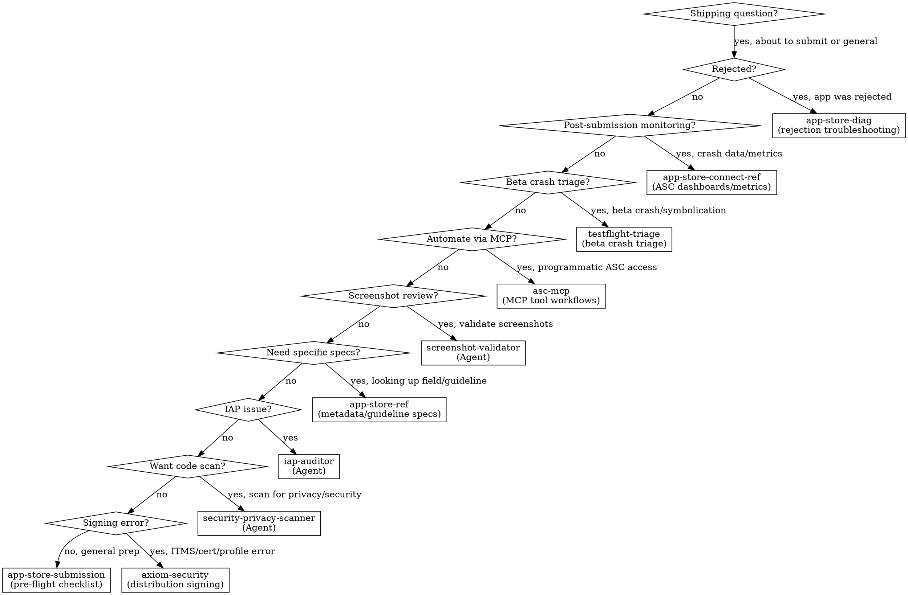

# Shipping & App Store

**You MUST use this skill when preparing to submit ANY app, handling App Store rejections, or working on release workflow.**

## When to Use

Use this skill when you encounter:
- Preparing an app for App Store submission
- App Store rejection (any guideline)
- Metadata requirements (screenshots, descriptions, keywords)
- Privacy manifest and nutrition label questions
- Age rating and content classification
- Export compliance and encryption declarations
- EU DSA trader status
- Account deletion or Sign in with Apple requirements
- Build upload and processing issues
- App Review appeals
- WWDC25/WWDC26 App Store Connect changes
- First-time submission workflow

## Quick Reference

| Symptom / Task | Reference |
|----------------|-----------|
| How do I submit my app? | See `skills/app-store-submission.md` |
| Pre-flight checklist | See `skills/app-store-submission.md` |
| First-time submission | See `skills/app-store-submission.md` |
| Encryption compliance | See `skills/app-store-submission.md` |
| Accessibility Nutrition Labels | See `skills/app-store-submission.md` |
| Metadata field requirements | See `skills/app-store-ref.md` |
| Product Page Header, Asset Library, search visuals `OS27` | See `skills/app-store-ref.md` (Part 11) |
| Retention Messaging (subscription cancellation flow) `OS27` | See `skills/app-store-ref.md` (Part 11) |
| Group / volume subscription selling (ABM, ASM, volume pricing) `OS27` | See `skills/app-store-ref.md` (Part 11) |
| Guideline number lookup | See `skills/app-store-ref.md` |
| Privacy manifest schema | See `skills/app-store-ref.md` |
| Age rating tiers | See `skills/app-store-ref.md` |
| EU DSA compliance | See `skills/app-store-ref.md` |
| WWDC25/WWDC26 ASC changes | See `skills/app-store-ref.md` |
| App was rejected | See `skills/app-store-diag.md` |
| Guideline 2.1/4.2/4.3 rejection | See `skills/app-store-diag.md` |
| Writing an appeal | See `skills/app-store-diag.md` |
| Repeated rejections | See `skills/app-store-diag.md` |
| App Review Guidelines reference | See `skills/app-review-guidelines.md` |
| Expert review checklist | See `skills/expert-review-checklist.md` |
| Crash data in App Store Connect | See `skills/app-store-connect-ref.md` |
| TestFlight crash reports | See `skills/app-store-connect-ref.md` |
| ASC metrics dashboards | See `skills/app-store-connect-ref.md` |
| Beta tester crash report | See `skills/testflight-triage.md` |
| Production corpus triage (Sentry, ASC — multiple grouped issues) | See `skills/production-triage.md` + `triage-analyzer` agent or `/axiom:triage` |
| Crash log symbolication (.ips / MetricKit / .crash) | See axiom-tools (skills/xcsym-ref.md) or `/axiom:analyze-crash`; `skills/testflight-triage.md` for the full TF workflow |
| Automate App Store Connect | See `skills/asc-mcp.md` |
| Submit build programmatically | See `skills/asc-mcp.md` |
| Manage TestFlight via MCP | See `skills/asc-mcp.md` |
| ITMS signing error on upload | See axiom-security (skills/code-signing-diag.md) |
| Certificate/profile mismatch | See axiom-security (skills/code-signing-diag.md) |
| Code signing setup | See axiom-security (skills/code-signing.md) |
| App Clips (size tiers, invocation, AASA, launch experience) | See `skills/app-clips.md` |
| App Clip entitlements / size / data-sharing reference | See `skills/app-clips-ref.md` |
| Apple Pay / Wallet / Tap to Pay payments | See `axiom-payments` suite |
| Shipping update with Claude model-ID change (4.6 → 4.7, etc.) | See **`claude-api`** skill (external) + this skill for submission |
| Switching cloud AI provider in-app (OpenAI → Claude, etc.) | See **`claude-api`** skill (external) + this skill for submission |

## Routing Logic

### 1. Pre-Submission Preparation → **app-store-submission**

**Triggers**:
- "How do I submit my app?"
- "What do I need before submitting?"
- Preparing for first submission
- Pre-flight checklist needed
- Screenshot requirements
- Metadata completeness check
- Encryption compliance questions
- Accessibility Nutrition Labels
- Privacy manifest requirements for submission

**Why app-store-submission**: Discipline skill with 8 anti-patterns, decision trees, and pressure scenarios. Prevents the mistakes that cause 90% of rejections.

**Reference**: `skills/app-store-submission.md`

---

### 2. Metadata, Guidelines, and API Reference → **app-store-ref**

**Triggers**:
- "What fields are required in App Store Connect?"
- "What's the max length for app description?"
- Specific guideline number lookup
- Privacy manifest schema details
- Age rating tiers and questionnaire
- IAP submission metadata
- EU DSA compliance details
- Build upload methods
- WWDC25 and WWDC26 changes to App Store Connect

**Why app-store-ref**: 11-part reference covering every metadata field, guideline, and compliance requirement with exact specifications.

**Reference**: `skills/app-store-ref.md`

---

### 3. Rejection Troubleshooting → **app-store-diag**

**Triggers**:
- "My app was rejected"
- "Guideline 2.1 rejection"
- "Binary was rejected"
- Guideline 4.2 or 4.3 rejection (app too simple, web wrapper, spam, duplicate)
- Guideline 1.x rejection (objectionable content, UGC moderation, Kids category)
- How to respond to a rejection
- Writing an appeal
- Understanding rejection messages
- Third or repeated rejection
- Resolution Center communication

**Why app-store-diag**: 9 diagnostic patterns mapping rejection types to root causes and fixes, including subjective rejections (4.2/4.3, 1.x). Includes appeal writing guidance and crisis scenario for repeated rejections.

**Reference**: `skills/app-store-diag.md`

---

### 4. Privacy & Security Compliance → **security-privacy-scanner** (Agent)

**Triggers**:
- "Scan my code for privacy issues before submission"
- Hardcoded API keys or secrets
- Missing privacy manifest
- Required Reason API declarations
- ATS violations

**Why security-privacy-scanner**: Autonomous agent that scans for security vulnerabilities and privacy compliance issues that cause rejections.

**Invoke**: Launch `security-privacy-scanner` agent or `/axiom:audit security`

---

### 5. IAP Review Issues → **iap-auditor** (Agent)

**Triggers**:
- IAP rejected or not working
- Missing transaction.finish()
- Missing restore purchases
- Subscription tracking issues

**Why iap-auditor**: Scans IAP code for the patterns that cause StoreKit rejections.

**Invoke**: Launch `iap-auditor` agent

---

### 6. Screenshot Validation → **screenshot-validator** (Agent)

**Triggers**:
- "Check my App Store screenshots"
- "Are my screenshots the right dimensions?"
- "Validate screenshots before submission"
- "Review my marketing screenshots"
- Screenshot content or dimension questions

**Why screenshot-validator**: Multimodal agent that visually inspects each screenshot for placeholder text, wrong dimensions, debug artifacts, broken UI, and competitor references. Catches issues that manual review misses.

**Invoke**: Launch `screenshot-validator` agent or `/axiom:audit screenshots`

---

### 7. Programmatic ASC Access → **asc-mcp**

**Triggers**:
- "Automate App Store Connect"
- "Submit build programmatically"
- "Manage TestFlight from Claude"
- "Respond to reviews via API"
- "Set up asc-mcp"
- "Distribute to TestFlight groups via MCP"
- "Create a new version without opening ASC"

**Why asc-mcp**: Workflow-focused skill teaching Claude to use asc-mcp MCP tools for release pipelines, TestFlight distribution, review management, and feedback triage — all without leaving Claude Code.

**Reference**: `skills/asc-mcp.md`

---

### 8. Post-Submission Monitoring → **app-store-connect-ref**

**Triggers**:
- "How do I view crash data in App Store Connect?"
- "Where are my TestFlight crash reports?"
- "How do I read ASC metrics dashboards?"
- Post-release crash investigation
- Downloading crash logs from ASC

**Why app-store-connect-ref**: ASC navigation for crash dashboards, TestFlight feedback, performance metrics, and data export workflows.

**Reference**: `skills/app-store-connect-ref.md`

---

### 9. Beta Crash Triage → **testflight-triage**

**Triggers**:
- Beta tester reports a crash
- Crash appears in Organizer or App Store Connect
- Crash logs need symbolication
- Post-release crash investigation (single file or Organizer)

**Why testflight-triage**: Systematic crash triage from symbolication through root cause analysis. Uses `xcsym` as the first step (parse → discover dSYMs → symbolicate → categorize with `pattern_tag` → emit structured JSON).

**Reference**: `skills/testflight-triage.md`. For the xcsym subcommand/exit-code reference, see axiom-tools (skills/xcsym-ref.md). For the one-call agent workflow, `/axiom:analyze-crash`.

---

### 10a. Production Corpus Triage → **production-triage** / **triage-analyzer**

**Triggers**:
- "Triage my Sentry crashes"
- "What are the top crash families in production?"
- "Show me which issues to fix first from App Store Connect"
- Multiple grouped issues from an aggregator (Sentry, ASC) — dozens of issues, not a single file
- "Which of these crashes are real bugs vs noise?"
- Corpus-level hang triage ("Are my ANR reports real blocks?")

**Why production-triage**: Corpus-level triage requires fetching from an aggregator, classifying each issue, noise-flagging suspension false-positives, and clustering into root-cause families. `testflight-triage` covers the Organizer/single-file path; `production-triage` covers the aggregate/multi-issue path.

**Reference**: `skills/production-triage.md` (fetch + NormalizedReport schema + flag-never-hide rule). **Agent**: `triage-analyzer` or `/axiom:triage sentry` / `/axiom:triage asc`.

---

### 10. Distribution Signing Issues → **code-signing** / **code-signing-diag**

**Triggers**:
- ITMS-90035 Invalid Signature on upload
- ITMS-90161 Invalid Provisioning Profile
- "No signing certificate found" when archiving
- Certificate expired before submission
- Archive succeeds but export/upload fails
- Profile doesn't match bundle ID
- Entitlement mismatch on upload

**Why code-signing**: Distribution signing errors are the #1 cause of upload failures. Diagnosing with CLI tools takes 5 minutes. code-signing-diag has 6 decision trees mapping ITMS errors to root causes.

**Reference**: See axiom-security (skills/code-signing-diag.md) (troubleshooting) or See axiom-security (skills/code-signing.md) (setup)

---

### 11. App Clips → **app-clips**

**Triggers**:
- Adding an App Clip target, or choosing an invocation method
- "What's the App Clip size limit?" / build exceeds maximum size
- Associated domains / AASA for App Clip links
- App Store Connect default and advanced launch experiences
- Handing App Clip data off to the full app on upgrade
- "My App Clip link does nothing"

**Why app-clips**: App Clips ship embedded in the full app and live under tight size (10/15/100 MB), entitlement, and capability limits. The discipline covers the size tiers, entitlements, AASA, and data handoff; the reference has the tables.

**Reference**: `skills/app-clips.md`, `skills/app-clips-ref.md`

---

## Decision Tree

Simplified:

1. App was rejected? → `skills/app-store-diag.md`
2. Post-submission crash data/metrics? → `skills/app-store-connect-ref.md`
3. Beta crash triage/symbolication (Organizer or single file)? → `skills/testflight-triage.md`
4. Production corpus triage (Sentry/ASC, multiple grouped issues)? → `skills/production-triage.md` + `triage-analyzer` agent
5. Automate ASC via MCP tools? → `skills/asc-mcp.md`
6. Validate screenshots? → `screenshot-validator` (Agent)
7. Need specific metadata/guideline specs? → `skills/app-store-ref.md`
8. IAP submission issue? → `iap-auditor` (Agent)
9. Want pre-submission code scan? → `security-privacy-scanner` (Agent)
10. ITMS signing/certificate/profile error on upload? → See axiom-security (skills/code-signing-diag.md)
11. General submission preparation? → `skills/app-store-submission.md`
12. App Clip (size tiers, invocation, AASA, data handoff)? → `skills/app-clips.md`, `skills/app-clips-ref.md`

#### Platform-specific submission
- watchOS 26 SDK requirement, 64-bit, independent-app submission → See axiom-watchos (skills/platform-basics.md)

## Anti-Rationalization

| Thought | Reality |
|---------|---------|
| "I'll just submit and see what happens" | 40% of rejections are Guideline 2.1 (completeness). app-store-submission catches them in 10 min. |
| "I've submitted apps before, I know the process" | Requirements change yearly. Privacy manifests, age rating tiers, EU DSA, Accessibility Nutrition Labels are all new since 2024. |
| "The rejection is wrong, I'll just resubmit" | Resubmitting without changes wastes 24-48 hours per cycle. app-store-diag finds the root cause. |
| "Privacy manifests are only for big apps" | Every app using Required Reason APIs needs a manifest since May 2024. Missing = automatic rejection. |
| "I'll add the metadata later" | Missing metadata blocks submission entirely. app-store-ref has the complete field list. |
| "It's just a bug fix, I don't need a full checklist" | Bug fix updates still need What's New text, correct screenshots, and valid build. app-store-submission covers it. |
| "I'll just eyeball the screenshots myself" | Human review misses dimension mismatches (even 1px off = rejection), subtle placeholder text, and debug indicators. A single missed issue costs 24-48 hours in resubmission. screenshot-validator catches it in 2 minutes. |
| "I'll just do it in the ASC web dashboard" | If asc-mcp is configured, MCP tools are faster for bulk operations — distributing builds, responding to reviews, creating versions. asc-mcp has the workflow. |
| "Upload failed with ITMS error, let me re-archive" | ITMS signing errors are configuration — wrong cert, expired profile, missing entitlement. Re-archiving with the same config produces the same result. code-signing-diag has the fix. |
| "It's just a model ID swap (Claude 4.6 → 4.7)" | 4.6 → 4.7 removed `temperature`, `top_p`, `top_k`, and prefill from the Messages API. Build succeeds; runtime returns HTTP 400 after submission. Read `claude-api` (external) and test the live endpoint before uploading. |
| "My App Clip can be 100 MB, so I'll add an App Clip Code too" | The 100 MB tier (iOS 17+) is digital-invocation-only; adding any NFC/QR/App Clip Code drops the limit to 15 MB. See `skills/app-clips.md`. |

## External Resources

**Cloud Claude migration (`claude-api` skill, ships outside Axiom) — mandatory before shipping any Claude model-ID change.** Opus 4.7 removed `temperature`, `top_p`, `top_k`, and prefill from the Messages API; code that built successfully on 4.6 returns HTTP 400 at runtime. An App Store update that ships this regression is an expedited-review situation. The `claude-api` skill automates the migration (model ID swap, sampling-param removal, prefill replacement) and enforces prompt caching from day one. Treat it as part of your pre-flight checklist, not a side reference.

## When NOT to Use (Conflict Resolution)

**Do NOT use axiom-shipping for these — use the correct skill instead:**

| Issue | Correct Skill | Why NOT axiom-shipping |
|-------|---------------|----------------------|
| Build fails before archiving | **axiom-build** | Environment/build issue, not submission |
| SwiftData migration crash | **axiom-data** | Schema issue, not App Store |
| Privacy manifest coding (writing the file) | **axiom-build** | security-privacy-scanner handles code scanning |
| StoreKit 2 implementation (writing IAP code) | **axiom-integration** | in-app-purchases / storekit-ref covers implementation |
| Performance issues found during testing | **axiom-performance** | Profiling issue, not submission |
| Accessibility implementation | **axiom-accessibility** | Code-level accessibility, not App Store labels |

**axiom-shipping is for the submission workflow**, not code implementation:
- Preparing metadata and compliance → axiom-shipping
- Writing the actual code → domain-specific skill (axiom-build, axiom-data, etc.)
- App was rejected → axiom-shipping
- Code changes to fix rejection → domain-specific skill, then back to axiom-shipping to verify

## Example Invocations

User: "How do I submit my app to the App Store?"
→ See `skills/app-store-submission.md`

User: "My app was rejected for Guideline 2.1"
→ See `skills/app-store-diag.md`

User: "What screenshots do I need?"
→ See `skills/app-store-ref.md`

User: "What fields are required in App Store Connect?"
→ See `skills/app-store-ref.md`

User: "How do I fill out the age rating questionnaire?"
→ See `skills/app-store-ref.md`

User: "Do I need an encryption compliance declaration?"
→ See `skills/app-store-submission.md`

User: "My app keeps getting rejected, what do I do?"
→ See `skills/app-store-diag.md`

User: "How do I appeal an App Store rejection?"
→ See `skills/app-store-diag.md`

User: "My app was rejected for Guideline 4.2 minimum functionality"
→ See `skills/app-store-diag.md`

User: "Rejected for being a web wrapper / duplicate app"
→ See `skills/app-store-diag.md`

User: "Rejection for user-generated content without moderation"
→ See `skills/app-store-diag.md`

User: "Kids category compliance rejection"
→ See `skills/app-store-diag.md`

User: "Scan my code for App Store compliance issues"
→ Launch `security-privacy-scanner` agent

User: "Check my IAP implementation before submission"
→ Launch `iap-auditor` agent

User: "Check my App Store screenshots in ~/Screenshots"
→ Launch `screenshot-validator` agent

User: "Are my screenshots the right dimensions?"
→ Launch `screenshot-validator` agent

User: "Triage my Sentry crashes"
→ Launch `triage-analyzer` agent (or `/axiom:triage sentry`)

User: "What are the top crash families in production right now?"
→ Launch `triage-analyzer` agent (or `/axiom:triage sentry`)

User: "Show me which ASC issues to fix first"
→ Launch `triage-analyzer` agent (or `/axiom:triage asc`)

User: "How do I find crash data in App Store Connect?"
→ See `skills/app-store-connect-ref.md`

User: "Where are my TestFlight crash reports in ASC?"
→ See `skills/app-store-connect-ref.md`

User: "What's new in App Store Connect this year?"
→ See `skills/app-store-ref.md`

User: "I need to set up DSA trader status for the EU"
→ See `skills/app-store-ref.md`

User: "What are Accessibility Nutrition Labels?"
→ See `skills/app-store-submission.md`

User: "This is my first app submission ever"
→ See `skills/app-store-submission.md`

User: "Submit this build to App Store programmatically"
→ See `skills/asc-mcp.md`

User: "Set up asc-mcp for App Store Connect"
→ See `skills/asc-mcp.md`

User: "Distribute build 42 to my beta testers via MCP"
→ See `skills/asc-mcp.md`

User: "Respond to negative App Store reviews from Claude"
→ See `skills/asc-mcp.md`

User: "ITMS-90035 Invalid Signature when uploading"
→ See axiom-security (skills/code-signing-diag.md)

User: "My provisioning profile expired and I can't upload"
→ See axiom-security (skills/code-signing-diag.md)

User: "How do I add an App Clip?" / "What's the App Clip size limit?" / "My App Clip link does nothing"
→ See `skills/app-clips.md`
