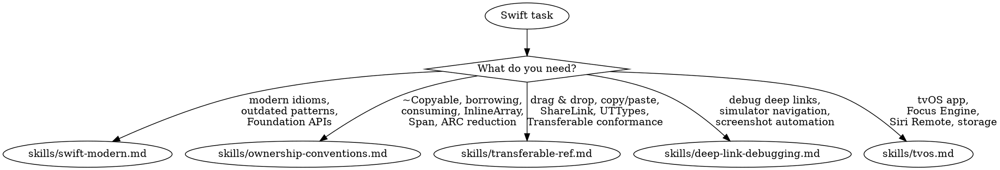

# Swift Language & Platform

**You MUST use this skill for ANY Swift idiom review, ownership/noncopyable types, Transferable/drag-and-drop, debug deep links, or tvOS development.**

## Quick Reference

| Symptom / Task | Reference |
|----------------|-----------|
| Outdated Swift patterns (Date(), CGFloat, DateFormatter) | See `skills/swift-modern.md` |
| Foundation modernization (FormatStyle, URL.documentsDirectory) | See `skills/swift-modern.md` |
| Common Claude hallucinations in Swift code | See `skills/swift-modern.md` |
| Swift 6.4 idioms — `anyAppleOS`, `weak let`, `~Sendable` (`OS27`) | See `skills/swift-modern.md` |
| Noncopyable types (~Copyable) | See `skills/ownership-conventions.md` |
| borrowing/consuming parameter ownership | See `skills/ownership-conventions.md` |
| InlineArray, Span, value generics; Swift 6.4 `borrow`/`mutate` accessors (`OS27`) | See `skills/ownership-conventions.md` |
| Reducing ARC overhead | See `skills/ownership-conventions.md` |
| Drag and drop (.draggable, .dropDestination) | See `skills/transferable-ref.md` |
| Copy/paste (.copyable, PasteButton) | See `skills/transferable-ref.md` |
| ShareLink, content sharing | See `skills/transferable-ref.md` |
| Custom UTType declarations | See `skills/transferable-ref.md` |
| TransferRepresentation choices | See `skills/transferable-ref.md` |
| Debug-only deep links for simulator testing | See `skills/deep-link-debugging.md` |
| Navigate to specific screens for screenshots | See `skills/deep-link-debugging.md` |
| tvOS Focus Engine, Siri Remote input | See `skills/tvos.md` |
| tvOS storage constraints (no Documents dir) | See `skills/tvos.md` |
| tvOS text input, AVPlayer tuning | See `skills/tvos.md` |
| TVUIKit components | See `skills/tvos.md` |

## Decision Tree

1. Outdated Swift patterns / modern API replacements / Claude hallucinations? -> `skills/swift-modern.md`
2. ~Copyable / borrowing / consuming / InlineArray / Span? -> `skills/ownership-conventions.md`
3. Drag and drop / copy/paste / ShareLink / Transferable / UTTypes? -> `skills/transferable-ref.md`
4. Debug deep links / simulator navigation / screenshot automation? -> `skills/deep-link-debugging.md`
5. tvOS development / Focus Engine / Siri Remote / storage / AVPlayer? -> `skills/tvos.md`
6. Swift concurrency (async/await, actors, Sendable) -> `/skill axiom-concurrency`
7. Swift performance (COW, ARC, generics optimization) -> See axiom-performance (skills/swift-performance.md)
8. Codable patterns (JSON, CodingKeys, enum serialization) -> See axiom-data (skills/codable.md)

## Conflict Resolution

**swift vs concurrency**: When Swift 6 concurrency errors appear:
- **Use concurrency, NOT swift** -- Concurrency errors are actor isolation / Sendable issues. `skills/swift-modern.md` covers concurrency *posture* (defaults), but detailed patterns live in axiom-concurrency.

**swift vs performance**: When optimizing Swift code:
- **Use swift for ownership** if the question is borrowing/consuming/~Copyable/InlineArray/Span -> `skills/ownership-conventions.md`
- **Use performance** if the question is COW, ARC profiling, generic specialization, or Instruments workflows -> axiom-performance

**swift vs swiftui**: When implementing drag and drop or copy/paste:
- **Use swift** for Transferable conformance, representation choices, UTType declarations -> `skills/transferable-ref.md`
- **Use swiftui** for view-level modifiers (.draggable, .dropDestination styling, animations)

**swift vs integration**: When sharing content:
- ShareLink + Transferable -> **use swift** (`skills/transferable-ref.md`)
- UIActivityViewController customization, share extensions -> **use integration**

**swift vs axiom-build**: When tvOS build fails:
- Environment/Xcode issues -> **use axiom-build first**
- tvOS platform-specific code issues (Focus Engine, storage, no WebView) -> **use swift** (`skills/tvos.md`)

## Critical Patterns

**Modern Swift Idioms** (`skills/swift-modern.md`):
- 12+ outdated patterns Claude defaults to (Date(), CGFloat, DateFormatter, DispatchQueue.main.async)
- Foundation modernization (FormatStyle, URL.documentsDirectory, .replacing())
- SwiftUI convenience APIs Claude misses (ContentUnavailableView.search, LabeledContent)
- Swift 6.4 concurrency posture defaults
- 12 common Claude hallucinations with corrections

**Ownership & Noncopyable Types** (`skills/ownership-conventions.md`):
- borrowing/consuming parameter modifiers with 7 patterns
- ~Copyable types: FileHandle pattern, limitations table, common compiler errors
- InlineArray: fixed-size stack-allocated arrays with value generics
- Span family: safe contiguous memory access replacing UnsafeBufferPointer
- Decision tree for when ownership modifiers help vs when to skip

**Transferable & Sharing** (`skills/transferable-ref.md`):
- Decision tree: CodableRepresentation vs DataRepresentation vs FileRepresentation vs ProxyRepresentation
- Drag and drop, copy/paste, ShareLink with complete SwiftUI API
- Custom UTType declarations (Swift + Info.plist, both required)
- 7 common errors with fixes (representation ordering, missing Info.plist, hit testing)
- UIKit bridging via NSItemProvider

**Debug Deep Links** (`skills/deep-link-debugging.md`):
- Debug-only URL scheme for simulator navigation
- NavigationPath integration for robust routing
- State configuration links (error states, empty states)
- Integration with /axiom:screenshot and simulator-tester agent
- 60-75% faster iteration with visual verification

**tvOS Development** (`skills/tvos.md`):
- Dual focus system (UIKit Focus Engine + SwiftUI @FocusState)
- Siri Remote input (two generations, three input layers)
- Storage constraints (no Documents directory, iCloud required)
- No WebView (JavaScriptCore only, no DOM)
- AVPlayer tuning, Menu button state machine
- TVUIKit components

## Anti-Rationalization

| Thought | Reality |
|---------|---------|
| "Date() is fine, everyone uses it" | `Date.now` has been the modern pattern since Swift 5.6. `skills/swift-modern.md` lists 12+ patterns Claude gets wrong. |
| "I don't need ownership modifiers" | For most code, correct. But ~Copyable types *require* them, and large value types in hot paths benefit measurably. |
| "Transferable is just Codable for drag and drop" | Transferable has 4 representation types, ordering rules, and Info.plist requirements. Getting it wrong causes silent cross-app failures. |
| "I'll just use the same code as iOS for tvOS" | tvOS has no Documents directory, no WebView, a dual focus system, and two generations of remote hardware. It compiles fine and fails at runtime. |
| "Debug deep links are overkill" | Manual navigation costs 2-3 minutes per iteration. Deep links cut it to 45 seconds. Over a debugging session, that's hours saved. |
| "CGFloat is what SwiftUI uses" | Swift 5.5+ has implicit Double-CGFloat bridging. Use Double everywhere except optionals, inout, and ObjC-bridged APIs. |
| "I'll add the Info.plist entry later" | Custom UTTypes work in-app without Info.plist but silently fail cross-app. This is the #1 "works in dev, fails in prod" Transferable issue. |
| "FormatStyle is too verbose" | `val.formatted(.number.precision(.fractionLength(2)))` is type-safe and localized. `String(format:)` is neither. |

## Example Invocations

User: "Is this Swift code using modern patterns?"
-> Read: `skills/swift-modern.md`

User: "How do I use borrowing and consuming?"
-> Read: `skills/ownership-conventions.md`

User: "How do I make my model draggable?"
-> Read: `skills/transferable-ref.md`

User: "How do I implement ShareLink with a custom preview?"
-> Read: `skills/transferable-ref.md`

User: "I need debug deep links for simulator testing"
-> Read: `skills/deep-link-debugging.md`

User: "I'm building a tvOS app and focus navigation doesn't work"
-> Read: `skills/tvos.md`

User: "What is InlineArray and when should I use it?"
-> Read: `skills/ownership-conventions.md`

User: "My drag and drop works in-app but not across apps"
-> Read: `skills/transferable-ref.md`

User: "tvOS keeps losing my saved data"
-> Read: `skills/tvos.md`

User: "How do I optimize large struct passing?"
-> Read: `skills/ownership-conventions.md`

User: "I need to fix my async/await code"
-> See `/skill axiom-concurrency`

User: "Check my code for Swift 6 concurrency issues"
-> See `/skill axiom-concurrency`
