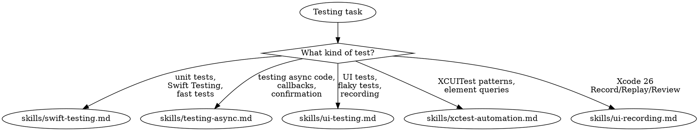

# Testing

**You MUST use this skill for ANY testing-related question, including writing tests, debugging test failures, making tests faster, or choosing between testing approaches.**

## Quick Reference

| Symptom / Task | Reference |
|----------------|-----------|
| Writing unit tests, Swift Testing (@Test, #expect) | See `skills/swift-testing.md` |
| Making tests run without simulator | See `skills/swift-testing.md` |
| Parameterized tests, tags, traits | See `skills/swift-testing.md` |
| Migrating from XCTest to Swift Testing | See `skills/swift-testing.md` |
| Warning-severity issues / cancelling a test — `Issue.record(severity:)`, `Test.cancel` (`OS27`) | See `skills/swift-testing.md` |
| Testing async/await functions | See `skills/testing-async.md` |
| confirmation for callbacks | See `skills/testing-async.md` |
| @MainActor tests, parallel execution | See `skills/testing-async.md` |
| Writing UI tests, XCUITest | See `skills/ui-testing.md` |
| Condition-based waiting patterns | See `skills/ui-testing.md` |
| Recording UI Automation (Xcode 26) | See `skills/ui-testing.md` |
| Network conditioning, multi-factor testing | See `skills/ui-testing.md` |
| XCUIElement queries, waiting strategies | See `skills/xctest-automation.md` |
| Accessibility identifiers, test plans | See `skills/xctest-automation.md` |
| CI/CD test execution | See `skills/xctest-automation.md` |
| Record/Replay/Review workflow (Xcode 26) | See `skills/ui-recording.md` |
| Test plan multi-configuration replay | See `skills/ui-recording.md` |
| Enhancing recorded tests for stability | See `skills/ui-recording.md` |

## Decision Tree

1. Writing unit tests / Swift Testing? → `skills/swift-testing.md`
2. Testing async/await code? → `skills/testing-async.md`
3. Writing UI tests / XCUITest / flaky tests? → `skills/ui-testing.md`
4. XCUIElement queries, waiting, test plans, CI? → `skills/xctest-automation.md`
5. Record UI interactions (Xcode 26)? → `skills/ui-recording.md`
6. Flaky tests / race conditions (Swift Testing)? → test-failure-analyzer (Agent)
7. Tests crash / environment wrong? → See axiom-build (skills/xcode-debugging.md)
8. Run tests from CLI / parse results? → test-runner (Agent)
9. Fix failing tests automatically? → test-debugger (Agent)
10. Want test quality audit? → testing-auditor (Agent) or `/axiom:audit testing`
11. Automate without XCUITest / AXe CLI? → simulator-tester (Agent) + See axiom-xcode-mcp (skills/axe-ref.md)

## Swift Testing vs XCTest Quick Guide

| Need | Use |
|------|-----|
| Unit tests (logic, models) | Swift Testing |
| UI tests (tap, swipe, assert screens) | XCUITest (XCTest) |
| Tests without simulator | Swift Testing + Package/Framework |
| Parameterized tests | Swift Testing |
| Performance measurements | XCTest (XCTMetric) |
| Objective-C tests | XCTest |

## Critical Patterns

**Swift Testing** (`skills/swift-testing.md`):
- @Test/@Suite macros, #expect/#require assertions
- Parameterized testing for eliminating repetitive tests
- Fast tests architecture: Package extraction, Host Application: None
- Reliable async testing with withMainSerialExecutor and TestClock
- Migration guide from XCTest (comparison table)
- XCTestCase + Swift 6.2 MainActor compatibility fix

**Async Testing** (`skills/testing-async.md`):
- confirmation for single/multiple callbacks
- expectedCount: 0 to verify something never happens
- @MainActor test isolation
- Timeout control with .timeLimit
- Parallel execution gotchas and .serialized

**UI Testing** (`skills/ui-testing.md`):
- Condition-based waiting (replaces sleep())
- Recording UI Automation (Xcode 26)
- Network conditioning for 3G/LTE testing
- Multi-factor testing (device size + network speed)
- Crash debugging from UI test failures

**XCUITest Automation** (`skills/xctest-automation.md`):
- Element identification with accessibilityIdentifier
- Waiting strategies (appear, disappear, hittable)
- Test plans for multi-configuration testing
- CI/CD integration with parallel execution

**UI Recording** (`skills/ui-recording.md`):
- Xcode 26 Record/Replay/Review workflow
- Enhancing recorded code for stability
- Query selection guidelines
- Test plan configuration for multi-language replay

## Automated Scanning

**Test quality audit** → Launch `testing-auditor` agent or `/axiom:audit testing` (maps test coverage shape against production code, detects flaky patterns and speed issues, identifies untested critical paths, scores overall test health)

**Flaky test analysis** → Launch `test-failure-analyzer` agent (scans for patterns causing intermittent failures in Swift Testing: missing confirmation, shared mutable state, missing @MainActor)

## Anti-Rationalization

| Thought | Reality |
|---------|---------|
| "Simple test question, I don't need the skill" | Proper patterns prevent test debt. `skills/swift-testing.md` has copy-paste solutions. |
| "I know XCTest well enough" | Swift Testing is significantly better for unit tests. Migration guide included. |
| "Tests are slow but it's fine" | Fast tests enable TDD. `skills/swift-testing.md` shows how to run without simulator. |
| "I'll fix the flaky test with a sleep()" | sleep() makes tests slower AND flakier. `skills/ui-testing.md` has condition-based waiting. |
| "I'll add tests later" | Tests written after implementation miss edge cases. |

## Example Invocations

User: "How do I write a unit test in Swift?"
→ Read: `skills/swift-testing.md`

User: "My UI tests are flaky in CI"
→ Check codebase: XCUIApplication/XCUIElement? → `skills/ui-testing.md`
→ Check codebase: @Test/#expect? → test-failure-analyzer (Agent)

User: "How do I test async code without flakiness?"
→ Read: `skills/testing-async.md`

User: "What's the Swift Testing equivalent of XCTestExpectation?"
→ Read: `skills/testing-async.md`

User: "I want my tests to run faster"
→ Read: `skills/swift-testing.md` (Strategy 1: Package extraction)

User: "Should I use Swift Testing or XCTest?"
→ Read: `skills/swift-testing.md` (Migration section) + this decision tree

User: "How do I record UI automation in Xcode 26?"
→ Read: `skills/ui-recording.md`

User: "Run my tests and show me what failed"
→ Invoke: test-runner (Agent)

User: "Audit my tests for quality issues"
→ Invoke: testing-auditor (Agent)
